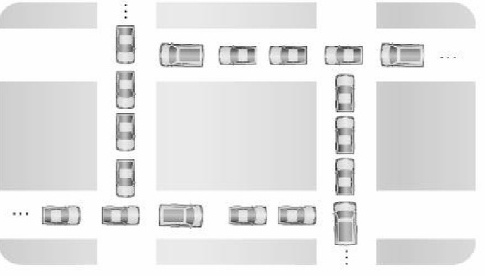

# 교착상태 ( Deadlock )

 

### 교착상태 ( Deadlock )
>- 상호 배제에 의해 나타나는 문제점으로 둘 이상으 프로세스들이 자원을 점유한 상태에서 서로 다른 프로세스가 점유하고있는 자원을 요구하며 무한정 기다리는 현상
>
>- 프로세스들이 현재 위치한 길(자원)을 점유함과 동시에 다른 차가 사용하는 길을 사용하려고 대기하고 있지만 다른 길을 사용할 수 없으며 현재 길에서도 벗어나지 못하는 상태

 

### 교착상태 발생의 필요 충분 조건
>- 교착상태가 발생하기 위해서는 다음의 네가지 조건이 충족되어야 함
>1) 상호배제(Mutual Exclusion) : 한번의 한 개의 프로세스만이 공유 자원을 사용할 수 있어야 함
>2) 점유와 대기(Hold and Wait) : 최소한 하나의 자원을 점유하고 있으면서 다른 프로세스에 할당되어 사용되고 있는 자원을 추가로 점유하기 위해 대기하는 프로세스가 있어야함
>3) 비선점(Non-preemption) : 다른 프로세스에 할당된 자원은 사용이 끝날때까지 강제로 빼앗을 수 없어야 함
>4) 순환대기(Circular Wait) : 공유자원과 공유자원을 사용하기 위해 대기하는 프로세스들이 원형으로 구성되어 있어 자신에게 할당된 자원을 점유하면서 앞이나 뒤에 있는 프로세스의 자원을 요구

 

### 교착상태 해결 방안
>1. 예방 기법 (Prevention) 
>2. 회피 기법 (Avoidance)
>3. 탐지 및 회복 기법 (Detection and Recovery)

 

#### >1. 예방기법
>- 교착상태의 발생조건 4가지 중 하나라도 발생하지 않게 하는 것
>- 조건을 방지해서 교착상태를 예방하는 방법(4가지)은 시스템의 처리량이나 효율성을 떨어트리는 단점이 발생할 수 있음
>>1-1) 상호 배제 부정
>>- 한번에 여러 프로세스가 공유 자원을 사용할 수 있게함
>>- 그러나 추후 동기화 관련 문제 발생할 수 있음
>>
>>1-2) 점유 대기 조건 방지 : 프로세스 실행에 필요한 모든 자원을 한꺼번에 요구하고 허용할 때까지 작업을 보류해서 나중에 또 다른 자원을 점유하기 위한 대기 조건을 성립하지 않도록 함
>>
>>1-3) 비선점 조건 방지 : 이미 다른 프로세스에게 할당된 자원이 선점권이 없다고 가정할 때, 높은 우선순위의 프로세스가 해당 자원을 선점할 수 있도록 함
>>
>>1-4) 순환 대기 조건 방지 : 자원을 순환 형태로 대기하지 않도록 일정한 한 쪽 방향으로만 자원을 요구할 수 있도록 함

 

#### >2. 회피 기법
>- 시스템의 프로세스들이 요청하는 모든 자원을, 교착상태을 발생시키지 않으면서도 차례로 모두에게 할당
>- 교착상태의 회피에서는 Safe sequence, Safe state 등이 키워드
>- 시스템의 프로세스들이 요청하는 모든 자원을, 교착상태를 발생시키지 않으면서도 차례로 할당해 줄 수있으면 안정상태(safe state)에 있다고 함.
>- 이처럼 특정한 순서로 프로세스들에게 자원을 할당, 실행 및 종료 등의 작업을 할 때 데드락이 발생하지 않는 순서를 찾을 수 있다면, 그것은 안전 순서(safe sequence)라고 부름
>- 반면 불안정 상태는 안정 상태가 아닌 상황으로 교착상태 발생 가는성이 있는 상황이며, 교착상태는 불안정 상태일 때 발생할 수 있음. 
>- 이렇게 회피 알고리즘은 자원을 할당한 후에도 시스템이 항상 Safe state에 있도록 할당을 허용하자는 것이 기본 특징 ( 대표적으로 은행원 알고리즘 존재 )
>- 하지만 미리 최대 자원 요구량을 알아야하고 할당할 수 있는 자원이 일정해야하는 등 사용에 제약조건이 있고 그에 따른 자원 이용도 하락 등 단점 존재

 

#### >3) 탐지 및 회복
>- 교착상태가 발생할 수 있어, 교착상태를 탐지하고 회복하는 알고리즘을 사용하는 방법
>>3-1) 탐지 기법
>>- Allocation, Request, Available 등으로 시스템에 교착상태가 발생했는지 여부를 탐색. 은행원 알고리즘 방식과 유사하게 현재 시스템의 자원 할당 상태를 가지고 파악
>>- 이 외에도 TimeOut, 자원 할당 그래프를 통해 탐지하는 방법
>>3-2) 회복 기법
>>- 탐지를 통해 교착상태를 발견했다면 순환 대기에서 벗어나 회복하기 위한 방법 사용
>>- 프로세스를 1개이상 중단시키기 
>>	    - 교착 상태에 빠진 모든 프로세스를 중단시키는 방법 : 계속 연산 중이던 프로세스들고 모두 일시에 중단되어 부분 결과가 폐기될 수 있는 부작용이 발생할 수 있음
>>	    - 프로세스를 하나씩 중단 시킬 때마다 탐지 알고리즘으로 교착상태를 탐지하면서 회복하는 방법 : 매번 탐지 알고리즘을 호출 및 수행해야 하므로 부담이 되는 작업일 수 있음
>>- 자원 선점하기  
>>	    - 프로세스에 할당된 자원을 선점해서, 교착 상태를 해결할 때 까지 그 자원을 다른 프로세스에 할당해 주는 방법

 

22-06-25

-------

## Reference
- https://chanhuiseok.github.io/posts/cs-2/ 
- https://coding-factory.tistory.com/311