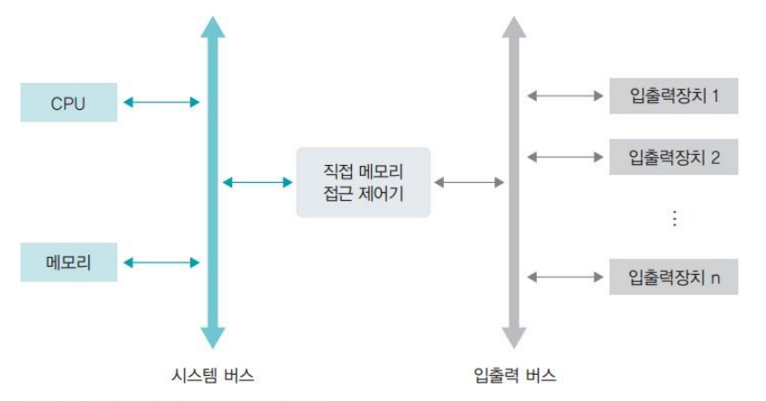
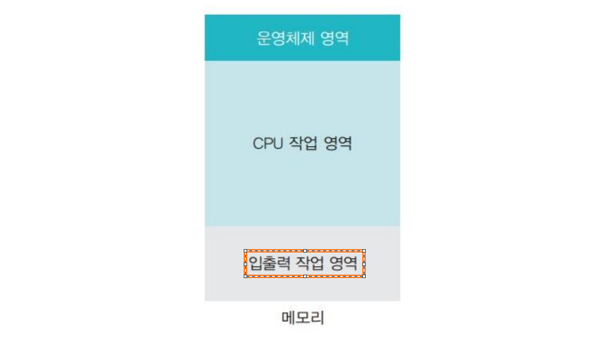

# 인터럽트 (Interrupt)

### 인터럽트 (interrupt)
- 초반 컴퓨터의 경우 주변장치가 많지 않아 CPU가 직접 입출력장치에서 데이터를 가져오거나 내보냈는데 이러한 방식을 '폴링(polling)'이라고 함
- 폴링 방식은 CPU가 명령어 해석과 실행이라는 본래 역할 외에 모든 입출력 까지 관여하게 되어 작업 효율이 떨어짐
- 오늘날의 컴퓨터는 많은 주변장치가 있는데 작업효율이 떨어지는 문제를 해결하기 위해 등장한 것이 '인터럽트' 방식
    - 맨 처음 이야기했던 주방 보조의 역할으로 CPU의 지시를 받아 데이터를 메모리로 이동시키고 준비 되었다고 CPU에게 알려주어 데이터 이동이 독립적이고 입출력이 이루어지는 동안 CPU가 다른 작업을 할 수 있어 작업 효율이 좋음
- 인터럽트 방식의 동작과정은 다음과 같으며 CPU에 보내는 완료 신호를 인터럽트라고 함
    - CPU가 입출력 관리자에게 입출력 명령을 보냄
    - 입출력 관리자는 명령받은 데이터를 메모리에 가져다 놓거나 메모리에 있는 데이터를 저장장치로 옮김
    - 데이터 전송이 완료되면 완료신호를 CPU에 보냄 (입출력 제어기는 입출력 데이터가 DMA 제어기 작업이 마친 후 CPU에 인터럽트를 보냄)
- 인터럽트 방식에는 많은 주변장치 중 어떤 것의 작업이 끝났는지 CPU에 알려주기 위해 '인터럽트 번호'를 사용하고 인터럽트 번호는 장치의 고유번호로 운영체제마다 다름
    - 인터럽트란 주변 장치의 입출력 요구나 하드웨어의 이상 현상을 CPU에 알려주는 역할을 하는 신호로 각 장치에는 고유의 인터럽트 번호인 IRQ가 부여
    - 인터럽트 발생시 CPU는 IRQ를 보고 어떤 장치에서 인터럽트가 발생했는지 파악
- CPU는 입출력 관리자에게 여러 개의 입출력 작업을 동시에 시킬 수 있는데 그 때마다 인터럽트를 사용하는 것은 매우 비효율적으로 여러 개의 인터럽트를 하나의 배열로 만든 '인터럽트 벡터'를 사용함
- 인터럽트 종류는 다음과 같음
    - 외부 인터럽트 : 입출력 장치로부터 오는 인터럽트뿐 아니라 전원 이상이나 기계적인 오류 때문에 발생하는 인터럽트를 포함
    - 내부 인터럽트 : 프로세스의 잘못이나 예상치 못한 문제 때문에 발생하는 인터럽트로 예외 상황(exception) 인터럽트라고도 부름
    - 시그널 : 사용자가 직접 발생시키는 인터럽트로 자발적 인터럽트라고도 부름

<br>

| 용어               | 정의 및 발생 원인                                                       |
|--------------------|------------------------------------------------------------------------|
| **외부 인터럽트**  | CPU 외부의 하드웨어 장치(예: 키보드, 마우스, 네트워크 카드)에서 발생하는 인터럽트 |
| **내부 인터럽트**  | CPU 내부에서 발생하는 인터럽트. 예외 상황(예: 0으로 나누기, 페이지 폴트) 등에 의해 발생 |
| **시그널**         | 소프트웨어나 하드웨어가 프로세스에 비동기적으로 발생시키는 이벤트. 프로세스 간 통신이나 오류 처리를 위해 사용 |
| **하드웨어 인터럽트** | 하드웨어 장치가 CPU에 특정 작업을 요청할 때 발생. 외부 인터럽트의 하위 개념  |
| **소프트웨어 인터럽트** | 소프트웨어가 의도적으로 발생시키는 인터럽트. 시스템 콜이나 명령어에 의해 발생 |

<br>

|종류|인터럽트 번호|비고|
|:---:|:---:|:---:|
|내부 인터럽트|0~31|0~19번까지만 정의됨|
|외부 인터럽트|32~47|주변장치의 수에 따라 유동적으로 할당|
|시그널|128|시그널 번호를 따로 기재|

<br>

#### 인터럽트 벡터와 인터럽트 핸들러
- 여러 인터럽트 중 어떤 인터럽트가 발생했는지 파악하기 위해 사용하는 자료 구조
    - 값이 1이라면 발생한 것으로 0이라면 미발생
- 인터럽트는 종류만큼이나 처리 방법도 다양하고 인터럽트 핸들러는 인터럽트 처리 방법을 함수 형태로 만들어둔 것
- 인터럽트가 발생하면 운영체제는 인터럽트 핸들러를 호출하여 작업을 하고 인터럽트 벡터에는 해당 인터럽트 핸들러를 호출할 수 있도록 인터럽트 핸들러가 저장된 메모리의 주소가 포인터 형태로 등록되어 있음

<br>

### 직접 메모리 접근 (DMA)

- 과거 운영체제는 CPU가 메모리나 주변장치에 대한 모든 권한을 가지고 있었으나 현재 메모리는 CPU만 접근 권한을 가진 작업 공간으로 접근이 불가능함
- 이를 위해 입출력 관리자에게는 CPU 허락 없이 메모리에 접근할 수 있는 권한이 필요한데 이러한 권한을 '직접 메모리 접근(DMA)'이라고 함



<br>

### 메모리 매핑 입출력 (MMIO)

- 직접 메모리 접근은 인터럽트 방식의 시스템을 구성하는데 필수적이나 그러나 사용하면 메모리가 복잡해짐. 메모리에는 CPU가 사용하는 데이터와 입출력 장치가 사용하는 데이터가 섞여있기 때문
- 이를 해결하기 위해 CPU가 사용하는 메모리 공간과 직접 메모리 접근을 통한 데이터 공간을 분리하는 방식을 사용하는데 해당 기법을 '메모리 매핑 입출력(MMIO)' 라고 함
- CPU와 직접 메모리 접근이 동시에 접근한다면 누군가 양보해야 하는데 입출력 장치의 속도가 느리기 때문에 직접 메모리 방식에 양보하는데 이를 '사이클 훔치기' 라고 부름



<br>

## Ssafy Wizards CS Study

<br>

### 1. 하드웨어 인터럽트 vs 소프트웨어 인터럽트

#### 하드웨어 인터럽트
- 하드웨어 인터럽트는 외부 하드웨어 장치에 의해 발생하는 인터럽트
- CPU 외부의 하드웨어 장치에서 특정 이벤트가 발생하면 해당 하드웨어 장치는 CPU에게 인터럽트를 요청하여 현재 실행 중인 작업을 중단하고 해당 이벤트를 처리하도록 요청함
- 하드웨어 인터럽트는 프로그램의 실행 흐름과 관계없이 언제든지 실시간 및 비동기적으로 발생하며 CPU가 즉시 응답해야 함
- 여러 하드웨어 인터럽트가 동시에 발생할 수 있으며 시스템은 인터럽트의 우선순위를 기반으로 어떤 인터럽트를 먼저 처리할지 결정함

#### 소프트웨어 인터럽트
- 소프트웨어 인터럽트는 프로그램 내에서 명령어에 의해 발생하는 인터럽트
- 소프트웨어가 특정 조건을 만나거나 특별한 시스템 호출이 필요할 때 의도적으로 CPU에게 인터럽트를 발생시켜 처리하도록 요청
    - 프로그램 코드 내에서 명령어 또는 시스템 호출에 의해 발생
    - 시스템 콜, 예외 처리, 트랩 명령어 등
- 소프트웨어 인터럽트는 프로그램의 실행 흐름 내에서 발생하여 동기적이며 명령어의 실행 결과로 발생

| 구분                  | 하드웨어 인터럽트                          | 소프트웨어 인터럽트                          |
|-----------------------|--------------------------------------------|----------------------------------------------|
| **발생 원인**         | 외부 하드웨어 장치(예: 키보드, 마우스)에서 발생 | 소프트웨어 명령어 또는 시스템 호출에 의해 발생 |
| **동기/비동기**       | 비동기적                                   | 동기적                                       |
| **처리 시점**         | 즉시 처리, 실시간으로 응답 필요               | 프로세스 실행 중 발생, 명령어 실행 결과로 처리 |
| **사용 예시**         | 키보드 입력, 네트워크 패킷 수신              | 시스템 콜, 예외 처리(0으로 나누기 등)         |
| **우선순위**          | 하드웨어마다 우선순위가 다를 수 있음         | 소프트웨어 내에서 정해진 흐름에 따라 처리     |
| **인터럽트 번호**     | 하드웨어 장치마다 고유한 인터럽트 번호 사용   | 소프트웨어 이벤트마다 고유한 번호 할당        |


<br>

### 2. 인터럽트 처리 방식
#### 1. 인터럽트 발생
- 소프트웨어 인터럽트 혹은 하드웨어 인터럽트 발생

#### 2. 현재 작업 중단
- CPU가 현재 실행 중인 작업을 일시 중단
- 이때, 현재 실행 중이던 작업의 상태(프로그램 카운터, 레지스터 등)를 저장하여 나중에 중단된 위치부터 작업을 재개할 수 있음
- 인터럽트 플래그를 자동으로 해제하여 이후 추가적인 인터럽트를 발생하지 않도록 설정

#### 3. 인터럽트 벡터 테이블 조회
- CPU는 인터럽트 벡터 테이블을 조회하여 해당 인터럽트를 처리할 핸들러(인터럽트 서비스 루틴, ISR)의 주소를 찾음
    - 인터럽트 벡터 테이블은 각 인터럽트 번호와 관련된 ISR의 주소를 저장한 테이블

#### 4. 인터럽트 서비스 루틴 실행
- CPU는 인터럽트 벡터 테이블에서 찾은 ISR을 실행
- ISR은 해당 인터럽트에 대해 필요한 처리를 수행하는 코드로 해당 작업 수행

#### 5. 작업 재개
- ISR의 처리가 완료되면 CPU는 중단되었던 작업의 상태를 복구하고 원래의 작업을 계속해서 실행

#### 6. 인터럽트 종료
- 모든 인터럽트 처리가 완료되면 인터럽트 플래그를 해제하여 다른 인터럽트가 처리될 수 있도록 함

```
인터럽트 플러그

- CPU가 외부 인터럽트를 수신할 수 있는 상태인지를 여부를 제어하는 플래그
- IF가 설정(Enabled)되어 있으면, CPU는 외부 인터럽트를 수신하고 처리할 수 있음
- IF가 해제(Disabled)되어 있으면, CPU는 외부 인터럽트를 무시하고 인터럽트 처리를 하지 않음
```


<br>

### 3. Polling 방식
- Polling(폴링) 방식은 컴퓨터 시스템에서 CPU가 주기적으로 특정 장치나 상태를 확인하여, 작업을 처리할 준비가 되었는지 또는 이벤트가 발생했는지를 확인하는 방법
    - 초반의 컴퓨터는 주변장치가 많지 않아 CPU가 직접 입출력장치에서 데이터를 가져오거나 내보냈는데 해당 방식이 폴링(Polling)
- CPU가 특정 주기로 주변 장치나 시스템의 상태를 반복적으로 확인함
- 폴링 방식은 CPU가 반복적으로 확인하는 동안 다른 작업을 수행할 수 없기 때문에, 리소스를 낭비할 수 있음
    - CPU가 다른 일을 하지 못함
    - 또한 다른 장치가 준비될 때까지 지속적으로 확인하여 대기 시간 존재 및 해당 시간동안 CPU 사용 불가
- 폴링 방식은 구현이 간단하여 복잡한 인터럽트 처리 메커니즘이 필요 없어 소규모 임베디드 시스템이나 초기 컴퓨터 시스템에서 사용됨

<br>

#### 동작 방식
1. 장치 상태 확인: CPU가 주기적으로 장치나 메모리의 특정 레지스터를 읽어 장치의 상태(예: 데이터 준비 상태)를 확인
2. 조건 확인: 장치가 작업을 수행할 준비가 되었는지(예: 데이터 수신 완료, I/O 장치 준비 등) 조건을 확인
3. 작업 수행: 조건이 충족되면 CPU가 해당 장치와의 데이터 교환 또는 작업을 수행
4. 반복: 장치가 준비되지 않은 경우, CPU는 일정 시간 후 다시 상태를 확인. 이 과정을 계속 반복

<br>

### 4. 동시에 두 개의 인터럽트가 발생한다면?
- 인터럽트 간의 우선순위에 따른 처리
    - 시스템은 인터럽트 벡터 테이블과 인터럽트 컨트롤러를 사용하여 발생한 인터럽트를 관리
    - 인터럽트 컨트롤러는 여러 인터럽트 신호를 받아서 우선순위에 따라 순차적으로 CPU로 전달함
- 인터럽트 마스킹 (Interrupt Masking)
    - 특정 인터럽트 핸들러가 실행되는 동안 다른 인터럽트가 발생하지 않도록 인터럽트를 마스킹함
    - 현재 처리 중인 인터럽트를 보호하고 예기치 않은 동시 인터럽트를 방지함
    - 위에서의 인터럽트 플래그도 인터럽트 마스킹 기법
- 인터럽트 중첩 (Interrupt Nesting)
    - 일부 시스템에서는 인터럽트 중첩을 허용하여 현재 처리 중인 인터럽트를 중단하고 더 높은 우선순위의 인터럽트를 처리한 후 중단된 인터럽트를 다시 처리할 수 있음
    - 우선순위가 더 높은 인터럽트 발생 시 실행 중인 낮은 우선순위의 인터럽트를 중단하고 높은 우선순위의 인터럽트를 먼저 처리