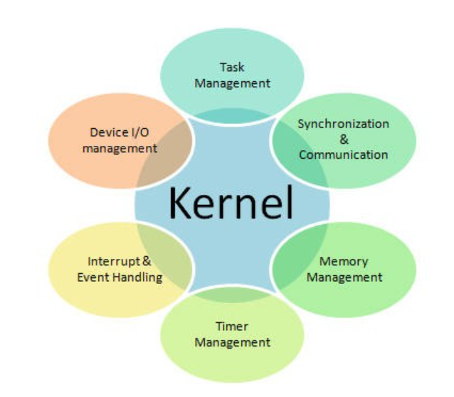
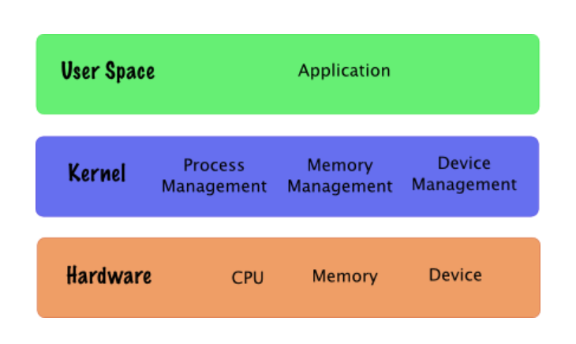
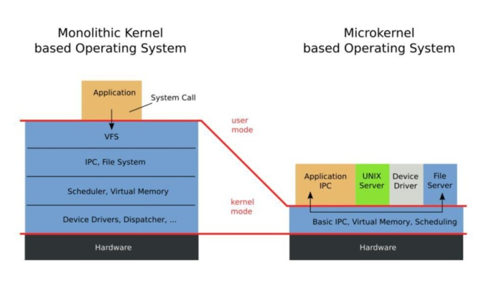

# Kernel

### 커널 (Kernel)
- 운영체제 중 항상 메모리에 올라가 있는 운영체제의 핵심 부분
- 하드웨어와 응용 프로그램 사이에서 인테페이스를 제공하는 역할을 하며 컴퓨터 자원들을 관리하는 역할 -> 
- 즉, 커널은 인터페이스로써 응용 프로그램 수행에 필요한 여러가지 서비스를 제공하고 여러가지 하드웨어 등의 리소스를 관리하는 역할
- 커널은 항상 컴퓨터 자원들을 바라고만 있어 사용자와의 상호작용은 지원하지 않음. 따라서 사용자와의 직접적인 상호작용을 하기 위헤 대표적 시스템 프로그램인 쉘(Shell)이라는 명령어 해석기를 사용

<br>



<br>

### 커널의 자원 관리
- 커널의 가장 큰 목표는 컴퓨터의 물리적(하드웨어) 자원과 추상화 자원을 관리하는 것
- 추상화란 물리적으로 하나뿐인 하드웨어를 여러 사용자들이 번갈아 사용할 수 있도록 마치 여러개 처럼 보이게하는 기술 -> 커널이 관리함에 따라 각 사용자들이 하나의 하드웨어를 독점하는 것처럼 느낄 수 있게함
- 커널이 추상화하여 관리하는 물리적 자원들과 이를 추상화한 자원을 칭하는 용어로는 대표적으로 CPU - Task or Process, 메모리 - Page or Segment, 디스크 - File, 네트워크 - Socket 등이 있음
- 커널의 수행하는 주요 작업
    - Task(Process) Management : 물리적인 자원인 CPU를 추상적 자원인 Task로 제공
    - Memory Management : 물리적 자원인 메모리를 추상적 자원인 Page 또는 Segment 로 제공
    - File System : 물리적 자원인 디스크를 추상적 자원인 File로 제공
    - Network Management : 물리적 자원인 네트워크 장치를 추상적 자원인 Socket으로 제공
    - Device Driver Management : 각종 외부 장치에 대한 접근
    - Interrupt Handling : 입터럽트 핸들러
    - I/O Communication : 입출력 통신 관리

<br>



</br>

### 인터페이스로써의 커널
- 커널은 다양한 자원을 관리하는데 이는 사용자가 물리적인 하드웨어에 접근하고 사용할 수 있도록 매개하기 위함
- 즉, 인터페이스로서 사용자가 컴퓨터만의 언어와 규칙으로 하드웨어와 통신할 수 있도록 도와주는 역할
- 커널 구성요소들이 존재하는 공간을 Kernel Space 라고 할 수 있고 User Space와 Kernel Space 사이에는 System Call Interface가 있어 해당 인터페이스를 통해 Kernel Space의 자원관리자에게 요청이 전달되는 방식
- Kernel Interface로 요청을 받으면 커널은 사용자요청에 맞는 하드웨어에게 명령을 전달하고 작업을 수행하는 역할을 함 -> 커널은 사용자가 System Call을 통해 컴퓨터 자원을 사용할 수 있게해주는 자원관리자임 (하드웨어가 처리할 수 있도록 요청을 변환)

<br>

### 커널과 운영체제?
- 커널은 OS의 핵심 서비스를 관리하는 OS의 구성요소. 운영체제는 커널 + 시스템 프로그램으로 커널과 함께 사용자 편의를 위한 시스템 프로그램을 포함
- 커널 위에 사용자 정의의 어플리케이션과 유틸리티가 추가되면서 OS라고 부를 수 있음
- 그러므로 OS는 커널 공간과 사용자 공간으로 구성되어 있다고 말할 수 있음
    - 사용자 영역 (User Land) : 프로그램이 동작하기 위해 사용되는 메모리 공간 (stack, heap, bss, data, text 영역)
    - 커널 영역 (Kernel Land) : 운영체제를 실행시키기 위해 필요한 메모리 공간
- 컴퓨터 프로세서는 멀티 모드를 가짐으로써 전체 시스템을 보호함. 프로세서는 실행중인 코드 유형에 따라 모드를 전환하고 Windows 운영체제는 다음 2개의 모드를 가짐
    - User Mode : 일반적인 사용자 Application은 User Mode에서 실행됨
    - Kernel Mode : 모든 시스템 메모리와 CPU에 접근가능하며 User 모드에서의 접근이 제한됨 -> 일반 사용자가 운영체제를 실행시키기 위한 자원을 접근하지 못하게 함 (시스템을 보호)
    - 동작 순서
        - 우리가 만드는 프로그램이 유저 모드에서 실행 -> 프로그램 실행 중에 인터럽트(interrupt)가 발생하거나 시스템 콜(system call)을 호출하게 되면 커널 모드로 전환 (read) -> 커널 모드에서 프로그램의 현재 CPU 상태를 저장. 파일을 읽을 준비 (waiting) -> 커널이 직접 해당 인터럽트 혹은 시스템 콜 실행/처리 (running) -> 처리가 완료되면 중단 됬던 프로그램의 CPU 상태 복원 -> 다시 통제권을 프로그램에게 반환해 커널모드에서 유저모드로 다시 변경됨

```
interrupt : 시스템에서 발생한 다양한 종류의 이벤트 혹은 그런 이벤트를 알리는 메커니즘
인터럽트 발생 시 : CPU에서 즉각적으로 인터럽트 처리를 위해 커널 코드를 커널 모드에서 실행 함

인터럽트의 종류
- 전원에 문제가 생겼을 때
- I/O 작업이 완료됬을 때
- 시간이 다됬을 때 (timer 관련)
- 0으로 나눴을 때
- 잘못된 메모리 공간에 접근을 시도할 때

System Call : 프로그램이 OS 커널이 제공하는 서비스를 이용하고 싶을 때 시스템 콜을 통해 실행
시스템 콜 발생 시 : 시스템콜 처리를 위해 커널 코드를 커널 모드에서 실행 함

시스템콜의 종류
- 프로세스/스레드 관련 
- I/O 관련 
- 소켓 관련 
- 장치 (device) 관련 
- 프로세스 통신 관련 

우리가 프로그래밍 언어를 사용하여 프로그램을 만들 때 시스템 콜을 따로 사용하지 않았는데 서비스가 실행되었는데 해당 이유는?
- 사용하는 프로그래밍 언어는 시스템 콜을 포장(warapping)하여 간접적으로 사용할 수 있도록 제공하였기 때문
- java의 경우 native를 사용하여 JNI(Java Native Interface)를 통해 OS의 시스템 콜을 연결해줌
```

<br>



<br>

### 커널의 유형
- 커널은 크게 모놀리식 커널(Monolithic Kernel), 마이크로 커널(MicroKernel)로 나뉨

#### 모놀리식 커널
- 우리가 개념적으로 알고 있는 커널으로 애플리케이션을 제외한 모든 System 서비스들 (VFS, IPC, File System 등)을 커널이 직접 처리하는 방식
- 각 서비스 들은 커널 내부의 여러 계층에서 관리되고 모놀리식 커널은 사용자가 운영체제 서비스들을 System Call을 통해 사용할 수 있게 해줌
- 모놀리식 커널은 커널이 많은 것을 관리하기 때문에 커널의 크기가 크고, 하나의 오류가 전체 시스템에 영향을 끼칠 수 있는 단점이 존재
- 커널 내부에서 서비스들이 서로 시스템 자원을 공유하여 효율적으로 자원관리를 할 수 있고, 내부 서비스를 직접 커널이 수행하기에 빠른 처리속도를 가지는 장점이 있음
- 초기 모놀리식 커널은 단일 모듈이었기에 내부 서비스의 추가나 수정에 있어 커널 전체를 다시 컴파일 및 로딩이 필요했음. 하지만 최신 모놀리식 커널은 여러개의 모듈로 구성되어 있어 커널의 추가, 수정이 수월해짐
- 대표적인 모놀리식 커널에는 Unix, Embedded Linux, OSEK, WinMobile 등이 있음

#### 마이크로 커널
- 기존의 모놀리식 커널에서 핵심 서비스(Process Management, Memory Management, Network Management 등)만을 남겨두고 나머지는 제외하여 가볍게 만든 커널
- 기존의 모놀리식 커널이 가지고 있던 시스템 서비스들(VFS, IPC, Device Driver)을 마이크로 커널에서는 개별적인 서버의 형태로 존재
- 마이크로 커널은 최소화하고 핵심적인 서비스들만을 모아놓고 서버를 추가하는 방식의 구조여서 프로세스간 통신을 위해 대부분의 서비스가 수행됨 -> 메시지 전송에 따른 컨텍스트 스위칭이 많이 발생하고 시스템 복잡도가 증가될수록 시스템 부하, 오버헤드가 증가하는 단점 존재
- 서버를 추가하는 방식으로 커널을 변경하지 않고 간단한 기능 추가, 수정이 가능하고 프로세스가 각각의 서버영역에서 수행되기 때문에 하나의 서비스가 다운되어도 다른 서비스에까지도 영향을 끼치지 않는 장점 존재
- 가벼운 성질 때문에 임베디드 시스템등에 사용되고 대표적인 마이크로 커널에는 MacOS, Window NT 등이 있음


<br>

<div style="text-align: right">22-08-08</div>

-------

## Reference
- https://minkwon4.tistory.com/295
- https://velog.io/@ragnarok_code/OS-커널kernel이란
- https://www.youtube.com/watch?v=v30ilCpITnY