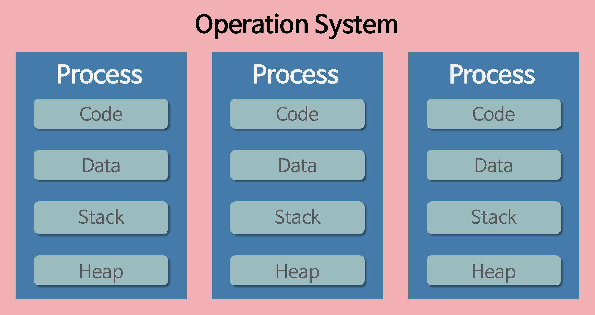

# Process, Thread

### 프로그램, 프로세스, 스레드란?
> #### 프로그램
>- 파일이 저장 장치에 저장되어 있지만 메모리에는 올라가 있지 않은(실행되지 않은) 정적인 상태를 의미
>
>#### 프로세스
>- 운영체제로부터 자원을 할당받은 작업의 단위
>- 운영체제 관점에서 최소 작업 단위
>
>#### 스레드
>- 프로세스가 할당받은 자원을 이용하는 실행 흐름의 단위
>- 프로세스는 스레드를 하나 이상을 가짐
>- CPU 입장에서의 최소 작업 단위

 

### 동작 과정
>#### 프로그램 -> 프로세스
>- 우선 프로그램은 메모리에 올라가 있지않아 정적인 상태임. 아직 운영체제가 프로그램에게 독립적인 메모리 공간을 할당해주지 않았으나 해당 프로그램을 실행 시킨다면 컴퓨터 메모리에 올라가게 되고 이 상태를 동적인 상태라고 하며 이 상태의 프로그램을 프로세스라고 한다. 즉,  프로세스는 실행되고 있는 프로그램(파일)이며 스케줄링 단계에서의 “작업”과 같은 단어라고 한다.
>
> 
>
>#### 프로세스 -> 스레드
> - 과거에는 프로그램을 실행할 때 실행 시작부터 실행 끝까지 프로세스 하나만을 사용하여 진행하였으나, 시간이 지날수록 프로그램이 복잡해지고 프로그램 하나가 단순히 한가지 작업만을 하는 경우가 없어, 하나의 프로세스만을 사용하여 프로그램을 실행하기가 힘들어졌다고 한다. 
>- 해당 해결 방안으로 한 프로그램을 처리하기 위한 프로세스를 여러 개 만들려고 한다면 이는 불가능하다고 한다. 운영체제는 안전성을 위해 프로세스마다 자신에게 할당된 메모리 내의 정보에만 접근할 수 있도록 제약을 두고있고, 이를 벗어나는 정보에 접근하려면 오류가 발생하기 때문이라고 한다. 이런 문제의 해결을 위해 프로세스와는 다른 더 작은 실행 단위 개념인 스레드가 필요하게되었다.
>- 위의 해결 방안으로 등장한 스레드는 프로세스와 다르게 스레드 간 메모리를 공유하며 작동한다. 스레드끼리 프로세스의 자원을 공유하면서 프로세스 실행 흐름의 일부가 되는 것이다. 스레드를 코드로 비유하면 코드 내의 선언된 함수, 즉 스레드는 프로세스의 코드에 정의된 절차에 따라 실행되는 특정한 수행 경로이다.

 

### 프로세스의 구조 및 특징

>- 운영체제는 프로세스마다 각각 독립된 메모리 영역을 Code/Data/Stack/Heap의 형식으로 할당해주고 각각의 독립된 메모리 영역을 할당해주기 때문에 프로세스는 다른 프로세스의 변수나 자료에 접근할 수 없다.
>- 프로세스는 하나의 프로세스가 동작 중 오류가 발생하여 프로세스가 강제로 종료된다면 공유하고 있는 파일을 손상시키는 경우가 아니라면 다른 프로세스에게 아무런 영향을주지 않는다

 

### 스레드의 구조 및 특징

>- 위의 프로세스와 다르게 프로세스 안의 스레드는 프로세스가 할당 받은 메모리 영역 내에서 Stack 형식으로 할당된 메모리 영역은 따로 할당받고 나머지 Code/Data/Heap 형식으로 할당된 메모리 영역을 공유한다. 따라서 각각의 스레드는 별도의 스택을 가지고 있지만 힙 메모리는 서로 읽고 쓸 수 있게 된다.
>- 스레드는 Code/Data/Heap 메모리 영역의 내용을 공유하기 때문에 어떤 스레드 하나에서 오류가 발생한다면 같은 프로세스 내의 다른 스레드 모두가 강제로 종료된다

 

### 멀티 프로세스 vs 멀티 스레드?
>#### 멀티 프로세스
>- 하나의 프로그램을 여러개의 프로세스로 구성하여 각 프로세스가 하나의 작업(테스크)를 처리하도록 하는 것
>
>장점
>>- 여러개의 자식 프로세스 중 하나에 문제가 발생하면 그 자식 프로세스만 죽고 다른 프로세스에는 영향이 가지 않는다
>>- 메모리 침범 문제를 OS 차원에서 해결
>
>단점
>>- context-switching에서의 오버헤드 발생 : context switching 과정에서 캐쉬 메모리 초기화등 무거운 작업이 진행되고 많은 시간이 소모되는 등의 오버헤드가 발생하게 된다. 멀티 스레드의 경우에는 Code/Data/Heap 메모리 영역을 공유하지만 프로세스들은 각각의 독립된 메모리 영역을 할당받아 context switching이 발생하면 캐쉬에 있는 모든 데이터를 모두 리셋하고 다시 캐쉬 정보를 불러온다
>
> 
>
>#### \* context-switching
>>- CPU에서 여러 프로세스를 돌아가면서 작업을 처리
>>- 동작 중인 프로세스가 대기를 하면서 해당 프로세스의 상태(context)를 보관하고 대기하고 있던 다음 순서의 프로세스가 동작하면서 이전에 보관했던 프로세스의 상태를 복구하는 작업

 

>#### 멀티스레드
>- 하나의 응용프로그램을 한 프로세스에서 여러 개의 스레드로 구성하고 각 스레드로 하여금 하나의 작업을 처리하도록 하는 것
>- 윈도우, 리눅스 등 많은 운영체제들이 멀티 프로세싱을 지원하고 있지만 멀티 스레딩을 기본으로 하고 있음
>- 웹 서버는 대표적인 멀티 스레드 응용 프로그램
>
>장점
>>- 시스템 자원 소모 감소 
>>      - 프로세스를 생성하여 자원을 할당하는 시스템 콜이 줄어들어 자원을 효율적으로 관리할 수 있음
>>- 시스템 처리량 증가
>>  	- 스레드 간 데이터를 주고받는 것이 간단해지고 시스템 자원 소모 줄음. 스레드 사이의 작업량이 많아 context switcing이 빠르고 비용이 감소
>>- 간단한 통신 방법으로 인한 프로그램 응답 시간 단축 
>>  	- 스레드는 프로세스 내의 stack 영역을 제외한 모든 메모리를 공유하기 때문에 통신의 부담이 적음
>
>단점
>>- 다른 프로세스(프로세스 밖)에서 스레드를 제어할 수 없음
>>- 멀티 스레드의 경우 자원 공유의 문제 발생 ( 동기화 문제 )
>>- 하나의 스레드에 문제가 발생하면 전체 프로세스가 영향을 받음
>
> 
>
>#### \* 멀티스레드에서의 동기화 문제 ( Synchronization Issue )
>>- 멀티스레드를 사용한다면 각각의 스레드에서 자원을 공유하는데 해당 자원을 어떤 것이 어떤 순서로 실행될지 알수 없다. 만약 A 스레드가 어떤 자원을 사용하다가 B 스레드로 제어권이 넘어간 후 자원을 수정했을 때, 다시 제어권을 받은 A스레드가 해당 자원에 접근하지 못하거나 바뀐 자원에 접근하게 되는 경우 오류가 발생할수 있음
>>- 이처럼 여러 스래드가 함께 전역 변수를 사용할 경우 발생할 수 있는 충돌을 동기화문제라고함. 스케줄링은 운영체제가 자동으로 해주지 않기 때문에 프로그래머가 적절한 기법을 직접 구현해야하므로 디버깅 과정도 까다로워 지므로 프로그래밍 할 때 멀티 스레드를 이용하려면 신중하여야 함

 

#### \* 프로세스간의 정보에 접근하는 방법
>- 기본적으로 프로세스 간의 정보에 접근이 불가능하다고 했지만 3가지 방법이 존재
>- 3가지 방법은 단순히 CPU 레지스터 교체뿐만이 아니라 RAM과 CPU 사이의 캐시 메모리까지 초기화 되기 때문에 자원 부담이 크다.
>>1. IPC ( Inter-process Communication )을 사용
>>2. LPC ( Local inter-Process Communication )을 사용
>>3. 별도로 공유 메모리를 만들어서 정보를 주고 받도록 설정

 

#### \* 멀티 프로세싱/ 멀티코어 / 멀티 태스킹/ 멀티 프로그래밍
>- 멀티 프로세싱 :  CPU가 1개가 아닌 여러개. register와 cache를 독립적으로 가진 여러개의 CPU가 1개의 메모리에 연결된 구조
>- 멀티 코어 : CPU 칩 내부에 register와 cahe를 갖고 있는 core만 따로 회로를 구성한 구조
>- 멀티 프로그래밍 : 하나의 메모리에 동시에 여러개의 프로세스를 올림
>- 멀티 태스킹 : 멀티 프로그래밍된 메모리를 대상으로 CPU가 시분할로 여러개의 프로세스를 빠르게 처리함 

 

22-06-22

-------

## Reference
- https://velog.io/@raejoonee/프로세스와-스레드의-차이
- https://velog.io/@dailyhyun/멀티-프로세스-vs-멀티-스레드
- https://velog.io/@nnnyeong/OS-멀티프로세스-멀티스레드-멀티-프로그래밍-멀티프로세스-멀티스레드에서의-데이터-통신
