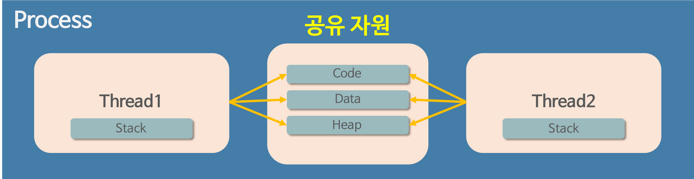

# Process, Thread

### 프로그램, 프로세스, 스레드란?
> #### 프로그램
>- 파일이 저장 장치에 저장되어 있지만 메모리에는 올라가 있지 않은(실행되지 않은) 정적인 상태를 의미
>
>#### 프로세스
>- 운영체제로부터 자원을 할당받은 작업의 단위
>- 운영체제 관점에서 최소 작업 단위
>
>#### 스레드
>- 프로세스가 할당받은 자원을 이용하는 실행 흐름의 단위
>- 프로세스는 스레드를 하나 이상을 가짐
>- CPU 입장에서의 최소 작업 단위

<br>

### 동작 과정
>#### 프로그램 -> 프로세스
>- 우선 프로그램은 메모리에 올라가 있지않아 정적인 상태임. 아직 운영체제가 프로그램에게 독립적인 메모리 공간을 할당해주지 않았으나 해당 프로그램을 실행 시킨다면 컴퓨터 메모리에 올라가게 되고 이 상태를 동적인 상태라고 하며 이 상태의 프로그램을 프로세스라고 한다. 즉,  프로세스는 실행되고 있는 프로그램(파일)이며 스케줄링 단계에서의 “작업”과 같은 단어라고 한다.
>
><br>
>
>#### 프로세스 -> 스레드
> - 과거에는 프로그램을 실행할 때 실행 시작부터 실행 끝까지 프로세스 하나만을 사용하여 진행하였으나, 시간이 지날수록 프로그램이 복잡해지고 프로그램 하나가 단순히 한가지 작업만을 하는 경우가 없어, 하나의 프로세스만을 사용하여 프로그램을 실행하기가 힘들어졌다고 한다. 
>- 해당 해결 방안으로 한 프로그램을 처리하기 위한 프로세스를 여러 개 만들려고 한다면 이는 불가능하다고 한다. 운영체제는 안전성을 위해 프로세스마다 자신에게 할당된 메모리 내의 정보에만 접근할 수 있도록 제약을 두고있고, 이를 벗어나는 정보에 접근하려면 오류가 발생하기 때문이라고 한다. 이런 문제의 해결을 위해 프로세스와는 다른 더 작은 실행 단위 개념인 스레드가 필요하게되었다.
>- 위의 해결 방안으로 등장한 스레드는 프로세스와 다르게 스레드 간 메모리를 공유하며 작동한다. 스레드끼리 프로세스의 자원을 공유하면서 프로세스 실행 흐름의 일부가 되는 것이다. 스레드를 코드로 비유하면 코드 내의 선언된 함수, 즉 스레드는 프로세스의 코드에 정의된 절차에 따라 실행되는 특정한 수행 경로이다.

<br>


### 프로세스의 구조 및 특징

>- 운영체제는 프로세스마다 각각 독립된 메모리 영역을 Code/Data/Stack/Heap의 형식으로 할당해주고 각각의 독립된 메모리 영역을 할당해주기 때문에 프로세스는 다른 프로세스의 변수나 자료에 접근할 수 없다.
>- 프로세스는 하나의 프로세스가 동작 중 오류가 발생하여 프로세스가 강제로 종료된다면 공유하고 있는 파일을 손상시키는 경우가 아니라면 다른 프로세스에게 아무런 영향을주지 않는다

<br>

### 스레드의 구조 및 특징


>- 위의 프로세스와 다르게 프로세스 안의 스레드는 프로세스가 할당 받은 메모리 영역 내에서 Stack 형식으로 할당된 메모리 영역은 따로 할당받고 나머지 Code/Data/Heap 형식으로 할당된 메모리 영역을 공유한다. 따라서 각각의 스레드는 별도의 스택을 가지고 있지만 힙 메모리는 서로 읽고 쓸 수 있게 된다.
>- 스레드는 Code/Data/Heap 메모리 영역의 내용을 공유하기 때문에 어떤 스레드 하나에서 오류가 발생한다면 같은 프로세스 내의 다른 스레드 모두가 강제로 종료된다


<br>

### 멀티 프로세스 vs 멀티 스레드?
>#### 멀티 프로세스
>- 하나의 프로그램을 여러개의 프로세스로 구성하여 각 프로세스가 하나의 작업(테스크)를 처리하도록 하는 것
>
>장점
>>- 여러개의 자식 프로세스 중 하나에 문제가 발생하면 그 자식 프로세스만 죽고 다른 프로세스에는 영향이 가지 않는다
>>- 메모리 침범 문제를 OS 차원에서 해결
>
>단점
>>- context-switching에서의 오버헤드 발생 : context switching 과정에서 캐쉬 메모리 초기화등 무거운 작업이 진행되고 많은 시간이 소모되는 등의 오버헤드가 발생하게 된다. 멀티 스레드의 경우에는 Code/Data/Heap 메모리 영역을 공유하지만 프로세스들은 각각의 독립된 메모리 영역을 할당받아 context switching이 발생하면 캐쉬에 있는 모든 데이터를 모두 리셋하고 다시 캐쉬 정보를 불러온다
>
><br>
>
>#### \* context-switching
>>- CPU에서 여러 프로세스를 돌아가면서 작업을 처리
>>- 동작 중인 프로세스가 대기를 하면서 해당 프로세스의 상태(context)를 보관하고 대기하고 있던 다음 순서의 프로세스가 동작하면서 이전에 보관했던 프로세스의 상태를 복구하는 작업

<br>

>#### 멀티스레드
>- 하나의 응용프로그램을 한 프로세스에서 여러 개의 스레드로 구성하고 각 스레드로 하여금 하나의 작업을 처리하도록 하는 것
>- 윈도우, 리눅스 등 많은 운영체제들이 멀티 프로세싱을 지원하고 있지만 멀티 스레딩을 기본으로 하고 있음
>- 웹 서버는 대표적인 멀티 스레드 응용 프로그램
>
>장점
>>- 시스템 자원 소모 감소 
>>      - 프로세스를 생성하여 자원을 할당하는 시스템 콜이 줄어들어 자원을 효율적으로 관리할 수 있음
>>- 시스템 처리량 증가
>>  	- 스레드 간 데이터를 주고받는 것이 간단해지고 시스템 자원 소모 줄음. 스레드 사이의 작업량이 많아 context switcing이 빠르고 비용이 감소
>>- 간단한 통신 방법으로 인한 프로그램 응답 시간 단축 
>>  	- 스레드는 프로세스 내의 stack 영역을 제외한 모든 메모리를 공유하기 때문에 통신의 부담이 적음
>
>단점
>>- 다른 프로세스(프로세스 밖)에서 스레드를 제어할 수 없음
>>- 멀티 스레드의 경우 자원 공유의 문제 발생 ( 동기화 문제 )
>>- 하나의 스레드에 문제가 발생하면 전체 프로세스가 영향을 받음
>
><br>
>
>#### \* 멀티스레드에서의 동기화 문제 ( Synchronization Issue )
>>- 멀티스레드를 사용한다면 각각의 스레드에서 자원을 공유하는데 해당 자원을 어떤 것이 어떤 순서로 실행될지 알수 없다. 만약 A 스레드가 어떤 자원을 사용하다가 B 스레드로 제어권이 넘어간 후 자원을 수정했을 때, 다시 제어권을 받은 A스레드가 해당 자원에 접근하지 못하거나 바뀐 자원에 접근하게 되는 경우 오류가 발생할수 있음
>>- 이처럼 여러 스래드가 함께 전역 변수를 사용할 경우 발생할 수 있는 충돌을 동기화문제라고함. 스케줄링은 운영체제가 자동으로 해주지 않기 때문에 프로그래머가 적절한 기법을 직접 구현해야하므로 디버깅 과정도 까다로워 지므로 프로그래밍 할 때 멀티 스레드를 이용하려면 신중하여야 함

<br>

#### \* 프로세스간의 정보에 접근하는 방법
>- 기본적으로 프로세스 간의 정보에 접근이 불가능하다고 했지만 3가지 방법이 존재
>- 3가지 방법은 단순히 CPU 레지스터 교체뿐만이 아니라 RAM과 CPU 사이의 캐시 메모리까지 초기화 되기 때문에 자원 부담이 크다.
>>1. IPC ( Inter-process Communication )을 사용
>>2. LPC ( Local inter-Process Communication )을 사용
>>3. 별도로 공유 메모리를 만들어서 정보를 주고 받도록 설정

<br>

#### \* 멀티 프로세싱/ 멀티코어 / 멀티 태스킹/ 멀티 프로그래밍
>- 멀티 프로세싱 :  CPU가 1개가 아닌 여러개. register와 cache를 독립적으로 가진 여러개의 CPU가 1개의 메모리에 연결된 구조
>- 멀티 코어 : CPU 칩 내부에 register와 cahe를 갖고 있는 core만 따로 회로를 구성한 구조
>- 멀티 프로그래밍 : 하나의 메모리에 동시에 여러개의 프로세스를 올림
>- 멀티 태스킹 : 멀티 프로그래밍된 메모리를 대상으로 CPU가 시분할로 여러개의 프로세스를 빠르게 처리함 

<br>

## Ssafy Wizards CS Study

<br>

### 1. 프로세스 vs 스레드
#### 프로세스
- 프로세스는 운영체제 입장에서 최소 작업으로 메모리에 올라가 있는 프로그램을 의미
- 프로세스 간 자원 공유는 IPC(Inter-Process Communication) 통신같은 추가적인 작업이 필요
- 프로세스가 종료되면 모든 스레드도 종료됨
- 하나의 프로세스가 비정상적으로 종료되도 다른 프로세스에는 영향을 미치지 않음

#### 스레드
- 스레드는 CPU 입장에서 최소 작업으로 프로세스가 할당받은 자원을 이용하는 실행 흐름 단위
- 같은 프로세스 내의 스레드는 메모리를 공유하여 자원 공유가 용이
- 하나의 스레드가 종료되어도 다른 스레드는 계속 실행 가능
- 하지만 하나의 스레드가 비정상적으로 종료되면 프로세스 전체에 영향을 미칠 수 있음

| 구분         | 프로세스(Process)                             | 스레드(Thread)                                      |
|--------------|-----------------------------------------------|-----------------------------------------------------|
| **정의**     | 실행 중인 프로그램의 인스턴스                  | 프로세스 내에서 실행되는 작업의 최소 단위              |
| **메모리**   | 독립된 메모리 공간을 가짐                     | 프로세스 내의 메모리 공간(코드, 데이터, 힙, 스택)을 공유 |
| **독립성**   | 각 프로세스는 독립적                          | 같은 프로세스 내의 스레드는 메모리를 공유하여 협력함     |
| **오버헤드** | 프로세스 간 전환 시 오버헤드가 큼              | 스레드 간 전환은 오버헤드가 적음                       |
| **통신 방식**| IPC(Inter-Process Communication)를 사용       | 스레드 간에는 메모리 공유를 통해 직접 통신 가능           |
| **종료 시 영향** | 프로세스가 종료되면 모든 스레드도 종료됨   | 하나의 스레드가 종료되어도 다른 스레드는 계속 실행 가능   |


<br>

### 2. PCB
- 해당 내용은 이전 [정리 내용](../../BookStudy/SE/쉽게배우는운영체제/Chapter3.md)을 가져왔음


<br>

### 프로그램에서 프로세스로의 전환
- 운영체제는 프로그램을 메모리의 적당한 위치로 가져오고 그와 동시에 주문서에 해당하는 작업 지시서를 만드는데 이 작업 지시서가 프로세스 제어 블록(Process Control Block)
- 주문서에는 어떤 테이블에서 어떤 요리를 주문했는지, 손님의 특별 주문 사항은 무엇인지, 현재 어떤 단품 요리까지 제공되었는지 등과 같은 정보가 담겨 있음. 해당 지시서가 프로세스 제어 블록
- 프로세스 제어 블록에는 프로세스를 처리하는데 필요한 다양한 정보가 들어있음
- 프로세스 제어 블록의 다양한 정보중 대표적인 세가지는 다음과 같음
    - 프로세스 구분자
        - 메모리에는 여러 개의 프로세스가 존재하므로 각 프로세스를 구분하는 구분자 (IDentification ID) 가 필요
    - 메모리 관련 정보
        - CPU를 실행하려는 프로세스가 메모리의 어디에 저장되어 있는지 알아야 작업을 할 수 있음
        - 이를 위해 프로세스 제어 블록에는 프로세스의 메모리 위치 정보가 담겨 있음
        - 또한 메모리 보호를 위한 경계 레지스터와 한계 레지스터도 포함되어 있음
    - 각종 중간값
        - 프로세스 제어 블로겡는 프로세스가 사용했던 중간값이 저장되는데 이는 현재 어떤 단품요리 까지 손님에게 제공되었는지 주문서에 표시하는 것과 유사
        - 시분할 시스템에서는 여러 프로세스가 번갈아가며 실행되기 때문에 각 프로세스는 일정 시간 적업을 한 후 다른 프로세스에게 CPU를 넘겨줌
        - 예를 들면 한 프로세스가 103번 행까지 작업 후 다른 프로세스에게 CPU를 넘겨주고 다시 받았을 때 104번 행부터 작업을 시작해야 하는데 이를 위해 프로세스 제어 블록에는 다음에 작업해야할 코드의 위치가 담긴 레지스터인 프로그램 카운터가 저장됨
        - 또한 작업의 중간값을 보관중인 다른 레지스터도 같이 저장됨
- 주문서가 없으면 요리가 진행되지 않듯이 프로세스 제어 블록이 없으면 프로그램이 프로세스로 전환되지 못함
    - 즉 어떤 프로그램이 프로세스가 되었다는 것은 운영체제로부터 프로세스 제어 블록을 받았다는 의미 -> 프로그램이 프로세스가 된다는 것은 운영체제로부터 프로세스 제어 블록을 얻는다는 것
    - 프로세스가 종료되면 프로세스가 메모리에서 삭제되고 프로세스 제어 블록도 마찬가지로 폐기됨 -> 프로세스가 종료된다는 것은 프로세스 제어 블록이 폐기된다는 것
- 프로세스 제어 블록은 운영체제가 해당 프로세스를 위해 관리하는 데이터 구조 이므로 운영체제 영역에 만들어짐
- 강조하고 싶은 점은 컴퓨터 내에는 사용자가 실행한 프로세스가 있는 것만이 아닌 운영체제 프로세스도 존재
    - 컴퓨터에는 일반 사용자의 사용자 프로세스(user process)와 운영체제의 커널 프로세스(kernel process)가 섞여서 실행됨

> 프로세스 : 프로그램 + 프로세스 제어 블록
>
> 프로그램 : 프로세스 - 프로세스 제어 블록

<br>

```
PCB에 저장되는 정보
- 프로세스 ID (PID) : 프로세스 식별 번호.
- 레지스터 값 : 프로세스가 사용 하던 레지스터 값. (프로그램 카운터 등)
- 프로세스 상태 : CPU를 사용 중인 상태인지, CPU 사용을 위해 기다리는 상태인지 등.
- CPU 스케줄링 정보 : 언제, 어떤 순서로 CPU를 할당 받을지.
- 메모리 관리 정보 : 프로세스가 적재된 메모리 위치.
- 사용한 파일 및 입출력 장치 정보 : 프로세스가 어떤 입출력 장치나 파일을 사용했는지.
```

<br>

## 2. 프로세스 제어 블록과 문맥 교환
- 프로세스 제어 블록은 프로세스를 실행 하는데 가장 필요한 중요한 정보를 보관하는 자료 구조
- 모든 프로세스는 고유의 프로세스 제어 블록을 가지며 프로세스 생성시 만들어지고 프로세스 실행 완료시 폐기됨

<br>


### 프로세스 제어 블록의 구성 (차례대로 구성)
- 포인터
    - 준비 상태나 대기 상태는 큐로 운영되는데 프로세스 제어 블록을 연결하여 준비 상태나 대기 상태의 큐를 구현할 때 포인터를 사용
    - 입출력이 완료되기를 기다리는 프로세스는 대기 상태로 모이는데 시스템 내에는 다양한 종류의 입출력장치가 있기 때문에 대기 상태로 모이는 프로세스도 다양한데 모든 프로세스를 뒤지지 않도록 대기 상태에는 같은 입출력을 요구한 프로세스끼리 모아놓음
- 프로세스 상태
    - 프로세스 상태에는 생성, 준비, 실행, 대기, 보류 준비, 보류 대기 등이 있음
    - 이는 프로세스가 현재 어떤 상태에 있는지를 나타냄
- 프로세스 구분자
    - 운영체제 내에 있는 여러 프로세스를 구별하기 위한 구분자를 저장
- 프로세스 카운터
    - 다음에 실행될 명령어의 위치를 가리키는 프로그램 카운터의 값을 저장
- 프로세스 우선순위
    - 프로세스의 중요도가 각각 다름
    - 사용자 프로세스보다 커널 프로세스는 우선순위가 높고 사용자 프로세스끼리도 우선순위가 다름
    - 다양한 우선순위 프로세스가 대기 상태로 들어오기 때문에 대기 상태의 큐도 우선순위 별로 따로 운영됨
    - CPU 스케줄러가 준비 상태에 있는 프로세스 중 실행 상태로 옮겨야 할 프로세스를 선택할 때는 프로세스 우선순위를 기준으로 삼음
    - 높은 우선 순위의 프로세스가 낮은 우선순위의 프로세스보다 먼저 실행되고 더 자주 실행됨
- 각종 레지스터 정보
    - 프로세스 제어 블록에는 프로세스가 실행되는 중에 사용하던 레지스터인 누산기, 색인 레지스터, 스택 포인터와 같은 레지스터의 값이 저장됨
    - 이전에 실행할 때 사용한 레지스터의 값을 보관해야 다음에 실행할 수 있기 때문에 자신이 사용하던 레지스터의 중간값을 보관함
- 메모리 관리 정보
    - 프로세스 제어 블록에는 메모리의 어디 있는지 나타내는 메모리 위치 정보, 메모리 보호를 위해 사용하는 경계 레지스터 값과 한계 레지스터 값 등이 저장됨
    - 그 외에 세크먼테이션 테이블, 페이지 테이블 등의 정보도 보관하는데 이는 8장에서 설명
- 할당된 자원 정보
    - 프로세스를 실행하기 위해 사용하는 입출력이나 오픈 파일 등에 대한 정보
    - 오떤 프로세스가 하드디스크에 저장된 파일을 열어서 작업하거나, 음악을 출력하기 위해 사운드 카드에 접근하고 있다면 파일이나 사운트카드에 대한 정보가 필요한데 이러한 정보를 저장
- 계정 정보
    - 계정 번호, CPU 할당 시간, CPU 사용 시간 등으로 이러한 정보를 저장
- 부모 프로세스 구분자와 자식 프로세스 구분자
    - 프로세스 제어 블록에는 부모 프로세스인 PPID(Parent PID)와 자식 프로세스를 가르키는 CPID(Child PID)정보도 저장
    - 프로세스를 이해하는데 매우 중요한 열쇠인 부모-자식 프로레스 관계는 밑에서 설명

<br>

### 3. 리눅스에서 프로세스와 스레드의 생성 방법

#### 프로세스 생성
- fork(): 부모 프로세스를 복사하여 새로운 자식 프로세스를 생성하는 시스템 호출
- exec(): 현재 프로세스를 새로운 프로그램으로 대체하여 실행

#### 스레드 생성
- pthread_create(): POSIX 스레드를 생성하는 함수로, 새로운 스레드를 생성하여 지정된 함수를 실행

<br>

### 4. 데몬 프로세스
- 데몬 프로세스(Daemon Process)는 백그라운드에서 실행되는 프로세스로 특정 시스템 작업이나 서비스를 지속적으로 제공하기 위해 설계된 프로세스
- 데몬 프로세스는 일반적으로 사용자와 직접 상호작용하지 않으며, 시스템이 부팅될 때 자동으로 시작되어 시스템이 종료될 때까지 계속 실행됨

#### 주요 특징
- 백그라운드 실행
    - 데몬 프로세스는 터미널이나 GUI 없이 백그라운드에서 실행됨
- 시스템 서비스 제공
    - 네트워크 서버, 프린터 스풀러, 로그 관리 등 시스템의 다양한 서비스를 지속적으로 제공
- 자동 시작
    - 시스템이 부팅될 때 자동으로 시작되며, 시스템 종료 시 자동으로 종료됨
- 주로 httpd (Apache 웹 서버), sshd (SSH 서버), cron (크론 작업 스케줄러)에서 사용

<br>

### 5. 자식 프로세스가 상태를 알리지 않고 죽거나 부모 프로세스가 먼저 소멸된다면?
- 좀비 프로세스나 고아 프로세스 상태가 발생할 수 있음
- 좀비 프로세스 (Zombie Process)는 자식 프로세스가 종료되었지만 부모 프로세스가 wait() 또는 waitpid()를 호출하지 않아 자식의 종료 상태를 수거하지 않은 경우 자식 프로세스는 종료된 상태로 PCB(Process Control Block)만 남아있게 되는 상태
    - 좀비 프로세스는 시스템 자원을 차지하지는 않지만, PCB가 해제되지 않아 프로세스 테이블에 남아있음
- 고아 프로세스 (Orphan Process)는 부모 프로세스가 먼저 종료되어 자식 프로세스의 부모가 없는 상태를 고아 프로세스라고 함
    - 해당 고아 프로세스는 init 프로세스가 인수하여 관리함

<br>

### 6. 리눅스에서 프로세스 트리의 루트 노드에 위치하는 프로세스

### 리눅스의 프로세스 계층 구조

- 리눅스에서 시스템이 부팅될 때 가장 먼저 init 프로세스(또는 현대 시스템에서는 systemd 프로세스)가 시작되며, 이 프로세스는 전체 프로세스 트리의 루트가 됨
- init/systemd 프로세스는 시스템의 나머지 모든 프로세스의 부모 역할을 하며, 나머지 프로세스들은 이 프로세스의 자식 프로세스로 생성됨
- init/systemd 프로세스는 PID 1을 가지며, 시스템의 기본적인 관리 작업을 수행하고, 자식 프로세스를 생성함. 이를 통해 운영체제의 모든 프로세스가 트리 구조를 형성하게 됨
- init/systemd 프로세스의 자식으로는 getty 프로세스(터미널을 관리하는 프로세스), sshd 프로세스(SSH 서버) 등이 포함됨

<br>

### 유닉스의 프로세스 계층 구조
- 유닉스에서 커널이 처음 메모리에 올라와 부팅이 되면 커널 관련 프로세스를 여러 개 만드는데 그중 init 프로세스는 전체 프로세스의 출발점이 됨
- 운영체제는 프로세스를 효율적으로 관리하기 위해 init 프로세스를 만든 다음 나머지 프로세스를 init 프로세스의 자식으로 만듬. 그렇게 모든 프로세스는 init 프로세스의 자식이 되어 트리 구조를 이룸
- init 프로세스는 일반 사용자 프로세스의 맨 위에 위치하며 fork()와 exec() 시스템 호출을 이용하여 자식 프로세스를 만듬
- init 프로세스의 자식으로는 login 프로세스, shell 프로세스 등이 있음

<br>

#### 프로세스 계층 구조의 장점
- **여러 작업의 동시 처리**
  - 리눅스에서는 사용자가 시스템에 접속할 때마다 새로운 getty 또는 sshd 프로세스가 fork() 시스템 호출을 통해 생성되어, 여러 사용자가 동시에 로그인하고 작업할 수 있음
  - 사용자가 로그인하면, 로그인 세션을 처리하는 프로세스가 fork()를 통해 새롭게 생성되어 사용자의 명령을 처리하는 쉘 프로세스를 시작함
  - 새로운 명령을 실행할 때, 기존의 쉘 프로세스는 exec() 시스템 호출을 사용하여 새로운 프로그램을 실행하면서 기존의 자원을 재사용하고, 부모-자식 관계도 유지할 수 있음

- **용이한 자원 회수**
  - 프로세스 계층 구조를 사용하면 프로세스 간의 책임 관계가 분명해져서 시스템을 관리하기가 수월해짐
  - 프로세스가 작업을 마쳐서 그 프로세스가 사용하던 자원을 회수할 때 특히 편리함
  - 만약 모든 프로세스가 독립적으로 만들어지면 프로세스가 종료될 때마다 운영체제가 직접 자원을 회수해야 하기 때문에 작업이 복잡해짐
  - 모든 프로세스를 부모-자식 관계로 만들면 자식 프로세스가 작업을 마쳤을 때 사용하던 자원을 부모 프로세스가 회수하면 됨

<br>

<div style="text-align: right">22-06-22</div>

-------

## Reference
- https://velog.io/@raejoonee/프로세스와-스레드의-차이
- https://velog.io/@dailyhyun/멀티-프로세스-vs-멀티-스레드
- https://velog.io/@nnnyeong/OS-멀티프로세스-멀티스레드-멀티-프로그래밍-멀티프로세스-멀티스레드에서의-데이터-통신
