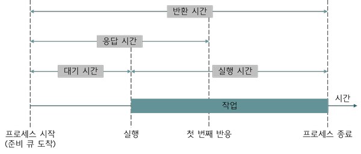

# Scheduling

### 스케줄링
- 컴퓨터의 자원을 보다 효율적으로 이용하기 위해 작업순서와 시간을 할당하는 것 -> 컴퓨터 자원을 어떤 작업에 할당할지 결정하는 것
- 프로세스들이 자원을 사용하는 순서를 결정하는 일
- 프로세스가 자원을 할당 받는 것은 스케줄러부터 CPU를 할당 받아야 함
- CPU를 강제로 빼앗을 수 있는지에 따라 선점형(preemptive), 비선점형(non-preemptive) 스케줄링으로 나눌 수 있음

<br>

### 쉽게 배우는 운영체제 스케줄링 정리 내용
- [쉽게 배우는 운영체제 스케줄링 정리](https://github.com/InJun2/TIL/blob/main/BookStudy/SE/쉽게배우는운영체제/Chapter4.md)

<br>

### 스케줄링의 목적
- 공정한 스케줄링 : 모든 프로세스에게 공정하게 할당해야 함
- 응답시간 최소화 : 대화식 사용자에게는 최대한 응답시간을 빠르게함
- 반환시간 최소화 : 프로세스를 제출한 시간부터 완료시까지 걸리는 반환시간을 최소화 함
- 대기시간 최소화 : 프로세스 준비상태 큐에서 대기하는 시간을 최소화 해야함. 앞에서 처리가 늦어지면 뒤에서 부하가 생김
- 우선 순위 제도 : 먼저 처리해야 하는 것에 우선순위를 부여해서 먼저 처리 함
- 처리량 극대화 : 단위시간당 할 수 있는 처리량을 최대화 함
- 무한 연기 회피 : 자원을 사용하기 위해 무한정 연기하는 경우를 회피

```
dispatcher
- 선택된 프로세스에게 CPU를 할당하는 역할
```

<br>

### 스케줄링의 단계
- 스케줄링의 단계는 고수준 스케줄링, 중간 수준 스케줄링, 저수준 스케줄링이 존재
- CPU 스케줄링을 고수준 스케줄링 또는 장기 스케줄링, 작업 스케줄링이라고 함
- 고수준 스케줄링의 경우는 많은 작업을 동시에 하면 시스템에 과부하가 걸려 작업이 원할하게 이루어지지 않아 시스템 내의 전체 작업 수를 조절하는 것을 의미
- 고수준 스케줄링 단계에서는 어떤 작업을 시스템이 받아들일지 또는 거부할지 결정
    - 일단 작업이 시작하면 기존 작업에 영향을 끼침
    - 운영체제에서 가장 다루는 일의 큰 단위인 프로세스를 단위로 이루어짐
- 저수준 스케줄링의 경우는 CPU 스케줄러 입장에서 어떤 프로세스에 CPU를 할당할지, 어떤 프로세스를 대기 상태로 보낼지 등을 결정
- 중간 수준 스케줄링은 고수준 스케줄링과 저수준 스케줄링 사이에 일어나며 프로세스가 과부하가 걸리는 경우를 중지와 활성화로 전체 시스템의 활성화된 프로세스를 조절하여 과부하를 막음
    - 이는 프로세스의 상태 중 보류 상태에 해당하며 저수준 스케줄링이 원만하게 이루어지도록 완충하는 역할을 함

<br>

### 선점형 스케줄링 (Preemptive Scheduling)
- CPU를 강제로 점유할 수 있음
- 빠른 응답을 요구하는 대화식 시분할 시스템에 적합
- context switching에 대한 overhead가 많이 발생 -> 경쟁 상태를 발생할 수 있음
- 응답이 빠르므로 실시간 응답을 요구하는 시스템에 적합
- 라운드 로빈 방식, SRT, 선점 우선 순위 알고리즘이 있음

<br>

### 비선점형 스케줄링 (Non-preemptive Scheduling)
- 작업이 완료될 때까지 다른 작업이 CPU를 점유할 수 없음 (독점)
- 일괄 처리 시스템에 적합
- 순서대로 처리 보장
- 응답 시간 예측이 가능
- 선점형 방식에 비해 context switching 으로 인한 overhaed가 적음
- 작업이 끝날 때 까지 다른 프로세스들은 대기해야 하므로 처리율이 떨어질 수 있음 
- FCFS, SJF, 우선순위, HRN 등이 있음 -> 높은 우선순위가 먼저 실행되고 낮은 작업이 기다리게 됨

<br>



### 스케줄링 알고리즘
- 스케줄링 알고리즘은 다음과 같은 기준을 통해 평가 할 수 있음
    - CPU 사용률(CPU Utilization) : 전체 시스템 시간 중 CPU가 작업을 처리하는 시간의 비율
    - 처리량(Throughput) : CPU가 단위 시간당 처리하는 프로세스의 개수
    - 응답 시간(Response Time) : 대화식 시스템에서 요청 후 응답이 오기 시작할 때까지의 시간
    - 대기 시간(Waiting Time) : 프로세스가 준비 큐 내에서 대기하는 시간의 총합
    - 반환 시간(Turnaround Time) : 프로세스가 시작해서 끝날 때까지 걸리는 시간 (대기 + 실행시간)

<br>

### 선점형 스케줄링 알고리즘 종류
#### SRT 스케줄링 (Shortest Remaining Time)
- 짧은 시간 순서대로 프로세스를 수행하는 방식
- 남은 처리 시간이 더 짧은 프로세스가 Ready Queue에 들어오면 그 프로세스가 바로 선점됨

#### 라운드 로빈 스케줄링 (Round Robin Scheduling)
- 프로세스들 사이에 우선순위를 두지 않고, 순서대로 시간 단위(time slice, quantum)로 CPU를 할당하는 방식. 대표적인 선점형 방식
- 라운드 로빈 방식은 타임 슬라이스(선점형 스케줄링에서 cpu를 점유하도록 허용된 시간)를 적당한 크기로 설정하는 것이 중요
- 타임 슬라이스가 너무 클 경우 : 응답 시간이 느려짐
- 타임 슬라이스가 너무 작을 경우 : context switching으로 인한 overhead가 커짐
- 타임 슬라이스만큼 순차적으로 할당하기 때문에 기아 현상이 발생하지 않으나 context switching으로 인한 overhead가 발생
- 우선순위가 따로 없기 때문에 중요도에 따라 우선순위를 다르게 두고 CPU를 할당하고 싶을 경우 우선순위 스케줄링 방식과 함께 사용해야 함

#### 다단계 큐 스케줄링 (Multilevel Queue Scheduling)
- 우선순위에 따라 준비 큐를 여러 개 사용하는 방식 (단순히 큐를 여러개 사용하는 멀티큐가 아니라 우선순위가 부여된 멀티 레벨 큐)
- 각각의 큐에 서로 다른 방식의 스케줄링 알고리즘을 적용시킬 수 있음
- 우선 순위에 따라 순서제어가 가능하고 우선순위에 따라 타임 슬라이스를 조절하여 작업 효율을 높일 수 있음
- 우선 순위가 높은 프로세스에 의해 우선순위가 낮은 프로세스의 작업이 연기될 수 있음
- 프로세스가 하나의 큐에 영구적으로 할당되는 방식이기 때문에 상황에 맞게 큐를 갈아탈 수 없음

#### 다단계 피드백 큐 스케줄링 (Multilevel Feedback Queue Scheduling)
- 우선순위를 변경할 수 없는 MQS에서 한단계 발전한 알고리즘으로 프로세스의 우선순위의 변경이 가능한 방식
- CPU를 사용하고 난 프로세스는 한단계 낮은 큐로 다시 삽입됨 -> 우선순위가 낮아져도 커널 프로세스가 일반 프로세스 큐에 삽입되지 않음
- MLFQ는 우선순위에 따라 타입 타입 슬라이스 크기가 다름 (우선순위가 낮을수록 타임 슬라이스 크기가 증가)
- 우선순위가 낮은 프로세스는 우선순위가 높은 프로세스보다 CPU를 얻을 기회가 더 적기 때문에 타임 슬라이스를 크게 설정하여 더 오랫동안 CPU를 점유할 수 있도록 함
- 오늘날의 운영체제가 CPU 스케줄링을 위해 일반적으로 사용되는 방식이나 구현이 어려움
- 우선순위가 변동되기 때문에 기아현상으로 인한 문제를 해소할 수 있음

<br>

### 비선점형 스케줄링 알고리즘 종류
#### 우선순위 스케줄링 (Priority Scheduling)
- 프로세스에게 우선순위를 정적 혹은 동적으로 부여하며 우선순위가 높은 순서대로 처리함
- 준비 큐에 프로세스가 도착하면 도착한 프로세스의 우선순위와 현재 실행 중인 프로세스의 우선순위를 비교하여 우선순위가 가장 높은 프로세스에 프로세서를 할당하는 방식
- 우선순위가 동일한 프로세스가 준비 큐로 들어오면 FIFO의 순서대로 스케줄링을 하게 됨
- 우선순위가 높은 작업이 계속해서 들어오면 우선순위가 낮아 실행하지 못하는 기아 상태가 유발될 수 있음

#### FCFS 스케줄링 (First Come First Served Scheduling)
- 먼저 들어온 작업을 먼저 처리하는 방식
- 비선점형 방식으로 선입 선출(FIFO, First In First Out)이라고도 함
- 알고리즘이 단순하고 구현이 간단 (큐로 구현 가능)
- CPU를 점유할 때까지 다른 프로세스들은 대기 해야 함 -> convoy effect 발생 가능 (convoy effect : 처리 시간이 긴 CPU를 점유하여 다른 프로세스들의 대기 시간이 길어져 시스템 효율이 떨어지는 것을 말함)

#### SJF 스케줄링 (Shortest Job First Scheduling)
- 실행 시간이 짧은 작업부터 먼저 처리하는 방식. 실행시간이 스케줄링 판단 구조
- 최단 작업 우선 스케줄링이라고도 함
- 선점형, 비선점형 모두 적용될 수 있으나, 선점형에 적용되는 SJF 스케줄링을 특별히 SRTF 스케줄링이라고 함
- 평균 대기 시간을 최소화 할 수 있음
- 프로세스 작업 길이를 추정하는 것이 힘들고, 특정 프로세스가 기아 상태에 빠질 수 있어 현실적으로 사용되기 어려움

#### HRRN 스케줄링 (Highest Response Ratio Next Scheduling)
- 준비 큐에 있는 프로세스들 중에서 응답률이 가장 높은 프로세스에게 높은 우선순위를 주는 방식
- 응답률(우선순위) = (대기시간 + CPU 사용시간) / CPU 사용 시간
- SJF의 문제점인 기아 현상을 보완하기 위해 개발된 방식. HRRN은 에이징(aging)을 통해 기아 현상을 해결 (대기 시간에 따라 우선순위를 증가시켜주는 방법. 오래 기다린만큼 우선순위를 높여주어 결국 실행될 수 있도록 하는 것)
- 실행시간이 짧은 프로세스를 우선순위를 높게 설정하면서도 대기 시간을 고려하여 기아 현상을 완화시키나 여전히 공평성은 떨어짐

<br>

### 기아 상태와 교착 상태의 차이

| **구분**           | **기아 상태 (Starvation)**                                       | **교착 상태 (Deadlock)**                                         |
|--------------------|-----------------------------------------------------------------|------------------------------------------------------------------|
| **정의**           | 자원을 받을 수 있는 기회는 있으나 장기간 자원을 할당받지 못함      | 프로세스들이 서로 자원을 점유한 채 대기하며 더 이상 진행 불가     |
| **발생 원인**      | 우선순위가 낮아 자원을 할당받지 못할 때 발생                      | 상호 배제, 점유 대기, 비선점, 순환 대기 조건이 모두 충족될 때 발생 |
| **특징**           | 자원은 사용 가능하지만 우선순위 높은 프로세스에 의해 대기 상태     | 프로세스들이 서로 자원을 기다리며 진행할 수 없는 상태            |
| **해결 방법**      | 에이징(Aging) 기법으로 우선순위를 점진적으로 높여 해결            | 교착 상태 예방, 회피, 탐지 및 복구를 통해 해결                  |

<br>

## Ssafy Wizards CS Study

<br>

### 1. RR을 사용할 때, Time Slice에 따른 trade-off
- RR, 라운드 로빈 스케줄링은 '순환 순서 방식'으로 번역되는 라운드 로빈 스케줄링은 한 프로세스가 할당받은 시간(타임 슬라이스)동안 작업을 하다가 작업을 완료하지 못하면 준비 큐의 맨 뒤로 가서 차례를 기다리는 방식
- 라운드 로빈 스케줄링에서 사용하는 타임 슬라이스는 각 프로세스가 CPU를 점유할 수 있는 시간 단위로 타임 슬라이스의 크기는 성능과 응답 시간에 큰 영향을 미침
- 짧은 타임 슬라이스는 응답 시간이 짧아져 대화형(interactive) 시스템에 유리
    - 사용자가 빠른 응답을 요구하는 경우, 각 프로세스가 자주 CPU를 점유하게 되므로 빠르게 반응할 수 있음
    - 컨텍스트 스위칭이 빈번하게 발생하여 오버헤드가 증가함. 이로 인한 성능 저하를 초래할 수 있음
- 긴 타임 슬라이스는 컨텍스트 스위칭 횟수가 줄어들어 오버헤드가 감소하고, CPU 효율성이 증가함
- CPU를 점유하고 있는 시간이 길어 응답 시간이 길어질 수 있음. 대화형 시스템에서는 사용자가 응답을 기다리는 시간이 길어져 오히려 성능 저하를 겪을 수 있음
- 해당 방식은 타임 슬라이스를 적당히 사용하는 것이 제일 중요

<br>

### 2. 싱글 스레드 CPU 에서 상시로 돌아가야 하는 프로세스가 있을 때 사용하는 스케줄링 알고리즘
- 상시로 돌아가야 하는 프로세스는 실시간 시스템에서 흔히 볼 수 있으며 실시간 스케줄링 알고리즘이 적합
- 실시간 시스템(Real-Time System)에서 항상 돌아가야 하는 프로세스를 위한 실시간 스케줄링 알고리즘은 다음과 같음

#### 1. Rate Monotonic Scheduling (RMS)
- 고정 우선순위 스케줄링 알고리즘으로 주기가 짧은 작업(주기적으로 반복 실행되어야 하는 작업)에 높은 우선순위를 부여하는 방식
- 실시간 시스템에서 주기가 짧을수록 더 자주 CPU를 사용해야 하므로, 주기가 짧은 작업이 높은 우선순위를 가져야 한다는 가정에서 설계
- 고정된 우선순위를 사용하므로, 작업이 시작될 때부터 우선순위가 고정됨

#### 2. Earliest Deadline First (EDF)
- 동적 우선순위 스케줄링 알고리즘으로 기한(Deadline)이 가장 빠른 작업에 우선순위를 부여하여 실행하는 방식
- 작업의 우선순위는 동적으로 변경되며, 기한이 가까운 작업이 높은 우선순위를 가지게 됨
- 주어진 시간 내에 반드시 완료되어야 하는 작업이 있는 경우, 해당 작업이 다른 작업보다 우선적으로 처리됨

#### 3. Preemptive Priority Scheduling
- 우선순위 기반의 선점형 스케줄링 알고리즘으로 우선순위가 높은 프로세스가 CPU를 선점하여, 항상 우선순위가 높은 프로세스가 먼저 실행되도록 보장함
- 특정 프로세스가 상시로 돌아가야 하는 경우에는 해당 프로세스에 가장 높은 우선순위를 부여하여, 다른 작업보다 항상 우선적으로 CPU 자원을 사용할 수 있도록 함
- 이 방식은 실시간 시스템에서 중요한 작업이 지연 없이 실행되도록 보장하는 데 유용

<br>

### 3. 동시성 vs 병렬성
- 프로세스 스케줄링 관점에서 동시성과 병렬성은 프로세스들이 어떻게 CPU 자원을 할당받아 실행되는지임
- [이전 정리 내용](./Concurrency-Parallelism.md)

#### 동시성 (Concurrency)
- 여러 작업을 논리적으로 동시에 실행하는 것을 의미
- 실제로는 싱글 코어에서 한 번에 하나의 작업을 처리하지만, 작업을 빠르게 전환하여 마치 여러 작업이 동시에 실행되는 것처럼 보이게 만듬
- Round Robin, Multilevel Feedback Queue 등 CPU 시간을 분할하여 각 프로세스가 짧은 시간 동안 교대로 CPU를 사용하도록 하여 동시성을 구현

#### 병렬성 (Parallelism)
- 여러 작업을 실제로 동시에 실행하는 것을 의미
- 멀티코어 CPU에서 각 코어가 다른 작업을 병렬로 처리할 수 있음
- 멀티코어 환경에서 각 코어에 프로세스를 동시에 할당하는 방식으로 구현

<br>

### 4. 타 스케쥴러와 비교하여, Multi-level Feedback Queue가 해결하는 문제점
- 짧거나 우선순위가 높은 작업은 높은 우선 순위 큐에서 빠르게 처리되어 우선 순위에 따른 작업 처리가 가능
- 오래 대기한 작업은 점차 높은 우선순위 큐로 이동하여 처리하여 기아 문제를 해결
- 프로세스의 실행 시간에 따라 우선순위가 동적으로 변동되어, 자주 실행되지 않는 프로세스도 처리할 수 있음

<br>

### 5. 스레드의 스케줄링 알고리즘
- 스레드의 스케줄링은 프로세스의 스케줄링과 유사하지만, 스레드는 같은 프로세스의 주소 공간을 공유하므로 메모리 전환 작업이 필요하지 않다는 점이 다름
- 스레드의 스케줄링 알고리즘에는 다음과 같은 방법이 존재
    - Round Robin (RR): 각 스레드가 고정된 시간 동안 CPU를 점유하고, 타임 슬라이스가 끝나면 다음 스레드로 교체되는 방식
    - Priority Scheduling: 스레드에 우선순위를 부여하고, 우선순위가 높은 스레드가 먼저 실행
    - Multi-level Feedback Queue (MLFQ): 여러 우선순위 큐를 사용하여 스레드의 작업 성격에 따라 우선순위를 동적으로 조정
    - Work Stealing: 멀티스레드 환경에서 자원을 효율적으로 사용하기 위해, 작업이 끝난 스레드가 다른 스레드의 작업을 훔쳐오는 방식

<br>

<div style="text-align: right">22-08-03</div>

-------

## Reference
- https://gamedevlog.tistory.com/78
- https://www.uname.in/252
- https://arainablog.tistory.com/289