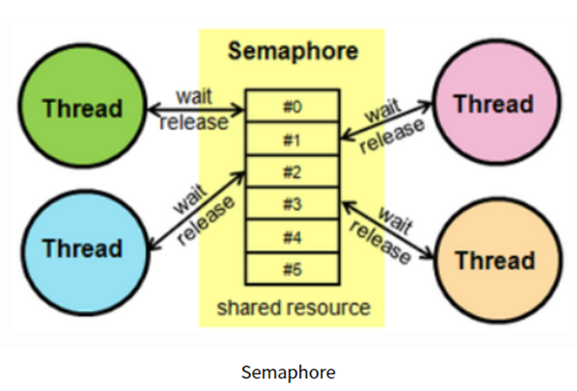
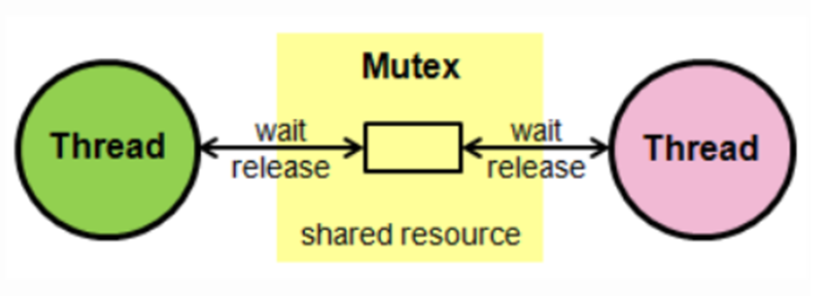

# 뮤텍스와 세마포어

### 임계 구역(Critical Section) 이란?
>- 여러 프로세스 혹은 스레드가 작업을 수행하면서 공유된 자원을 건드리게 될 수 있는데, 이때 동기화 처리를 제대로 해주지 않으면 문제가 발생할 수 있음.
>- 여기서 공유되는 부분으로 프로그램 코드 상에서 공유 자원에 접근하는 부분을 임계 구역(Critical Section)이라고 함
>- 임계구역에서 여러 프로세스 및 스레드가 함부로 접근할 수 없도록 관리를 잘해주어야 하는데 이를 위해 사용하는 방식으로 세마포어(Semaphore)와 뮤텍스(Mutex)가 존재 ( 병행 처리를 위한 동기화 기법 )

 

### 경쟁 상태(Race Condition) 란?
- 두 개 이상의 동시성이 있는 프로세스나 스레드들이 동기화 없이 공유된 자원에 접근하려는 현상
- 쉽게 말해 두 개 이상의 프로세스가 하나의 자원을 놓고 서로 이용하려고 경쟁하는 상황을 의미

 

 

### 세마포어(Semaphore)
>- 공유 자원에 여러 프로세스가 접근하는 것을 막는 것.
>- 세마포어는 이를 위해서 현재 공유 자원의 상태를 나타내는 카운터 변수를 사용하게 됨
>- 하나의 임계구역에 여러 프로세스가 들어오는 것은 아님. 프로세스마다 사용하는 임계구역이 따로 있는 것 같음..
>- 이러한 변수는 실제로 운영체제 혹은 커널에 값으로 저장되며, 각 프로세스는 이를 확인할 수 있고 값을 변경할 수도 있게 됨.
>- 각각의 프로세스들은 이런 상태값을 확인하여 자원을 즉시 사용할 수 있는 상태라면 즉시 사용할 수 있고 만약에 누군가가 자원을 사용중이라는 것을 인지하게 되면, 반드시 일정 시간을 기다렸다가 사용. 이런 방식을 사용하여 여러 프로세스가 공유자원에 한꺼번에 접근하는 것을 막음
>- 세마포어는 뮤텍스와 다르게 0혹은 1 같은 이진수 외에 더 큰 숫자를 가지게 할 수 있어서 꼭 1개의 프로세스만이 자원을 점유하지 않음.
>- 카운터 변수의 값이 해당 공유 자원에 접근할 수 있는 임계치가 되며 이를 조정하여 접근할 수 있는 프로세스의 개수를 통제할 수 있음.

 

 

### 뮤텍스 ( Mutex )
>- 뮤텍스(Mutex)는 상호 배제(Mutual Exclusion)를 뜻하는 말로, Critical Section을 가지는 쓰레드들의 Running time이 서로 겹치지 않도록 해주는 기법.
>- 세마 포어와 가장 큰 차이점으로는 공유 자원에 접근할 수 있는 대상의 개수 차이로 뮤텍스는 1개의 스레드만이 공유 자원에 접근할 수 있도록 함.
>- 뮤텍스에서는 Lock과 Unlock개념을 사용하여, 이진 세마포어(Binary Semaphore)와 같은 개념. 
>- 뮤텍스가 Lock을 이용하여 처리하는 동안 기다리는 것을 비지 웨이팅(busy waiting)이라 함
>- 뮤텍스는 단일코어에서는 효율적이지 못하지만 다중코어에서는 효과적일 수 있음.
>- 스핀락이란 임계구역에 진입이 불가능할 때 진입이 가능할 때까지 루프를 돌면서 재시도하는 방식으로 구현된 Lock. -> 스핀락은 운영체제의 스케줄링 지원을 받지 않기 때문에 해당 스레드에 대한 문맥교환이 일어나지 않음
>- 자원을 점유하고 있는 대상이 Lock을 할 수 있는 권한을 가지고 있어서 자원을 점유하기 시작할 때 들어가서 Lock을 걸어버리는데 이렇게 되면 다른 대상들은 Unlock 상태가 될 때까지 기다렸다가 나중에 해당 공유 자원에 접근할 수 있게 됨.

 

### 차이점
>- 뮤텍스(Mutex)는 이진 세마포어(Binary Semaphore)로 세마포어의 일종. 가장 큰 차이점으로는 뮤텍스는 오직 1개의 프로세스 혹은 스레드만이 공유 자원에 접근할 수 있고, 세마포어는 지정된 변수의 값만큼 접근할 수 있음
>- 또한 세마포어는 운영체제 혹은 커널 단위에서 해당 리소스 변수가 관리되어 현재 공유 자원을 사용 중인 대상 뿐만아니라 다른 프로세스 및 스레드도 잠금 상태를 해제할 수 있지만 뮤텍스는 프로세스 단에서 관리되고 해당 변수(Lock)을 가지고 있기 때문에 Lock을 가지고 있는 변수만이 Unlock을 할 수 있음.

 

22-06-27

+ 내용추가 : 22-07-27

-------

## Reference
- https://velog.io/@logandev/세마포어와-뮤텍스-차이
- https://dkwjdi.tistory.com/247