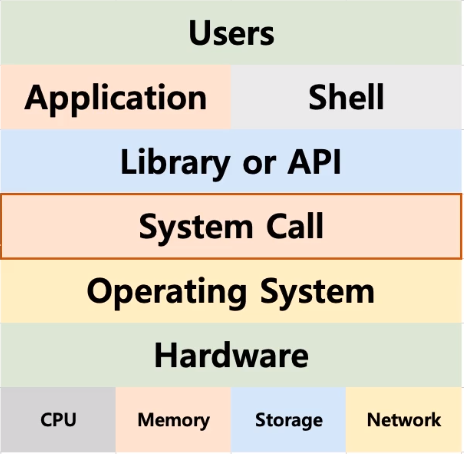
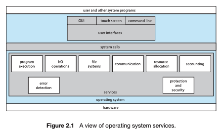
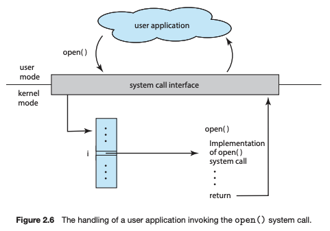

# System Call





### 시스템 콜(System Call)
- 프로세스가 컴퓨터를 관리하는 시스템인 운영체제에게 어떤 기능(서비스)를 사용 요청 -> 커널과 사용자 프로그램을 이어주는 인터페이스 역할
- 운영체제는 컴퓨터를 실행 및 사용하게 해주는 프로그램이라면 시스템 콜은 프로세스가 운영체제에게 운영체제 기능을 요청하는 것
- 기본적으로 파일을 읽고, 메모리에 데이터를 올리는 것은 운영체제의 역할이고 프로세스는 관리자는 운영체제에게 허락을 요청받기 위해 시스템 콜로 하여금 허락을 요청한다
- 파일 뿐 아니라 운영체제가 관리하는 모든 자원(네트워크, 디스크, 메모리 등)이 필요할때 프로세스는 시스템 콜을 사용해야 함 -> User mode에서 사용이 불가능한 Protected Instruction을 사용하기 위해 OS가 제공하는 system call을 이용하여 커널모드로 switch 할때 사용(시스템 콜을 호출하면 User mode에서 Kernel mode로 Context Switch가 발생)
- 시스템 콜은 커널 영역의 기능을 사용자 모드가 사용가능하도록 프로세스가 하드웨어에 직접 접근해서 필요한 기능을 사용할 수 있게 해주는 것으로 동작 과정은 기술하였음

<br>

### 시스템 콜 유형 및 종류
#### 1. 프로세스 제어 (Process Control)
>- 끝내기(exit), 중지(abort)
>- 적재(load), 실행(execute)
>- 프로세스 생성(create process) - fork
>- 프로세스 속성 획득과 설정(get process attribute and set process attribute)
>- 시간 대기(wait time)
>- 사건 대기(wait event)
>- 사건을 알림(signal event)
>- 메모리 할당 및 해제(malloc, free)
#### 2. 파일 조작(File Manipulation)
>- 파일 생성(create file), 파일 삭제(delete file)
>- 열기(open), 닫기(close)
>- 읽기(read), 쓰기(write), 위치 변경(reposition)
>- 파일 속성 획득 및 설정(get attribute and set file attribute)
#### 3. 장치 조작(Devide Management)
>- 하드웨어의 제어와 상태 정보를 얻음(ioctl (Input/Output control의 약자)) 
>- 장치를 요구(request devices), 장치를 방출(release device)
>- 읽기(read), 쓰기(write), 위치 변경
>- 장치 속성 획득, 장치 속성 설정
>- 장치의 논리적 부착(attach) 또는 분리(detach)
#### 4. 정보 유지보수(Information Maintenance)
>- getpid(), alarm(), sleep()
>- 시간과 날짜의 설정과 획득(time)
>- 시스템 데이터의 설정과 획득(date)
>- 프로세스 파일, 장치 속성의 획득 및 설정
#### 5. 통신(Communication)
>- pipe(), shm_open(), mmap()
>- 통신 연결의 생성, 제거
>- 메시지의 송신, 수신
>- 상태 정보 전달
>- 원격 장치의 부탁 및 분리
#### 6. 보호(Protection)
>- chmod()
>- umask()
>- chown()

<br>



### API(Application Programming Interface)
- 대부분의 어플리케이션 개발자들은 API에 따라 프로그램을 설계 -> 보통 시스템 콜을 사용하기 보다는 해당 시스템 콜을 사용해서 만든 각 언어별 라이브러리(API)를 사용함
- 프로그래머가 사용 가능한 가장 흔한 API 3가지는 Windows APU, POSIX API, Java API 존재
- 최종적으로 API를 구성하는 함수들은 통상 어플리케이션 프로그래머를 대신하여 실제 시스템 콜을 호출함
- 시스템 콜을 처리하는 중요한 다른 요소는 실행 시간 환경(런타인 환경, RTE)으로 RTE는 운영체제가 제공하는 시스템 콜에 대한 연결고리 역할을 하는 시스템 콜 인터페이스를 제공. 이 시스템 인터페이스는 API 함수의 호출을 intercept해서 필요한 운영체제 시스템 콜을 부름
- 운영체제 인터페이스에 대한 대부분의 자세한 내용은 API에 의해 프로그래머로부터 숨겨지고 RTE에 의해 관리됨
- 시스템 콜 호출을 위해서는 운영체제에 매개변수를 전달해야만 하는데 해당 내용은 아래 기술

<br>

### 커널 (Kernel)
- 운영체제 중 항상 메모리에 올라가 있는 운영체제의 핵심 부분
- 커널은 인터페이스로써 응용 프로그램 수행에 필요한 여러가지 서비스를 제공하고 여러가지 하드웨어 등의 리소스를 관리하는 역할
- 커널은 유저모드와 커널모드가 존재
    - 커널모드는 I/O devices를 포함해 모든 주소 영역 접근 가능
    - 유저모드는 명령어의 일부와 HW feature의 일부만 사용 가능

- [커널 정리 링크](./Kernel.md)
```
보호 명령( Protected Instruction )
- 프로세스의 실행, 종료나 I/O 작업 등의 사용자가 함부로 사용하면 문제가 될 만한 명령들
- OS의 커널모드와 유저모드 중 커널 모드에서만 사용이 가능
- 이와 같은 기능을 위해서 유저모드에서 커널모드로 trap하는 system call을 사용
```

<br>

### 시스템 콜으로 커널 동작 과정
> 1. 우리가 만드는 프로그램이 유저 모드에서 실행 
> 2. 프로그램 실행 중에 인터럽트(interrupt)가 발생하거나 시스템 콜(system call)을 호출하게 되면 커널 모드로 전환 (read) 
> 3. 커널 모드에서 프로그램의 현재 CPU 상태를 저장. 파일을 읽을 준비 (waiting) 
> 4. 커널이 직접 해당 인터럽트 혹은 시스템 콜 실행/처리 (running) 
> 5. 처리가 완료되면 중단 됬던 프로그램의 CPU 상태 복원 
> 6. 다시 통제권을 프로그램에게 반환해 커널모드에서 유저모드로 다시 변경됨

<br>

#### 시스템 콜 매개 변수 전송
- 필요한 기능이나 시스템 환경에 따라 System Call이 발생할 때 좀 더 많은 정보가 필요할 수 있음
- 그러한 정보가 담긴 매개변수를 운영체제에 전달하기 위해서는 대략 3가지 정도의 방법이 존재
    - 레지스터를 통한 전송 : 매개변수를 CPU 레지스터 내에 전달. 이 경우에 매개변수의 객수가 CPU 내의 총 레지스터 개수보다 많을 수 있음. 매개변수가 레지스터로 직접 전달되나 레지스터 크기보다 더 많은 매개변수가 존재하므로 좋지 않은 방법
    - 블록 혹은 테이블을 통한 전송 : 매개변수를 메모리 내의 블록이나 테이블에 저장하고 해당 메모리의 주소가 레지스터에 전달
    - 스택을 통한 전송 : 매개변수는 프로그램에 의해 스택(stack)으로 전달(push) 될 수도 있음. 매개변수는 프로그램에 의해 스택에 넣어지고 운영체제의 의해 꺼내짐

<br>

<div style="text-align: right">22-08-23</div>

-------

## Reference
- https://dolphinsarah.tistory.com/54
- https://velog.io/@woo0_hooo/기술면접대비-System-Call이란
- https://dar0m.tistory.com/264
- https://rebro.kr/171