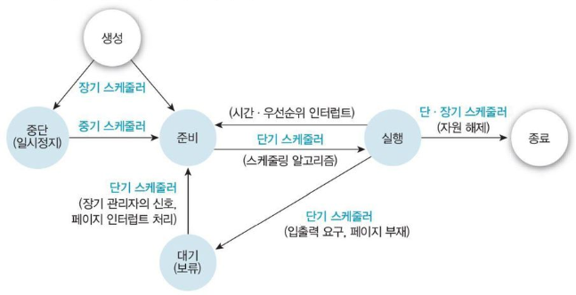

# Scheduler

### 스케줄러 (Scheduler)
- 운영체제의 한 구성 요소로, 프로세스나 스레드에 CPU 자원을 할당하는 역할으로 스케줄링을 수행하는 주체
- 스케줄러는 여러 프로세스나 스레드 중에서 어떤 것을 CPU에 할당할지 결정하며 이 결정에 따라 시스템의 성능, 응답 시간, 공정성 등이 영향을 받음
- CPU 스케줄러는 프로세서 스케줄러라고도 하며 프로세스가 생성된 후 종료될 때까지 모든 상태 변화를 조정하는 일을 함

 

### 스케줄러 주요 유형
#### 단기 스케줄러(Short-Term Scheduler, CPU 스케줄러)
- 즉각적으로 CPU에 할당할 프로세스를 결정
- 준비 상태에 있는 프로세스들 중 하나를 선택하여 CPU에 할당하는 역할
- 문맥 교환이 일어날 때마다 활성화되어 다음에 실행할 프로세스를 정함

#### 중기 스케줄러(Medium-Term Scheduler)
- 시스템의 메모리 상태를 관리하는 역할을 하며, 메모리 부담을 줄이기 위해 일부 프로세스를 일시적으로 디스크로 내보내는(swap out) 일을 함
- 메모리가 충분하지 않으면 프로세스를 일시적으로 중단(suspend)시켜 메모리 사용을 조정함

#### 장기 스케줄러(Long-Term Scheduler)
- 시스템에서 실행할 프로세스를 결정
- 프로세스 생성 시 어떤 프로세스를 시작 상태로 바꿀지 결정하여 준비 상태로 이동시킴
- 일반적으로 프로세스 생성 빈도가 낮기 때문에 느리게 동작하며, 시스템의 작업량을 조절하는 역할을 함

 

### 스케줄러의 주요 특징

#### 1. 우선순위 기반 (Priority-Based)
- 스케줄러는 프로세스의 우선순위에 따라 CPU 자원을 할당할 수 있음
- 우선순위가 높은 프로세스는 CPU를 먼저 할당받아 실행되며, 우선순위가 낮은 프로세스는 대기
- 우선순위 기반 스케줄링에서 기아(Starvation) 현상이 발생할 수 있으며, 이를 방지하기 위해 에이징(Aging) 기법을 사용하여 우선순위를 점진적으로 높임

#### 2. 선점형 (Preemptive) vs. 비선점형 (Non-Preemptive)
- 선점형 스케줄링: CPU가 프로세스에 할당된 도중, 더 높은 우선순위의 프로세스가 발생하면 현재 프로세스를 중단하고 새로운 프로세스에 CPU를 할당
- 비선점형 스케줄링: 한 번 할당된 CPU는 프로세스가 종료되거나 자발적으로 CPU를 반환할 때까지 유지

#### 3. 공정성 (Fairness)
- 스케줄러는 모든 프로세스가 공정하게 CPU 자원을 할당받을 수 있도록 관리
- 각 프로세스는 일정한 시간 동안 CPU를 사용하고, 스케줄러는 과도한 CPU 사용을 방지하여 시스템 성능을 최적화

#### 4. 반응 시간 (Response Time)
- 반응 시간은 프로세스가 실행을 시작하기까지 걸리는 시간
- 스케줄러는 반응 시간을 최소화하여, 특히 대화형(interactive) 시스템에서 사용자 경험을 개선

#### 5. 처리율 (Throughput)
- 처리율은 일정 시간 동안 완료된 작업 수를 의미
- 스케줄러는 처리율을 최적화하기 위해 문맥 교환 오버헤드를 최소화하고, CPU 자원을 최대한 활용하는 방식으로 작업을 관리

#### 6. 실시간 지원 (Real-Time Support)
- 실시간 시스템에서는 특정 시간 내에 작업이 완료되어야 하는 경우가 많음
- 스케줄러는 실시간 스케줄링 알고리즘(예: RMS, EDF)을 통해 기한 내 작업을 완료하도록 CPU 자원을 할당

 

### 스케줄링
- 스케줄러는 다양한 상황에 맞게 여러 종류의 스케줄링 알고리즘을 적용할 수 있어 각 알고리즘은 시스템의 요구사항에 따라 사용될 수 있음
- [스케줄링 목적 및 알고리즘 정리](./Scheduling.md)

 

## Ssafy Wizards CS Study

 

### 1. 단기, 중기, 장기 스케쥴러와 현재 사용하는 스케쥴러
#### 단기 스케줄러 (Short-Term Scheduler, CPU 스케줄러)
- 즉각적으로 CPU에 할당할 프로세스를 선택하는 스케줄러
- 프로세스가 실행 상태로 전환될 때마다 CPU를 할당하며, 매우 빈번하게 작동
- 문맥 교환 시마다 활성화되어 짧은 시간 내에 처리할 프로세스를 결정

#### 중기 스케줄러 (Medium-Term Scheduler)
- 메모리 관리와 관련된 스케줄러로, 메모리 부담을 줄이기 위해 프로세스를 일시적으로 중단(suspend)하고 디스크로 스왑 아웃하는 역할
- 메모리 자원이 부족할 때, 중단된 프로세스를 다시 메모리로 복귀시킴(스왑 인)

#### 장기 스케줄러 (Long-Term Scheduler)
- 시스템에서 프로세스를 생성하거나 제거하는 역할
- 준비 상태로 전환할 프로세스를 선택하여 프로세스의 수를 조정함
- 프로세스 생성 빈도가 낮아 장기적으로 시스템 작업 부하를 조정

#### 현재 사용하는 스케줄러
- 대부분의 현대 운영체제에서는 **단기 스케줄러**가 주로 사용됨
- 멀티태스킹 환경에서 **선점형(preemptive) 스케줄링** 알고리즘을 사용하여 프로세스 간의 빠른 전환을 지원
- 예: Linux 스케줄러(CFS, Completely Fair Scheduler), Windows 스케줄러는 우선순위 기반 선점형 스케줄링을 사용

 

### 2. 프로세스의 스케쥴링 상태
- **New(생성)**: 새로 생성된 프로세스. 아직 준비 상태에 들어가지 않음
- **Ready(준비)**: 프로세스가 CPU를 할당받을 준비가 된 상태
- **Running(실행)**: 프로세스가 CPU에서 실행 중인 상태
- **Waiting(Blocked, 대기 혹은 보류)**: 프로세스가 입출력(I/O) 작업이나 다른 자원을 기다리는 상태
- **Terminated(종료)**: 프로세스가 작업을 완료하고 종료된 상태
- **Suspended(중단 혹은 일시정지)**: 프로세스가 일시적으로 중단된 상태로 메모리에서 스왑 아웃되어 디스크에 저장됨

 

### 3. preemptive/non-preemptive 에서 존재할 수 없는 상태
- Non-Preemptive(비선점) 스케줄링에서는 선점이 발생하지 않음. 즉, 프로세스는 스스로 자발적으로 CPU를 반환하기 전까지 계속 실행됨
- Preemptive(선점) 스케줄링에서는 더 높은 우선순위의 프로세스가 등장하면 현재 실행 중인 프로세스는 중단되고 문맥 교환이 발생

#### Preemptive 스케줄링에서 존재할 수 없는 상태
- 프로세스가 자발적으로 CPU를 반납할 때까지 기다리는 상태는 존재하지 않음
- 언제든지 더 높은 우선순위의 프로세스가 등장하면 현재 프로세스가 강제 중단시키고 CPU를 점유할수 있음

#### Non-Preemptive 스케줄링에서 존재할 수 없는 상태
- 강제로 CPU를 빼앗기는 상태는 존재하지 않음. 즉, CPU가 자발적 반환 없이 선점되지 않음
- 프로세스가 CPU를 자발적으로 반납할 때까지 실행을 반복하며 현재 실행 중인 프로세스가 스스로 종료하거나 입출력을 기다릴 때만 CPU가 다른 프로세스로 넘어감
- 그렇기 때문에 교착 상태는 발생하지 않음

 

### 4. Memory가 부족할 경우, Process의 상태 변화
- **Ready → Suspended**: 프로세스가 준비 상태에 있지만, 메모리가 부족한 경우 디스크로 스왑 아웃되어 Suspended 상태로 전환될 수 있음
- **Running → Suspended**: 실행 중인 프로세스가 메모리 부족으로 중단되고, 디스크로 스왑 아웃되어 Suspended 상태로 전환됨
- **Suspended → Ready**: 메모리가 확보되면, 스왑 인되어 다시 준비 상태로 전환됨
- 이러한 상태 변화는 중기 스케줄러가 관리하며, 시스템이 원활하게 작동하도록 메모리 자원을 동적으로 할당하고 조정함

 

-------

 

## Reference
- https://tech-interview.tistory.com/5