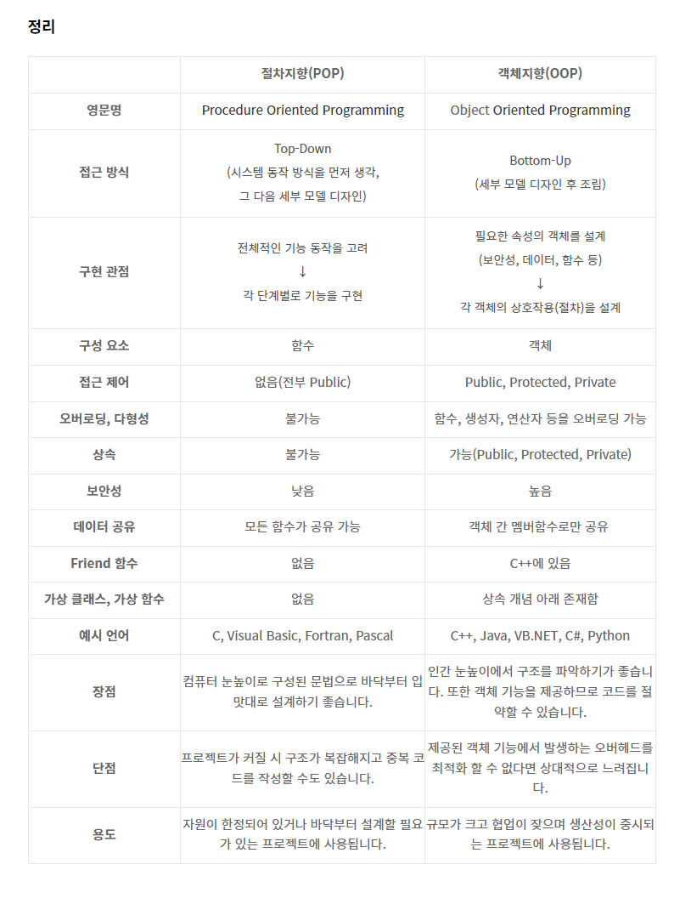

# 객체지향 (Object Oriented Programming) vs 절차지향 (Procedural Oriented Programming)

### 절차지향 (Procedural Oriented Programming)
- 절차지향이란 물이 위에서 아래로 흐르는 것처럼 순차적인 처리가 중요시되며 프로그램 전체가 유기적으로 연결되도록 만드는 프로그래밍 기법
- 대표적인 예로는 C언어가 있음. 
- 컴퓨터의 작업 처리 방식과 유사하기 때문에 객체지향 언어를 사용하는 것에 비해 더 빨리 처리되어 시간적으로 유리
- 유지보수가 어렵고, 디버깅이 어려움
- 실행 순서가 정해져 있으므로 코드의 순서가 바뀌면 동일한 결과를 보장하기 어려움

 

### 객체지향 ( Object Oriented Programming )
- 데이터와 절차를 하나의 덩어리로 묶어서 생각 -> 컴퓨터의 부품을 하나씩 사다가 컴퓨터를 조립하는 것과 같은 방법
- 소프트웨어 언어의 발달과 컴파일러의 발달로 하드웨어가 소프트웨어의 발달을 따라오지 못하는 상황 발생 -> 객체지향 언어가 등장하게 된 계기
- 객체지향 프로그래밍은 개발하는 것을 기능별로 모듈화 함으로써 하드웨어가 같은 기능을 중복으로 연산하지 않도록 하고, 모듈을 재활용 하기 때문에 하드웨어의 처리양을 획기적으로 줄여줌
- 디버깅이 쉬움
- 객체지향 언어는 어떤 모듈의 한 기능만 필요하더라도 모듈 전체를 가져와야 하기 때문에 절차지향 프로그래밍보다 크기가 더 커질 수도 있음
- 데이터의 접근이 상대적으로 절차지향보다 느려질 가능성이 많고, 메소드를 통해서만 접근이 가능하기 때문에 절차지향식처럼 특정 함수에 접근할 수 없고, 식으로만 접근이 가능해 속도적인 측면에서 불이익 존재
- 설계에 많은 시간이 소모됨

>객체지향의 특성
>- 추상화 (Abstraction)
>       - 세부적인 사물들의 공통적인 특징을 파악한 후 하나의 집합으로 만들어 내는 것 ( 필요로하는 속성이나 행동을 추출 )
>       - 추상적인 개념에 의존하여 설계해야 유연함을 갖출 수 있음
>- 캡슐화 (Encapsulation)
>       - 객체를 캡슐로 싸서 그 내부를 보호하고 볼 수 없게 하는 것으로 객체의 가장 본질적인 특징
>       - 한 곳에서 변화가 일어나도 다른 곳에 미치는 영향을 최소화 함 ( 낮은 결합도를 유지 )
>       - Java로 예를 들면 클래스는 객체의 모양을 선언한 틀이며, 클래스 모양 그대로 생성된 실체(Instance)가 객체가 됨. 자바는 필드와 메소드를 클래스 내에 모두 구현하고 캡슐화를 통해 객체 내 필드에 대한 외부로부터의 접근을 제한함
>- 상속 (Inheritance)
>       - 일반화 관계(Generalization)라고도 하며, 여러 개체들이 지닌 공통된 특성을 부각시켜 하나의 개념이나 법칙으로 성립하는 과정
>       - 자식 클래스를 외부로부터 은닉하는 캡슐화의 일종
>       - 자식 클래스를 캡슐화 해두면 외부에서 이러한 클래스들에 영향을 받지 않고 개발을 이어나갈 수 있는 장점 존재
>- 다형성 (Polymorphism)
>       - 서로 다른 클래스의 객체가 같은 메시지를 받았을 때 각자의 방식으로 동작하는 능력
>       - 객체지향의 핵심으로 상속과 함께 활용할 경우 코드를 간결하게 해주고 유연함을 갖추게 해줌
>       - 부모 클래스의 메소드를 자식 클래스가 오버라이딩(재정의)해서 자신의 역할에 맞게 활용하는 것이 다형성
>       - 구체적으로 현재 어떤 클래스 객체가 참조되는 지는 무관하게 프로그래밍 가능
>
><code>[객체지향 설계 원칙 (SOLID)](../../Design%20Pattern/SOLID.md)</code>

 

 

22-07-10

-------

## Reference
- https://usefultoknow.tistory.com/entry/절차지향Procedural-Programming-객체지향Object-Oriented-Programming-장단점-및-차이점
- https://github.com/gyoogle/tech-interview-for-developer/blob/master/Computer%20Science/Software%20Engineering/Object-Oriented%20Programming.md