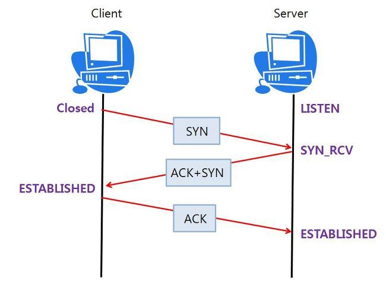

# 3-Way Handshake

### 3-Way Handshake
- TCP(Transmission Control Protocol)에서 신뢰성 있는 연결을 설정하기 위해 사용하는 절차
- 이 절차는 클라이언트와 서버 간의 통신을 시작할 때, 양측이 서로 연결을 설정하고 데이터 전송을 준비하기 위해 사용됨
- TCP 에서 연결을 수립하는데 3-way handshake를 통해 연결을 수립하고 4-way handshake 를 통해 연결 해제
    - SYN: 클라이언트가 서버에 연결을 요청할 때 사용하는 패킷
    - ACK: 연결 요청 및 응답을 확인하는 패킷

 

 

### 3-way handshake 방식
- TCP 통신을 위한 네트워크 연결 방식
- 서로의 통신을 위한 관문을 확인하고 연결하기 위하여 3번의 요청/응답 후에 연결이 되는 것. 해당 과정에서 UDP 보다 느려지는 주 원인
- 동작 과정
>1) Client에서 Server에 연결 요청을 하기 위해 SYN 데이터를 전송
>2) Server에서 해당 포트는 LISTEN 상태에서 SYN 데이터를 받고 SYN_RCV로 상태가 변경됨
>3) 이후 요청을 정상적으로 받았다는 대답(ACK)와 Client도 포트를 열어달라는 SYN을 같이 보냄
>4) Client에서는 SYN+ACK를 받고 ESTABLISHED로 상태를 변경하고 서버에 ACK를 전송
>5) ACK를 받은 서버는 상태가 ESTABLSHED로 변경

 

### 4-way handshake
- TCP 연결을 종료하기 위한 네트워크 종료 방식
- 연결된 양쪽(Client와 Server)에서 서로 연결을 종료하기 위해 4번의 요청/응답 후에 연결이 종료
- 동작 과정
>1) Client에서 Server에 연결을 종료하기 위해 FIN 데이터를 전송. 이때 Client의 상태는 FIN_WAIT_1로 변경
>2) Server는 FIN 데이터를 받고, 연결 종료를 수락했다는 의미로 ACK를 보냄. Server의 상태는 CLOSE_WAIT로 변경되고, Client는 FIN_WAIT_2 상태로 변경
>3) Server도 연결을 종료하기 위해 FIN 데이터를 Client에게 전송. 이때 Server의 상태는 LAST_ACK로 변경
>4) Client는 FIN 데이터를 받고, 연결 종료를 확인하는 ACK를 Server에 보냄. 이때 Client의 상태는 TIME_WAIT로 변경되고, Server는 CLOSED 상태로 연결이 완전히 종료됨
>5) Client는 TIME_WAIT 상태에서 일정 시간이 지난 후 CLOSED 상태로 전환되어 연결이 완전히 종료됨

 

## Ssafy Wizards CS Study

### 1. ACK, SYN 같은 정보 전달 방식
- ACK와 SYN은 TCP(Transmission Control Protocol)에서 사용하는 플래그(flag)
- TCP 헤더의 특정 비트를 사용하여 설정되며, 이를 통해 연결 설정, 데이터 전송, 연결 종료 등의 과정에서 필요한 정보를 전달
    - SYN (Synchronize) : 클라이언트가 서버에 연결을 요청할 때 사용하는 패킷
    - ACK (Acknowledgment) : 연결 요청 및 응답을 확인하는 패킷
    - FIN (Finish) : FIN 플래그를 통해 연결을 종료하는 패킷
    - RST (Reset) : 연결을 비정상적으로 종료하거나 잘못된 요청이 들어왔을 때 거부하기 위한 패킷
    - PSH (Push) : 데이터를 즉시 전송하고 처리하도록 요청
    - URG (Urgent) : 우선 처리해야 할 긴급한 데이터를 표시

 

### 2. 2-Way Handshaking 를 하지 않는 이유
- 2-way handshake 의 경우 서버가 요청을 수락하였다는 정보를 클라이언트에게 보내지만 클라이언트가 해당 응답을 받았는지 확인할 수 없음
- 클라이언트가 정말 서버의 응답을 받지 못했을 경우 동일하게 SYN 패킷을 보낸다면 서버는 이는 재전송이 아닌 처음 요청으로 잘못 해석할 수 있음
- 3-Way Handshake를 사용하는 이유는 신뢰성과 안전한 연결을 보장하기 위함

 

### 3. 두 호스트가 동시에 연결을 시도했을 때 통신 연결 수행 방법
- 두 호스트가 동시에 서로에게 TCP 연결을 시도하는 경우를 동시 개방(Simultaneous Open)이라고 하며 TCP 프로토콜은 이러한 동시 연결 요청을 처리할 수 있어 결국 두 호스트 간에 연결이 정상적으로 설정됨
- 두 호스트 모두 각각 SYN 패킷을 보내고 수신하며 이후 각각 응답으로 SYN-ACK 패킷을 보내고 수신하며 연결 상태가 됨

 

### 4. SYN Flooding 에 대해 설명
- DDoS 공격의 일종으로 TCP 3-Way Handshake의 SYN 요청을 악용하여 서버의 자원을 소모시키고 정상적인 사용자들이 서비스를 사용할 수 없게 만드는 공격
- 연결을 위한 SYN 요청을 다수 보내 연결을 시도하며 이때 보통 출발지 IP 주소를 위조(spoofing)하여 서버가 응답을 보내도 실제로는 그 응답을 받을 호스트가 없도록 만듬
- 그러면 서버는 요청에 대한 SYN-ACK 패킷을 보내고 기다리지만 이에 대한 응답 패킷이 오지 않으면 미완성된 연결을 유지하기 위해 자원을 할당
- 이를 통해 서버는 자원을 낭비하고 서버가 새로운 연결 요청을 처리할 수 없게 만듬