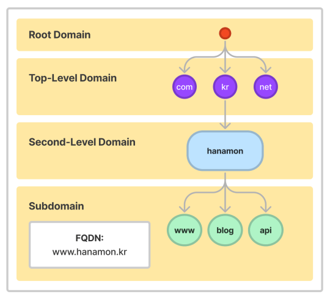
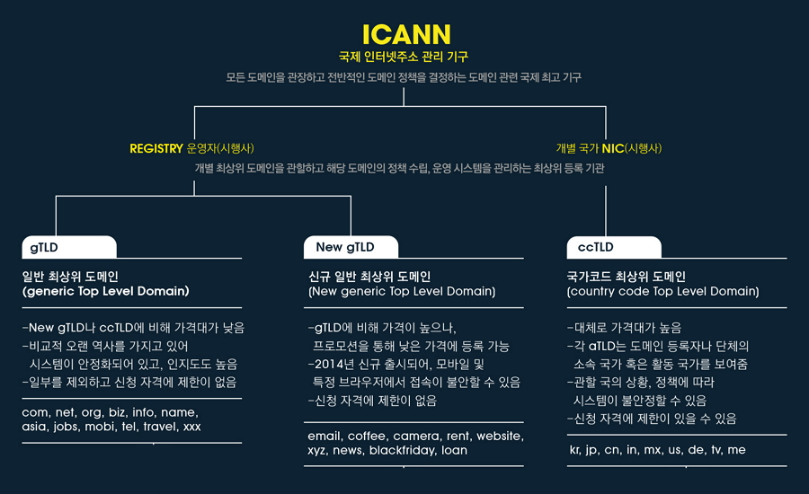
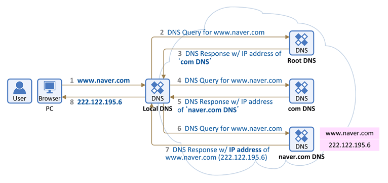

# DNS

### DNS란?
>- IP 네트워크에서 사용하는 시스템으로 웹사이트의 IP주소와 도메인 주소를 이어주는 환경/시스템. 
>- 도메인은 IP 주소를 대신하여 사용하는 주소이며 DNS를 이용하여 IP와 도메인을 매칭.
>- DNS 시스템 안에서 IP와 도메인 매칭 역할을 하는 서버를 DNS를 운영하는 서버를 DNS 서버 혹은 네임서버라고 함.
>- 상위 기관에서 인증된 기관에게 도메인을 생성하거나 IP주소로 변경할 수 있는 권한을 부여하여 ‘계층구조’를 가지는 분산 데이터 베이스 구조를 가진다.
>- DNS 서버 통신은 기본적으로 DNS 프로토콜을 사용하며 해당 프로토콜은 UDP 방식이며 Default 포트로 53번 포트를 이용.
>- 모든 IP와 루트 네임서버는 비영리 단체인 ICANN이 관리. 루트 서버는 전세계 모든 도메인 기억
>- DNS 서버에 질의하면 돌아오는 응답은 Authoritative answer와 Non-authoritative answer로 나뉨
>
>#### \* Domain 이란?
>>- 도메인은 웹 브라우저를 통해 특정 사이트에 진입 시, IP 주소를 대신하여 사용하는 주소
>>- 도메인을 이용하여 한눈에 파악하기 힘든 IP 주소를 보다 분명하게 나타낼 수 있음

 

### DNS 실행 시점
>1. 브라우저의 검색창에 도메인주소(naver.com) 입력
>2. 이 요청은 DNS에서 IP 주소(125.209.222.142)를 찾음
>3. 이 IP 주소에 해당하는 웹 서버로 요청을 전달하여 클라이언트와 서버가 통신

 

### DNS 구성요소

#### 1. 도메인 네임 스페이스(Domain Name Space)
>- 최상위에 루트 DNS 서버가 존재하고, 그 하위로 인터넷에 연결된 모든 노드가 연속해서 이어진 계층구조로 구성 ( 도메인 이름 저장을 분산한 계층 구조 )
>- 구조 : Root Domain -> 최상위 -> 2차 도메인 -> 서브 도메인 ...

 

#### 2. 네임 서버(Name Server) = DNS 서버
>- 주소를 변환 시키기 위해 도메인 네임 스페이스의 트리구조에 대한 정보가 필요한데 해당 정보를 가지고 있는 서버. 
>- 해당 도메인 이름의 IP 주소를 찾음
>- 데이터베이스(저장,관리) 역할, 찾아주는 역할, 요청 처리 응답 구현
>- 마스터-슬레이브 구조 ( 마스터 네임서버, 보조 네임 서버 )
>
>#### \* 네임서버 구성
>2-1) Root DNS 서버 
>>- ICANN이 직접 관리하는 최고 레벨 서버. TLD DNS 
>>- 서버 IP 주소를 저장하고 안내하는 역할
>>
>2-2) Top-Level Domain(TLD) DNS 서버 
>>- 도메인 등록 기관이 관리하는 서버. 
>>- Authoritative DNS 서버의 주소를 저장하고 안내하는 역할
>>
>2-3) Second-Level/Sub Domain(SLD) DNS 서버 ( = Authoritative DNS 서버 )
>>- TLD 하위에서 관리되는 서브 도메인.
>>- 실제 개인 도메인과 IP 주소의 관계가 기록(저장, 변경)되는 서버.
>>- 권한의 의미인 Authoritative가 붙었고 일반적으로 도메인/호스팅 업체의 네임서버로 개인 DNS 구축도 이에 해당.
>>
>2-4) 권한없는 DNS 서버 ( 리졸버서버, 리컬시브 서버, 리커서 )
>>- DNS 서버는 도메인 네임 스페이스를 위한 권한 있는 DNS 서버와 권한이 없는 DNS 서버로 구분되는데 위의 2-1), 2-2), 2-3) 서버는 권한이 있는 서버.
>>- 권한이 있는 DNS 서버는 IP 주소와 도메인 이름을 매핑하고, 권한이 없는 DNS 서버는 질의를 통해 IP 주소를 알아내거나 캐시한다.
>
> \* TLD의 구조
> 

 

#### 3. 리졸버(Resolver)
>- DNS 클라이언트의 요청을 네임 서버로 전달하고 찾은 정보를 클라이언트에게 제공하는 기능 수행. 
>- 어떤 네임서버에서 찾아야하는지, 이미 캐시 되어있는지 등 클라이언트에게 찾았을 경우 찾은 것을 전달, 못 찾았을 경우 못찾았다고 전달

 

### DNS 작동 순서

> ex) 예시 도메인 이름 www.naver.com
> 1. 웹 브라우저에 www.naver.com 입력 시 먼저 local DNS에게 “www,naver.com"이라는 ”homename"에 대한 IP 주소를 질의하여 Loacl DNS에 없으면 다른 DNS name 서버 정보를 받음 ( Root DNS 정보 전달 받음 )
> 2. Root DNS 서버에 "www.naver.com" 질의
> 3. Root DNS 서버로부터 “com 도메인”을 관리하는 TLD(Top-Level Domain) 이름 서버 정보 전달 받음
> 4. TLD에 "www.naver.com" 질의
> 5. TLD에서 "naver.com" 관리하는 DNS (SLD) 정보 전달
> 6. “naver.com" 도메인을 관리하는 DNS 서버에 ”www.naver.com" 호스트네임에 대한 IP 주소 질의
> 7. Local DNS 서버에게 "www.naver.com" 에 대한 IP주소인 222.122.195.6 응답
> 8. Local DNS 는 www.naver.com에 대한 IP 주소를 캐싱하고 IP 주소 전달

 

22-06-22

-------

## Reference
- https://hanamon.kr/dns란-도메인-네임-시스템-개념부터-작동-방식까지/ 
- https://hwan-shell.tistory.com/320
- https://gentlysallim.com/dns란-뭐고-네임서버란-뭔지-개념정리/ 
- https://developer-trier.tistory.com/438 
- https://velog.io/@goban/DNS와-작동원리