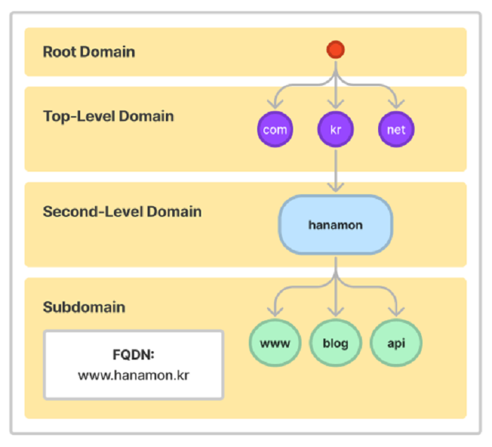
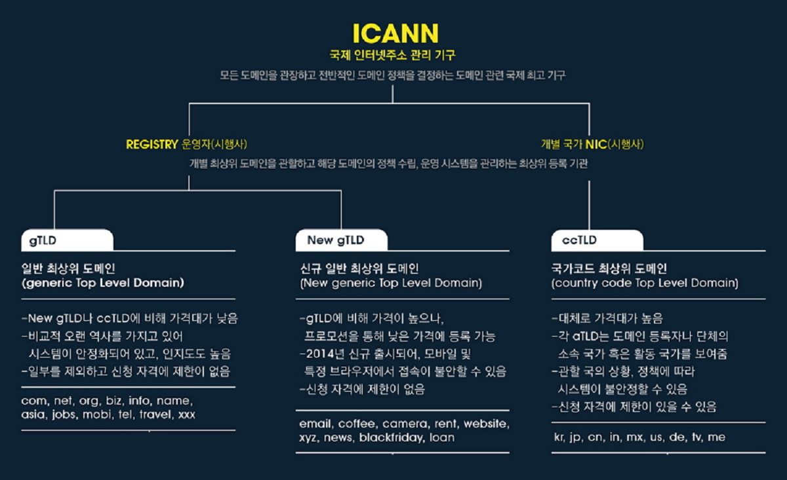

# DNS

### DNS란?
>- IP 네트워크에서 사용하는 시스템으로 웹사이트의 IP주소와 도메인 주소를 이어주는 환경/시스템. 
>- 도메인은 IP 주소를 대신하여 사용하는 주소이며 DNS를 이용하여 IP와 도메인을 매칭.
>- DNS 시스템 안에서 IP와 도메인 매칭 역할을 하는 서버를 DNS를 운영하는 서버를 DNS 서버 혹은 네임서버라고 함.
>- 상위 기관에서 인증된 기관에게 도메인을 생성하거나 IP주소로 변경할 수 있는 권한을 부여하여 ‘계층구조’를 가지는 분산 데이터 베이스 구조를 가진다.
>- DNS 서버 통신은 기본적으로 DNS 프로토콜을 사용하며 해당 프로토콜은 UDP 방식이며 Default 포트로 53번 포트를 이용.
>- 모든 IP와 루트 네임서버는 비영리 단체인 ICANN이 관리. 루트 서버는 전세계 모든 도메인 기억
>- DNS 서버에 질의하면 돌아오는 응답은 Authoritative answer와 Non-authoritative answer로 나뉨
>
>#### \* Domain 이란?
>>- 도메인은 웹 브라우저를 통해 특정 사이트에 진입 시, IP 주소를 대신하여 사용하는 주소
>>- 도메인을 이용하여 한눈에 파악하기 힘든 IP 주소를 보다 분명하게 나타낼 수 있음

<br>

### DNS 실행 시점
>1. 브라우저의 검색창에 도메인주소(naver.com) 입력
>2. 이 요청은 DNS에서 IP 주소(125.209.222.142)를 찾음
>3. 이 IP 주소에 해당하는 웹 서버로 요청을 전달하여 클라이언트와 서버가 통신

<br>

### DNS 구성요소

#### 1. 도메인 네임 스페이스(Domain Name Space)
>- 최상위에 루트 DNS 서버가 존재하고, 그 하위로 인터넷에 연결된 모든 노드가 연속해서 이어진 계층구조로 구성 ( 도메인 이름 저장을 분산한 계층 구조 )
>- 구조 : Root Domain -> 최상위 -> 2차 도메인 -> 서브 도메인 ...

<br>

#### 2. 네임 서버(Name Server) = DNS 서버
>- 주소를 변환 시키기 위해 도메인 네임 스페이스의 트리구조에 대한 정보가 필요한데 해당 정보를 가지고 있는 서버. 
>- 해당 도메인 이름의 IP 주소를 찾음
>- 데이터베이스(저장,관리) 역할, 찾아주는 역할, 요청 처리 응답 구현
>- 마스터-슬레이브 구조 ( 마스터 네임서버, 보조 네임 서버 )
>
>#### \* 네임서버 구성
>2-1) Root DNS 서버 
>>- ICANN이 직접 관리하는 최고 레벨 서버. TLD DNS 
>>- 서버 IP 주소를 저장하고 안내하는 역할
>>
>2-2) Top-Level Domain(TLD) DNS 서버 
>>- 도메인 등록 기관이 관리하는 서버. 
>>- Authoritative DNS 서버의 주소를 저장하고 안내하는 역할
>>
>2-3) Second-Level/Sub Domain(SLD) DNS 서버 ( = Authoritative DNS 서버 )
>>- TLD 하위에서 관리되는 서브 도메인.
>>- 실제 개인 도메인과 IP 주소의 관계가 기록(저장, 변경)되는 서버.
>>- 권한의 의미인 Authoritative가 붙었고 일반적으로 도메인/호스팅 업체의 네임서버로 개인 DNS 구축도 이에 해당.
>>
>2-4) 권한없는 DNS 서버 ( 리졸버서버, 리컬시브 서버, 리커서 )
>>- DNS 서버는 도메인 네임 스페이스를 위한 권한 있는 DNS 서버와 권한이 없는 DNS 서버로 구분되는데 위의 2-1), 2-2), 2-3) 서버는 권한이 있는 서버.
>>- 권한이 있는 DNS 서버는 IP 주소와 도메인 이름을 매핑하고, 권한이 없는 DNS 서버는 질의를 통해 IP 주소를 알아내거나 캐시한다.
>
> \* TLD의 구조
> 

<br>

#### 3. 리졸버(Resolver)
>- DNS 클라이언트의 요청을 네임 서버로 전달하고 찾은 정보를 클라이언트에게 제공하는 기능 수행. 
>- 어떤 네임서버에서 찾아야하는지, 이미 캐시 되어있는지 등 클라이언트에게 찾았을 경우 찾은 것을 전달, 못 찾았을 경우 못찾았다고 전달

<br>

### DNS 작동 순서

> ex) 예시 도메인 이름 www.naver.com
> 1. 웹 브라우저에 www.naver.com 입력 시 먼저 local DNS에게 “www,naver.com"이라는 ”homename"에 대한 IP 주소를 질의하여 Loacl DNS에 없으면 다른 DNS name 서버 정보를 받음 ( Root DNS 정보 전달 받음 )
> 2. Root DNS 서버에 "www.naver.com" 질의
> 3. Root DNS 서버로부터 “com 도메인”을 관리하는 TLD(Top-Level Domain) 이름 서버 정보 전달 받음
> 4. TLD에 "www.naver.com" 질의
> 5. TLD에서 "naver.com" 관리하는 DNS (SLD) 정보 전달
> 6. “naver.com" 도메인을 관리하는 DNS 서버에 ”www.naver.com" 호스트네임에 대한 IP 주소 질의
> 7. Local DNS 서버에게 "www.naver.com" 에 대한 IP주소인 222.122.195.6 응답
> 8. Local DNS 는 www.naver.com에 대한 IP 주소를 캐싱하고 IP 주소 전달

<br>

<div style="text-align: right">22-06-22</div>

<br>

## Ssafy Wizards CS Study

### 1. DNS는 몇 계층 프로토콜
- DNS는 주로 도메인 이름을 IP 주소로 변환하는 역할으로 네트워크에서 인간이 이해하기 쉬운 도메인 이름을 IP 주소로 해석하여 사용자가 원하는 서버에 접속할 수 있도록함
- DNS는 클라이언트와 직접 상호작용하며 애플리케이션 계층에서 동작하는 여러 프로토콜들과 함께 작동하는 애플리케이션 계층 (7계층)프로토콜임

<br>

### 2. UDP와 TCP 중 사용하는 프로토콜
- DNS는 주로 UDP를 사용
- UDP는 전송 계층 프로토콜이 할 수 있는 최소 기능으로 동작하므로 다중화/역다중화 기능과 간단한 오류 검사 기능을 제외하면 IP에 아무것도 추가하지 않음
- DNS은 주로 많은 정보가 필요하지 않으므로 연결 설정이 없고, 연결 상태를 유지할 필요도 없으며 더 많은 클라이언트를 수용하고 빠른 UDP를 주로 사용

<br>

### 3. DNS Recursive Query, Iterative Query
- DNS Recursive Query, Iterative Query는 DNS 시스템에서 도메인 이름을 IP 주소로 변환할 때 사용하는 두 가지 쿼리 방식
- DNS 클라이언트와 DNS 서버 간의 상호작용 방법에 따라 다름
- DNS recursor (혹은 DNS resolver)는 사용자가 도메인 이름을 IP 주소로 변환하는 과정을 처리하는 DNS 서버

#### DNS Recursive Query (재귀적 쿼리)
- 클라이언트가 DNS recursor에 도메인 이름을 요청하면, DNS recursor가 모든 작업을 처리하여 최종 IP 주소를 찾아 클라이언트에게 반환함
    - Recursive Query는 클라이언트가 요청을 보내고 DNS recursor가 모든 작업을 처리하여 최종 IP 주소를 찾아 클라이언트에게 반환하므로 클라이언트는 실제 IP 주소를 받아옴
- 클라이언트는 한 번의 요청으로 원하는 결과를 받을 수 있지만 DNS recursor가 모든 작업을 처리하므로 서버는 부하가 걸릴 수 있으며 처리 시간이 상대적으로 길 수 있음

#### Iterative Query (반복적 쿼리)
- 클라이언트가 DNS 서버에 도메인 이름을 요청하면, DNS 서버는 자신이 알고 있는 한도 내에서 최선의 답변을 반환. 클라이언트는 이러한 답변을 바탕으로 직접 다음 DNS 서버에 쿼리를 보내면서 최종 IP 주소를 얻을 때까지 이 과정을 반복함
    - Iterative Query는 DNS recursor가 다른 DNS 서버들과 통신하여 IP 주소를 찾는 과정
- 클라이언트가 최종 IP 주소를 얻을 때 까지 여러 DNS 서버에 쿼리를 보내므로 서버에 부하가 덜 걸리지만 네트워크 트래픽이 증가할 수 있고 클라이언트가 처리할 작업이 많아짐

<br>

### 4. DNS 쿼리 과정에서 손실이 발생할 경우 처리 방법
- DNS 쿼리 과정에서 패킷 손실이 발생하면 일반적으로 재전송을 통해 문제를 해결
- 클라이언트가 DNS 쿼리를 보낸 후 일정 시간동안 응답을 받지 못하면 요청이 손실되었다고 간주하고 타임 아웃을 발생하는데 이후 클라이언트는 동일한 DNS 쿼리를 다시 전송함
    - 일반적으로 클라이언트는 2~3 번 가량 재전송을 시도함
- 서버 입장에서는 클라이언트는 재전송 시, 다른 DNS 서버로 요청을 보내도록 구성할 수 있음
- 만약 UDP로 전송한 DNS 쿼리가 계속 실패하거나 응답이 너무 큰 경우 TCP를 사용하여 재전송이 가능
    - TCP는 연결 기반이므로 손실된 패킷에 대한 자동 재전송이 가능

<br>

### 5. 캐싱된 DNS 쿼리가 잘못 될 경우 에러 보장 방법
- 캐싱된 DNS 쿼리가 잘못될 경우를 처리하기 위해 지속적으로 캐시된 데이터를 확인하고 갱신하는 매커니즘 필요

#### 1. TTL (Time To Live) 사용
- DNS 레코드에는 TTL 값이 포함되어 있으며 TTL은 해당 레코드가 캐시에서 얼마나 오래 유지될 수 있는지를 결정
- TTL이 만료되면, 캐시된 레코드는 무효화되며, DNS 서버는 해당 레코드를 다시 조회하여 최신 정보를 가져옴
- TTL이 만료되면, 클라이언트 또는 DNS recursor는 최신 정보를 얻기 위해 원본 DNS 서버에 쿼리를 다시 보냄

#### 2. 캐시 무효화(Invalidate)
- 관리자가 특정 DNS 레코드의 변경을 알게 되면, 수동으로 캐시된 데이터를 무효화할 수 있음
- 일부 DNS 서버 소프트웨어는 자동으로 특정 조건에 따라 캐시를 무효화하고, 새로운 데이터를 가져올 수 있음

#### 3. DNSSEC (DNS Security Extensions)
- DNSSEC은 DNS 응답에 디지털 서명을 추가하여, 클라이언트가 수신한 데이터가 권한 있는 출처에서 온 것인지 확인할 수 있도록함
- DNSSEC을 통해, 캐싱된 데이터가 유효한지 검증할 수 있으며, 잘못된 데이터가 캐시에 남아있는 경우 이를 탐지하고 처리할 수 있음
- 캐시 중에 데이터가 변조되거나 손상될 가능성을 줄임

<br>

### 6. DNS 레코드 타입 중 A, CNAME, AAAA의 차이
- DNS 레코드 타입은 여러 타입이 있으며 A, CNAME, AAAA 레코드는 가장 일반적으로 사용되는 DNS 레코드 타입 중 일부

#### 1. A 레코드 (Address Record)
- A 레코드는 도메인 이름을 IPv4 주소로 매핑하여 IPv4 주소 32비트를 반환함
- 인터넷에서 대부분의 웹사이트가 IPv4 주소를 사용하므로, A 레코드는 매우 일반적이고 널리 사용됨

#### 2. CNAME 레코드 (Canonical Name Record)
- 하나의 도메인 이름을 다른 도메인 이름(별칭)으로 리다이렉트함
    - 특정 도메인을 다른 도메인으로 리다이렉트할 때 사용
- CNAME 레코드가 설정된 도메인은 A 레코드 또는 AAAA 레코드로 직접 변환되지 않고, CNAME이 가리키는 도메인 이름을 먼저 조회한 다음, 최종적으로 A 레코드 또는 AAAA 레코드가 반환됨

#### 3. AAAA 레코드 (IPv6 Address Record)
- AAAA 레코드는 도메인 이름을 IPv6 주소로 매핑
- 도메인 이름을 IPv6 (128비트)를 반환

<br>


```
AWS route53 호스팅영역 레코드 타입

유형 A
- address의 약자로 도메인이 IP주소를 바라
- 즉, 도메인으로 접속했을 때 ALB의 ip 주소로 접속하게 해주는 과정

유형 NS
- Name Server의 약자로 도메인이 등록되어있는 name server를 의미
- 특정 도메인에 대한 DNS 쿼리를 처리할 네임서버를 지정
- NS 레코드가 Route 53의 네임서버로 설정되면, 그 도메인의 모든 DNS 요청이 AWS Route 53을 통해 처리됨
- 도메인을 생성하면 SOA유형과 함께 기본적으로 생성되는 레코드

유형 CNAME
- Canonical Name의 약자로 도메인의 별칭을 의미하고
- 도메인에서 도메인 별칭을 바라보게 함
- 도메인 소유권 검증 할 때 만든 레코드
```

<br>

### 7. hosts 파일의 역할과 DNS와 비교하였을 때 우선순위
- hosts 파일은 운영 체제에서 도메인 이름을 IP 주소로 매핑하는 데 사용되는 간단한 텍스트 파일으로 컴퓨터에 위치하여 DNS 서버를 조회하기 전에 로컬에서 도메인 이름을 IP 주소로 변환하는 데 사용됨
- hosts 파일은 DNS보다 우선적으로 사용. 사용자가 도메인 이름을 입력했을 때 시스템은 먼저 hosts 파일을 확인하여 해당 도메인에 대한 IP 주소 매핑이 있는지 확인함
- 이 구조는 사용자가 특정 도메인에 대한 로컬 매핑을 설정하거나, DNS를 우회하고자 할 때 유용하게 사용됨

<br>

## Ssafy Wizards CS Study 추가 문제

<br>

### 1. www.github.com을 브라우저에 입력하고 엔터를 쳤을 때, 네트워크 상 어떤 일이 일어나는지
1. 사용자가 입력한 URL을 통해 접근하려는 웹 리소스 식별
2. 브라우저는 도메인의 캐시, 호스트 파일여부 등을 확인하고 DNS 서버로 DNS 쿼리 요청을 통한 IP 반환 받음
3. 브라우저는 DNS 에서 받은 IP 주소로 TCP 연결 설정
    - 3-way handshake
4. HTTPS 인 경우 TLS handshake 과정을 통한 보안 연결 설정
5. 해당 연결이후 HTTP 요청 전송
6. 요청 서버 처리 및 응답 이후 브라우저 렌더링
7. 4-way handshake를 통한 TCP 연결 종료

<br>

### 2. DNS 쿼리를 통해 얻어진 IP가 가리키는 곳
- DNS 쿼리를 통해 얻어진 IP 주소가 가리키는 곳은 웹 서버 또는 웹 애플리케이션 서버 등 특정 서비스를 제공하는 서버임
    - 해당 서버는 해당 도메인 이름에 해당하는 리소스를 제공함
- 가리키는 것은 다음과 같음
    - 웹 서버
    - 웹 애플리케이션 서버
    - 로드 밸런서
    - CDN
    - API 서버

<br>

### 3. Web Server와 Web Application Server의 차이
#### Web Server (WS)
- 클라이언트로부터 HTTP 요청을 받아 정적인 웹 페이지나 파일을 제공함
    - 주로 정적인 콘텐츠를 제공하여 클라이언트와 통신하므로 멱등성 존재
- 대표적인 웹 서버로는 Apache HTTP Server, Nginx, Microsoft IIS 등이 존재
- 가상 호스팅(Virtual Hosting)을 통해 하나의 IP 주소에서 여러 개의 도메인을 처리할 수 있음

#### Web Application Server (WAS)
- 웹 애플리케이션 서버는 웹 서버의 기능을 확장하여 동적인 콘텐츠를 생성하고 실행하기 위한 환경 제공
    - 동적인 데이터를 제공하여 다양한 언어와 기술을 지원함
    - 웹 서버의 기능을 확장하여 서블릿, JSP, EJB 등의 코드를 실행하고 관리
- 대표적인 AWS로는 Apache Tomcat, Red Hat JBoss, IBM WebSphere, Oracle WebLogic 등이 존재

<br>

### 4. URL, URI, URN의 차이
#### URI (Uniform Resource Identifier)
- URI는 인터넷에서 자원을 식별하기 위한 문자열
- URI는 리소스를 고유하게 식별하거나 위치를 지정할 수 있는 모든 식별자를 포함하는 상위 개념
    - 모든 URL과 URN은 URI의 하위 개념임

#### URL (Uniform Resource Locator)
- URL은 URI의 한 형태로, 리소스의 위치를 지정
- URL은 리소스를 어디에서 어떻게 접근할 수 있는지(프로토콜과 경로)를 설명
- https://www.example.com/index.html 등

#### URN (Uniform Resource Name)
- URN은 URI의 또 다른 형태로, 리소스의 이름을 지정
- URN은 리소스의 위치와는 독립적으로 리소스를 고유하게 식별하는 데 사용
- urn:isbn:0451450523 등

<br>

-------

## Reference
- https://hanamon.kr/dns란-도메인-네임-시스템-개념부터-작동-방식까지/ 
- https://hwan-shell.tistory.com/320
- https://gentlysallim.com/dns란-뭐고-네임서버란-뭔지-개념정리/ 
- https://developer-trier.tistory.com/438 
- https://velog.io/@goban/DNS와-작동원리
- https://velog.io/@syi9595/UDP-가-DNS를-이용하는-이유