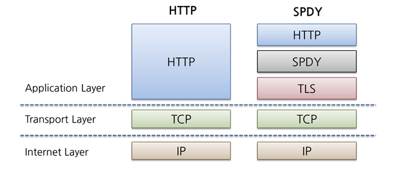

# HTTP/1 , HTTP/2, HTTP/3

### HTTP (HyperText Transfer Protocol)
- 웹에서 정보를 교환하기 위한 전송 프로토콜로 웹의 기반이자 웹을 이루는 기술 자체
- HTTP는 애플리케이션 레벨의 프로토콜로 TCP/IP 위에서 작동하며 HTTP는 상태를 가지고 있지 않은 Stateless 프로토콜
- Method, Path, Version, Headers, Body 등으로 구성됨
- [HTTP 설명 링크](./HTTP-HTTPS.md)

<br>

### HTTP/1
#### 1. HTTP/0.9
- 버전번호가 따로 없는 상태로 발표되었던 초기 HTTP로 요청이 단일 라인으로 구성되며 가능한 메서드는 get이 유일
- Header는 없었고, 그렇기 때문에 오직 HTML 파일 전송만 가능했으며 상태코드 존재X
- HTTP/1.0이 나오면서 0.9가 되었음

<br>

#### 2. HTTP/1.0
- 제한적인 기능을 개선해 기능을 추가하였음
    - 요청에 버전 정보가 붙어서 전송되기 시작
    - 응답 시작 부분에 상태 코드가 추가됨
    - 모든 요청과 응답에 헤더 개념이 추가됨

<br>

#### 3. HTTP/1.1
- 1.0이 발표될 당시에는 다양한 표준화가 진행되고 있었고, 1.0 발표 된지 몇달 이후 HTTP 첫번째 표준버전인 1.1 발표되었음
- Connection Keep-Alive (기존 연결에 대해서 handshake 생략가능)
    - 이전 비연결성인 HTTP 연결은 한번의 요청과 응답이 끝나면 연결을 끊어 매번 Handshake를 해야했어 overhead가 발생했음
    - 이후 Keep-Alive 기능을 통해 한번 맺어졌던 연결을 끊지 않고 지속적으로 유지하여 성능 개선
- 파이프라이닝 추가. 이전 요청에 대한 응답이 완전히 전송되기 전에 다음 전송을 가능하게 하여 레이턴시를 낮춤
- 청크된 응답 지원(응답 조각)
- 캐시 제어 메커니즘
- 언어, 인코딩 타입등을 포함한 컨텐츠 전송

#### HTTP/1.1의 단점
##### 1. HTTP HOLB
- 파이프라이닝이라는 기술은 한 번에 순차적인 여러 요청을 연속적으로 하고 그 순서에 맞춰 응답을 받는 방식으로 지연 시간을 줄이는 방법
- 순차적으로 데이터를 요청하고 받아야 하다 보니 먼저 받은 요청이 끝나지 않으면 뒤의 작업이 아무리 빨라도 기다려야 하는 HOL(Head of LIne) Blocking 문제가 발생
- 그래서 모던 브라우저들은 대부분 파이프라이닝을 사용하지 못하도록 막아두고 H1으로 통신할 때 클라이언트가 요청을 병렬로 하기 위해서 6-8개의 커넥션을 이용해 데이터를 가져오는 방식으로 성능을 개선하고 있음 

##### 2. RTT(Round Trip Time)
- TCP 상에서 동작하는 HTTP의 특성상 Handshake가 반복적으로 일어나고 또한 불필요한 RTT 증가와 네트워크 지연을 초래하여 성능을 저하 시킴

##### 3. 무거운 Header 구조
- HTTP/1.1의 헤더에는 많은 메타 정보들이 저장되어져 있음
- 사용자가 방문한 웹페이지는 다수의 HTTP 요청이 발생하게 되는데 이 경우 매 요청시 마다 중복된 헤더값을 전송하게 되며 또한 해당 도메인에 설정된 쿠키 정보도 매 요청시 마다 헤더에 포함되어 전송되어 전송값보다 헤더가 큰 경우도 있음

<br>


### SPDY
- 구글은 더 빠른 Web을 실현하기 위해 Latency 관점에서 HTTP를 고속화한 SPDY(스피디)라 불리는 새로운 프로토콜 구현
- HTTP를 대치하는 프로토콜이 아닌 HTTP를 통한 전송을 재 정의하는 형태로 구현
- SPDY는 실제로 HTTP/1.1에 비해 상당한 성능 향상과 효율성을 보여주었고, 이는 HTTP/2 초안의 참고 규격이 되었음

<br>

### HTTP/2
- 완전히 새로운 프로토콜이 아닌 SPDY의 개선사항을 적용해 수정된 성능 향상에 초점을 맞춘 프로토콜
#### 1. Multiplexed Streams
- 한 커넥션으로 동시에 여러 개의 메세지를 주고 받을 수 있으며, 응답은 순서에 상관없이 Stream으로 주고 받음
- HTTP/1.1의 Connection Keep-Alive, Pipelining의 개선
#### 2. Stream Prioritizaion
- 클라이언트가 요청한 HTML 문서 안에 CSS 파일 1개와 Image 파일 2개가 존재하고, 이를 클라이언트가 각각 요청하고 난 후 Image 파일보다 CSS 파일 수신이 늦어지는 경우 브라우저의 렌더링이 늦어지는 문제가 발생하는데 HTTP/2의 경우 리소스간 의존관계(우선순위)를 설정하여 이런 문제를 해결
#### 3. Server Push
- 서버는 클라이언트의 요청에 대해 요청하지도 않은 리소스를 보내줄 수 있게 되었음
- 클라이언트가 HTML문서를 요청하고 해당 HTML에 여러 리소스가 포함되어 있는 경우 HTTP/1.1에서는 클라이언트는 요청한 HTML 문서를 수신한 후 HTML 문서를 해석하면서 필요한 리소스를 재 요청하는 반면에 HTTP/2 에서는 Server Push 기법을 통해 클라이언트가 요청하지 않은 HTML 문서에 포함된 리소스를 Push 해주는 방법으로 클라이언트의 요청을 최소화 해서 성능 향상을 이끌어 냄

<br>

#### HTTP/2의 단점
- 여전히 TCP를 이용하여 Handshake의 RTT로 인한 Latency, TCP의 HOLB 문제는 해결할 수 없음

<br>

### QUIC
- Quick UDP Internet Connections 의 약자이며, UDP를 기반으로 TCP + TLS + HTTP 의 기능을 모두 구현하는 프로토콜
- 구글에서 개발했던 SPDY 기술이 HTTP/2의 기반 기술이었는데 QUIC 역시 구글에서 개발하여 HTTP/3 기반 기술이 되었음

<br>

### HTTP/3
- UDP 기반의 프로토콜인 QUIC를 사용하여 통신하는 프로토콜
- UDP를 사용하지만 기존의 신뢰성 있는 통신이라는 타이틀을 포기한 것은 아님
- 기존의 TCP를 수정하기가 어려운데다 백지 상태나 다름이 없었던 UDP를 사용하면서 QUIC의 기능을 확장하기 쉬웠기 때문이라고 한다

#### RTT 감소로 인한 지연시간 단축
- QUIC은 TCP를 사용하지 않기 때문에 통신을 시작할 때 번거로운 3 Way Handshake과정을 거치지 않아도됨
- QUIC는 첫 연결 설정에 1 RTT만 소요되는데 연결 설정에 필요한 정보와 함께 데이터도 보내기 때문. 클라이언트가 서버에 어떤 신호를 한번 주고, 서버도 거기에 응답하기만 하면 바로 기본 통신을 시작할 수 있다는 것
- 단, 클라이언트가 서버로 첫 요청을 보낼 때는 서버의 세션키를 모르는 상태이기 때문에 목적지인 서버의 Connection ID를 사용하여 생성한 특별한 키인 초기화 키(Initial Key)를 사용하여 통신을 암호화 함
- 한번 연결에 성공했다면 그 설정을 캐싱해놓고 있다가, 다음 연결 때는 캐싱해놓은 설정들을 사용하여 바로 연결을 성립시키기 때문에 0 RTT 만으로 바로 통신을 시작할 수 있음 -> 이러한 점 때문에 QUIC는 TCP + TLS 방식에 비해 지연시간을 더 줄일 수 있었음
```
RTT (Round Trip Time)
- 클라이언트가 보낸 요청을 서버가 처리한 후 다시 클라이언트로 응답해주는 사이클을 RTT(Round Trip Time)이라고 함
- TCP는 연결을 생성하기 위해 기본적으로 1RTT가 필요하고, 여기에 TLS를 사용한 암호화까지 하려고 한다면 TLS의 자체 핸드쉐이크까지 더해져 총 3RTT가 필요
```

#### 패킷 손실 감지에 걸리는 시간 단축
- QUIC도 TCP와 마찬가지로 전송하는 패킷에 대한 흐름제어를 해야함. 통신 과정에서 발생한 에러를 재전송을 통해 에러를 복구하는 ARQ 방식을 사용하기 때문
- TCP는 여러 ARQ 방식 중 Stop and Wait ARQ 방식을 사용함 -> 송신 측이 패킷을 보낸 후 타이머를 사용하여 시간을 재고, 일정 시간이 경과해도 수신 측이 적절한 답변을 주지 않는다면 패킷이 손실된 것으로 판단하고 해당 패킷을 다시 보내는 방식
- QUIC는 헤더에 별도에 패킷 번호 공간을 부여해 TCP가 RTT 계산에서 패킷 손실 감지에 걸리는 시간을 단축
```
RTO(Retransmission Time Out)
- TCP에서 패킷 손실 감지에 대해서 송신 측이 패킷을 수신측으로 보내고 난 후 얼마나 기다려줄 것인가, 즉 타임 아웃을 언제 낼 것인가를 동적으로 계산하는 시간을 의미
- RTO 에서 필요한 데이터는 RTT 들의 샘플들
- RTT 샘플을 측정하기 위해서는 반드시 송신 측으로부터 ACK를 받아야하는데, 정상적인 상황에서는 문제가 없으나 타임아웃이 발생해서 패킷 손실이 발생하게 되면 RTT 계산이 애매해지는데 QUIC는 이런 경우를 위해 헤더에 별도의 패킷 번호 공간을 부여해 패킷 고유의 번호를 가지고 있음
```

#### 멀티 플렉싱을 지원
- HTTP/2와 마찬가지로 멀티플렉싱을 지원
- 하나의 스트림에서 문제가 발생해도 다른 스트림은 지킬 수 있어 이런 문제에 대해 자유로움

#### 클라이언트의 IP가 바뀌어도 연결이 유지됨
- TCP의 경우 소스의 IP 주소와 포트, 연결 대상의 IP 주소와 포트로 연결을 식별하기 때문에 클라이언트의 IP가 바뀌는 상황이 발생하면 연결이 끊어져 버림 -> 다시 Handshake 과정을 거쳐야해서 레이턴시 발생
- QUIC는 Connection ID을 이용하여 서버의 연결을 생성 -> Connection ID는 랜덤한 값일 뿐, 클라이언트의 IP와는 전혀 무관한 데이터이므로 클라이언트의 IP가 변경되더라도 기존의 연결을 계속 유지 가능

<br>

<div style="text-align: right">22-09-05</div>

-------

## Reference
- https://velog.io/@ziyoonee/HTTP1-부터-HTTP3-까지-알아보기