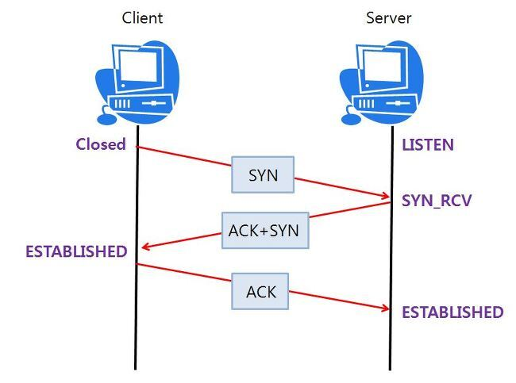
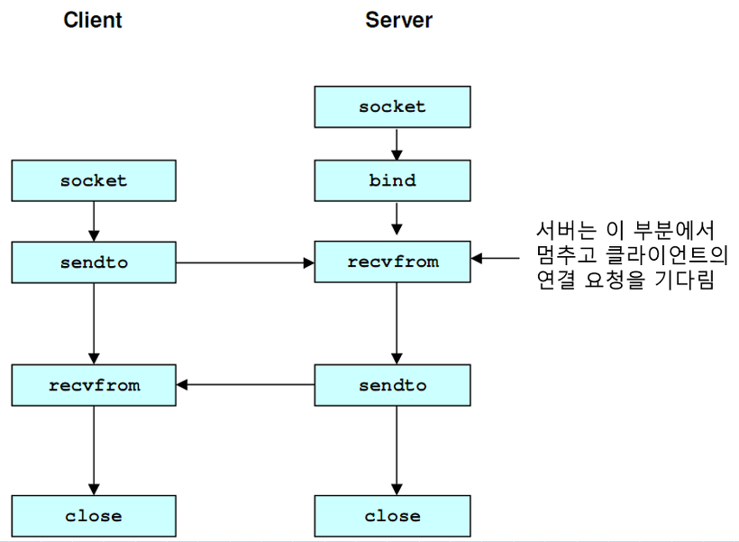

# IP / TCP / UDP / HTTP

## 계층구분


<br>
<br>


<br>

### IP (Internet Protocol) 이란?
>- 3계층인 네트워크 계층에서 사용되는 프로토콜으로 복잡한 인터넷 망 속에서 클라이언트와 서버간 원활하게 통신할 수 있는 규칙. 
>- 인터넷여 연결되어 있는 모든 장치는 식별이 가능하도록 각각 고유 주소인 IP를 부여
>- IP는 지정한 IP 주소에 패킷(Packet)이라는 통신 단위로 데이터를 전달 ([Packet 설명링크](./Packet.md))
>- IP는 <code>공인IP와 사설 IP</code>가 존재. 공유기를 사용한 인터넷 접속일 경우 공유기까지는 공인IP를 할당하지만 공유기에 연결되어 있는 가정이나 각 네트워키 기기에는 사설 IP를 할당.
>- IP는 출발지와 목적지를 패킷에 담아 적합한 통신 방법이지만 <code>비연결성, 비신뢰성</code>의 한계가 있음 ( TCP/UDP로 해당 한계 보완 )
```
공인IP ( Public IP )
- 인터넷 사용자의 로컬 네트워크를 식별하기 위해 ISP(인터넷 서비스 공급자)가 제공하는 IP주소. 공용 IP주소라고도 불리며 외부에 공개되어 있는 IP 주소
- 공인 IP는 전세계에서 유일한 IP주소를 가짐
- 공인IP주소가 외부에 공개되어 있기에 인터넷에 연결된 다른 PC로부터 접근이 가능
- 공인 IP주소를 사용하는 경우 방화벽등의 보안 프로그램 필요
사설IP ( Private IP )
- 일반 가정이나 회사 내 할당된 네트워크 IP주소로 로컬 IP, 가상 IP라고도 함
- 하나의 네트워크 안에서 유일
- 라우터에 의해 로컬 네트워크상의 PC나 장치에 할당됨 
- 외부 접근 불가능함
- 사설 IP 주소만으로는 인터넷에 직접 접근 불가능. 라우터를 통해 1개의 공인 IP만 할당하고 연결된 개인 PC는 사설 IP를 할당받아 인터넷에 접속

비연결성
- 패킷을 받을 대상이 없거나 서비스 불능 상태여도 패킷을 전송
비신뢰성
- 전송 과정에서 중간에 패킷이 사라질 수 있음
- 패킷은 나눠 전달하게 되기도 하는데 패킷의 순서를 보장할 수 없음
```

<br>

### TCP/UDP 이란?

>- 전송계층에서 사용되는 프로토콜 TCP/UDP
>- 전송계층은 송신자와 수신자를 연결하는 통신 서비스를 제공하고 IP에 의해 전달되는 패킷의 오류를 검사, 재전송 요구 제어등을 담당하는 계층
>- TCP와 UDP는 모두 포트 번호를 이용하여 주소를 지정하고 데이터 오류검사를 위한 체크섬을 이용한 데이터 전달 역할을 하지만 정확성(TCP)을 추구하느냐와 신속성(UDP)를 추구하느냐의 차이가 있다

<br/><br/>


<br/>


### TCP ( Trasmission Control Protocol )
>- 연결지향적 프로토콜, 클라이언트와 서버가 연결된 상태에서 IP와 함께 사용하여 데이터를 주고받는 프로토콜.
>- 클라이언트가 연결요청(SYN 데이터 전송)을 하고, 서버가 연결을 수락하면 통신 선로가 고정, 모든 데이터는 고정된 통신 선로를 통해 순차적으로 전달하기 때문에 TCP는 데이터를 정확하고 안정적으로 전달 가능 ( 3-way-handshake 방식 )
>- 연결형 서비스로 가상 회선 방식을 제공
>- IP패킷을 사용하기 전에 TCP 데이터를 <code>소켓</code>에 담음
>- 3-way-handshaking 과정을 통해 연결을 설정하고 4-way-handshaking을 통해 해제
>- 흐름 제어 및 혼잡 제어 기능. 해당 기능의 영향으로 UDP보다 속도가 느림
>- TCP/IP 패킷에서 Port는 해당 프로세스 출발지,목적지임 IP는 기기간의 연결. Port는 .0~65535할당 가능하고 잘알려져있는 포트는 FTP - 20,21 , TELNET - 23, HTTP - 80, HTTPS - 443 이있어 해당 포트는 사용하지 않는 것이 좋음
>- 높은 신뢰성을 보장
>- 전이중(Full-Duplex), 점대점(Point to Point) 방식
```
소켓(Socket)
- 네트워크 환경에 연결할 수 있게 만들어진 연결부
- 데이터는 소켓에 먼저 담기고 그 데이터를 IP 패킷에 담아 LAN 카드와 같은 물리적 계층을 지나기 위해 이더넷 프레임워크에 포함하여 서버로 전송

```

<br/>

### TCP Server
>- 서버소켓은 연결만을 담당
>- 연결과정에서 반환된 클라이언트 소켓은 데이터의 송수신에 사용된다. 가상 회선 방식을 제공
>- 서버와 클라이언트는 1대1로 연결
>- 스트림 전송으로 전송 데이터의 크기가 무제한
>- 패킷에 대한 응답을 해야하기 때문에 (시간지연, CPU소모) 성능이 낮음
>- Streaming 서비스에 불리 ( 손실된 경우 재전송 요청을 하기 때문에 )

<br>

### UDP ( User Datagram Protocol )
>- 데이터를 데이터 그램 단위로 처리하는 프로토콜
>- 비연결형 프로토콜으로 데이터그램 방식을 제공
>- 연결을 위해 할당되는 논리적 경로가 없어 각각의 패킷은 다른 경로에 전송되고 각각의 패킷은 독립적인 관계를 지니게 되는데 이렇게 데이터를 서로 다른 경로로 독립적으로 처리하는 프로토콜
>- 정보를 주고 받을 때 정보를 보내거나 받는다는 신호절차를 거치지 않음
>- UDP헤더의 CheckSum 필드를 통해 최소한의 오류만 검출. 패킷 관리가 필요
>- 패킷 오버헤드가 적어 네트워크 부하가 감소
>- 신뢰성이 낮고 TCP보다 속도가 빠름

<br/>

### UDP Server
>- UDP에는 연결 자체가 없어서 서버소켓과 클라이언트 소켓의 구분이 없음
>- 소켓 대신 IP 기반으로 데이터를 전송
>- 서버와 클라이언트는 1대1, 1대N, N대N 등으로 연결될 수 있음
>- 데이터그램(메세지) 단위로 전송되며 크기는 65535바이트로 크기가 초과하면 잘라서 보냄
>- 흐름제어가 없어서 패킷이 제대로 전송되었는지, 오류가 없는지 확인 가능
>- 파일 전송과 같은 신뢰성이 필요한 서비스보다 성능이 중요시 되는 경우 사용

<br/><br/>



<br/>

### \* 3way-hand-shake 방식 (STN, ACK)?
>- TCP 통신을 위한 네트워크 연결 방식
>- 서로의 통신을 위한 관문을 확인하고 연결하기 위하여 3번의 요청/응답 후에 연결이 되는 것. 해당 과정에서 UDP 보다 느려지는 주 원인
>>- 동작 과정
>>1) Client에서 Server에 연결 요청을 하기 위해 SYN 데이터를 전송
>>2) Server에서 해당 포트는 LISTEN 상태에서 SYN 데이터를 받고 SYN_RCV로 상태가 변경됨
>>3) 이후 요청을 정상적으로 받았다는 대답(ACK)와 Client도 포트를 열어달라는 SYN을 같이 보냄
>>4) Client에서는 SYN+ACK를 받고 ESTABLISHED로 상태를 변경하고 서버에 ACK를 전송
>>5) ACK를 받은 서버는 상태가 ESTABLSHED로 변경 

<br/>

### \* 흐름제어(Flow Control), 혼잡제어(Congestion Control) 란?
>1) 흐름제어 
>>- 흐름제어는 데이터를 송신하는 곳과 수신하는 곳의 데이터 처리 속도를 조절하여 수신자의 버퍼 오버플로우를 방지하는 것.
>>- 송신하는 곳에서 감당할수 있도록 데이터 처리 속도 조절.
>2) 혼잡제어 
>>- 혼잡제어는 네트워크 내의 패킷 수가 넘치게 증가하지 않도록 방지하는 것.
>>- 정보의 소통량이 과다하면 패킷을 조금만 전송하여 혼잡 붕괴 현상을 막음

<br/>

### TCP FLOW

<br/>


<br/>

### UDP FLOW



<br>

### HTTP ( HyperText Transfer Protocol)
- HTTP는 문서를 전송하기 위한 규약. 
- HTTP의 구조는 클라이언트-서버 구조로 어떻게 메시지를 교환할지 정해 놓은 규칙.
- 클라이언트가 서버에 request 요청을 보내고, 서버는 클아이언트에게 Response 응답을 보냄
- HTTP는 요청을 받을 때에만 연결을 유지하고 응답 이후에는 TCP/IP 연결을 끊어 연결을 유지 하지 않음. HTTP는 <b>비연결성</b>을 가짐. 이를 통해 최소한의 자원으로 서버 유지를 가능케 함
- 그러나 HTML 뿐만아니라 JS, CSS 혹은 이미지 등 여러 미디어데이터를 응답하는 경우 트래픽이 많아 큰 규모의 서비스 운영시 비연결성은 한계를 보임. 현재는 <b>HTTP 지속 연결(Persistent Connections)</b>로 문제 해결
- HTTP 지속 연결에서는 TCP/IP 연결과 종료 과정 사이에 HTML 요청 및 응답, JS 요청 및 응답, 이미지 요청 및 응답을 모두 수행한 후 연결을 종료하여 데이터 전송에서 기존 방식보다 더 짧은 시간이 소요
- 서버가 클아이언트의 상태를 보존하지 않는 <b>무상태(Stateless)</b> 프로토콜. 상태를 보존하지 않는다는 의미는 클아이언트가 반복적인 요청을 보낼때에도 이미 보낸 요청을 반복해서 보내야 한다는 것
- 무상태성은 서버가 상태를 보존하지 않아 서버를 확장하기 용이. 그러나 클라이언트가 이미 전송한 요청을 반복적으로 추가적인 데이터를 전송해야 함.
- 로그인 같은 서비스가 필요할시 상태유지가 필요하는데 HTTP 프로토콜을 사용하는 것과 함께 상태를 유지하기 위해 브라우저 쿠키, 서버 세션, 토큰 등을 이용해 상태 유지
- HTTP는 <code>요청 메시지</code>를 지원한다
- 서버는 응답코드로 서버의 상태를 알려준다. 응답코드는 3자리로 이루어져 있다
```
요청 메소드

- GET : 클라이언트가 서버에게 URL에 해당하는 자료의 전송을 요청
- HEAD : GET 요청으로 반환될 데이터 중 헤더 부분에 해당하는 데이터만 요청
- POST : 클라이언트가 서버에서 처리할 수 있는 자료를 보냄. 멱등성을 보장하지 않음
- PATCH : 클라이언트가 서버에게 지정한 URL 데이터를 부분적으로 수정할 것을 요청
- PUT : 클라이언트가 서버에게 지정한 URL에 지정한 데이터를 저장할 것을 요청 ( PATCH와 다른점은 변경외의 필드도 덮어씀 )
- DELETE : 클라이언트가 서버에게 지정한 URL의 정보를 제거할 것을 요청
- TRACE : 클라이언트가 서버에게 송신한 요청의 내용을 반환해 줄 것을 요청
- CONNECT : 클라이언트가 특정 종류의 프록시 서버에게 연결을 요청
- OPTIONS : 해당 URL에서 지원하는 요청 메시지의 목록을 요청

```

<br>

#### Authentication, Authorization
```
인증(Authentication)
- 본인이 누구인지 확인 (로그인)

인가(Authorization)
- 권한부여

Unauthorized
- 인증되지 않음
```

<br>

#### HTTPS?
- 기본적인 골격이나 사용목적은 HTTP와 동일하지만 데이터를 주고 받는 과정에 보안 요소가 추가
- 서버와 클라이언트 사이의 모든 통신 내용이 암호화됨
- SSL(Secure Socket Layer)이라는 프로토콜을 사용해 주고 받는 정보 암호화 -> 이후 SSL은 TLS(Transport Layer Security)로 발전되어 SSL/TLS 단어 혼용 사용
- SSL은 대칭키 방식과 비대칭키 방식을 적절히 섞어 사용하면서 신뢰도를 높임 ( 대칭키를 혼용해 사용하는 이유는 비대칭키의 방식이 컴퓨터에 과부하를 줌 )

> 동작방식
>1. 클라이언트가 서버에 접속하기 위해 클라이언트가 생성한 랜덤 데이터(1)를 서버에 보낸다.
>2. 서버는 클라이언트에게 서버가 생성한 랜덤데이터(2)와 CA에서 발급받은 인증서를 보낸다. 인증서가 필요한 이유는 서버가 신뢰할 만한 서버인지 확인하기 위함이다.
>3. 클라이언트는 그 인증서를 받아 CA의 공개키로 복호화 한다. 인증서를 복호화 하면 접속하려는 사이트의 정보와 사이트의 공개키가 들어있다.
>4. 랜덤데이터1과 랜덤데이터2를 조합하여 대칭키로 사용할 것인데 이는 탈취당하면 안되기 때문에 인증서에 들어있던 공개키로 암호화하여 서버에 전송한다.
>5. 서버는 가지고 있는 비밀키를 이용해 복호화하여 클라이언트가 보낸 대칭키를 얻는다.
>6. 이후 그 대칭키를 통해 데이터를 주고 받는다.
>7. 세션이 종료되면 대칭키를 폐기한다.

<br/>

<div style="text-align: right">22-06-16</div>
<div style="text-align: right"> + 22-07-03 ( IP/ HTTP 내용 추가 ) </div>
<div style="text-align: right"> + 22-07-20 ( 인프런 강의 시청 후 상태코드 내용 추가 ) </div>

<br>

## Ssafy Wizards CS Study

### 1. Checksum

<br>

### 2. TCP와 UDP 중 Checksum을 수행하는 프로토콜

<br>

### 3. Checksum을 통해 오류를 정정 가능 유무

<br>

### 4. TCP가 신뢰성을 보장하는 방법

<br>

### 5. TCP의 혼잡 제어 처리 방법

<br>

### 6. HTTP는 TCP를 사용하는 이유

<br>

### 7. 브라우저가 서버가 TCP를 쓰는지 UDP를 쓰는지 어떻게 알 수 있는 방법

<br>

### 8. 본인이 새로운 통신 프로토콜을 TCP나 UDP를 사용해서 구현한다고 하면, 프로토콜 선택 기준

<br>

-------

## Reference
- https://velog.io/@hidaehyunlee/공인Public-사설Private-IP의-차이점
- https://coding-factory.tistory.com/614
- https://mangkyu.tistory.com/15 
- https://velog.io/@shitaikoto/CS-IP-TCP-UDP-HTTP
- https://www.joinc.co.kr/w/Site/Network_Programing/AdvancedComm/HTTP
- https://velog.io/@gotaek/HTTPS란

