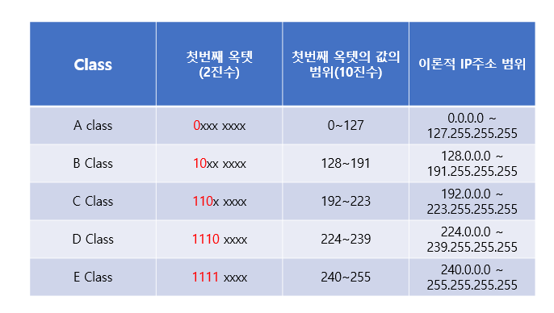
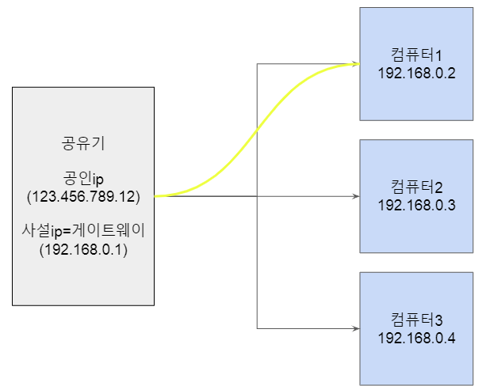

# IPv4 vs IPv6

### IP 주소 체계
- IP주소는 인터넷 공간에서 PC가 해당하는 고유한 식별자를 뜻함
- 많은 장치를 효율적으로 관리하면서 수많은 장치들간에 효율적인 통신을 하기 위해 주소체계를 계층적 주소 형식을 띄고 있음
- IPv4는 43억개의 주소를 사용할 수 있는데 기술의 발전에 따라 주소가 부족해졌고 이에 따라 IPv6를 개발


<br>


### IPv4
- 32자리(32bit)의 이진수를 8자리(8bit)씩 쪼개어 십진수로 만들고, 가운데 점을 찍어 각 마디을 옥텟이라고 부르며 이를 보기 쉽게 헥사 값으로 변경
- 각 영역의 숫자는 0~255 까지의 숫자로 표현할 수 있음 ->  2^32 = 약 43억개의 주소를 사용할 수 있음
- 가변 헤더를 가지며 크기가 20bytes ~ 60bytes
    - 헤더가 상대적으로 복잡하며 필드가 많고 체크섬 필드와 같은 추가적인 필드가 존재
- 주소를 수동으로 할당하거나 DHCP(Dynamic Host Comnfiguration Protocol)를 통해 동적으로 할당
- NAT(Network Address Transalation)를 많이 사용하여 사설 IP주소와 공인 IP 주소 간의 변환을 통해 주소 부족 문제를 완화
- 보안 기능이 프로토콜의 선택적 추가 사항
- 송신자와 라우터 모두에서 패킷의 프래그멘테이션(분할)이 가능
- 브로드캐스트 기능이 있으며, 네트워크 상의 모든 호스트에게 패킷을 전달할 수 있음
- 수동으로 설정하거나 DHCP를 통해 자동으로 할당
- IPv4 라우터에서는 tunneling이라는 방식을 사용해 IPv6 데이터그램을 전송

<br>


#### IPv4 클래스
- IP주소는 대역에 따라 A,B,C,D,E 클래스로 나뉨
- Host ID의 처음(Network ID)과 Host ID의 마지막(Broadcast)은 제외하므로 Host ID 만큼 제곱한수의 -2 한 값이 할당할 수 있는 IPv4의 개수임
    - A Class 
        - 대규모 네트워크 환경에 쓰이며, 첫번째 마디의 숫자가 0~127까지 사용된다. (ex : 12.123.123.123)
        - 첫 번째 옥텟의 범위는 0~127이고 1개의 네트워크 영역이 각각 가질 수 있는 호스트 ID는 (2^24)-2 개
    - B Class : 중규모 네트워크 환경에 쓰이며, 첫번째 마디의 숫자가 128~191까지 사용된다. (ex : 128.123.123.123)
        - B 클래스는 중규모 네트워크에서 사용된다. 네트워크 영역은 앞의 16비트가 차지하고, 뒤의 16비트는 호스트 영역이 차지
        - 첫 번째 옥텟의 범위는 128~191이고 1개의 네트워크 영역이 각각 가질 수 있는 호스트 ID는 (2^16) -2 개
    - C Class : 소규모 네트워크 환경에 쓰이며, 첫번째 마디의 숫자가 192~223까지 사용된다. (ex : 192.168.0.1)
        - C 클래스는 소규모 네트워크에서 사용된다. 네트워크 영역은 앞의 24비트가 차지하고, 뒤의 8비트는 호스트 영역이 차지
        - 첫 번째 옥텟의 범위는 192~223이고 1개의 네트워크 영역이 각각 가질 수 있는 호스트 ID는 (2^8)-2 개
    - D Class : 멀티캐스팅용으로 쓰인다. 잘 쓰이지 않는다.
    - E Class : 연구/개발용 혹은 미래에 사용하기 위해 남겨놓은 클래스로 일반적인 용도로 사용되지 않는다.

<br>

### 서브넷 마스크
- 네트워크 부분과 호스트 부분을 구분해주는 값
- 서브넷 마스크를 비트로 바꿔서 0이 아니라면 해당 부분까지 네트워크 ID를 구분
- 효율적인 네트워크 분리를 가능하게 함
- 서브넷 마스크는 IP와 똑같이 xxx.xxx.xxx.xxx로 이루어져 있는데 IP주소와 서브넷 마스크를 AND 연산하기 위해서 임

#### 서브넷팅(subnetting)
- 서브넷팅은 IP 주소 낭비를 방지하기 위해 원본 네트워크를 여러개의 서브넷으로 분리하는 과정을 뜻함 
- Net Mask를 증가시켜 하나의 네트워크에서 사용가능한 IP는 줄어들지만 좀 더 작은 단위로 분할하여 관리 가능
    1. 서브넷은 특정 네트워크를 여러개의 네트워크, 브로드캐스트 도메인을 나누는 것
    2. IP부족 현상을 해결하기 위한 방안
    3. 서브넷팅은 디폴트 서브넷 마스크를 기준으로 해서 네트워크 ID 비트수를 늘리고 호스트 ID 비트수를 줄인다
    4. 이때 기준에서 늘어난 네트워크 ID 비트는 서브넷 ID 라고 부름

```
Network : 194.126.32.0/27
Subnet Mask : 255.255.255.224 -> 11111111 11111111 11111111 11100000

Subnet : 111 -> 8
Host ID : 11100001 ~ 11111110
Subnet Network Address : 194.126.32.0 , 194.126.32.32 , 194.126.32.64 , 194.126.32.96 , 194.126.32.128 , 194.126.32.160 , 194.126.32.192 , 194.126.32.224
Subnet Broadcast Address : 194.126.32.31 , 194.126.32.63 , 194.126.32.95 , 194.126.32.127 , 194.126.32.159 , 194.126.32.191 , 194.126.32.223, 194.126.32.254

```
<br>


### 게이트웨이
- 컴퓨터 네트워크에서 한 네트워크에서 다른 네트워크로 이동하기 위해 거쳐야 하는 지점
- 라우터의 주소. 라우터는 공인 ip와 사설ip를 가지는데 라우터가 가지는 사설 ip가 게이트웨이
- 소프트웨어 측을 강조할 때 게이트웨이라고 하며, 하드웨어 측면을 강조할때는 라우터라고 함

``` 
IP : 192.168.60.16
Subnet Mask : 255.255.255.0
Gateway : 192.168.60.254

Network ID = 192.168.60
Host ID = 16

192.168.60.16/24
```

<br>


### IPv6
- 총 128bit로 각 16비트씩 8자리로 각 자리는 콜론(:)으로 구분하고 있음 
- 주소가 부족함에 따라 IPv6 개발. 그러나 아직까지 많은 라우터들이 IPv4를 사용하고 있고 IPv6 전환에는 오랜 시간이 걸릴걸로 예상
- 2^128 = 어마어마한 양의 주소 사용 가능
- 고정 헤더크기는 40bytes. 헤더 크기는 커졌으나 기능을 간략화
- 자동으로 주소를 설정할 수 있는 SLAAC 와 DGCPv6를 지원
- IPsec을 필수적으로 지원하여 보안 기능이 기본적으로 포함
- 주소 공간이 매우 넓어 NAT를 사용할 필요가 거의 없어 이를 통해 엔드투엔드 연결을 촉진
- 송신자는 프래그멘테이션을 할 수 없으며, 오직 수신자만이 패킷을 분할할 수 있음. 대신 MTU(Path MTU Discovery) 기법을 통해 최적의 패킷 크기를 자동으로 조정
- 브로드캐스트 기능이 제거되었으며, 대신 멀티캐스트와 애니캐스트 방식이 사용
- DHCPv6를 통해 자동으로 할당하거나, 자동 구성 방식(SLAAC)을 통해 주소를 설정할 수 있음
- 각 필드의 맨 앞의 연속되는 0은 생략할 수 있으며 연속되는 0은 '::'로 표현될 수 있음. 단 '::'는 한번만 사용가능

```
- 2004:2ba8:13aa:0011:0000:0000:0000:abaa

- 앞쪽 0 생략 가능 : 2004:2ba8:13aa:11:0:0:0:abaa

- '0'이 연속할 경우 '::'로 생략 가능 : 2004:2ba8:13aa:11::abaa
```

#### 프리픽스
- IPv6에서의 '서브넷'과 유사한 개념
```
예) 2001:DB8::/32
2001:0DB8:0000:0000:0000:0000:0000:0000 ~ 2001:0DB8:FFFF:FFFF:FFFF:FFFF:FFFF:FFFF

예) 2001:DB8:4567::/48
2001:0DB8:4567:0000:0000:0000:0000:0000 ~ 2001:0DB8:4567:FFFF:FFFF:FFFF:FFFF:FFFF

예) 2001:DB8:1234:0::/64
2001:0DB8:1234:0000:0000:0000:0000:0000 ~ 2001:0DB8:1234:0000:FFFF:FFFF:FFFF:FFFF
```

<br>

### IPv4/IPv6 전환
#### Tunneling
- Tunneling은 IPv4를 사용하는 라우터들 사이에서 IPv6 데이터그램이 IPv4 데이터그램 안에 payload로써 이동되어지도록 IPv6를 IPv4로 캡슐화하는 기법
- 모든 라우터가 동시에 업그레이드 되어질 수 없어서 실제로 IPv6가 보편화되는데에는 시간이 걸림
- 해당 문제 해결을 위해 터널링 기법을 통해 IPv4와 IPv6 혼용하여 사용
- IPv4와 IPv6 모두 허용하는 라우터마다 IPv6를 IPv4로 캡슐화하고, 도착지에서 받은 데이터는 헤드가 벗겨지면서 IPv6로 받음

#### Dual Stack
- 하나의 장비에서 IPv4와 IPv6 모두 지원, 동시 처리 가능하도록하는 기술
- 단, IPv4 주소가 필요하게되어, IPv4 주소 부족 문제에는 별 도움이 안됨
- 동작 우선순위 결정. 동작 우선순위는 상대 목적지 주소가 IPv4 형식인지 IPv6 형식인지에 따라 달라짐  

#### 헤더 변환(Translation)
- IPv6 시스템이 IPv4 수신자가 이해할 수 있는, 또는 그 반대로 헤더 변환(Translation)하는 기술.
- 기술 종류 : NAT-PT, CGN(Carrier Grade NAT), A+P, DS-Lite 등
- 주소 전환 프로토콜 계층에 따라서 다음의 3가지로 분류할 수 있음
    - SIIT(Stateless Ip/Icmp Translation)
    - TRT(Transport relay Translator)
    - ALG(Application Level Gateway)

<br>


<div style="text-align: right">22-09-01</div>
<div style="text-align: right">+ 내용추가 : 22-09-03</div>
-------

## Reference
- https://jhnyang.tistory.com/245
- https://blog.naver.com/hai0416/221564816863
- https://code-lab1.tistory.com/33