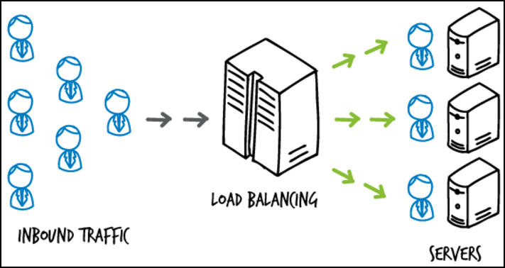

# Load Balancing 

<br>



<br>

### 로드밸런싱 (Load Balancing)
- 네트워크 또는 서버에 가해지는 로드를 분산해주는 기술
- 부하가 심해져 병목현상이 생기는 것을 방지하기 위해 사용
- 컴퓨팅 리소스, 네트워크 리소스 등 모든 부분에서의 성능향상을 기대함
- 중앙처리장치 혹은 저장장치와 같은 컴퓨터 자원들에게 작업을 나누는 것을 의미

<br>

### 로드밸런싱의 필요성
- 여러 대의 서버를 두고 서비스를 제공하는 분산 처리 시스템에서 필요한 기술
- 클라이언트 요청이 증가하여 기존 서버만으로는 정상적인 서비스가 불가능해지는데 증가한 <code>트래픽</code>을 대처할 수 있는 방법 중 Scale-out에 필요함

> 증가하는 트래픽에 대처하는 방법
> 1. Scale-up 
>       - 서버 자체의 성능을 확장하는 것. 서버 장비를 업그레이드
> 2. Scale-out 
>       - 기존 서버와 동일하거나 낮은 성능의 서버를 두 대 이상 증설하여 운영하는 것을 의미. 이 경우 여러 대의 서버로 트래픽을 균등하게 분산해주는 로드 밸런싱 기술이 필요
>
>```
> 트래픽(Traffic) : 서버나 스위치 등 네트워크 장치에서 일정 시간 내에 흐르는 데이터의 양을 말함. 웹 사이트에서의 트래픽은 사용자 접속에 따른 전송 데이터 양
>```

<br>

### 로드 밸런싱의 기본 기능
1. 상태 확인 (Health Check)
    - 서버들에 대한 주기적인 Health Check를 통해 서버들의 장애 여부를 판단하여, 정상 동작 중인 서버로만 트래픽을 보냄
    - L3 체크 : <code>ICMP</code>를 이용하여 서버의 IP 주소가 통신 가능한 상태인지 확인
    - L4 체크 : TCP는 3 Way-Handshaking을 기반으로 통신하는데 이러한 TCP의 특성을 바탕으로 각 포트 상태를 체크하는 방식
    - L7 체크 : 애플리케이션 계층에서 체크를 수행하여 실제 웹페이지에 통신을 시도하여 이상 유무 파악
    ```
    ICMP ( Internet Control Message Protocol) : 패킷 전송에 실패했을 때 에러가 났음을 알림과 동시에 해결 가능한 힌트를 제공하는 메시징 프로토콜. TCP/IP 계층에서 동작
    ```
2. 터널링 (Tunneling)
    - 데이터 스트림을 인터넷 상에서 가상의 파이프를 통해 전달시키는 기술로 패킷 내의 터널링할 대상을 캡슐화 시켜 목적지 까지 전송
    - 연결된 상호 간에만 캡슐화된 패킷을 구별해 캡슐화를 해제하게 함
3. NAT (Network Address Translation)
    - 내부 네트워크에서 사용하는 사설 IP 주소와 로드밸런서 외부의 공인 IP 주소 간의 변환 역할 ([NAT 설명 링크](./OSI%20L4.md))
    - 로드밸런싱 관점에서는 여러 개의 호스트가 하나의 공인 IP 주소(VLAN or VIP)를 통해 접속하는 것이 주 목적
    - SNAT (Source Network Address Translation) : 내부에서 외부로 트래픽이 나가는 경우 내부 사설 IP주소 -> 외부 공인 IP 주소로 변환
    - DNAT (Destination Network Address Translation) : 외부에서 내부로 트래픽이 들어오는 경우 외부 공인 IP 주소 -> 내부 사설 IP 주소로 변환
4. DSR (Destination Network Address Translation)
    - 서버에서 클라이언트로 트래픽이 되돌아 가는 경우, 목적지를 클라이언트로 설정한 다음, 네트워크 장비나 로드밸런서를 거치지 않고 바로 클라이언트를 찾아가는 방식
    - 이 기능을 통해 로드밸런서의 부하를 줄여줄 수 있음

<br>


<br>

### 로드밸런서 (Load Balancer)
- 서버에 가해지는 부하(로드)를 분산(밸런싱)해주는 장치 또는 컴퓨터 네트워크 기술의 통칭.
- 한 대의 서버로 부하가 집중되지 않도록 트래픽을 관리해 각각의 서버가 최적의 퍼포먼스를 보일 수 있도록 함
- 클라이언트와 네트워크 트래픽이 집중되는 서버들 또는 네트워크 허브 사이에 위치
- OSI 7계층은 상위 계층에서 사용되는 장비는 하위 계층의 장비가 가지는 기능을 모두 가지고 있어 상위 계층으로 갈수록 더욱 정교한 로드밸런싱 가능
- OSI 4계층인 전송계층의 L4 로드밸런서와 OSI 7계층인 애플리케이션 계층의 L7 로드밸런서가 가장 많이 활용되는데 L4 로드밸런서부터 포트 정보를 바탕으로 로드를 분산 가능하기 때문. 다수의 서버 프로그램을 운영하는 경우 최소 L4 로드밸런서 이상을 사용해야만 함
- L4는 단순히 부하를 분산, L7는 요청의 세부적인 사항을 두고 서비스별 서버로 분리하여 가볍고 작은 단위로 여러개의 서비스를 운영하고 요청을 각각의 서버에 분산 가능
- 특정기능이 필요한 것이 아니라면 <b>초당 연결수(Connections Per Sec), 동시 연결수(Concurrent Connections), 처리용량(Throughput)</b>을 성능 지표로 하여 L4 로드밸런서와 L7 로드밸런서중 적절히 선택하면 됨
>#### L4 Load Balancing
>- 서버나 네트워크의 트래픽을 로드밸런싱하는 스위치로 OSI 4계층인 '전송 계층'의 L4 스위치. 
>- TCP/IP 프로토콜을 기반으로 대부분 동작하여 Port 단위의 로드 밸런싱을 수행한다. 
>- L7에 비하여 속도가 빠르고 효율이 높고 가격이 저렴
>- 데이터의 내용을 복호화할 필요가 없어 안전
>- 패킷의 내용을 모르기 때문에 섬세한 라우팅이 불가능하고 사용자 IP가 수시로 바뀌는 경우라면 연속적인 서비스 제공이 어려움
>- TCP와 UDP의 헤더(Port)를 보고 적절한 서버로 스위칭 해줌
>- 주로 Round Robin 방식을 사용한다.
>- CLB(Connection Load Balancer) 또는 SLB(Session Load Balancer)라고 부르기도 함
>- 사용방식
>>- Round Robin(순차방식)
>>    - 요청을 순서대로 각 서버에 균등하게 분배하는 방식
>>    - 서버 커넥션 수나 응답시간에 상관없이 모든 서버를 동일하게 처리, 다른 알고리즘에 비해서 가장 빠름
>>- IP 해시 방식(IP Hash Method)
>>    - 클라이언트의 IP 주소를 특정 서버로 매핑하여 요청을 처리하는 방식
>>    - 사용자의 IP를 <code>해싱</code>하여 코드를 분배하기 때문에 사용자가 항상 동일한 서버로 연결되는 것을 보장
>>- 최소 접속 방식(Least Connection)
>>    - 서버에 연결되어 있는 Connection 개수만 갖고 단순 비교하여 가장 적은 곳에 연결
>>- 가중치 최소 접속 방식(Weighted Least Connection)
>>    - 서버에 부여된 Weight 값을 기반으로 Connection 수의 개수와 같이 고려하여 할당
>>- 응답 시간 방식(Fastest Response Time)
>>    - 가장 빨리 응답하는 서버에 이용자 요구를 연결하는 방법.
>>    - 응답시간은 각 서버가 패킷 형태의 요구를 송수신하는데 걸리는 시간을 측정
>>- 최소 대기 방식(Adaptive)
>>    - Open 또는 Pending(계류중) 커넥션을 적게 가지고 있는 서버로 네트웍 커넥션 방향을 지정.
>>    - Pending 커넥션은 Full TCP Handshake를 완성하지 않은 것으로, 이것은 초 마다 클라이언트 Thread 수가 증가할 때 더욱 잘 수행됨
>>- 대역폭 방식(Bandwidth Method)
>>    - 서버들과의 <code>대역폭</code>을 고려하여 서버에 트래픽을 할당
>>
>>```
>>해싱(Hashing) : 임의의 길이를 지닌 데이터를 고정된 길이의 데이터로 매핑하는 것, 또는 그러한 함수
>>
>>대역폭(Bandwidth) : 데이터가 한 위치에서 다른 위치로 전송될 수 있는 속도를 설명하는데 사용되는 용어로 보통 초당 비트수로 측정되며 사이트, 사용자 및 서버 간에 데이터를 전송하는 속도에 영향을 끼침
>>```
>
> <br>
>
>#### L7 Load Balancing
>- OSI 계층인 '애플리케이션 계층'의 L7 스위치
>- 애플리케이션 계층(HTTP,FTP,SMTP)에서 로드(부하)를 분산(밸런싱)하기 때문에 HTTP 헤더, 쿠키 등과 같은 사용자 요청을 기준으로 특정 서버에 트래픽을 분산. 즉, 패킷의 내용을 확인하고 그 내용에 따라 로드를 특정 서버에 분배하는 것이 가능
>- 캐싱(Cashing)기능 제공
>- L7 로드밸런서의 경우 특정한 패턴을 지닌 바이러스를 감지해 네트워크 보호
>- DoS/DDoS 와 같은 비정상적인 트래픽을 필터링할 수 있어 그만큼 자원의 소모가 크지만 네트워크 보안 분야에서도 활용됨.
>- Port 단위의 로드밸런싱을 수행하는 L4를 극복하기 위해 Port 정보와 패킷의 <code>페이로드</code> 내용까지 분석하여 로드밸런싱을 수행.
>- L4에 비해 패킷의 내용을 복호화하여야 하므로 비쌈
>- 클라이언트가 로드밸런서와 인증서를 공유해야 하기 때문에 로드밸런서를 통해 클라이언트의 데이터에 접근할 수 있는 보안상 위험성 존재
>- 사용 방식
>>  - URL 스위칭 (URL Switching) 방식
>>      - 특정 하위 URL들은 특정 서버로 처리하는 방식
>>  - 컨텍스트 스위칭 (Context Switching) 방식
>>      - 클라이언트가 요청한 특정 리소스에 대해 특정 서버로 연결 가능
>>  - 쿠키 지속성 (Persistence with Cookies) 
>>      - 쿠키 정보를 바탕으로 클라이언트가 연결했었던 동일한 서버에 계속 할당
>>      - 특히 사설 네트워크에 있던 클라이언트의 IP주소가 공인 IP 주소로 치환되어 전송하는 방식을 지원
>>
>>``` 
>>페이로드 (payload) : 보내고자 하는 데이터 자체를 의미로 Message의 Body 부분에 해당
>>```

<br>

<div style="text-align: right">22-06-29</div>

<br>

## Reference
- https://devfunny.tistory.com/630
- https://velog.io/@makeitcloud/란-L4-load-balancer-vs-L7-load-balancer-란
- https://co-no.tistory.com/22
- https://www.stevenjlee.net/2020/06/30/이해하기-네트워크의-부하분산-로드밸런싱-load-balancing-그/