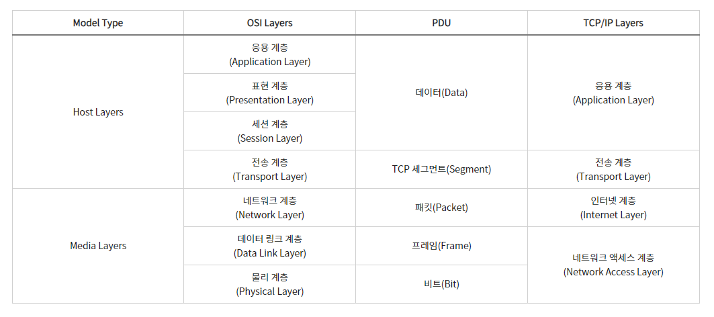
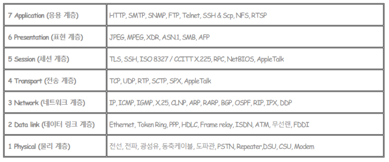

# OSI 7 계층

 

 

### OSI 7계층이란?
 
> - OSI (Open Systems Interconnection Reference Model)은 네트워크를 이루고 있는 구성 요소들을 7단계의 계층적 방법으로 나누고 각 계층의 표준을 정한 네트워크 모델.
> - 계층을 나눈 이유는 네트워크에서 통신이 일어나는 과정을 단계적으로 파악할 수 있게하기 위해서임. 특정 계층에서 문제가 생기면 해당하는 계층의 장비나 소프트웨어만 고치면 해결이 가능함
> - 개방형 시스템 상호 연결 모델의 표준
> - 실제 인터넷에서 사용되는 TCP/IP는 OSI 참조 모델을 기반으로 상업적이고 실무적으로 이용될 수 있돌고 단순화 한 것이라고 함
> - 등장 배경은 초기 여러 정보 통신 업체 장비들은 자신의 업체 장비들 끼리만 연결이 되어 호환성이 없었음. 
> - 모든 시스템들의 상호 연결에 있어 문제없도록 표준을 정한 것

 

### 작동 원리
> - 7계층은 물리, 데이터링크, 네트워크, 전송, 세션, 표현, 응용 계층으로 나뉨.
> - 전송시 7계층에서 1계층으로 각각의 층마다 인식할 수 있어야 하는 헤더를 붙임 ( 캡슐화 )
> - 수신시 1계층에서 7계층으로 헤더를 떼어냄 ( 디캡슐화 )
> - 출발지에서 데이터가 전송될 때 헤더가 추가되는데 오류제어를 위해 꼬리부분에 추가됨

 

## 구조
1) Physical Layer : 물리 계층
> - 주로 전기적, 기계적, 기능적인 특성을 이용하여 데이터를 전송 ( 물리적인 장치에 의해 통신 하는 계층 )
>- 데이터는 0,1의 비트열로 전기적 신호 상태로 이루어져 있어 해당 계층은 그저 데이터를 전달
>- 데이터 전달 뿐이기 때문에 알고리즘, 오류제어 기능이 없음
>- 장비로는 케이블, 리피터, 허브가 존재

 

2) Data-Link Layer : 데이터링크 계층
>- 장치간 신호를 전달하는 물리계층 이용하여 네트워크 상의 주변 장치들 간의 데이터를 전송. 물리계층을 통하여 송수신 되는 정보의 오류와 흐름을 관리하여 안전한 정보의 전달을 수행하도록 도움
>- 물리적인 연결을 통하여 인접한 두 장치 간의 신뢰성 있는 정보 전달을 담당 ( Point-To-Point )
>- 안전한 정보의 전달이라는 것은 오류나 재전송하는 기능이 존재함을 의미
>- MAC 주소를 통해서 통신
>- 데이터 링크 계층에서 데이터 단위는 프레임
>- 장비로는 브리지, 스위치가 존재
>
>>\* MAC 주소 : 이더넷과 와이파이를 포함한 대부분의 IEEEE 802 네트워크 기술에 네트워크 주소로 사용. MAC 주소는 매체 접근 제어 프로토콜로 대체적으로 네트워크 인터페이스 컨트롤러(NIC)의 제조 업체가 할당하며 하드웨어에 저장되는데 제조업체에 의해 할당되면 일반적으로 제조업체의 등록된 식별 번호로 인코딩되며 이를 BIA(burned-in address)라고 부름. 또 이더넷 하드웨어 주소, 하드웨어 주소, 물리 주소로도 불림.

 

3) Network Layer : 네트워크 계층
>- 중계 노드를 통하여 전송하는 경우 어떻게 중계할 것인가를 규정
>- 여러 개의 노드를 거칠 때마다 경로를 찾아주는 계층으로 다양한 길이의 데이터를 네트워크들을 통해 전달. 그 과정에서 전송 계층이 요구하는 서비스 품질(QoS)를 제공하기 위한 기능적, 절차적 수단을 제공
>- 네트워크 계층에서 데이터 단위는 패킷 ( Packet )
>- 컴퓨터에게 데이터를 전송할지 주소를 갖고 있어서 경로를 선택하여 주소를 정하고 경로에 따라 패킷을 전달해주는 것이 이 계층의 주 역할. 통신이 가능 ( IP 주소는 네트워크 계층의 헤더에 속함 )
>- 네트워크 계층은 라우팅, 흐름 제어, 세그멘테이션, 오류 제어, 인터네트워킹 등을 수행
>- 사용 장비로는 라우터, L3 스위치가 존재

 

4) Transeport Layer : 전송 계층
>- 종단 간 신뢰성 있고 정확한 데이터 전송을 담당
>- 송신자와 수신자 간의 신뢰성있고 효율적인 데이터를 전송하기 위해 오류검출 및 복구, 흐름제어와 중복검사 등을 수행
>- 데이터 전송을 위해서 Port 번호를 사용함 ( TCP와 UDP가 대표적 프로토콜 )
>- 전송 계층에서 데이터 단위는 세그먼트 ( Seqgment )

 

5) Session Layer :  세션 계층
>- 통신 장치 간 상호작용 및 동기화를 제공
>- 연결 세션에서 데이터 교환과 에러 발생 시의 복구를 관리

 

6) Presentation Layer : 표현 계층
>- 데이터를 어떻게 표현할지 정하는 역할을 하는 계층
>- 송신자에서 온 데이터를 해석하기 위한 응용계층 데이터 부호화, 변화
>- 수신자에서 데이터의 압축을 풀 수 있는 방식으로 된 데이터 압축
>- 데이터의 암호화나 복호화

 

7) Application Layer : 응용 계층
>- 사용자와 가장 밀접한 계층으로 인터페이스 역할
>- 응용 프로세스 간의 정보 교환을 담당

 

### 구조별 사용 프로토콜

 

 

22-06-15
