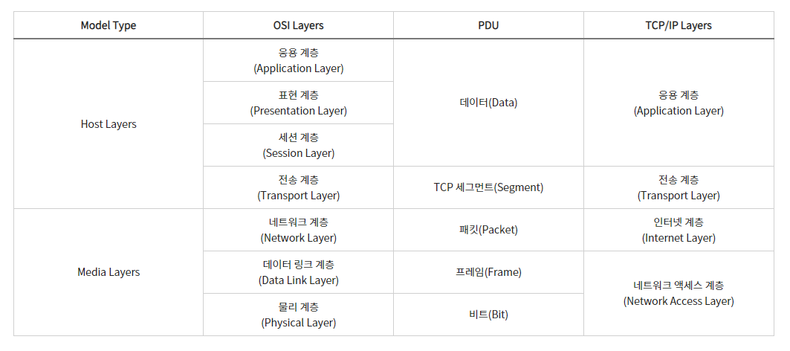

# OSI 7 계층

<br/>



<br/>

### OSI 7계층이란?
 
> - OSI (Open Systems Interconnection Reference Model)은 네트워크를 이루고 있는 구성 요소들을 7단계의 계층적 방법으로 나누고 각 계층의 표준을 정한 네트워크 모델.
> - 계층을 나눈 이유는 네트워크에서 통신이 일어나는 과정을 단계적으로 파악할 수 있게하기 위해서임. 특정 계층에서 문제가 생기면 해당하는 계층의 장비나 소프트웨어만 고치면 해결이 가능함
> - 개방형 시스템 상호 연결 모델의 표준
> - 실제 인터넷에서 사용되는 TCP/IP는 OSI 참조 모델을 기반으로 상업적이고 실무적으로 이용될 수 있돌고 단순화 한 것이라고 함
> - 등장 배경은 초기 여러 정보 통신 업체 장비들은 자신의 업체 장비들 끼리만 연결이 되어 호환성이 없었음. 
> - 모든 시스템들의 상호 연결에 있어 문제없도록 표준을 정한 것

<br/>

### 작동 원리
> - 7계층은 물리, 데이터링크, 네트워크, 전송, 세션, 표현, 응용 계층으로 나뉨.
> - 전송시 7계층에서 1계층으로 각각의 층마다 인식할 수 있어야 하는 헤더를 붙임 ( 캡슐화 )
> - 수신시 1계층에서 7계층으로 헤더를 떼어냄 ( 디캡슐화 )
> - 출발지에서 데이터가 전송될 때 헤더가 추가되는데 오류제어를 위해 꼬리부분에 추가됨

<br/>

## 구조
1) Physical Layer : 물리 계층
> - 주로 전기적, 기계적, 기능적인 특성을 이용하여 데이터를 전송 ( 물리적인 장치에 의해 통신 하는 계층 )
>- 데이터는 0,1의 비트열로 전기적 신호 상태로 이루어져 있어 해당 계층은 그저 데이터를 전달
>- 데이터 전달 뿐이기 때문에 알고리즘, 오류제어 기능이 없음
>- 장비로는 케이블, 리피터, 허브가 존재

<br/>

2) Data-Link Layer : 데이터링크 계층
>- 장치간 신호를 전달하는 물리계층 이용하여 네트워크 상의 주변 장치들 간의 데이터를 전송. 물리계층을 통하여 송수신 되는 정보의 오류와 흐름을 관리하여 안전한 정보의 전달을 수행하도록 도움
>- 물리적인 연결을 통하여 인접한 두 장치 간의 신뢰성 있는 정보 전달을 담당 ( Point-To-Point )
>- 안전한 정보의 전달이라는 것은 오류나 재전송하는 기능이 존재함을 의미
>- MAC 주소를 통해서 통신
>- 데이터 링크 계층에서 데이터 단위는 프레임
>- 장비로는 브리지, 스위치가 존재
>
>>\* MAC 주소 : 이더넷과 와이파이를 포함한 대부분의 IEEEE 802 네트워크 기술에 네트워크 주소로 사용. MAC 주소는 매체 접근 제어 프로토콜로 대체적으로 네트워크 인터페이스 컨트롤러(NIC)의 제조 업체가 할당하며 하드웨어에 저장되는데 제조업체에 의해 할당되면 일반적으로 제조업체의 등록된 식별 번호로 인코딩되며 이를 BIA(burned-in address)라고 부름. 또 이더넷 하드웨어 주소, 하드웨어 주소, 물리 주소로도 불림.

<br/>

3) Network Layer : 네트워크 계층
>- 중계 노드를 통하여 전송하는 경우 어떻게 중계할 것인가를 규정
>- 여러 개의 노드를 거칠 때마다 경로를 찾아주는 계층으로 다양한 길이의 데이터를 네트워크들을 통해 전달. 그 과정에서 전송 계층이 요구하는 서비스 품질(QoS)를 제공하기 위한 기능적, 절차적 수단을 제공
>- 네트워크 계층에서 데이터 단위는 패킷 ( Packet )
>- 컴퓨터에게 데이터를 전송할지 주소를 갖고 있어서 경로를 선택하여 주소를 정하고 경로에 따라 패킷을 전달해주는 것이 이 계층의 주 역할. 통신이 가능 ( IP 주소는 네트워크 계층의 헤더에 속함 )
>- 네트워크 계층은 라우팅, 흐름 제어, 세그멘테이션, 오류 제어, 인터네트워킹 등을 수행
>- 사용 장비로는 라우터, L3 스위치가 존재

<br/>

4) Transeport Layer : 전송 계층
>- 종단 간 신뢰성 있고 정확한 데이터 전송을 담당
>- 송신자와 수신자 간의 신뢰성있고 효율적인 데이터를 전송하기 위해 오류검출 및 복구, 흐름제어와 중복검사 등을 수행
>- 데이터 전송을 위해서 Port 번호를 사용함 ( TCP와 UDP가 대표적 프로토콜 )
>- 전송 계층에서 데이터 단위는 세그먼트 ( Seqgment )

<br/>

5) Session Layer :  세션 계층
>- 통신 장치 간 상호작용 및 동기화를 제공
>- L4와 L6 사이에서 논리적인 연결을 담당
>- 연결 세션에서 데이터 교환과 에러 발생 시의 복구를 관리

<br/>

6) Presentation Layer : 표현 계층
>- 데이터를 어떻게 표현할지 정하는 역할을 하는 계층
>- 송신자에서 온 데이터를 해석하기 위한 응용계층 데이터 부호화, 변화
>- 수신자에서 데이터의 압축을 풀 수 있는 방식으로 된 데이터 압축
>- 데이터의 암호화나 복호화
>- 몬자코드나 그림파일, 동영상 파일의 확장자로 쓰임

<br/>

7) Application Layer : 응용 계층
>- 사용자와 가장 밀접한 계층으로 인터페이스 역할 ( 우리가 사용하는 프로그램 : 어플리케이션 )
>- 응용 프로세스 간의 정보 교환을 담당

<br/>


### 구조별 사용 프로토콜

<br/>


<br/>

## Ssafy Wizards CS Study

### 1. Transport Layer와, Network Layer의 차이
- Transport Layer는 4계층 전송 계층을 의미하고 Network Layer는 3계층 네트워크 계층을 의미
- 네트워크 계층은 데이터 패킷이 송신자에서 수신자에게 도달하기 위해 라우팅으로 데이터 패킷의 경로를 설정함
    - 이를 위한 각 장치의 논리적 주소인 IP를 할당하고 데이터를 전송 가능
    - 패킷은 네트워크 장비(라우터, 스위치)를 통해 물리적인 네트워크 상에서 전달됨. 또한 전송 계층에서 생성된 세그먼트를 재조립하여 데이터를 패킷으로 캡슐화됨
- 전송 계층은 송수신자 간의 데이터 전송을 관리하고 제어하며 데이터의 신뢰성 있는 전송을 보장하기 위해 데이터를 세그먼트로 나누어 전송하고 수신측에서는 이 세그먼트를 다시 조립하여 원래의 데이터로 복원
    - IP 내의 포트 번호로 데이터를 전송하고 데이터 구조는 세그먼트 혹은 데이터 그램으로 전송
    - 주로 논리적인 프로세스 간의 통신을 관리

<br>

### 2. L3 Switch와 Router의 차이
#### L3 스위치
- L3 스위치는 주로 LAN 환경에서 사용되며 L2 스위칭과 L3 라우팅 기능을 결합한 장비
    - L2 스위치 : MAC 주소 기반으로 장치 간의 데이터를 전달
    - L3 스위치 : 네트워크 계층(3계층)에서 작동하여 IP 기반의 라우팅 기능을 수행. 내부 네트워크에서 IP 기반 라우팅을 수행하며 여러 서브넷 간의 통신을 관리 가능
- MAC 주소 기반의 스위칭 기능과 L3 라우팅 기능을 모두 수행할 수 있음
- 주로 하드웨어 기반 처리로 매우 빠르고 많은 수의 포트를 제공
- LAN 내부에서의 고속 패킷 전송과 서브넷 간 라우팅을 처리하는 데 최적화된 장비

#### 라우터
- 라우터는 다른 네트워크 간의 트래픽을 라우팅하는 역할을 수행하여 LAN과 WAN(Wide Area Network) 간의 트래픽을 관리하거나, 인터넷과 내부 네트워크를 연결하는 데 사용
- L3 스위치 보다 더 복잡한 라우팅 기능을 지원하고 여러 라우팅 프로토콜을 사용하여 다양한 네트워크 환경에서 동적으로 경로를 설정하고 관리할 수 있음
- 일반적으로 소프트웨어 기반으로 라우팅 작업을 수행하여 패킷 전달 속도가 L3 스위치보다 느리거나 네트워크 연결 위주의 적은 포트를 제공하지만 유연하고 다양한 네트워크 기능을 제공
- 네트워크 보안을 강화하기 위한 방화벽, NAT(Network Address Translation), VPN(Virtual Private Network) 등 다양한 보안 기능을 내장

<br>

### 3. Layer는 패킷 명칭
| **계층**                      | **데이터 단위**                      | **설명**                                                  |
|-------------------------------|---------------------------------------|-----------------------------------------------------------|
| 물리 계층 (Physical Layer, 1계층) | 비트(Bit)                            | 데이터를 전기적 신호나 광 신호로 변환하여 전송             |
| 데이터 링크 계층 (Data Link Layer, 2계층) | 프레임(Frame)                        | MAC 주소 기반으로 데이터를 프레임 단위로 처리하고 전송      |
| 네트워크 계층 (Network Layer, 3계층) | 패킷(Packet)                         | IP 주소를 사용하여 패킷을 라우팅하고 전달                  |
| 전송 계층 (Transport Layer, 4계층) | 세그먼트(Segment) 또는 데이터그램(Datagram) | TCP/UDP를 사용하여 신뢰성 있는 데이터 전송을 관리          |
| 세션 계층 (Session Layer, 5계층) | 데이터(Data)                          | 통신 세션을 설정하고 관리                                  |
| 표현 계층 (Presentation Layer, 6계층) | 데이터(Data)                          | 데이터의 형식 변환, 암호화, 압축 등을 수행                  |
| 응용 계층 (Application Layer, 7계층) | 메시지(Message) 또는 데이터(Data)      | 사용자와 직접 상호작용하며, 프로토콜을 통해 데이터를 주고받음 |


<br>

### 4. 각각의 Header의 Packing Order
- Packing Order 란 각 계층의 헤더가 데이터가 추가되는 순서를 설명하는 것으로 OSI 계층 모델을 따라 데이터를 캡슐화하는 과정
- 데이터가 전송될 때 상위 계층에서 하위 계층으로 내려갈수록 각 계층의 헤더가 데이터에 추가됨
- 데이터 수신 시 헤더의 제거 순서를 Unpacking Order 라고 하고 수신 측에서는 이전 Packing Order 과정을 역순으로 수행하여 데이터의 헤더를 제거하고 원래의 데이터를 복원

| **계층**                      | **헤더 추가 순서**                     | **설명**                                                                          |
|-------------------------------|----------------------------------------|-----------------------------------------------------------------------------------|
| 응용 계층 (Application Layer, 7계층) | 1                                      | 사용자가 상호작용하는 데이터(메시지)가 생성                                |
| 표현 계층 (Presentation Layer, 6계층) | 2                                      | 데이터의 형식 변환, 암호화, 압축이 이루어지며, 헤더가 추가될 수 있음        |
| 세션 계층 (Session Layer, 5계층) | 3                                      | 통신 세션을 설정하고 관리하는 헤더가 추가                                |
| 전송 계층 (Transport Layer, 4계층) | 4                                      | 데이터에 TCP/UDP 헤더(세그먼트/데이터그램)가 추가                       |
| 네트워크 계층 (Network Layer, 3계층) | 5                                      | 세그먼트에 IP 헤더가 추가되어 패킷이 됨                                   |
| 데이터 링크 계층 (Data Link Layer, 2계층) | 6                                      | 패킷에 프레임 헤더(MAC 주소 정보 등)가 추가되어 프레임이 됨                |
| 물리 계층 (Physical Layer, 1계층) | 7                                      | 프레임이 비트(Bit) 단위로 변환되어 전기적 신호나 광 신호로 전송            |

<br>

```
하위 계층으로 내려 갈수록 헤더가 추가되는 이유

- 하위 계층(1~3계층)은 네트워크 전송을 위한 물리적 및 논리적 경로 설정, 오류제어, 데이터 주소화 등을 담당하여 데이터가 실제로 네트워크를 통해 전송되고, 목적지까지 안전하게 도달할 수 있도록 하기 위한 기본적인 전달 정보가 필요
- 하위 계층의 필수적인 전송 정보인 MAC 주소, IP 주소, 오류 검사 정보 등으로 헤더가 채워지므로 많은 정보가 필요함

- 상위 계층(4~7계층)은 네트워크 상에서 애플리케이션 간의 통신을 관리하고, 데이터의 올바른 전달을 보장 위주
- 이 계층에서는 애플리케이션 간의 데이터 전달에 필요한 정보가 헤더에 포함되지만, 물리적 전달과 관련된 세부적인 정보는 하위 계층에서 처리되므로 상대적으로 헤더에 포함되는 정보가 간소화될 수 있음

- 즉, 이미 하위계층에서 설정된 정보를 토대로 네트워크 데이터 전송에 필요한 헤더보다는 하드웨어에서 IP 까지 구성하는 과정이 더 많은 헤더가 필요
```

<br>

### 5. ARP
- ARP (Address Resolution Protocol)는 네트워크에서 IP 주소를 MAC 주소로 변환하기 위해 사용되는 프로토콜
- RARP (Reverse Address Resolution Protocol)는 ARP의 반대 역할을 하며, MAC 주소를 IP 주소로 변환하기 위해 사용


<br>

<div style="text-align: right">22-06-15</div>