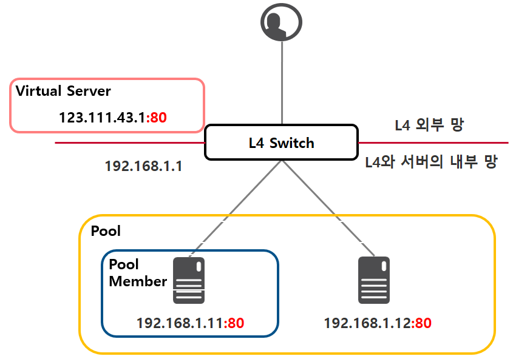

# OSI L4

### L4 Swich?
- OSI 4계층에서 이용하는 스위치로 L4 라고 함
- 서버의 부하 분산([로드밸런싱 설명 링크](./Load_Balancing.md))을 처리하는 장비  
- 외부에서 들어오는 모든 요청을 L4 스위치가 받아 서버들에게 적절히 나누어줌
- TCP, UDP, HTTP와 같은 Protocol들의 Header를 분석하여 그 정보를 바탕으로 부하 분산을 실시하고 거기에 더해 Source IP 혹은 Destination IP를 NAT(Network Address Translation)하여 보낼 수 있음
- L4는 4계층 장비인 만큼 외부에서 접근할 IP + Port(TCP 헤더 : Source Port, Destination Port 존재)를 명시해주어야 함. 
- 외부 사용자들이 접속 시 사용하는 IP와 Port를 갖고있는 L4 스위치의 구성요소를 Virtual Server 라고 함. 또한 Virtual Server IP를 VIP라고 부르며 L4 스위치는 다수의 Virtual Server를 가질 수 있음
- Virtual Server에 도달한 요청을 서버(IP와 Port가 명시된)들의 집합에 전달하게 되는데 이 집합을 Pool이라 함. 특정 Virtual Server에 전달된 요청들은 그 Virtual Server에 연결된 Pool에만 전달 됨 ( Pool 안의 구성되는 IP와 Port로 구성되는 서버를 Pool Member로 부름. Pool Member는 IP와 Port로 구성되어 있는 서버로 IP가 같아도 Port가 다르면 엄연히 다른 Pool Member 라고 함 )
- 클라이언트와 서버가 '3-way handshake'를 거쳐 논리적 연결이 생성되었음을 나타내는 Connection을 생성하면 중간자 역할의 L4 스위치 역시 Connectino을 생성하여 리스트를 관리. ( 이 과정에서 3-way handshake 또한 L4 스위치를 통해 실시됨 )
- 논리적 연결을 통해 데이터를 주고받던 서버 혹은 클라이언트가 4-way handshake(연결종료과정)를 실시하여 Connection을 제거하면 4-way handshake의 중재자인 L4 스위치 또한 Connection을 삭제.

<br>



<br>

### L4의 역할

#### L4 Load Balancing 
- 서버나 네트워크의 트래픽을 로드밸런싱
- TCP/IP 프로토콜을 기반으로 대부분 동작하여 Port 단위의 로드 밸런싱을 수행한다. 
- L7에 비하여 속도가 빠르고 효율이 높고 가격이 저렴
- 데이터의 내용을 복호화할 필요가 없어 안전
- 패킷의 내용을 모르기 때문에 섬세한 라우팅이 불가능하고 사용자 IP가 수시로 바뀌는 경우라면 연속적인 서비스 제공이 어려움
- TCP와 UDP의 헤더(Port)를 보고 적절한 서버로 스위칭 해줌
- 주로 Round Robin 방식을 사용한다.
- CLB(Connection Load Balancer) 또는 SLB(Session Load Balancer)라고 부르기도 함
- 사용방식
>- Round Robin(순차방식)
>    - 요청을 순서대로 각 서버에 균등하게 분배하는 방식
>    - 서버 커넥션 수나 응답시간에 상관없이 모든 서버를 동일하게 처리, 다른 알고리즘에 비해서 가장 빠름
>- IP 해시 방식(IP Hash Method)
>    - 클라이언트의 IP 주소를 특정 서버로 매핑하여 요청을 처리하는 방식
>    - 사용자의 IP를 <code>해싱</code>하여 코드를 분배하기 때문에 사용자가 항상 동일한 서버로 연결되는 것을 보장
>- 최소 접속 방식(Least Connection)
>    - 서버에 연결되어 있는 Connection 개수만 갖고 단순 비교하여 가장 적은 곳에 연결
>- 가중치 최소 접속 방식(Weighted Least Connection)
>    - 서버에 부여된 Weight 값을 기반으로 Connection 수의 개수와 같이 고려하여 할당
>- 응답 시간 방식(Fastest Response Time)
>    - 가장 빨리 응답하는 서버에 이용자 요구를 연결하는 방법.
>    - 응답시간은 각 서버가 패킷 형태의 요구를 송수신하는데 걸리는 시간을 측정
>- 최소 대기 방식(Adaptive)
>    - Open 또는 Pending(계류중) 커넥션을 적게 가지고 있는 서버로 네트웍 커넥션 방향을 지정.
>    - Pending 커넥션은 Full TCP Handshake를 완성하지 않은 것으로, 이것은 초 마다 클라이언트 Thread 수가 증가할 때 더욱 잘 수행됨
>- 대역폭 방식(Bandwidth Method)
>    - 서버들과의 <code>대역폭</code>을 고려하여 서버에 트래픽을 할당
>
>```
>해싱(Hashing) : 임의의 길이를 지닌 데이터를 고정된 길이의 데이터로 매핑하는 것, 또는 그러한 함수
>
>대역폭(Bandwidth) : 데이터가 한 위치에서 다른 위치로 전송될 수 있는 속도를 설명하는데 사용되는 용어로 보통 초당 비트수로 측정되며 사이트, 사용자 및 서버 간에 데이터를 전송하는 속도에 영향을 끼침
>```
<br>

> 공인 IP, 내부 IP? L4가 필요한 이유
    >- 본래는 클라이언트에서 서버의 공인 IP로 요청을 보내는데 여러개의 서버가 있을 경우 혹은 서버를 추가했을경우는 어려워짐. 
    >- 서버가 여러대 일경우 부하를 분산하는것이 로드밸런싱인데 이 행동을 L4에서 진행함. 
    >- 이제 클라이언트는 서버로 요청을 보내려면 어떤 요청이던지 모든 요청은 L4로 보내지고 L4는 로드밸런싱을 통해 알맞는 서버로 요청을 전달함. 여기서 클라이언트는 이에 알맞는 서버에 대한 IP는 알수없고 L4 스위치의 외부 망인 공인 IP로 요청을 보내는 것만이 가능. 그렇게 공인 IP로 요청이 들어오면 스위치는 서버 내부 망인 사설 IP를 가지고 있는데 L4가 알아서 사설 IP로 요청을 보낸다. 이렇게 L4 내에서 안밖으로 IP가 변환됨
    >- 즉 외부망 \> 공인IP ( 알려져있는 IP로 접근 ), 내부망 \> 사설IP ( L4 를 이용해 내부 서버 접근 )

<br>

### L2, L3 스위치 간단 정리
#### L2 Switch
- OSI 2계층을 이해하고 처리하는 장비로 MAC 어드레스를 읽고 처리
- 가장 기본적인 스위치 기능. Data Link 간의 통신으로 포트를 확장하고 싶을 때 사용
- Ethernet은 기본적으로 Broadcasting을 사용한다고 했는데 이것을 개선한 것.
- Broadcasting 하던 것을 MAC어드레스를 읽어서 해당 호스트에만 전달할 수 있게 해주어 호스트 간의 Dedicated 대역폭을 제공
- Broadcasting을 할 경우 10/100/1000 Mbps를 모두 공유하므로 하나의 허브에 N개의 호스트를 넣으면 1/N의 속도로 각각 통신할 수 있게함

<br>

#### L3 Switch
- OSI 3계층을 이해하고 처리할수 있는 장버로 IP(네트워크 주소)를 읽고 처리함
- IP는 네트워크를 구분하는데 사용되어 L3 스위치는 네트워크 간의 전송을 가능케함.
- 위의 전송은 실제로 라우터에서 하던 라우팅에 해당하며 라우터를 대신하는 기능으로 사용

<br>

<div style="text-align: right">22-06-30</div>

<br>

## Reference
- https://aws-hyoh.tistory.com/entry/L4-Switch-쉽게-이해하기
- http://egloos.zum.com/genes1s/v/3091521