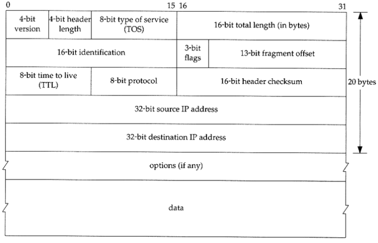

# Packet

### Packet 이란?

>- Packet은 pack + bucket 으로 만들어진 용어로, 네트워크에서 네트워크를 통해 전송하기 쉽도록 자른 데이터의 전송단위. 데이터/ 제어 정보를 포함하는 형식화된 블록.
>- 네트워크에서 전송되는 데이터의 기본단위이면서 인터넷 계층에서 정의되는 데이터 단위를 의미.
>- 패킷은 헤더(제어정보), 페이로드(사용자 데이터), 트레일러로 이루어져 있음.
>- 분할 하는 이유는 큰 데이터는 대역폭을 많이 차지하고, 에러 정정이 어려우며 트래픽이 많아지는 데 해당 문제들을 방지하기 위해 이용. 
>- 패킷 교환 방식은 나눠서 보내진 데이터가 동시에 여러 회선으로 자유롭게 목적지로 향함. 패킷이 무사히 전송됬다면 그것들을 재조립하는 방식이기 때문에 동시에 여러 연결을 수행(멀티플렉싱)하며 데이터를 교환할 수 있는 장점이 있음.
>- 패킷 교환 방식은 가상회선 교환과 데이터그램 교환으로 구분.  
>

  

 

### 패킷의 구조
>1) 헤더 (Header) : 패킷 길이, 프로토콜, 보낸/받는 사람의 IP 주소 등.
>2) 페이로드 (Payload) : 패킷의 본문, 사용자의 데이터.
>3) 트레일러 (Trailer) : 패킷의 끝에 도달했음을 수신 컴퓨터에 알리는 비트가 담겨있음.

 

### 패킷 교환 방식
>- 미리 고정된 이동 경로를 설정하지 않는 대신 데이터를 패킷이라고 하는 작은 단위로 나누어 전송하는 방식
>- 각 패킷은 전송 당시 가장 효율적인 경로를 각자 설정해 최종 수신지까지 이동.
>>1) 가상 회선 방식
>>      - 정보 전송 전에 제어 패킷에 의해 가상 경로를 설정하여 순서적으로 전달
>>      - 패킷의 송, 수신 순서가 같음
>>2) 데이터 그램 방식
>>      - 주소, 패킷 번호 포함하여 전송

 

### 패킷 손실
>- 하나 이상의 데이터 패킷이 네트워크를 통해 전송 시 목적지에 도달하지 못할 경우 발생
>>1) 네트워크 혼잡, 정체 ( Congestion )
>>      - 네트워크가 수용할 수 있는 최대 용량에 도달하게 되면 패킷은 전달될 순서를 기다리지만 네트워크의 성능이 급격하게 낮아져 패킷을 저장할 수 없는 경우 그 이상의 패킷은 저장되지 못하고 버려지며 이 때 패킷 손실이 발생
>>      - 최근에는 데이터를 자동 재전송 혹은 전송 속도를 늦추어 네트워크가 폐기하지 않도록 조절하여 보냄
>>2) 잡음 ( Nose )
>>      - 스위치, 라우터의 결함 같은 하드웨어의 문제가 발생시 체크섬으로 Error dection을 하고 Correct를 시도하지만 실패하면 버려짐
>>      - 트래픽인 정상적으로 처리할 수 없고 패킷이 노이즈가 들어가서 정상적으로 전달되지 못하고 버려지는 경우가 생김 

 

>\* 트래픽 ( traffic ) : 서버와 스위치 등 네트워크 장치에서 일정 시간 내에 흐르는 데이터의 양을 의미. 웹 사이트에서 트래픽이 많다는 것은 사용자 접속이 많아서 전송하는 데이터의 양이 많다는 것을 의미. 트래픽이 너무 많으면 서버에 과부하가 걸려 기능 수행에 문제가 생길 수 있음.  

 

### IP Packet vs TCP Segment?
>- 보통 4계층인 전송 계층의 PDU ( 프로토콜 데이터 단위 )를 보면 segment로 구성되어있다. 이 segment는 데이터 단위가 모두 헤더와 데이터로 구성되어있다는 측면에서 패킷의 종류이지만, 원본 데이터를 분할하여 전송의 효율성을 꾀하는 패킷 전송 방식의 패킷을 만드는 것은 전송 계층의 TCP 프로토콜이라고 한다. 그렇기 때문에 전송 계층에서 만든 데이터 단위가 ‘부분, 분할하다’는 뜻을 가진 세그먼트(segment)이다.
>- 상세히는 TCP 프로토콜에 따라 분할한 데이터에 헤더를 붙인 것을 세그먼트라고 함. 전송 계층에는 UDP 프로토콜이 있는데 UDP는 데이터를 분할하지 않고 상위 계층에서 받은 데이터에 헤더를 붙이기 때문에 데이터 그램이라고 함.
>- segment가 아니고 IP 프로토콜에 변환된 데이터 단위인 IP 데이터그램을 패킷이라고 부르는 이유는 TCP 프로토콜이 데이터를 분할해서 만든 세그먼트를 수신 호스트까지 전송할 수 있는 IP주소가 IP 데이터그램의 헤더에 담기기 때문. 

 

22-06-16

-------

## Reference
- https://luv-n-interest.tistory.com/1034
- https://enlqn1010.tistory.com/9
- https://better-together.tistory.com/110 

