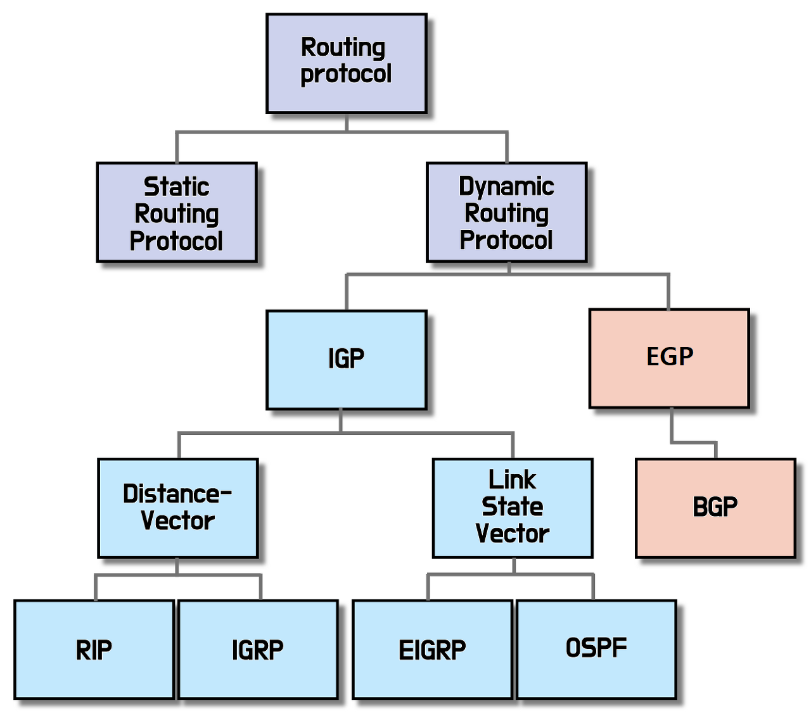
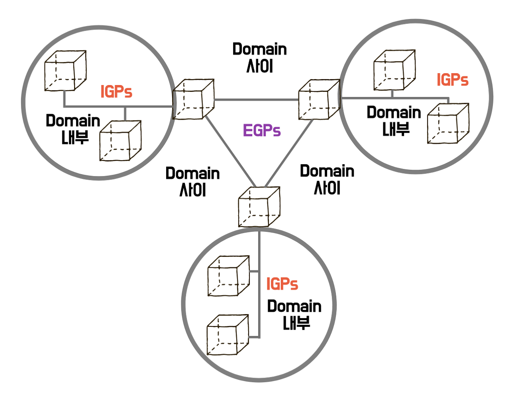

# Router

### Router
- 패킷의 위치를 추출하여 그 위치에 대한 최적의 경로를 지정하며, 이 경로를 따라 데이터 패킷을 다음 장치로 전향시키는 장치
- 라우터는 이름 그대로 네트워크와 네트워크 간의 경로(Route)를 설정하고 가장 빠른 길로 트래픽을 이끌어주는 3계층 네트워크 장비
- 라우터는 계층구조를 가지며 라우터는 외부 라우터와 내부 라우터로 나눌 수 있음. 내부 라우터는 라우팅 정보를 공유하는 특정 지역 내의 라우터. 외부 라우터는 내부 라우터가 다른 지역의 네트워크와 통신할 때 게이트웨이 역할을 하는 라우터
- 라우터의 대표적인 기능은 네트워크와 네트워크를 연결하는 것이지만, NAT(Network Address Translation), 방화벽, VPN(Virtual Private Network), Qos(Quality of Service)등 다양한 부가 기능을 함께 제공하기도 함
- 패킷을 읽어 어느 네트워크로 전송할지 판단하는 처리를 라우팅(Routing, 경로제어)이라고 하며, 경로가 결정되면 해당 경로로 데이터 패킷을 넘겨주는 것을 스위칭(switching)이라고함. 
- L3 스위치가 라우터 역할을 하기도 함

<br>

### 라우팅 테이블
- 라우팅 테이블은 경로에 대해 지도 정보를 유지하는데. 패킷을 보낼 곳을 판단할 때 필요한 정보. 
- 지도 정보가 RAM에 유지되기 때문에 전원이 꺼지면 정보가 소실되기 때문에 라우팅 프로토콜의 가장 중요한 목적이 바로 라우팅 테이블의 구성
- 라우팅 테이블은 4가지를 가지고 있음
    - 목적지의 네트워크 주소 (Destination Address)
    - 목적지의 네트워크로 패킷을 보내기 위한 자신의 인터페이스
    - 목적지의 네트워크에 패킷을 보낼 때의 다음 경로 주소
    - 목적지의 최적 경로를 선택하기 위한 값

<br>

### AS (Autonomous System, 자율적 시스템)
- 인터넷에서 동일한 관리자에 의해 여러 내부 라우팅 프로토콜을 동일한 정책을 통해 관리되는 라우터들과 서브네트워크 들의 집합. 즉 하나의 네트워크 관리자에 의해 관리되는 라우터의 집단
- 한 회사, 기업, 단체의 전산망, 크게보면 ISP 등을 말하는데 하나의 관리 통제하에 있는 영역
- 네트워크는 AS에 의해 분리되어야함. 라우팅 정책의 독립성, 보안유지, 고장 및 오류의 국지화, 라우팅 트래픽양의 최소화 등을 하기 위함
- 라우터가 가진 정보를 효율적으로 관리. 인터넷 서비스를 좀 더 간편하게 사용

<br>



<br>

### 라우팅 유형 (Static / Dynamic)
#### 정적 라우팅 ( Static Routing ) 
- 관리자가 수동으로 라우팅 정보를 설정. 라우터는 오직 관리자가 지정한 대로 데이터를 전송
- 이에 해당 경로에 장애가 생겼을 경우, 우회 경로를 자동으로 선택할 수 없음
- 지정해 놓은대로만 전송하기 때문에 동적 라우팅에 비해 속도가 빠르고 성능이 좋음
- 자신의 정보를 알리지 않기 때문에 보안에 강함(라우팅 테이블 교환하지 않음)
- 라우터의 수가 많아질수록, 복잡해지고 장애 대처와 관리가 어려움
- 소규모로 검증할 경우 불필요한 패킷 발생을 방지하기 위해 정적 라우팅을 이용

#### 동적 라우팅 ( Dynamic Routing )
- 라우터가 동적으로 경로를 찾아가는 라우팅
- 관리자가 일일이 경로를 입력하지 않아도 라우터가 경로를 찾아감
- 어떤 경로에 장애가 생겼을 경우 우회 경로를 자동으로 선택하기 때문에 장애 대처와 관리가 쉬워짐
- 라우팅 테이블을 라우터 간에 계속 업데이트하며 교환하기 때문에 라우터의 부담이 큼
- 이러한 운영 관리 측면 장점으로 동적 라우팅을 이용하는 네트워크가 압도적으로 많음

<br>

### 라우팅 프로토콜
- 라우팅 프로토콜은 라우터 간의 경로 정보(라우팅 테이블) 교환에 사용되는 프로토콜
- 라우팅 프로토콜은 크게 EGP와 IGP로 구분됨



<br>

#### EGP ( Exterior Gateway Protocol )
- AS 간의 경로 정보를 교환하기 위한 프로토콜
- 외부 AS 통신 프로토콜
- 주로 BGP (Border Gateway Protocol) 사용
    BGP 
        - 대규모 네트워크에 대응하도록 설계. 
        - EGP의 단점을 보완하기 위해 개발. 최근은 BGP4를 사용
        - 인접한 라우터끼리 라우팅 정보를 학습하는 <code>distance vector</code> 알고리즘 사용
        - BGP로 동작하는 라우터는 대부분 고가.
#### IGP ( Interior Gateway Protocol )
- AS 내부에서 이용되는 프로토콜.
- IGP에서 주로 RIP, OSPF, EIGRP 사용
    1. RIP ( Routing Infomation Protocol )
        - 홉 수 (목적네트워크까지의 라우터 수)를 기준으로 경로를 선택하는 프로토콜로, <code>distance vector</code>형 프로토콜이라고도 불림.
        - 구현이 쉬워 자주 이용되었으나 루핑(Looping)등의 문제로 OSPF나 EIGRP를 채용하는 사례 증가
    2. OSRP ( Open Shortest Path First )
        - RIP로는 실현할 수 없는 빠른 경로 전환과 경로의 대역폭을 고려한 경로 선택 등이 가능하고 멀티 벤더도 가능.
        - 대규모 네트워크를 지원할 수 있는 프로토콜로 <code>link state</code>형 프로토콜로 불림
        - 한 라우터가 모든 경로 정보를 토폴로지 데이터베이스화 하여 가지고 있음. 토폴로지 베이스를 SPF(최단 경로 우선) 알고리즘을 통해 가장 빠른 경로를 찾음
        - 모든 라우팅 정보를 가지고 있고 이 중 변경된 부분만 교환하기 때문에 디스턴스 벡터 방식에 비해 트래픽 발생이 적고 CPU 부담이 큼
    3. EIGRP ( Enhanced Interior Gateway Routing Protocol )
        - Cisco의 <code>IGRP</code>를 개량한 프로토콜로, 경로 선택을 복수의 요소로 결정하며 경로를 전환할 수 있음.
        - 링크 스테이트와 디스턴스 벡터의 성질을 모두 갖추고 있어, 하이브리드형이나 확장 디스턴스 벡터형으로 불림
        - 소~대규모 네트워크를 지원할 수 있고, 허브나 스포크형 대규모 네트워크에 적합.
        - Sisco 독자 프로토콜로 Cisco 온리 네트워크 안에서 구현되는 일이 많다고 함

```
Router 알고리즘

Distance Vector
    - 거리에 따른 경로 설정 방식. 거리에 따른 메트릭(metric)값의 크기를 이용하여 경로를 결정
    - 거리와 방향을 고려. 
    - 목적지까지의 거리와 목적지 까지 가기위해 거쳐갈 인접 라우터만 저장. 
    - 인접 라우터끼리만 주기적으로 라우팅 테이블을 교환하여 라우팅 테이블 관리
    - Looping 발생 가능 -> Looping이란 프레임이 네트워크 상에서 무한정으로 빙빙 돌아 이더넷의 특성상 네트워크가 잠잠해질 때까지 기다리고 데이터 전송이 불가능해지는 상태
    - distance-거리, vector-크기
    - 디스턴스 벡터의 종류로는 RIP, EIGRP,BGP 등이 있음. 해당 프로토콜들은 인접 라우터들에게 자신을 통하면 특정 네트워크까지 가는 메트릭 값이 얼마인지 광고
    - 디스턴스 벡터 프로토콜은 인접 라우터들에게만 정봉를 알려주어 라우터 입장에서는 전체적인 네트워크 구성을 알지 못하고 어떤 포트로 가면 목적지 네트워크의 메트릭이 얼마인지만 알고있음
    - 경로를 결정할 때 경로가 여러곳이라면 가장 낮은 메트릭 값을 경로로 결정

Link State
    - 라우터에 접속되어있는 네트워크정보 라우터와 인접한 라우터 정보들을 광고
    - 전체적인 구성을 파악하고 지도를 보며 찾아가는 방식으로 하나의 라우터가 목적지까지의 모든 경로를 알고 있음
    - 링크 스테이트는 경로 정보에 대한 데이터베이스를 가지고 SPF(우선경로탐색)알고리즘로 가장 빠른 경로를 찾음
    - 해당 SPF를 가지고 SPF 트리를 만들어 사용. 해당 트리는 가장 빠른 경로를 찾아가는 방식으로 해당 트리를 이용해 라우팅 테이블을 만듬
    - 링크 스테이트의 종류로는 OSPF가 존재
    - 한 라우터가 모든 정보를 알고있어 링크의 변화를 알아채는데 걸리는 시간이 짧고 라우터끼리의 교환이 자주 발생하지 않아 트래픽 발생 감소
    - 그만큼 메모리 소모가 많고 CPU 부담이 큼


IGRP ( Interior Gateway Routing Protocol)
    - Sisco 에서 발명한 거리 벡터 내부 게이트웨이 라우팅 프로토콜. 
    - 인접한 게이트웨이와 라우팅 정보를 교환하여 게이트웨이 간의 동기화된 라우팅 프로세스를 가능하게 함. 라우팅 정보에는 네트워크에 대한 자세한 정보가 들어있음
    - IGRP는 사유 프로토콜으로 대형망에서 사용할 때 RIP의 제약인 15홉, 하나의 라우팅 메트릭을 부분적으로 극복할 목적으로 만들어졌으나 라우팅 루프 문제가 발생하여 피하기 위해 특정 변경이 발생할 때 새로 생성된 데이터를 무시 -> IGRP를 개선하여 EIGRP 개발
```


<br>

<div style="text-align: right">22-07-25</div>

-------

## Reference
- https://velog.io/@ette9844/Network-라우터의-기능과-구조
- https://choidev-1.tistory.com/28
- https://puzzle-puzzle.tistory.com/entry/네트워크-용어-라우터란-Router
- https://facelight.tistory.com/35