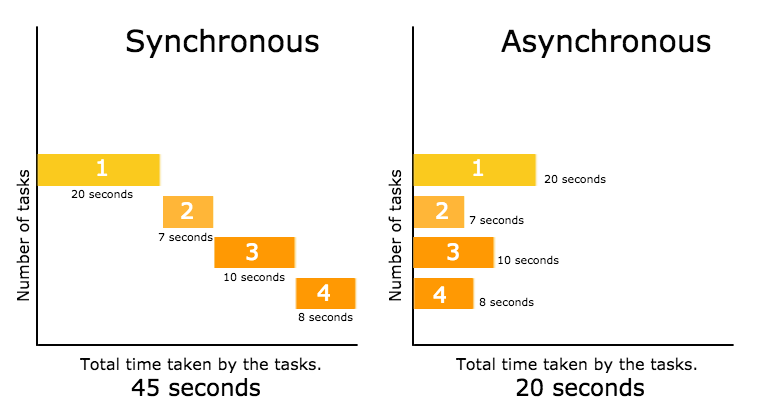
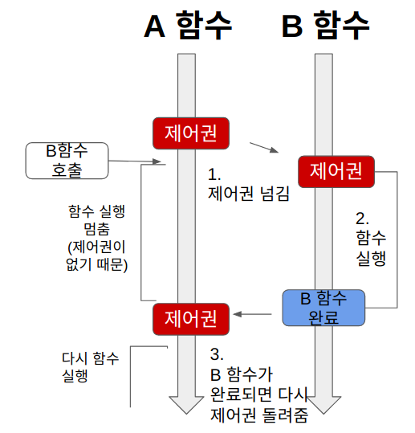
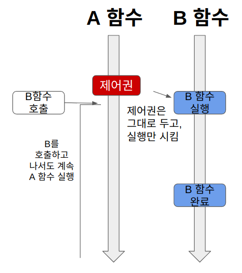

# Synchronous vs Asynchronous



<br>

### 동기 (synchronous)
- 동기는 데이터의 요청과 결과가 한 자리에서 동시에 일어나는 것을 말함
- 요청을 하면 시간이 얼마나 걸리던지 요청한 자리에서 결과가 주어져야 함
- 작업 완료 여부를 계속해서 확인
- 사용자가 데이터를 서버에게 요청한다면 그 서버가 데이터 요청에 따른 응답을 사용자에게 다시 리턴해주기 전까지 사용자는 다른 활동을 할 수 없으며 기다려야 함
- 순서에 맞춰 진행되지만, 여러 가지 요청을 동시에 처리할 수 없음
- 설계가 매우 간단하고 직관적이지만, 결과가 주어질 때 까지 아무것도 못하고 대기해야 함

>#### 동기화 (Synchronization) 란?
>- 우선 동기(Synchronous)는 형용사로 정확히 같은 시간에 발생, 존재하는 것인데 Synchronization은 Synchronous한 상태라고 한다.
>- 동기와 동기화는 근본적으로는 같은말이나 두 단어가 한국어로 변형되어 다른 뜻이 되는것은 번역과정의 표현이 어려움
>- 작업이 끝남과 동시에 같은 상태가 되는 것 ( 동시에 작동시키기 위해 서로의 상태를 일치 시키는 것 )이 Synchronus한 상태가 되는 것이며 이것을 동기화라 한다.

<br>

### 비동기 (Asynchronous)
- 비동기는 동시에 일어나지 않음을 의미
- 요청과 결과가 동시에 일어나지 않는다. 즉 하나의 요청에 따른 응답을 즉시 처리하지 않아도그 대기 시간동안 또 다른 요청에 대해 처리가 가능한 방식
- 작업 완료 여부를 확인하지 않음
- 서버에게 데이터를 요청한 후 요청에 따른 응답을 계속 기다리지 않아도 되며 다른 외부 활동을 수행하여도되고 서버에게 다른 요청사항을 보내도 상관없음.
- 작업 완료 여부를 확인하지 않아 다른 함수를 호출할때 <code>콜백 함수</code>를 함께 전달하여 호출한 함수의 작업이 완료되면 보낸 콜백 함수 실행
- 여러 개의 요청을 동시에 처리할 수 있는 장점이 있지만 동기 방식보다 속도가 떨어질 수도 있음
- 동기보다 복잡하지만 결과가 주어지는데 시간이 걸리더라도 그 시간 동안 작업을 할 수 있으므로 자원을 효율적으로 사용할 수 있는 장점이 있음

```
콜백함수(callback) 
- 어떤 함수를 실행시키고 난 이후에 결과를 받을 함수 또는 그 다음에 실행될 함수를 의미. 
- 주로 특정 함수에 매개변수로 함수를 전달하여 콜백함수를 전달 받은 함수 내에서 콜백함수가 실행됨
- 상황에 따라 어떤 작업이 끝났다는 것을 사용자에게 알려주거나 코드 내부에서 콜백함수를 받았을 경우에만 처리하는 로직을 짤 수 있음.

```


<br>

## 블로킹(Blocking)과 논블로킹(Non-Blocking)

<br>

### 블로킹과 논블로킹
- 블로킹/논블로킹은 주로 멀티 스레딩, I/O 등에서 사용되는 개념이며, 합수의 리턴 시점과 제어권에 따라 차이가 남
- 동기와 비동기는 프로세스의 수행 순서 보장에 대한 매커니즘이고 블로킹과 논블로킹은 프로세스의 유휴 상태에 대한 개념으로 다른 곳에 초점을 둠.
- 동기와 비동기 / 블로킹과 논블로킹의 구분은 함수의 작업 완료 여부를 기다리는 것과 제어권을 통해 구분
>- 제어권
>   - 제어권은 자신(함수)의 코드를 실행할 권리 같은 것. 제어권을 가진 함수는 자신의 코드를 끝까지 실행한 후, 자신을 호출한 함수에게 돌려준다
>- 작업 완료 여부 대기
>   - A 함수에서 B함수를 호출했을 때, A 함수가 B 함수의 결과값을 기다리느냐의 여부를 의미

<br>



### 블로킹(Blocking)
- 제어권이 호출된 함수에게 넘어가서 호출된 함수 내에서 작업이 모두 끝난 후 호출한 함수에게 다시 제어권이 넘어옴
- 작업이 완료된 후 새로운 작업을 수행할 수 있음

<br>

> 동작순서
>1. A함수가 B함수를 호출하면 B에게 제어권을 넘긴다.
>
>2. 제어권을 넘겨받은 B는 열심히 함수를 실행한다. A는 B에게 제어권을 넘겨주었기 때문에 함수 실행을 잠시 멈춘다.
>3. B함수는 실행이 끝나면 자신을 호출한 A에게 제어권을 돌려준다.

<br>



### 논블로킹(Non-Blocking)
- 제어권이 계속 호출한 함수에 있기 때문에 작업의 완료여부와 관계없이 새로운 작업을 수행할 수 있음.

<br>

> 동작순서
>1. A함수가 B함수를 호출하면, B 함수는 실행되지만, 제어권은 A 함수가 그대로 가지고 있는다.
>
>2. A함수는 계속 제어권을 가지고 있기 때문에 B함수를 호출한 이후에도 자신의 코드를 계속 실행한다.

<br>

### 동기-비동기 | 블로킹-논블로킹

<br>


#### 1. Sync-Blocking
- 함수 A는 함수 B의 리턴값을 필요로 한다 (동기)
- 그래서 제어권을 함수 B에게 넘겨주고, 함수 B가 실행을 완료하여 리턴값과 제어권을 돌려줄때까지 기다린다 (블로킹)

<br>

#### 2. Sync-NonBlocking
- 함수 A는 B함수를 호출하는데 A 함수는 B 함수에게 제어권을 주지 않고, 자신의 코드를 계속 실행한다 (논블로킹).
- 그런데 A 함수는 B 함수의 리턴값이 필요하기 때문에, 중간중간 B 함수에게 함수 실행을 완료했는지 물어본다 (동기)

<br>

#### 3. Async-NonBlocking
- A 함수는 B 함수를 호출하는데 제어권을 B 함수에 주지 않고, 자신이 계속 가지고 있는다. 따라서 B 함수를 호출한 이후에도 멈추지 않고 자신의 코드를 계속 실행한다. (논블로킹)
- 그리고 B 함수를 호출할 때 콜백함수를 함께 준다. B 함수는 자신의 작업이 끝나면 A 함수가 준 콜백 함수를 실행한다 (비동기)

<br>

#### 4. Async-Blocking
- A 함수는 B 함수의 리턴값에 신경쓰지 않고, 콜백함수를 보낸다 (비동기).
- 그런데, B 함수의 작업에 관심없음에도 불구하고, A 함수는 B 함수에게 제어권을 넘긴다 (블로킹).
- 따라서, A 함수는 자신과 관련 없는 B 함수의 작업이 끝날 때까지 기다려야 한다.
- Async-Blocking은 Sync-Blocking과 성능의 차이가 거의 없어 사용하는 경우도 거의 없음

<br>

<div style="text-align: right">22-06-28</div>

-------

## Reference
- https://dev-coco.tistory.com/46
- https://evan-moon.github.io/2019/09/19/sync-async-blocking-non-blocking/#동기-방식--논블록킹-방식
- https://velog.io/@nittre/블로킹-Vs.-논블로킹-동기-Vs.-비동기
- https://inpa.tistory.com/entry/👩%E2%80%8D💻-동기비동기-블로킹논블로킹-개념-정리