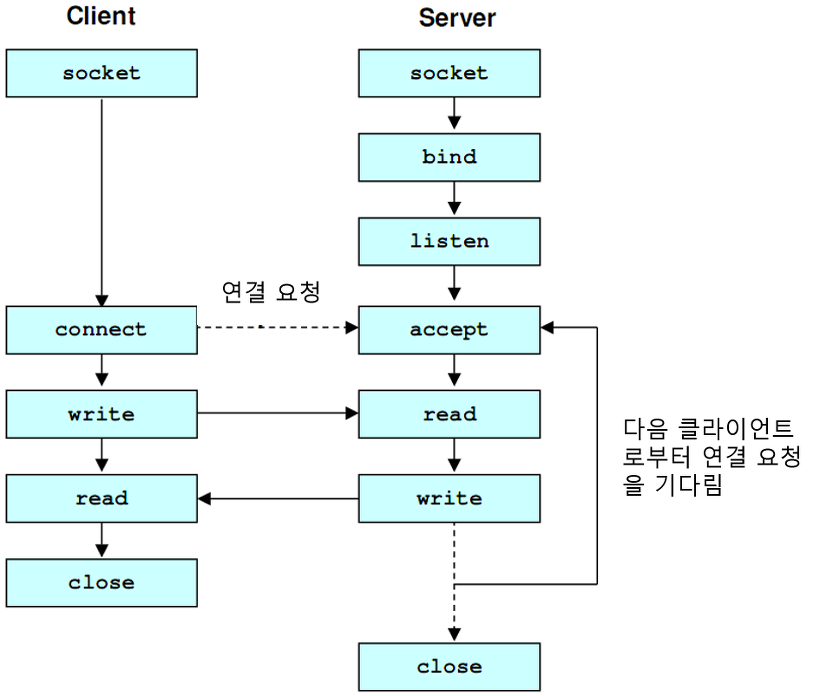

# TCP / UDP

### TCP/UDP 이란?

>- 전송계층에서 사용되는 프로토콜 TCP/UDP
>- 전송계층은 송신자와 수신자를 연결하는 통신 서비스를 제공하고 IP에 의해 전달되는 패킷의 오류를 검사, 재전송 요구 제어등을 담당하는 계층
>- TCP와 UDP는 모두 포트 번호를 이용하여 주소를 지정하고 데이터 오류검사를 위한 체크섬을 이용한 데이터 전달 역할을 하지만 정확성(TCP)을 추구하느냐와 신속성(UDP)를 추구하느냐의 차이가 있다

  

 

### TCP ( Trasmission Control Protocol )
>- 연결지향적 프로토콜, 클라이언트와 서버가 연결된 상태에서 IP와 함께 사용하여 데이터를 주고받는 프로토콜.
>- 클라이언트가 연결요청(SYN 데이터 전송)을 하고, 서버가 연결을 수락하면 통신 선로가 고정, 모든 데이터는 고정된 통신 선로를 통해 순차적으로 전달하기 때문에 TCP는 데이터를 정확하고 안정적으로 전달 가능 ( 3-way-handshake 방식 )
>- 연결형 서비스로 가상 회선 방식을 제공
>- 3-way-handshaking 과정을 통해 연결을 설정하고 4-way-handshaking을 통해 해제
>- 흐름 제어 및 혼잡 제어 기능. 해당 기능의 영향으로 UDP보다 속도가 느림
>- 높은 신뢰성을 보장
>- 전이중(Full-Duplex), 점대점(Point to Point) 방식
 

### TCP Server
>- 서버소켓은 연결만을 담당
>- 연결과정에서 반환된 클라이언트 소켓은 데이터의 송수신에 사용된다. 가상 회선 방식을 제공
>- 서버와 클라이언트는 1대1로 연결
>- 스트림 전송으로 전송 데이터의 크기가 무제한
>- 패킷에 대한 응답을 해야하기 때문에 (시간지연, CPU소모) 성능이 낮음
>- Streaming 서비스에 불리 ( 손실된 경우 재전송 요청을 하기 때문에 )

 

### UDP ( User Datagram Protocol )
>- 데이터를 데이터 그램 단위로 처리하는 프로토콜
>- 비연결형 프로토콜으로 데이터그램 방식을 제공
>- 연결을 위해 할당되는 논리적 경로가 없어 각각의 패킷은 다른 경로에 전송되고 각각의 패킷은 독립적인 관계를 지니게 되는데 이렇게 데이터를 서로 다른 경로로 독립적으로 처리하는 프로토콜
>- 정보를 주고 받을 때 정보를 보내거나 받는다는 신호절차를 거치지 않음
>- UDP헤더의 CheckSum 필드를 통해 최소한의 오류만 검출. 패킷 관리가 필요
>- 패킷 오버헤드가 적어 네트워크 부하가 감소
>- 신뢰성이 낮고 TCP보다 속도가 빠름

 

### UDP Server
>- UDP에는 연결 자체가 없어서 서버소켓과 클라이언트 소켓의 구분이 없음
>- 소켓 대신 IP 기반으로 데이터를 전송
>- 서버와 클라이언트는 1대1, 1대N, N대N 등으로 연결될 수 있음
>- 데이터그램(메세지) 단위로 전송되며 크기는 65535바이트로 크기가 초과하면 잘라서 보냄
>- 흐름제어가 없어서 패킷이 제대로 전송되었는지, 오류가 없는지 확인 가능
>- 파일 전송과 같은 신뢰성이 필요한 서비스보다 성능이 중요시 되는 경우 사용

  

 

### \* 3way-hand-shake 방식 (STN, ACK)?
>- TCP 통신을 위한 네트워크 연결 방식
>- 서로의 통신을 위한 관문을 확인하고 연결하기 위하여 3번의 요청/응답 후에 연결이 되는 것. 해당 과정에서 UDP 보다 느려지는 주 원인
>>- 동작 과정
>>1) Client에서 Server에 연결 요청을 하기 위해 SYN 데이터를 전송
>>2) Server에서 해당 포트는 LISTEN 상태에서 SYN 데이터를 받고 SYN_RCV로 상태가 변경됨
>>3) 이후 요청을 정상적으로 받았다는 대답(ACK)와 Client도 포트를 열어달라는 SYN을 같이 보냄
>>4) Client에서는 SYN+ACK를 받고 ESTABLISHED로 상태를 변경하고 서버에 ACK를 전송
>>5) ACK를 받은 서버는 상태가 ESTABLSHED로 변경 

 

### \* 흐름제어(Flow Control), 혼잡제어(Congestion Control) 란?
>1) 흐름제어 
>>- 흐름제어는 데이터를 송신하는 곳과 수신하는 곳의 데이터 처리 속도를 조절하여 수신자의 버퍼 오버플로우를 방지하는 것.
>>- 송신하는 곳에서 감당할수 있도록 데이터 처리 속도 조절.
>2) 혼잡제어 
>>- 혼잡제어는 네트워크 내의 패킷 수가 넘치게 증가하지 않도록 방지하는 것.
>>- 정보의 소통량이 과다하면 패킷을 조금만 전송하여 혼잡 붕괴 현상을 막음

 

### TCP FLOW

 

 

### UDP FLOW

 

22-06-16

-------

## Reference
- https://coding-factory.tistory.com/614
- https://mangkyu.tistory.com/15 

