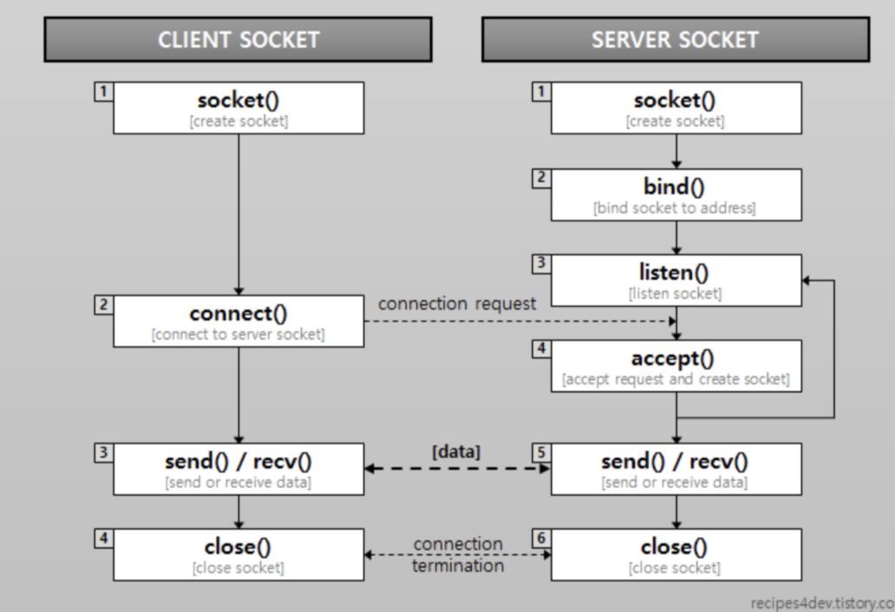

# Socket

### Socket
- 프로그램이 네트워크에서 데이터를 주고받을 수 있도록 네트워크 환경에 연결할 수 있게 만들어진 연결부
    - IP/TCP 전송 계층에서 주로 사용되며 프로토콜 제어
- 네트워크를 통해 데이터를 송수신하기 위한 엔드포인트(Endpoint)로 소프트웨어적으로는 프로그래밍에서 네트워크 통신을 구현하기 위한 인터페이스
- 소켓은 IP 주소와 포트 번호로 구성되며, 네트워크 상의 특정 컴퓨터의 특정 서비스로 데이터를 주고받을 수 있게 함
    - IP와 Port를 통해 소켓을 찾아 연결하고 데이터를 송수신
- 즉, 소켓은 엔드포인트에 각각 생성되고 클라이언트는 연결 요청을 전송하고 서버는 요청을 수락하여 커넥션을 유지하여 서로 데이터를 주고 받음

<br>

### Client Socket, Server Socket
- 통신 연결 요청을 받아들이는 Server Socket
    - 서버는 클라이언트의 연결 요청을 대기하기 위해 소켓을 생성하고 서버내의 특정 포트에 바인딩함
    - 네트워크 상에서 클라이언트의 연결 요청을 기다리고, 이를 수락하여 클라이언트와의 통신을 시작
- 통신 연결 요청을 보내는 Client Socket
    - 서버에 연결 요청을 보내고, 서버와의 연결이 성립되면 데이터를 주고받는 역할
- 처음 생성된 소켓은 아직 연결되지 않은 상태의 빈 소켓이고, 연결이 수립되면 소켓은 요청 측과 응답 측의 IP 주소와 포트 번호를 포함하여 통신에 필요한 정보를 가지고 있음

<br>



### 클라이언트 소켓 동작 흐름
1. 연결 대상에 대한 정보가 들어있지 않은 Socket(비어있는 소켓)을 생성 (socket())
    - 이 때 소켓의 종류를 선택해야하는데 TCP 소켓을 위해선 stream 타입을, UDP 소켓을 위해선 데이터그램 타입으로 지정이 가능
2. 연결 요청 (connect())
    - 연결하고 싶은 대상한테 연결 요청을 보낸다. IP주소와 서비스 포트 번호로 연결하고 싶은 타켓대상을 특정
    - 요청을 보내고 단순히 끝나는게 아니고, 그 요청에 대한 결과가 돌아와야만 Connect의 실행 종료
3. 데이터의 송수신 (send(), recv())
    - 연결 요청 및 이후 전송요청에 대한 결과(신호)가 들어오면 실행
4. 소켓 닫기 (close())
    - 더 이상의 데이터 송수신이 없다고 판단되면 소켓을 닫음

```
- 송신할 때에는 데이터를 보내는 것이기 때문에 데이터를 언제 얼마나 보낼것인지 알수 있지만, 수신할 때에는 상대방이 언제, 얼만큼의 데이터를 보낼 것인지 알수가 없음
- 그렇기 때문에 수신하는 API는 별도의 Thread 나 비동기 I/O 처리를 사용
- 각 단계에서 발생할 수 있는 오류를 적절히 처리해야 함. 바인딩 오류, 연결 오류, 송수신 오류 등이 있음
```

<br>

### 서버 소켓 동작 흐름
1. 서버 소켓 생성 (socket())
    - 클라이언트 소켓과 마찬가지로 연결 대상에 대한 정보가 들어있지 않은 껍데기 소켓을 생성
2. 바인딩 (bind())
    - 우리는 컴퓨터를 사용할 때 매우 많은 서비스를 이용하므로 수많은 프로세스가 동시에 돌아가는데 프로세스들의 포트 번호가 동일하다면 혼란 야기 -> 운영체제에서는 소켓들이 중복된 포트 번호를 사용하지 않도록 내부적으로 포트 번호와 소켓 연결 정보를 관리
    - 서버 소켓이 고유한 포트 번호를 만들 수 있도록 소켓과 포트번호를 결합해주는 작업이 필요
    - 단 하나의 프로세스는 동일한 포트 번호를 가진 여러 개의 소켓을 결합 할 수 있음. 호스트가 하나의 Port로 여러 개의 Socket을 만들어 다른 호스트들과 데이터를 주고받을 수 있음
3. 클라이언트 연결 요청 대기 (listen())
    - 서버 소켓에서 포트번호와 바인딩 작업을 마치고 나면 클라이언트로부터의 연결 요청을 받아들일 준비가 된 것
    - 클라이언트가 연결 요청을 할 때까지 기다리다가 연결 요청이 오면 대기 상태를 종료하고 리턴
4. 클라이언트 연결 수립 (accept())
    - 연결 요청을 확인하고 서버 소켓은 연결 요청을 받아들임과 동시에 새로운 소켓을 생성
    - 서버 소켓의 메인 역할은 클라이언트 연결 요청을 기다리는 것. 클라이언트 소켓으로부터 연결 요청을 받으면 새로운 소켓을 열고, 이것과 클라이언트 소켓을 맵핑하여 넘겨줌
5. 데이터 송수신 (send(), recv())
    - 연결 요청 및 이후 전송요청에 대한 결과(신호)가 들어오면 실행
6. 소켓 닫기 (close())
    - 더 이상의 데이터 송수신이 없다고 판단되면 소켓을 닫음
    - 서버 소켓은 추가적으로 자신이 생성한 소켓들을 관리함

<br>

### Web Socket
- 웹 소켓은 HTTP처럼 요청과 응답의 형태로 이루어지지 않고, 양방향 통신을 통해 실시간으로 데이터를 주고받을 수 있는 통신 채널을 제공
- 소켓은 지속적인 통신을 통한 양방향 데이터 전송이 가능하지만 웹은 HTTP 기반으로 동작하기 때문에 해당 HTTP 특징이 존재 
    - 비연결성 (단방향)으로 매번 연결 맺고 끊는 과정의 비용 발생
    - request-response 의 구조에서 헤더의 비중이 너무 큼 → 실시간성으로 많은 데이터를 주고 받고자 하는 경우에는 매우 부담되는 요소
- 즉, TCP/IP 프로토콜을 사용하는 소켓처럼 계속 connection이 유지되는 실시간 통신을 할 수 없음. 이런 문제점을 해결하기 위해 나온것이 웹소켓 프로토콜
- 웹 소켓은 다음과 같은 성격을 가짐
    - 연결지향 (양방향)
    - 한 번 연결 맺은 뒤 유지
    - 핸드쉐이크 과정에서는 헤더의 비중이 크지만, 한번 연결이 되면 간단한 메시지들만 오고감

<br>

### HTTP 기반 웹 소켓이 양방향, 연결 지향을 지원한 방법
- 웹소켓은 HTTP를 통해 초기 연결을 설정한 후, 지속적인 데이터 스트림을 통해 양방향 통신을 지원
- 웹소켓 연결은 HTTP 요청을 통해 시작. 클라이언트는 HTTP Upgrade 헤더를 포함한 요청을 서버에 보냄
- 서버는 이 요청을 받아들이고, 응답 헤더에 101 Switching Protocols 상태 코드를 포함하여 웹소켓 프로토콜로 업그레이드됨
- 핸드셰이크가 완료되면, 클라이언트와 서버 간에 지속적인 연결이 유지됩니다. 이를 통해 양쪽 모두 언제든지 데이터를 전송할 수 있음
    - 웹소켓은 메시지를 프레임으로 구분하여 전송
- 웹소켓 연결은 클라이언트나 서버가 명시적으로 연결을 종료할 때까지 지속됨. HTTP의 요청-응답 모델과 달리, 지속적인 데이터 스트림을 가능하게 함
- 웹 소켓의 업그레이드 3-way handshake
    - 클라이언트 요청: 클라이언트는 서버에 웹소켓 연결을 요청하는 HTTP 요청을 보냄. 이 요청에는 Upgrade: websocket 헤더와 Sec-WebSocket-Key 등이 포함됨
    - 서버 응답: 서버는 이 요청을 처리하고, 연결을 수락하면 101 Switching Protocols 상태 코드와 함께 응답. 또한 Sec-WebSocket-Accept 헤더를 포함하여 웹소켓 키를 확인
    - 연결 설정: 서버의 응답을 받은 클라이언트는 웹소켓 연결이 성공적으로 설정되었음을 확인함. 이 후, 클라이언트와 서버는 HTTP가 아닌 웹소켓 프로토콜을 사용하여 데이터를 주고 받음

```http
GET /chat HTTP/1.1
Host: example.com
Upgrade: websocket
Connection: Upgrade
Sec-WebSocket-Key: dGhlIHNhbXBsZSBub25jZQ==
Sec-WebSocket-Version: 13

HTTP/1.1 101 Switching Protocols
Upgrade: websocket
Connection: Upgrade
Sec-WebSocket-Accept: s3pPLMBiTxaQ9kYGzzhZRbK+xOo=
```

<br>

## Ssafy Wizards CS Study

### 1. 소켓과 포트의 차이
- 소켓은 통신의 엔드포인트를 의미하고 해당 엔드포인트에서 데이터 전송 목적 연결을 위해 IP와 Port를 사용하여 연결
    - 소켓은 IP 주소와 포트 번호로 구성되어 특정 위치를 지정
    - 네트워크 상의 두 지점 간의 통신 경로를 제공
- 포트는 컴퓨터 안의 작업 공간이며 어플리케이션 각각 다른 포트에 들어가 동작
    - 각 애플리케이션은 고유한 포트를 사용
    - 특정 서버의 IP 안의 Port를 통해 어플리케이션 위치 특정 가능

<br>

### 2. 여러 소켓이 있다고 할 때, 그 소켓의 포트 번호는 모두 다른지
- 서버는 클라이언트 소켓의 연결 요청마다 새로운 소켓을 생성하고 해당 클라이언트 소켓들과 연결하므로 하나의 포트에서 여러 소켓이 존재가 가능
    - 하나의 서버 포트에서 여러 소켓이 존재할 수 있는데 서버 포트 내의 각 소켓이 서로 다른 클라이언트와의 연결을 나타내기 때문
    - 서버의 특정 포트에서 10개의 클라이언트와 동시에 연결된 경우 서버는 해당 포트를 통해 10개의 서로 다른 소켓을 관리. 각 소켓은 고유의 클라이언트 IP 주소와 클라이언트 포트 번호를 사용하여 식별
- 클라이언트가 서버에 연결을 요청할 때 클라이언트 소켓은 클라이언트 내부에서 임의의 포트 번호를 사용되고 

<br>

### 3. 사용자의 요청이 무수히 많아지면, 소켓도 무수히 생성되는지
- 사용자의 요청이 많아지면 서버는 각각의 요청에 대해 새로운 소켓을 생성하게 되는데 해당 경우 서버의 자원 한계에 도달하게 되어 여러 문제가 발생할 수 있음
    - 파일 디스크립터 한계: 운영체제는 소켓을 파일 디스크립터로 관리하는데, 파일 디스크립터의 수에는 한계가 있으므로 너무 많은 소켓이 생성되면 파일 디스크립터의 한계에 도달됨
    - 메모리 사용량 증가: 각 소켓은 메모리를 소비함. 많은 소켓이 생성되면 메모리 사용량이 증가하여 서버가 메모리 부족 상태에 이를 수 있음
    - CPU 부하 증가: 많은 소켓을 관리하고 처리하기 위해 CPU 부하가 증가할 수 있음
    - 네트워크 대역폭 한계: 네트워크 트래픽이 많아지면 대역폭 한계에 도달하게 되어 통신 속도가 느려질 수 있음
- 이를 해결하기 위해 서버에서는 여러 해결 방법이 존재
    - 연결 수 제한 : 서버는 동시에 처리할 수 있는 연결 수를 제한하여 자원 사용을 관리할 수 있음
    - 멀티스레딩 및 멀티프로세싱 :서버는 멀티스레딩이나 멀티프로세싱을 사용하여 여러 클라이언트 요청을 동시에 처리할 수 있음
    - 비동기 I/O : 비동기 I/O를 사용하여 효율적으로 많은 요청을 처리할 수 있음
    - 로드 밸런싱 : 여러 서버를 사용하고 로드 밸런서를 사용하여 들어오는 요청을 여러 서버로 분산시켜 처리
    - 연결 풀링 : 자주 사용하는 연결을 재사용하여 소켓 생성 비용을 줄임

<br>

### 4. 소켓과 웹 소켓의 차이
- 소켓은 TCP/IP 전송 계층에서의 지속적인 양방향 통신 방법
    - TCP/UDP 를 사용
    - 일반적인 네트워크 애플리케이션, 예를 들어 파일 전송, 원격 제어, 채팅 애플리케이션 등에서 사용
- 웹 소켓은 업그레이드된 HTTP 헤더를 통해 초기 연결만 HTTP 를 사용하고 이후 웹 소켓 프로토콜을 통해 지속적인 양방향 통신
    - 초기 연결 설정을 위해 HTTP를 사용하고, 연결이 설정된 후에는 웹소켓 프로토콜을 사용
    - 실시간 웹 애플리케이션, 예를 들어 실시간 채팅, 실시간 게임, 실시간 업데이트가 필요한 대시보드 등에서 사용
- 두 통신 방법은 서로 다른 계층에서 동작함
    - TCP/IP 4계층 전송 계층
    - 웹 소켓 7계층 응용 계층

<br>

### Reference
- https://velog.io/@rhdmstj17/소켓과-웹소켓-한-번에-정리-1
- https://velog.io/@rhdmstj17/소켓과-웹소켓-한-번에-정리-2