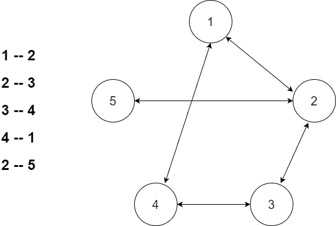
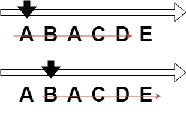

# BAEKJOON_G5_13023_ABCDE

### 문제 사항

- BOJ 알고리즘 캠프에는 총 N명이 참가하고 있다. 사람들은 0번부터 N-1번으로 번호가 매겨져 있고, 일부 사람들은 친구이다.
- 오늘은 다음과 같은 친구 관계를 가진 사람 A, B, C, D, E가 존재하는지 구해보려고 한다.

```
A는 B와 친구다.
B는 C와 친구다.
C는 D와 친구다.
D는 E와 친구다.
```
- 위와 같은 친구 관계가 존재하는지 안하는지 구하는 프로그램을 작성하시오.

<br>

### 입력
- 첫째 줄에 사람의 수 N (5 ≤ N ≤ 2000)과 친구 관계의 수 M (1 ≤ M ≤ 2000)이 주어진다.
- 둘째 줄부터 M개의 줄에는 정수 a와 b가 주어지며, a와 b가 친구라는 뜻이다. (0 ≤ a, b ≤ N-1, a ≠ b) 같은 친구 관계가 두 번 이상 주어지는 경우는 없다.

<br>

### 출력
- 문제의 조건에 맞는 A, B, C, D, E가 존재하면 1을 없으면 0을 출력

<br>



<br>



<br>

### 생각해봐야하는 부분
- 사람의 수 N (5 ≤ N ≤ 2000) 이므로 배열에 넣기에는 매우 많은 데이터가 필요
    - 모든 배열을 채우고 탐색할 필요가 없으므로 인접리스트를 통해 값이 있는 리스트만 사용
- 연속되어야 하므로 연결되어 있는 노드를 탐색해야하고 이미 방문했던 노드는 연속되지 않으며 다른 노드에서 탐색하는 경로로 사용하므로 필요 없음
- 해당 연속되는 관계가 존재하는지 확인만 하면 되므로 한번 확인했다면 이후 노드들은 탐색할 필요가 없음

<br>

### 구현 코드

```java
import java.io.BufferedReader;
import java.io.IOException;
import java.io.InputStreamReader;
import java.util.ArrayList;
import java.util.List;
import java.util.StringTokenizer;

public class Main {
	
	public static void main(String[] args) throws IOException {
		new Main().solution();
	}
	
	int N, M;
	List<List<Integer>> list = new ArrayList<>();
	boolean[] visited;
	boolean result;
	
	private void solution() throws IOException {
		BufferedReader br = new BufferedReader(new InputStreamReader(System.in));
		StringTokenizer st = new StringTokenizer(br.readLine());
		
		N = Integer.parseInt(st.nextToken());
		M = Integer.parseInt(st.nextToken());
		visited = new boolean[N];
		
		for(int i = 0; i < N; i++) {    // N-1 번 노드까지 리스트를 생성
			list.add(new ArrayList<>());
		}
		
		
		for(int t = 0; t < M; t ++) {
			st = new StringTokenizer(br.readLine());
			int from = Integer.parseInt(st.nextToken());
			int to = Integer.parseInt(st.nextToken());
			
            // 양방향이므로 양쪽 노드에 연결
			list.get(from).add(to);
			list.get(to).add(from);
		}
		
		for(int i = 0; i < list.size(); i++) {
			dfs(i, 0);
			if(result) {
				break;
			}
		}
		
		System.out.println(result ? 1 : 0);
	}

	private void dfs(int startNode, int cnt) {
        // 여러 사람이 있고 그 중 5명이 연속으로 있는 경우가 있어야 한다 <- depth 4
        // 또한 이미 5개가 연속인 경우가 확인됬다면 종료
		if(cnt == 4 || result == true) {
			result = true;
			return;
		}
		
        // 해당 노드는 도달했으므로 방문 기록
		visited[startNode] = true;

        // 해당 노드와 연결된 노드 리스트 가져오기
		List<Integer> fromList = list.get(startNode);
		for(int from : fromList) {
			if(!visited[from]) {
				dfs(from, cnt + 1);
			}
		}

        // 현재 방문할 노드가 없으므로 해당 재귀 종료 및 백트래킹
		visited[startNode] = false;
	}
}

```