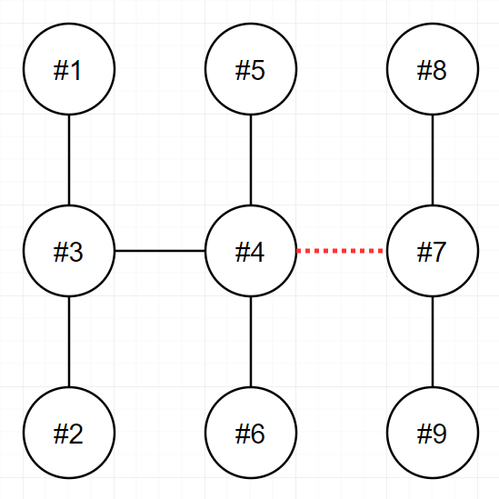

# 전력망을 둘로 나누기

### 문제 설명
- n개의 송전탑이 전선을 통해 하나의 트리 형태로 연결되어 있습니다. 당신은 이 전선들 중 하나를 끊어서 현재의 전력망 네트워크를 2개로 분할하려고 합니다. 이때, 두 전력망이 갖게 되는 송전탑의 개수를 최대한 비슷하게 맞추고자 합니다.
- 송전탑의 개수 n, 그리고 전선 정보 wires가 매개변수로 주어집니다. 전선들 중 하나를 끊어서 송전탑 개수가 가능한 비슷하도록 두 전력망으로 나누었을 때, 두 전력망이 가지고 있는 송전탑 개수의 차이(절대값)를 return 하도록 solution 함수를 완성해주세요.

<br>

### 제한사항
 - n은 2 이상 100 이하인 자연수입니다.
- wires는 길이가 n-1인 정수형 2차원 배열입니다.
- wires의 각 원소는 [v1, v2] 2개의 자연수로 이루어져 있으며, 이는 전력망의 v1번 송전탑과 v2번 송전탑이 전선으로 연결되어 있다는 것을 의미합니다.
- 1 ≤ v1 < v2 ≤ n 입니다.
- 전력망 네트워크가 하나의 트리 형태가 아닌 경우는 입력으로 주어지지 않습니다.

<br>

### 입출력 예
|n|wires|result|
|:---:|:---:|
|9|[[1,3],[2,3],[3,4],[4,5],[4,6],[4,7],[7,8],[7,9]]|3|

<br>



### 입출력 예 설명
- 4번과 7번을 연결하는 전선을 끊으면 두 전력망은 각 6개와 3개의 송전탑을 가지며, 이보다 더 비슷한 개수로 전력망을 나눌 수 없습니다.
- 또 다른 방법으로는 3번과 4번을 연결하는 전선을 끊어도 최선의 정답을 도출할 수 있습니다.

<br>

## 풀이
### 첫번째 풀이
- 해당 풀이는 도저히 어떻게 해야할지 생각이 들지 않았음..
- 트리구조라고 한다면 그래프 탐색일 것 같은데 어떻게 해야 조회를 해야할지 생각이 들지 않음
- 그냥 wire를 하나씩 없애보고 연결되어 있는 최소 개수차이를 구해본다? (n의 최대 개수가 100개 뿐이니 가능할 것 같지만 두개를 어떻게 나눌지 구현하지 못하였음)
- 블로그를 참조해서 그대로 가져왔음..
- 아직 봐도 이해가 잘 되지 않는다

```java
import java.util.LinkedList;
import java.util.Queue;
class Solution {
    static int[][] arr;
    public int solution(int n, int[][] wires) {
        int answer = Integer.MAX_VALUE;

        // 인접 행렬 만들기
        arr = new int[n + 1][n + 1];
        for (int i = 0; i < wires.length; i++) {
            arr[wires[i][0]][wires[i][1]] = 1;
            arr[wires[i][1]][wires[i][0]] = 1;
        }

        // 선 하나씩 끊으면서 bfs 탐색
        for (int i = 0; i < wires.length; i++) {
            int left = wires[i][0];
            int right = wires[i][1];

            // 선 끊기
            arr[left][right] = 0;
            arr[right][left] = 0;

            // bfs
            answer = Math.min(answer, bfs(left, n));

            // 끊었던 선 복구
            arr[left][right] = 1;
            arr[right][left] = 1;
        }

        return answer;
    }
    // bfs 메서드
    static int bfs(int left, int n) {
        int cnt = 1;
        boolean[] visited = new boolean[n + 1];
        Queue<Integer> queue = new LinkedList<>();
        queue.add(left);

        while (!queue.isEmpty()) {
            int temp = queue.poll();
            visited[temp] = true;
            for (int i = 1; i < n + 1; i++) {
                if (arr[temp][i] == 1 && !visited[i]) {
                    queue.add(i);
                    cnt++;
                }
            }
        }
        // cnt와 n - cnt는 각각 연결된 전력망
        return Math.abs(cnt - (n - cnt));
    }
}
```

<br>

### 문제 링크
- https://school.programmers.co.kr/learn/courses/30/lessons/86971

<br>

## Reference
- https://rovictory.tistory.com/114