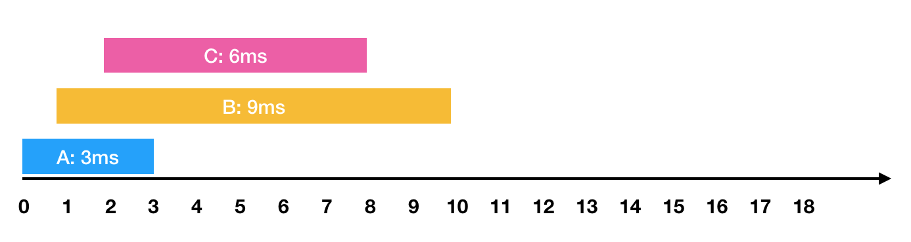
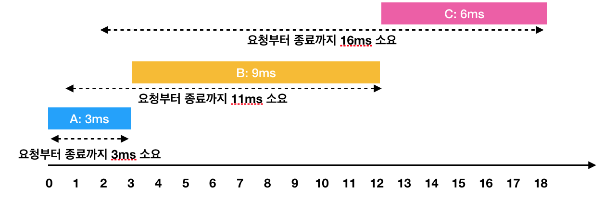

# 디스크 컨트롤러

### 문제 설명
- 하드디스크는 한 번에 하나의 작업만 수행할 수 있습니다. 
- 디스크 컨트롤러를 구현하는 방법은 여러 가지가 있습니다. 
- 가장 일반적인 방법은 요청이 들어온 순서대로 처리하는 것입니다.

```
예시 )

    - 0ms 시점에 3ms가 소요되는 A작업 요청
    - 1ms 시점에 9ms가 소요되는 B작업 요청
    - 2ms 시점에 6ms가 소요되는 C작업 요청
```

<br>



<br>



- 한 번에 하나의 요청만을 수행할 수 있기 때문에 각각의 작업을 요청받은 순서대로 처리하면 다음과 같이 처리 됩니다.

```
- A: 3ms 시점에 작업 완료 (요청에서 종료까지 : 3ms)
- B: 1ms부터 대기하다가, 3ms 시점에 작업을 시작해서 12ms 시점에 작업 완료(요청에서 종료까지 : 11ms)
- C: 2ms부터 대기하다가, 12ms 시점에 작업을 시작해서 18ms 시점에 작업 완료(요청에서 종료까지 : 16ms)
```
-  이 때 각 작업의 요청부터 종료까지 걸린 시간의 평균은 10ms(= (3 + 11 + 16) / 3)가 됩니다.

<br>


```
- A: 3ms 시점에 작업 완료(요청에서 종료까지 : 3ms)
- C: 2ms부터 대기하다가, 3ms 시점에 작업을 시작해서 9ms 시점에 작업 완료(요청에서 종료까지 : 7ms)
- B: 1ms부터 대기하다가, 9ms 시점에 작업을 시작해서 18ms 시점에 작업 완료(요청에서 종료까지 : 17ms)
```

- 하지만  A → C → B 순서대로 처리하면 각 작업의 요청부터 종료까지 걸린 시간의 평균은 9ms(= (3 + 7 + 17) / 3)가 됩니다.

- 각 작업에 대해 [작업이 요청되는 시점, 작업의 소요시간]을 담은 2차원 배열 jobs가 매개변수로 주어질 때, 작업의 요청부터 종료까지 걸린 시간의 평균을 가장 줄이는 방법으로 처리하면 평균이 얼마가 되는지 return 하도록 solution 함수를 작성해주세요. (단, 소수점 이하의 수는 버립니다)

<br>

### 제한 사항
- jobs의 길이는 1 이상 500 이하입니다.
- jobs의 각 행은 하나의 작업에 대한 [작업이 요청되는 시점, 작업의 소요시간] 입니다.
- 각 작업에 대해 작업이 요청되는 시간은 0 이상 1,000 이하입니다.
- 각 작업에 대해 작업의 소요시간은 1 이상 1,000 이하입니다.
- 하드디스크가 작업을 수행하고 있지 않을 때에는 먼저 요청이 들어온 작업부터 처리합니다.

<br>

### 입출력 예
|jobs|return|
|:---:|:---:|
|\[\[0, 3\], \[1, 9\], \[2, 6\]\]|9|

<br>

## 풀이

### 첫번째 풀이
- 우선 첫번째로 우선순위큐를 만들어서 어떻게 큐에 넣어줄지 판단해야함
- 우선 가장 먼저 jobs[i][0] 시점이 현재 시점과 맞는지 확인해야함
- 수행시간이 짧은 순서대로 정렬해두고 정렬해둔 시간을 큐에 넣어야 할것 같음
- 근데 도저히 못하겠음

<br>

### 두번째 풀이
- 모르곘어서 블로그를 확인해봤다
- 그대로 가져와 보았음
- 이후 다시 풀이해볼예정으로 프로그래머스 코드 제출을 하지 않았음

```java
import java.util.Arrays;
import java.util.PriorityQueue;

class Solution {

    public int solution(int[][] jobs) {

        int answer = 0;
        int end = 0; // 수행되고난 직후의 시간
        int jobsIdx = 0; // jobs 배열의 인덱스
        int count = 0; // 수행된 요청 갯수

        // 원본 배열 오름차순 정렬 (요청시간 오름차순)
        Arrays.sort(jobs, (o1, o2) -> o1[0] - o2[0]);

        // 처리 시간 오름차순으로 정렬되는 우선순위 큐(Heap)
        PriorityQueue<int[]> pq = new PriorityQueue<>((o1, o2) -> o1[1] - o2[1]);

        // 요청이 모두 수행될 때까지 반복
        while (count < jobs.length) {

            // 하나의 작업이 완료되는 시점(end)까지 들어온 모든 요청을 큐에 넣음
            while (jobsIdx < jobs.length && jobs[jobsIdx][0] <= end) {
                pq.add(jobs[jobsIdx++]);
            }

            // 큐가 비어있다면 작업 완료(end) 이후에 다시 요청이 들어온다는 의미
            // (end를 요청의 가장 처음으로 맞춰줌)
            if (pq.isEmpty()) {
                end = jobs[jobsIdx][0];

                // 작업이 끝나기 전(end 이전) 들어온 요청 중 가장 수행시간이 짧은 요청부터 수행
            } else {

                int[] temp = pq.poll();
                answer += temp[1] + end - temp[0];
                end += temp[1];
                count++;
            }
        }

        return (int) Math.floor(answer / jobs.length);
    }
}
```

### 문제 링크
- https://school.programmers.co.kr/learn/courses/30/lessons/42627

<br>

## Reference
- https://codevang.tistory.com/316