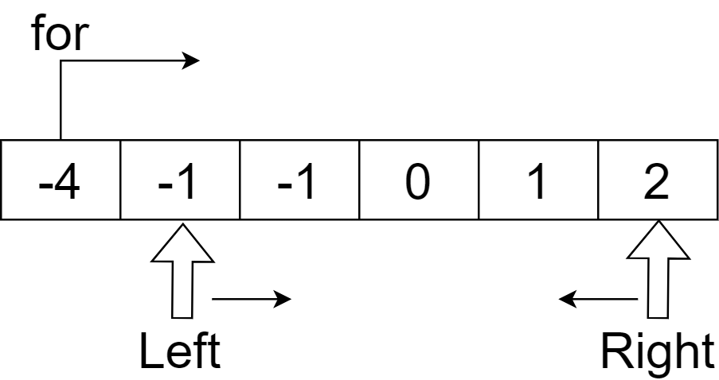

# 15. 3Sum
- 정수 배열 nums가 주어지면 삼중항의 합은 0이 되어야 함
    - 솔루션 세트에서는 중복된 삼중항이 포함되어서는 안됨
    - https://leetcode.com/problems/3sum/description/

<br>

### 풀이 방법
- 그냥 보았을 때 세 숫자를 모두 비교해서 Set에 정렬된 문자열로 넣는 방법을 생각했으나 너무 오래걸리고 효율적이지 못한다고 판단
- 해당 문제는 그 외 떠오르는 방법이 없어 책을 참조
- 책에서는 정렬 후 투 포인터 방식으로 문제를 풀이하였음
    - 

<br>



<br>

### 풀이 코드

```java
import java.util.List;
import java.util.ArrayList;
import java.util.Arrays;

class Solution {
    public List<List<Integer>> threeSum(int[] nums) {
        int left, right, sum;
        List<List<Integer>> results = new ArrayList<>();
        Arrays.sort(nums);

        for(int i = 0; i < nums.length - 2; i ++) {
            // 중복된 값 건너뛰기
            if(i > 0 && nums[i] == nums[i- 1]) {
                continue;
            }

            // 간격을 좁혀가며 합 sum 계산
            left = i + 1;
            right = nums.length - 1;
            while (left < right) {
                sum = nums[i] + nums[left] + nums[right];

                // 합이 0보다 작다면 왼쪽 포인터 이동
                if (sum < 0) {
                    // 합이 0보다 크다면 오른쪽 포인터 이동
                    left += 1;
                } else if (sum > 0) {
                    right -= 1;
                } else {
                    // 합이 0 인 경우 이므로 정답 처리
                    results.add(Arrays.asList(nums[i], nums[left], nums[right]));

                    // 중복된 값 건너뛰기, 이 처리를 하지 않으면 같은 정답이 두 번 나올 수 있음
                    while(left < right && nums[left] == nums[left + 1]) {
                        left += 1;
                    }

                    while (left < right && nums[right] == nums[right - 1]) {
                        right -= 1;
                    }

                    // 정답이 나왔으므로 투 포인터 모두 한 칸씩 이동
                    // 합이 0인 상황이므로 양쪽 모두 이동해야 함
                    left += 1;
                    right -= 1;
                }
            }
        }

        return results;
    }
}
```