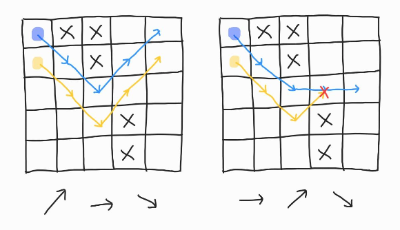

# BJ-3109-빵집
### 문제 설명
- 유명한 제빵사 김원웅은 빵집을 운영하고 있다. 원웅이의 빵집은 글로벌 재정 위기를 피해가지 못했고, 결국 심각한 재정 위기에 빠졌다.

- 원웅이는 지출을 줄이고자 여기저기 지출을 살펴보던 중에, 가스비가 제일 크다는 것을 알게되었다. 따라서 원웅이는 근처 빵집의 가스관에 몰래 파이프를 설치해 훔쳐서 사용하기로 했다.
- 빵집이 있는 곳은 R*C 격자로 표현할 수 있다. 첫째 열은 근처 빵집의 가스관이고, 마지막 열은 원웅이의 빵집이다.
- 원웅이는 가스관과 빵집을 연결하는 파이프를 설치하려고 한다. 빵집과 가스관 사이에는 건물이 있을 수도 있다. 건물이 있는 경우에는 파이프를 놓을 수 없다.
- 가스관과 빵집을 연결하는 모든 파이프라인은 첫째 열에서 시작해야 하고, 마지막 열에서 끝나야 한다. 각 칸은 오른쪽, 오른쪽 위 대각선, 오른쪽 아래 대각선으로 연결할 수 있고, 각 칸의 중심끼리 연결하는 것이다.
- 원웅이는 가스를 되도록 많이 훔치려고 한다. 따라서, 가스관과 빵집을 연결하는 파이프라인을 여러 개 설치할 것이다. 이 경로는 겹칠 수 없고, 서로 접할 수도 없다. 즉, 각 칸을 지나는 파이프는 하나이어야 한다.
- 원웅이 빵집의 모습이 주어졌을 때, 원웅이가 설치할 수 있는 가스관과 빵집을 연결하는 파이프라인의 최대 개수를 구하는 프로그램을 작성하시오.

<br>

### 요구사항
- 첫째 줄에 R과 C가 주어진다. (1 ≤ R ≤ 10,000, 5 ≤ C ≤ 500)
- 다음 R개 줄에는 빵집 근처의 모습이 주어진다. '.'는 빈 칸이고, 'x'는 건물이다. 처음과 마지막 열은 항상 비어있다.

<br>

### 입력
```
<!-- case 1 -->
5 5
.xx..
..x..
.....
...x.
...x.

<!-- case 2 -->
6 10
..x.......
.....x....
.x....x...
...x...xx.
..........
....x.....
```

<br>

### 출력

```
<!-- case 1 -->
2

<!-- case 2 -->
5
```

<br>

### 동작 예시



<br>

```java
import java.io.BufferedReader;
import java.io.IOException;
import java.io.InputStreamReader;
import java.util.StringTokenizer;

/**
 * @author	황인준
 * @since 	2024. 8. 22.
 * @link	https://www.acmicpc.net/problem/3109
 * @performance	배열의 column이 왼쪽부터 오른쪽까지 한칸씩 이동하되 높이는 대각선 위, 아래, 높이는 그대로 등으로 이동하여 
 * 				도달하는 경우를 최대한 높이는 문제로 기존 건물이 있는 'x'는 파이프를 설치하지 못하므로 boolean[][] 에
 * 				true를 통해 장애물 위치를 지정하고 이후 해당 파이프를 설치할 때도 해당 boolean 배열에 true를 지정.
 * 				해당 column이 가장 오른쪽 배열위치에 도달했다면 true 반환하여 메서드 스택 반환 시작 및 true인 경우마다 result ++ 후 답 반환
 * 				추가적으로 //check[moveRow][moveCol] = false; 해당 부분을 계속 넣어야 한다고 생각했는데 해당 부분이 있으면
 * 				만약 아래 행에서 해당 경로를 지났던 경로와 똑같이 들어오게 된다면 이미 실패할 경로를 다시 탐색하므로 시간 초과 발생..
 * @category #완전탐색 #DFS
 * @note	
*/
public class BJ_G2_3109_빵집 {

	public static void main(String[] args) throws IOException {
		new BJ_G2_3109_빵집().solution();
	}
	
	int N, M;   // 행열
	boolean[][] check;
	int result = 0;
	
    // 배열 탐색은 아래로 내려가므로 이후 다른 행의 파이프 탐색에 영향을 끼치므로 위부터 탐색
	int[] dRow = {-1, 0, 1};
    // 열 이동은 무조건 1칸이므로 따로 변수를 사용하지 않음
    static final int ONE_MOVE = 1;
	
	
	private void solution() throws IOException {
		BufferedReader br = new BufferedReader(new InputStreamReader(System.in));
		StringTokenizer st = new StringTokenizer(br.readLine());
		
		N = Integer.parseInt(st.nextToken());
		M = Integer.parseInt(st.nextToken());
		check = new boolean[N][M];
		
		for(int i = 0; i < N; i++) {
			String line = br.readLine();
			
			for(int j = 0; j < M; j++) {
				char ch = line.charAt(j);
				if(ch == 'x') {
					check[i][j] = true;
				}
			}
		}

		for(int i = 0; i < N; i ++) {
			if(move(i, 0)) {
				result ++;
			}
		}
		
		System.out.println(result);
	}

	private boolean move(int row, int col) {
	    if (col == M - 1) {
	        return true;
	    }

	    for(int i = 0; i < dRow.length; i++) {
	    	int moveRow = row + dRow[i];
	    	int moveCol = col + ONE_MOVE;
	    	
	    	if (moveRow >= 0 && moveRow < N && !check[moveRow][moveCol]) {
                check[moveRow][moveCol] = true;
                
                if (move(moveRow, moveCol)) {
                    return true;
                }
                
                // 이 녀석을 남겨두면 나중에 아래 행에서 해당 위치에 도달하면 똑같은 실패를 반복하므로 true로 막아두어야 함
//                check[moveRow][moveCol] = false;	
            }
    	}
	    
	    return false;
	}
}

```