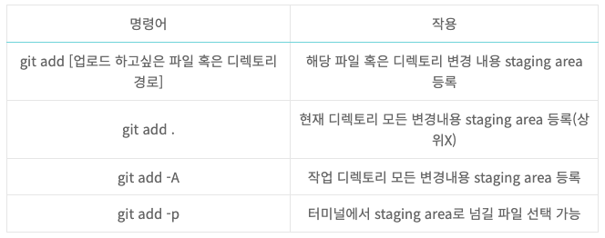

# Git

### 형상관리 툴(Software Configuration Management Tool)
- 소프트웨어 버전 관리 툴
- 형상관리는 소스의 변화를 끊임없이 관리하는 것을 말함
- 소스를 버전 별로 관리할 수 있어 개발할 때 실수로 소스를 삭제하거나 수정하기 이전으로 돌아가야 하는 경우 유용
- 팀프로젝트에서 누가 무엇을 어떻게 수정했는지도 알 수 있기 때문에 코드를 병합하거나 수정된 소스를 추적하는 데에도 쓰임
- SVN과 Git이 대표적 
```
SVN
- SVN은 보통 대부분의 기능을 완성해놓고 소스를 중앙 저장소에 commit
- commit의 이미 자체가 중앙 저장소에 해당 기능을 공개한다는 의미
- 개발자가 자신만의 version history를 가질 수 없음 (그렇기 때문에 local History를 이용하긴 하지만, 일시적이다. 내가 몇일전 까지에 한하여 작업했던 내역을 확인 가능하지만 버전 관리가 되진 않는다.)
- commit한 내용에 실수가 있을 시에 다른 개발자에게 바로 영향을 미치게 되는 단점도 있음
```
ㅁㄴㅇㅁㅇㅁㄴㅇㄴㅁㅇㅁ

<br>

### Git
- 분산형 버전 관리 시스템(Version Control System)의 한 종류
- 버전 관리는 파일들을 복사, 백업, 저장 등을 해서 관리하는 것을 의미. 버전 관리는 두가지 모델으로 나눔
    - 클라이언트-서버 모델
    - 분산 모델
- 깃은 다른 버전 관리 도구와 다르게 스냅샷(snapshot)방식을 이용하고 프로젝트 전체를 스냅샷으로 관리해 변경된 부분만 찾아 수정된 내용을 저장
    - 깃의 스냅샷은 HEAD가 가르키는 커밋에 기반. 데이터를 보는 관점이 어떤 파일이 존재하고 각 파일이 시간에 따라 변경된 차이점을 비교
    - 위의 방법을 델타 베이스드 버전 관리(delta-based version control)이라고도 함
- 별도로 주고 받는 작업 없이 같은 파일을 여러 명이 동시에하는 병렬 개발이 가능
- 작업한 파일에 대한 변경된 정보를 실시간으로 저장해줌
- 같은 파일에 대한 각각 다른 버전을 보관할 수 있음
- Git은 오픈 소스 라이선스인 GNU General Public License version 2.0 (opens new window)를 가지고 모든 사용자에게 무료로 제공
- 개발자는 마음대로 commit(push)하다가 자신이 원하는 순간에 서버에 변경 내역(commit history)을 보낼 수 있으며, 서버의 통합 관리자는 관리자가 원하는 순간에 각 개발자의 commit history를 가져올 수 있음

<br>

### Git의 장점
- 인터넷 연결이 되지 않은 곳에서도 개발을 진행할 수 있으며 분산 버전 관리이기 때문에 중앙 저장소가 삭제되어도 원상복구가 가능
- 각각의 개발자가 Branch에서 개발한 뒤, 본 프로그램에서 합치는 merge 방식을 통한 병렬 개발 가능

<br>


### Git 파일 상태
- 깃의 파일 관점에서 4가지로 나뉘어짐
    - Untracked : Working Directory에 있는 파일이지만 Git으로 버전관리를 하지 않는 상태
        - Tracked : Git이 해당 파일을 추적 및 관리하는 상태로 최소한 한번은 git add 명령을 통해 Staging Area에 포함되거나 Commit을 통해 디렉터리에 저장된 파일
    - Unmodified : 신규로 파일이 추가되었을 때, new file 상태와 같다. ( $ git add 상태 )
    - Modified : 파일이 추가된 이후 해당 파일이 수정되었을 때의 상태
    - Staged : Staging Area에 반영된 상태

<br>

### Git 기본 용어
- Git Directory : git init으로 생성되어 생성되는 깃 저장소. Git 프로젝트의 모든 메타데이터와 객체 데이터베이스가 저장됨
- Working Directory : 내가 작업하고 있는 프로젝트의 디렉토리
- Working Tree : 저장소를 어느 한 시점을 바라보는 작업자의 현재 시점. Git Directory에서 특정 버전을 checkout 해온 것
- Staging Area : 저장소에 커밋하기 전에 커밋을 준비하는 위치
- Repository : 커밋들이 모여있는 저장소
- Commit : 현재 변경된 작업 상태를 점검을 마치면 확정하고 저장소에 저장하는 작업
- Head : 현재 작업중인 Branch를 가르킴
- Branch : 가지 또는 분기점. 작업을 할 때에 현재 상태를 복사하여 Branch에서 작업을 한 후에 완전하다 싶으면 Merge하여 작업을 함
- Merge : 다른 Branch의 내용을 현재 Branch로 가져와 합치는 작업을 의미
```
깃은 워킹 트리에서 파일을 수정 -> Staging Area에 파일을 Stage 해서, 커밋할 스냅샷을 만듬 -> Staging Area에 있는 파일들을 커밋해서 Git Directory에 영구적인 스냅샷으로 저장
```
<br>

### Git Staging area를 쓰는 이유
- 스테이징 에리어는 저장소에 커밋되기 전에 반드시 거쳐야만 하는 중간 단계
- 스테이징 에리어를 쓰는 이유는 다음과 같음

#### 1. 일부분만 커밋할 때
- 워킹 디렉토리에서 자유롭게 고치고 커밋할 때 골라서 커밋하고 싶을경우 스테이징 에리어가 없다면 커밋을 할 때 커밋할 파일만 선택해야 함

#### 2. 충돌을 해결할 때
- 충돌이 발생했을 때 해결을 위한 작업 데이터를 스테이징 에리어에 저장해두는 것이 좋음
- SVN도 마찬가지로 어떤 파일이 충돌했는지 파일 상태를 기억함
- Git은 파일 단위로 충돌을 기억하는 것이 아니라서 필요한 만큼만 충돌 해소 후 그 부분만 add 하여 커밋하면 됨

#### 3. 커밋 다시하기
- 커밋을 다시할 때 로그메시지만 고치는 것이 아니라 파일들도 고치고 싶다면 commit 전에 파일을 고쳐서 add하기만 하면 됨

<br>

### Git 기본 명령어
- git help : 도움말 기능. 해당 깃 명령어의 설정과 사용에 대한 도움말 출력
    - git help \[궁금한명령어\]
- git init : 깃 저장소를 초기화. 저장소나 디렉토리 안에서 이 명령을 실행하기 전까지는 일반 폴더로 해당 명령어를 입력 후에야 추가적인 깃 명령어 입력 가능
- git status : 저장소 상태 체크. 어떤 파일이 저장소 안에 있는지, 커밋이 필요한 변경사항이 있는지, 현재 저장소에 어떤 브랜치에서 작업하고 있는지 등의 상태 정보 출력
- git branch : 새로운 브랜치 생성. 여러 협업자와 작업할 시, 이 명령어로 새로운 브랜치를 만들고, 자신만의 변경사항과 파일 추가 등의 커밋 타임라인을 생성
- git add : 'staging 영역'에 변경 내용 추가, 다음 commit 명령 전까지 변경분을 staging 여역에 보관하여 변동 내역을 저장
> 
- git commit : staging area에 있는 변경 내용 묶음 및 정의
    - git commit -m [커밋 메시지] : staging area에 있는 내용은 커밋 메시지를 반영한 수정본 파일의 묶음
- git log : 커밋 내역 확인
- git push : 로컬 컴퓨터에서 서버로 변경사항을 전송함
- git pull : 서버 저장소로부터 최신버전을 받아옴. 작업 도중 기존 작업 내용은 유지하면서, 최신 코드로 업데이트 할 때 사용
- git clone : 서버 저장소의 데이터를 로컬 컴퓨터로 복사. 서버 저장소의 데이터를 그대로 가져오고 작업중이던 내역이 있을시 덮어쓰기 됨
- git checkout : 작업하기 원하는 브랜치로 이동
    - git checkout \[브랜치 이름\] : 해당 브랜치로 이동
    - git checkout -b \[브랜치 이름\] : 브랜치를 생성 후 브랜치로 이동
- git merge : 개별 branch에서 마친 작업을 master branch로 병합

<br>

### Github
- Github는 Git을 지원하는 웹 호스팅 서비스 시스템(클라우드)의 한 종류
- 깃을 웹에서 보다 편하게 쓸 수 있도록 만든 클라우드 서비스로 웹을 사용하여 비주얼 인터페이스를 제공하여 편리하고 커뮤니티 기능도 사용이 가능함
- 컴퓨터에 있는 깃의 히스토리를 가져와서 깃허브 웹사이트(클라우드)에 올릴 수 있고 변경된 히스토리를 확인할 수 있음
- 깃허브는 굉장히 많은 오픈소스들을 열람할 수 있음
- 개발한 소스코드를 공유하거나 상대로부터 받은 코드 수정시에도 유용
- 해당 서비스는 Gitlab과 bitbucket 등도 있으나 가장 유명한 것은 깃허브
```
웹 호스팅 서비스
- 인터넷 호스팅 서비스의 일종으로 개인과 단체가 월드 와이드 웹(World Wide Web)을 통하여 웹사이트를 제공하는 것을 뜻함 (인터넷 홈페이지를 대신 운영해주는 서비스)
- 웹 호스트는 인터넷 연결을 제공할 뿐 아니라 일반적으로 데이터 센터에서 클라이언트 이용에 대한 임대 또는 소유하는 서버의 공간을 제공
```

<br>

### Github

<div style="text-align: right">22-09-27</div>

-------

## Reference
- https://yanacoding.tistory.com/4
- https://coding-lks.tistory.com/154
- https://github.com/yeoseon/tip-archive/issues/85
- https://velog.io/@lzhxxn/Git-이란