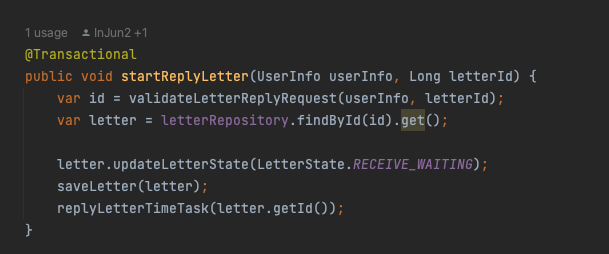
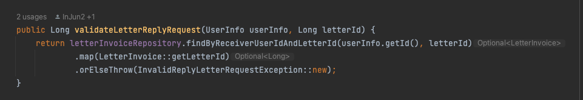
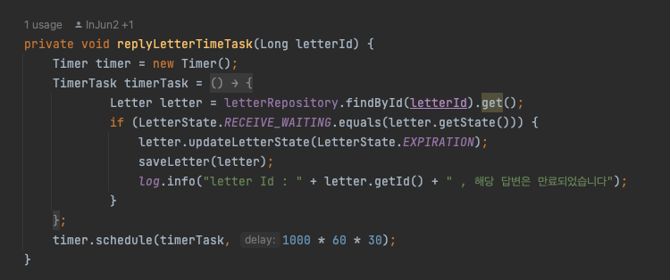
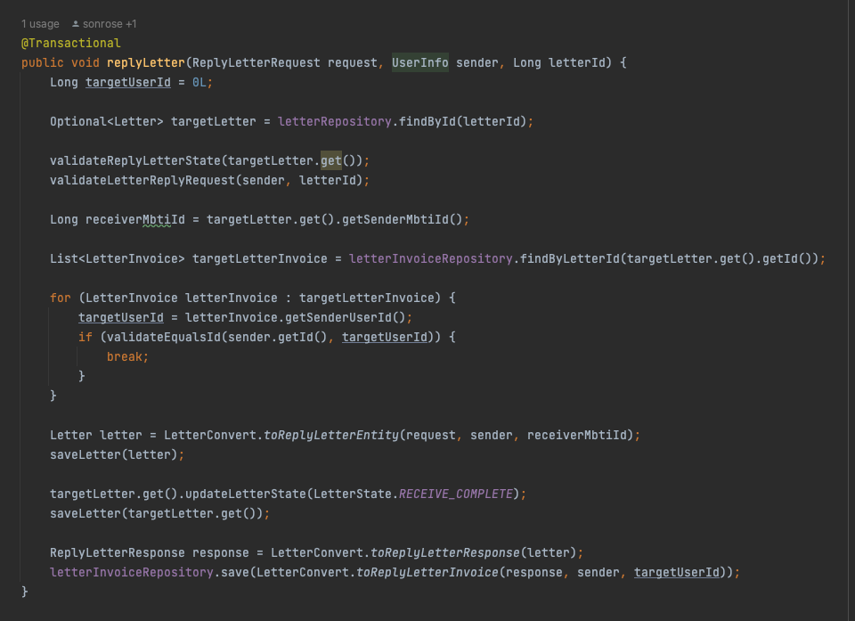
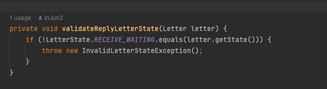
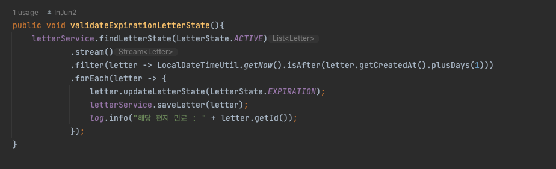
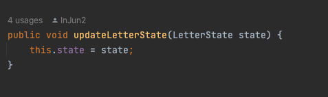

# Glass-Bottle 편지 발송 시 유효시간 직후 답변을 쓸 경우 처리

### 프로젝트 flow 설명
- 현재 진행 중인 프로젝트인 [Glass-Bottle](https://github.com/selab-hs/glass-bottle) 프로젝트는 발송자가 편지를 작성하면 특정 mbti 무작위 대상 혹은 무작위 대상에게 답변을 받을 수 있음
- 현재 발송자가 보낸 편지의 유효기간은 하루이고 해당 유효기간이 지난다면 5분마다 진행되는 스케줄링을 통해 편지 상태가 만료로 변경됨
- 만료로 변경된 편지는 이후 조회를 제외하고 다른 기능에서 사용될 수 없음

 

### 현재 문제
- 만약 발송자가 유효시간이 지나기 직전에 자신에게 온 편지를 확인하고 답변을 쓰려고 할때 문제가 발생
- 발송자가 답변 편지를 쓰는 도중 발신 편지의 상태가 만료가 되고 요청을 보낼 경우 만료된 편지이기 때문에 예외처리 발생
- 해당 문제를 해결하기 위해서 편지를 작성하기전 스케줄링에서 변경되지 않도록 편지 상태를 변경하고 이후 어느 정도의 유효시간을 추가로 주어저야한다고 판단
- 신경 써야하는 부분은 유효시간을 추가로 주어져야 하지만 답변자가 답변을 작성 완료할 경우에는 곧바로 답변 편지가 발송되어야 함
- 해당 요청이 들어올 경우 편지 작성 중인 상태를 알려줄 수 있는 상태로 변경하고 스케줄링의 경우 진행 중 상태의 편지만 스케줄링 하도록 작동하도록 진행
- 또한 답변 편지 작성 경우 상태를 변경한 이후 추가된 시간 이후 작성되지 않으면 만료되도록 진행하여야 함

 

### 해결 방법
- 현재 편지 상태는 '진행 중', '만료', '답변 완료'로 이루어져 있으며 '작성 중' 상태를 추가하고 해당 상태로 변경되는 중간 과정을 추가하는 것으로 해결
- 스케줄링의 경우 '진행 중'인 편지만 만료되도록 진행하고 답변 편지 작성 요청 전 편지를 '작성 중'으로 변경되도록 get 요청을 하도록 중간 과정을 추가
- 유효시간은 30분으로 측정되어 답변 편지 확인 시 java.util.Timer 클래스를 통해 '작성 중' 상태라면 30분 이후 '만료' 되도록 진행. '진행 중' 상태는 처음 편지를 발송될 때에만 초기 생성되는 상태이기 떄문에 제외하였음
- 답변 편지 작성 시 '작성 중' 상태가 아니라면 예외처리 발생

 

### 사용 방법

#### 답변 작성 확인 로직

- 답변 전 확인 요청 시 로그인 정보(토큰)가 해당 편지의 답변자 유저 ID가 맞는지 유효성 검사 진행. 해당 유저가 존재하지 않을 경우 예외 발생
- 유효성 검사 진행 이후 해당 발송 편지 상태를 '답변 대기' 상태로 변경 후 적용 반영.
- 이후 30분 이후 해당 편지의 상태가 아직 '답변 대기'일 경우 편지 상태를 만료하고 적용 반영 및 로그 출력

 

#### 답변 작성 로직

- 기존 답변 작성 로직에서 '답변 대기' 상태가 아니면 예외 발생 로직 추가

- 기존 스케줄링 작업시 '활성' (진행 중) 상태인 경우에만 스케줄링 동작하도록 로직 추가

- JPA Entity 업데이트의 경우 기존에 사용하던 대로 모두 해당 Entity 내의 메소드를 통해 JPA 더티체킹을 통해 상태를 변경하였음