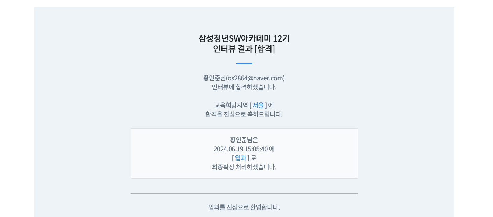

# Ssafy 12기 코딩테스트 & 인터뷰 후기

### 작성하기 전에
- 싸피의 시험 내용은 모두 대외비로 어떤 문제였는지, 어떤 질문이었는지, 어떤 식으로 진행하는지에 대해서는 작성하지 못함
- 싸피를 지원했던 이유는 생각보다 취직을 너무 못하고 있어서.. 현재 1년 9개월 가량 취업준비를 진행하는데 서류에서 지속적으로 탈락하다보니 싸피라도 한번 지원해보자..
    - 사실 코테도 합격하지 못할거라 생각했음
- 지원서를 접수하고 코딩테스트는 약 2주후 진행했고, 약 10일 이후 합격 발표가 나왔으며 이후 약 일주일 이후 인터뷰를 진행 이후 12일 후 결과가 나옴
    - 인터뷰를 진행하고 합격이 된다면 다음달에 시작을 하는데 신청->교육 진행까지 2달가량 걸리는 것 같음

 

### 코딩테스트 후기
- 코딩테스트에 자신이 없어 코딩테스트라도 보자했던 싸피 코딩테스트에서 예상치 못하게 합격을 받았다
- 오전반에 코딩테스트를 진행했는데 코딩테스트를 진행해도 못봤다 생각했는데 예상외로 코딩테스트는 합격을 받았음
    - 운이 좋게도 전체적으로 코딩테스트 풀이 퍼센트가 저조했던 것 같음
- 이에 싸피에 대해 좀 더 알아보고 이후 인터뷰는 무엇을 하는지 간단하게 찾아봤음

 

### 인터뷰 후기
- 기존 공부했던 내용을 간단하게 이야기하고 다음 내용만 추가적으로 조금 준비를 해왔음. 달달 외워봤자 면접에서 이야기하지 못할 것 같아 키워드 위주로 준비를 했음
    - 자기소개
    - 지원동기
    - 싸피를 선택한 이유
    - 백엔드로 직무를 결정한 이유
    - 나의 장점과 단점
    - 실패 경험
    - 팀원과의 갈등
- 그 외에도 PT 면접을 진행한다고 해서 간단하게 나마 준비를 헀음
- 그런데 PT 면접에서 따로 준비하지 못했던 부분이 나왔고 전형적인 기술이었지만 대답을 못했던 것 같음
- 또한 개인적으로 한일 Q&A에서 제대로 답변하지 못했고 잘못했던 부분과 면접관 분께서 이야기해주신 약점은 다음과 같음
    - 경험은 충분하고 코딩을 좋아하는 것을 알겠다. 하지만 이야기하는 내용들이 너무 장황하다. 일부 장점에대해 돋보이도록 이야기해라
    - 약점에 대해 또는 이야기하며 전체적으로 네거티브한 워딩이많다 이러한 부분이 좋은 방법은 아니다
    - 질문한 의도와 다른 대답이 좀 있었음
- 개인적으로 회사 면접보다 확실히 체계적이고 면접자들을 배려해주는 모습이 보였던 것 같음
- 아쉽게도 인터뷰는 자기 PR을 제대로 하지못했다고 생각한다. 그런데 이러한 경험이 많은데 이후 면접 스터디를 따로 진행해봐야겠다..
- 인터뷰에 있어 제대로 준비를 하지 못했기에 조금 아쉽게 느껴지지만 그래도 자신의 약점을 바라보는 좋은 경험이었다고 생각함!

 

### 인터뷰 결과
- 이후 약 12일 이후 합격 결과를 받게 되었음
- 인터뷰를 볼 때에는 질문에 인터뷰를 진행하면서 보이는 약점을 직접 물어보기도 하고 PT 면접도 못봤다고 생각했는데 생각치도 못한 결과를 얻은 것 같다
- 개인적으로 다른 인터뷰 후기 블로그처럼 지금까지 내가 진행한 프로젝트를 어떻게 진행했고 과정을 풀어나갔던 것이 성장가능성이 보이는 대답이라 컸었다고 생각한다
- 사실 나는 많이 준비하지는 못했지만 (주에 스터디를 3~4개 병행) 지금까지 공부 방법이나 앞으로의 목표 등을 크게 봐주신 것 같음
- 아직 싸피를 진행해보지는 못했지만 다른 분들도 좋은 결과 있기를 바랍니다

 

