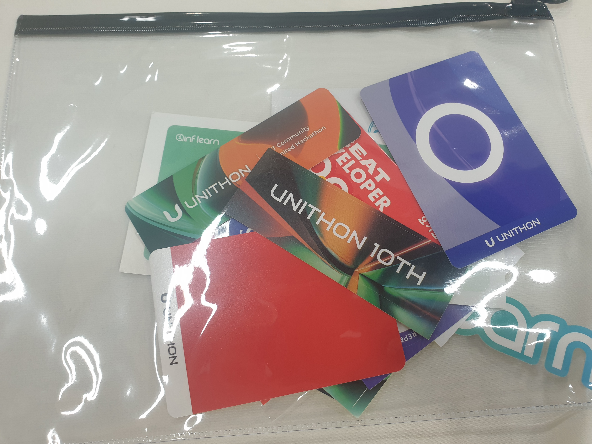
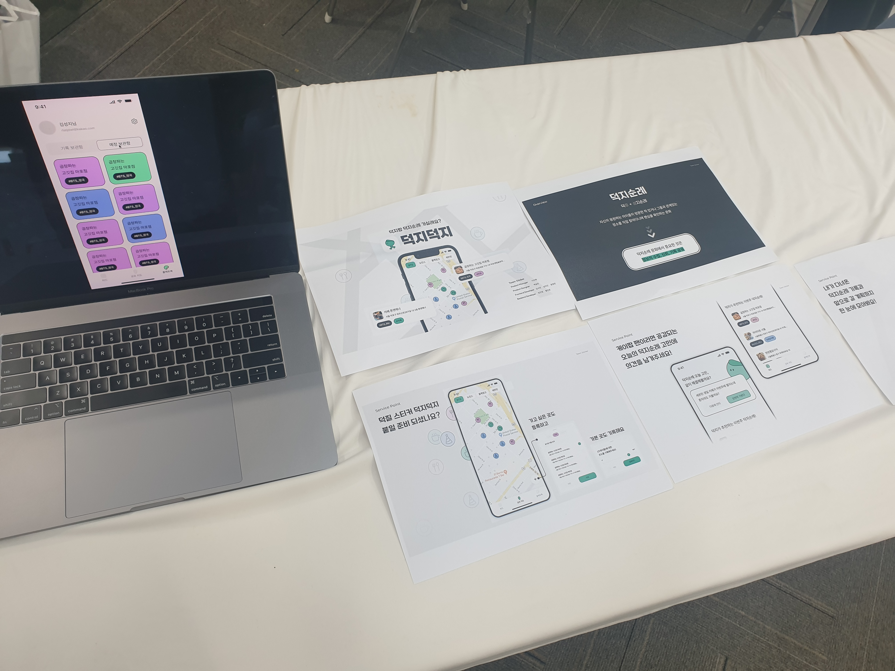
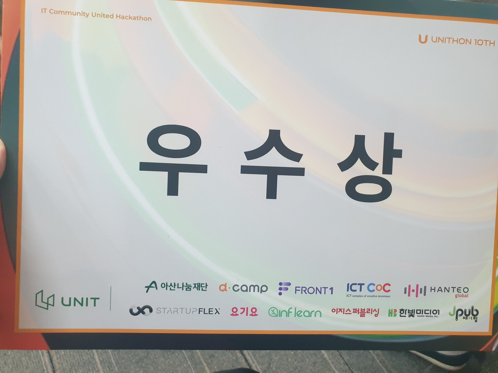
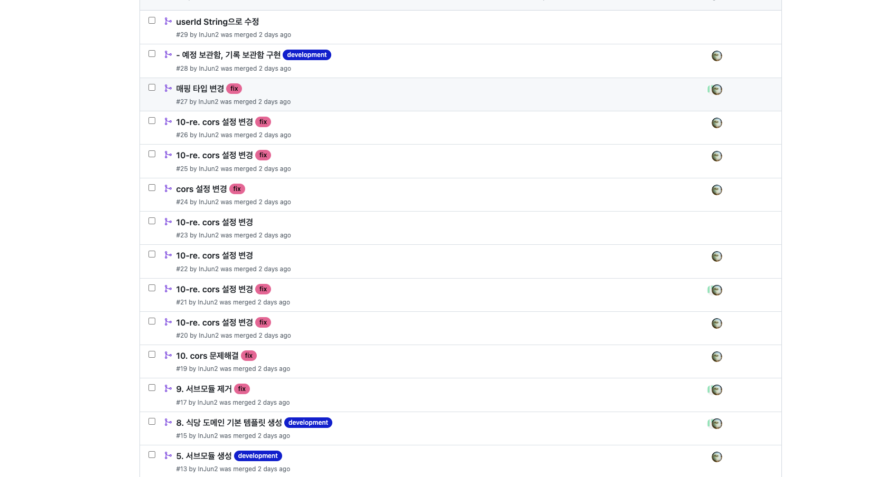
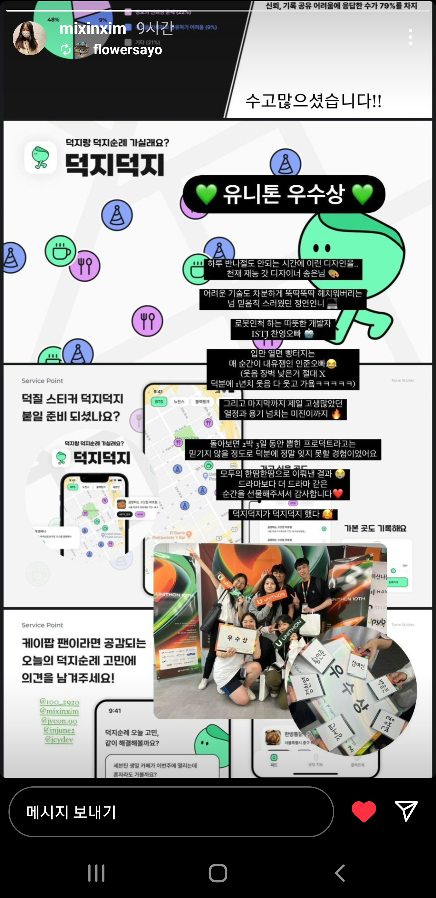

# UNITHON 10 TH 참여 후기

## 참여하기 전에 UNTHION
- 취업 준비 중 지인을 통해 UNIT 에서 10기 해커톤 unithon 지원자를 받는다는 것을 알게 되었고 이후 지원 후 합격하여 참가하게 되었습니다.
>    - 지인과 함께 신청하고 제안해준 극락코딩(https://github.com/DongGeon0908)님과 참여하게 되었고 다른 한분은 아쉽게도 불합격이 되어 각자 1팀, 10팀에서 진행하였습니다.
- 참가하게 된 이유로 짧은 기간동안 서비스를 구현하는 해커톤이라는 것 자체에 대한 기대도 있지만 아직 다른 FE 분들과 작업을 한적이 없었기에 BE로 참여하여 하나의 프로젝트를 만들어 내는 것 자체에 큰 경험이 될 것 같아 신청하였습니다
- 또한 다른 개발자들과 커뮤니케이션을 나누어보고 싶기도하고 오프라인으로 지속적인 구현과 피드백, 소통을 통한 프로젝트 진행에도 기대가 됬습니다.
- 기간은 23.9.22 ~ 23.9.24로 금,토,일 2박 3일동안 진행되었고 위치는 공덕에 위치한 ICT COC 5층에서 진행되었습니다
>   - 가져간 물품은 간단하게 노트북과 윗옷/반바지 한벌, 노트북과 충전기, 칫솔/치약/폼클렌징, 인공눈물 정도만 들고가서 진행했습니다. 
>   - 셔츠는 처음에 웰컴키트와 함께 주셔서 날씨가 추울까봐 가져간 옷은 따로 입지않았고 불편했던점은 없었습니다.

- 웰컴키트는 스티커와 인프런할인권 등 셔츠와 핫팩, 물티슈 등으로 구성

 

### 진행방식
- 각 7명씩 팀원이 구성되었고 저희 팀은 저를 포함한 BE 2명, FE 3명, 기획자 1명, 디자이너 1명으로 구성되었습니다.
- 팀은 무작위로 선정이 진행되었던 것 같고 처음 설명을 제외하고는 유니톤 진행팀에서 중간중간 이벤트를 진행해주셨고 그것을 제외하고는 전부 팀 자율로 진행되었습니다
>    - 간식과 음료수는 지속적으로 배치해주셨고 그 외 점심과 저녁, 2일차 야식을 통해 식사가 이루어져서 유니톤을 진행하는 동안 쓴 금액은 왕복 교통비 밖에 안쓰게되었네요 (팀원 분이 사준 커피 제외)
>    - 이벤트는 이름표의 같은 스티커 인원찾기, 삼행시, 참참참, 장난감사격 등 중간중간 분위기를 환기하는 자율적 참여 이벤트를 진행해주셨습니다.
- 첫째날은 자율적으로 절반정도는 집에 돌아가시고 아침에 돌아오셨고 둘째날은 대부분 밤을 새며 프로젝트를 진행하는 것 같았습니다.
- 이후 마지막날을 통해 각자 2~4분 가량의 발표를 진행하고 총 1시간 40분 가량 심사위원 심사(팀당 10분 가량) 및 다른 팀의 프로젝트 설명/경험을 진행하고 결과발표로 마무리되었습니다.

 

### 첫째날
- 처음날에는 우선 간단한 자기소개와 프로젝트 주제 정하기 및 기획을 진행하였습니다.
- 자기소개 이후 각자 아이디어를 하나씩 발표하고 가장 많은 득표를 받은 '성지순례지도'로 프로젝트를 진행하기로 하였습니다.
- 해당 프로젝트는 특정 연예인이 갔던 음식점이나 생일카페 등을 저장하고 이를 지도로 찾아보고 예정/방문 기록 저장 기능을 추가한 프로젝트였습니다.
- 이름은 디자이너신 백송은님이 하루를 지나 덕지덕지(덕질과 지도)로 명명해주셨고 기획자님이 피그마를 통해 와이어프레임을 먼저 구현해주셨습니다.
- 이후 와이어프레임이 진행되기전에는 개발환경 구성과 배포 방법 고민을 진행헀고 로그인은 카카오 로그인과 카카오 지도 API를 사용하기로 하였습니다.
- 개발은 일단 같은 BE 분은 주로 nestJS를 사용하여 사용 스택과 언어가 다른 상황이었고 우선 스프링을 통해 진행하기로 하였습니다.
- 우선 카카오 로그인을 통해 멤버 정보를 받아오는 것이 먼저기 때문에 로그인 먼저 진행을 하게 되었는데 FE에서 카카오 API를 먼저 경유하여 access token을 가져오면 이를 Jwt로 다시 돌려주는 기능을 구현하였습니다.
>    - FE에서 먼저 API를 경유한 이유는 카카오 첫 로그인 시 회원가입을 진행해야하다보니 먼저 FE에서 토큰을 받아오게 하기로 되었습니다. (여기서 저는 FE에서 생각보다 가능한 것들이 많구나 느꼈습니다..)
>    - Oauth2를 사용해보지 않았는데 로그인은 이후 저에게 가장 큰 문제가 되었습니다..

 

### 둘째날
- 이후 BE에서는 테이블 설계를 진행하였고 테스트를 위한 AWS EC2 설정과 RDS를 생성하여 연결하였습니다.
- 기능명세서도 대부분 이야기를 통해 기능은 얼추 정리가 되어있는 상태에서 기획자분이 작성해주시고 BE팀은 기능을 위한 환경과 구현만 진행했던 것 같습니다.
>    - BE 개발자끼리만 프로젝트를 진행한 저는 기획자, 디자이너 ,FE 등 다른 분들과 역할을 분담하다보니 프로젝트 진행 수순이 정말 깔끔하고 편하게 진행된 것 같습니다. 진짜 너무 좋았어요..
>    - ERD클라우드를 통해 테이블 설계를 진행하고 우선 로그인까지 FE 구현을 기다리기 위해 AWS EC2, RDS를 생성해두었습니다
- 오후 1시 ~5시 즈음 각자 팀별로 혹은 개인으로 30분 가량 유니톤에서 한터글러벌 서비스 소속 신동한님이 멘토링을 진행해주셔서 진행 프로젝트에서 사용한 코드가 괜찮은지, 매핑 테이블을 사용하는 것이 옳은지 등을 말해주셔서 프로젝트 진행 방향에 많은 도움이 되었습니다.
- 이후 큰 문제가 발생했습니다.. oauth2를 사용하기위해 사용했던 spring-security 때문에 cors 문제가 발생하였고 해당 문제로 인해 많은 시간이 소요되었습니다. 당연히 시간이 지속되고 기능은 구현을 못했다보니 멘탈이 점차 나가던 상황에서 다른 BE 분이 결국 nestJS를 통해 구현하며 서버를 2개를 사용해서 구현하자고 말씀해주셨고 그렇게 진행하는 것으로 변경하였습니다
- FE에서 보낸 데이터를 Jwt로 바꿔서 보내는 건 결국 nestJS에서 진행해 주셨고 이후 또 문제가 발생했습니다.
- DB table을 스키마를 따로 사용하지않고 쓰다보니 DB가 충돌이 발생해 ORM에서 DB를 사용하지 못하는 문제가 발생하였고 또한 다른 BE 분은 카카오 데이터를 그대로 Jwt에 넣어서 Spring에서 userId만 파싱하는 과정을 추가해주어야 했습니다.
- 로그인한 정보를 받아와도 DB에 접근이 안되다 보니 결국 옆에서 방법 제시와 DevOps, 문서화 등 간단한 업무만을 진행하고 Server는 nodeJS 하나만을 사용하기로 하였습니다.
>    - 해당 과정을 거치다 보니 멘탈이 좀 나가긴했는데 많이 배운것 같습니다.. FE와 처음 같이 작업을 하다보니 기초적으로 cors 설정을 해두긴 하지만 spring-security가 먼저 filter chain에 걸리다 보니 둘다 적용을 해주어야 했는데 처음 oauth2를 사용하다보니 안그래도 시간이 좀 걸렸는데 cors 설정과정은 너무나도 복잡했습니다.. 이후에도 다른 언어와 프레임워크는 잦은 충돌이 생겼고 이후 nodeJS만을 사용하기로 했습니다.
>    - 처음에는 nodeJS를 사용하는 건 DB도 그렇고 요청도 그렇고 좋은 방법은 아니라고 생각하고 이야기했는데 지나고나니 다른 BE 분께서 진행해주시지 않으셨다면 진짜 큰일 날뻔했습니다..
>   - 둘째날에 먹은 야식 치킨은 맛있었습니다. 각 팀당 치킨 세종류를 한마리씩 받아 맛있게 먹고 떠들다보니 멘탈을 좀 회복하고 프로젝트를 마저 진행해나갔습니다.

 

### 마지막날
- Spring 프레임워크를 잃은 저는 할일이 없어졌습니다. 그래서 다른 작업을 찾아서 뭐라도 하는 것을 위주로 했고 잡다하게 진행했던 것 같습니다. 그렇게 밤을 새면서 다들 구현을 진행하였습니다.
- FE 구현이 조금 늦어져 기획자님과 충돌이 생겼습니다.. 이후 분위기가 싸늘해졌다가 이후 다행히 다시 화목한 환경이 돌아왔고 잘 만들어진 결과물을 통해 BE에서는 와 진짜 저희 FE분과 디자이너분이 진짜 잘만드신거 같아요 감탄했습니다. 진짜 다들 너무 잘해주신것 같습니다.
- 이후 10시 전에 발표자료를 제출하고 이후 발표를 진행하고 시연부스를 통해 심사위원 님들이 확인하고 다른 팀원불들도 부스를 통해 서비스를 경험해였습니다.
- 마지막으로 결과 발표를 진행하는데 10팀 중 3등인 우수상을 수상했습니다.. 안그래도 좋아진 분위기에 더욱 좋은 분위기가 조성이 되었고 2박3일 밤샘으로 피곤했지만 너무 좋게 마무리 되었습니다.

 

- 덕지덕지 시연부스

 

- 10팀 덕지덕지 우수상 수상! 

 

### 진행 사항과 발생이슈
- ouath2, 카카오 로그인 api, Jwt를 통한 환경설정 및 로직 구현
    - cors 문제로 로그인은 nestJS로 정찬영BE 님이 진행해주심
- AWS EC2, AWS RDS, AWS S3 등 환경 구성 및 설정
- 서브모듈 사용하였으나 이후 정찬영BE님 문제 발생으로 제거
- 보관함 도메인 구현 및 식당 도메인 구현 중 문제 발생으로 보류 후 중단
- Spring에서 Jwt 헤더를 담은 요청에서 유저 id 파싱
    - nestJS에서 int 범위 초과로 카카오 userID를 String으로 사용하여 코드 모두 변경
    - 이후 Filter를 통해 들어오는 모든 요청에서 header Jwt를 파싱하여 반환 성공
- ORM DB 충돌로 영속성 컨테이너에 접근 불가.. Spring 사용 철회
- AWS EC2 nestJS 실행환경 조성, ERD클라우드 변경, 백엔드 문서화 작성, 요청/응답/기능을 적는 API 문서 작성, 기타 아이디어 제공 등으로 프로젝트 진행

 

### 느낀점
- 생각보다 2박3일 동안 부족한게 없이 진행됬고 이벤트를 통해 재미있게 프로젝트를 진행할 수 있었던 것 같습니다. 물론 2박3일동안 한 3~4시간 가량 자다보니 힘들고 얼굴은 말이아니었지만(원래 아니긴함) 이런 환경을 조성해주신 운영진님들의 고생에 감사했습니다. 정말 덕분에 프로젝트 진행을 재미있게 할 수 있게 되었던 것 같습니다.
- 진짜 결과적으로는 제가 팀에서 제 역할을 하지 못해 중간중간마다 아쉽고 죄송한 느낌이 많았는데 잘 마무리되어 다행이지만 좀 더 많은 공부를 진행해야 하는 것을 크게 느낀 것 같습니다. 특히 2일차에서 이후 다양하게 접해보는 것이 중요한 것을 다시 한번 느낀 날이 되었던 것 같습니다.
- 프로젝트를 진행해보니까 역시 스프링은 무겁고 nodeJS는 가볍습니다.. 2박 3일로 구현하려고하니 이 부분은 명확하게 느껴진것 같고 옆에서 nodeJS는 쉽고 빠르게 진행되니까 뭔가 좀 느낌이 신기하기도 했습니다. 이후에는 환경설정이나 모듈을 사용하기위해 템플릿을 좀더 만들어 두는것도 좋다고 생각하게 되었습니다.
- 정말 팀원분들을 잘만난건지 진행하는동안 재미있고 잘 마무리되었다고 생각합니다. 다시 봐도 발표자료 디자인, 문서화, 화면 디자인 등 다들 너무 잘만드신것 같습니다. 기능도 생각보다 많이 FE에서 처리되기도 했고 서버는 좀 아쉽지만 멋진 결과물인것 같습니다. 우리 팀원들 최고야..
- 해커톤 진행하면서 첫날에는 낯도 가리다보니 불편하기도했고 구현하는 과정은 힘들고 문제는 터지느라 멘탈도 나갔지만 재미도 있었고 정말 좋은 경험이었다고 생각합니다. 다음 해커톤도 지인들과 다시 신청할 생각도 있고 더 제대로 되고 멋진 서버를 구현하는 것을 목표로 하겠습니다.

 

- 몰골이 말이 아닌데 마지막날은 사진을 진짜 많이 찍고 성공적인 마무리.. 다들 고생하셨고 감사했습니다.

 

---

 
 

### 기타 링크

UNITHON 10TH Notion : https://unit-center.notion.site/UNITHON-10TH-Dashboard-56853d1d444f4112819bdb76786a5b26

Github Orizination : https://github.com/unithon-10th-10team

덕지덕지(10팀 명) Notion : https://unit-center.notion.site/TEAM-d38c7df5b7784c72ac9d31de6a8769f6

 

23-09-25
