# 방줘 프로젝트 ( 25.03.10 ~ 25.04.10 )

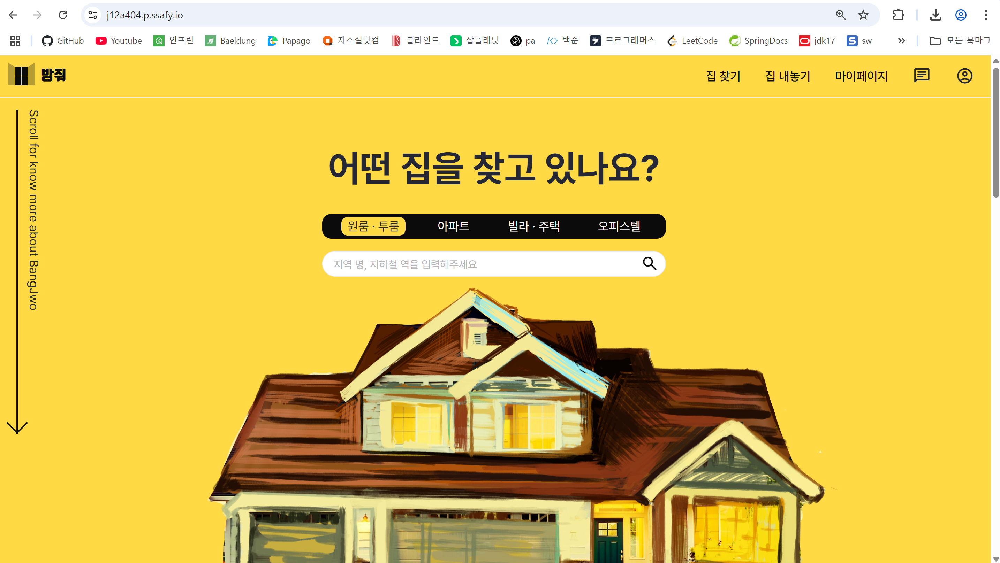

<br>

## 1. 프로젝트 소개
- '방줘' 프로젝트는 월세를 저렴하게 구하고 싶은 청년들을 타겟으로 한 서비스로 공인중계사 없이 월세 거래를 진행할 수 있도록 도와주는 서비스입니다.
- 등기부 등본 정보를 통해 임대 건물에 대한 정보를 조회하고 위험도 분석 및 임대인과 임차인의 거래가 가능하도록 해당 서비스를 통해 계약서를 작성 및 작성 보조 기능을 제공합니다.
- BE 4명, FE 2명으로 구성되어 진행하였으며 저는 로그인 및 회원 기능, 매물 기능 및 계약 기능을 담당하였습니다.


<br>

### 1-1. 담당 서비스 도메인

📑 회원 기능
- 카카오 소셜 로그인
- 회원가입, 회원 정보 수정/조회
- 마이페이지 조회 (매물/계약/결제 내역 등)
- 포트원 본인인증

📑 매물 기능
- 매물 등록/ 필터링 조회
- 카카오 장소 API 매물 주소 조회

📑 계약 기능
- 계약서 생성/수정/조회
- 포트원 결제 및 내역 조회

<br><br>

### 1-2. 서비스 아키텍처

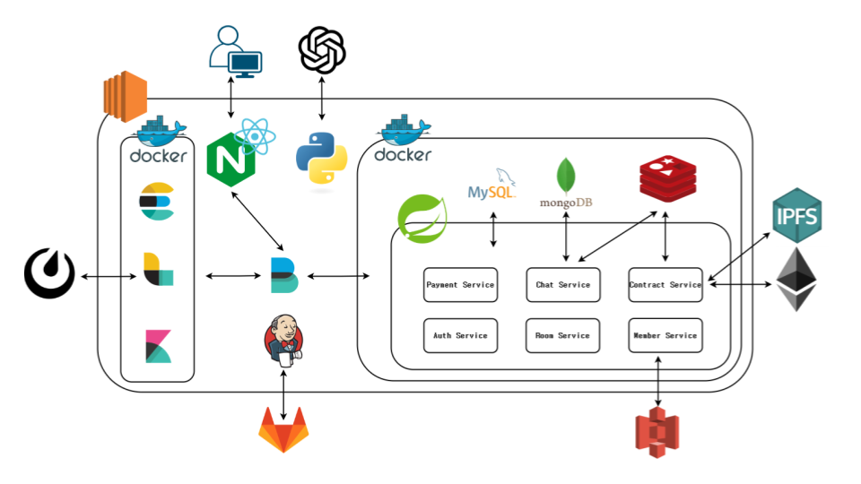


<br><br>


### 1-3. 내가 사용한 기술 스택

#### ✅ BE
- Java, SpringBoot, JPA, Oauth2, Webflux, AWS S3, Swagger

#### ✅ DB
- MySQL, MongoDB, Redis

<br><br>


## 2. 협업 진행 방식

<br>

### 2-1. Jira 협업 툴 사용

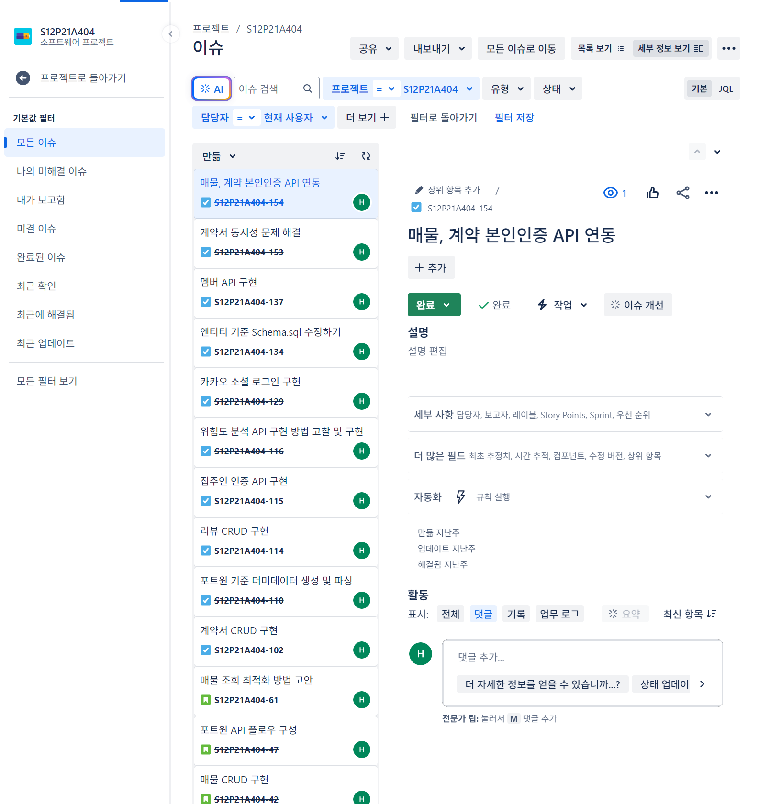

- Jira 스프린트 이슈 해결

<br>

### 2-2. Figma 와이어프레임

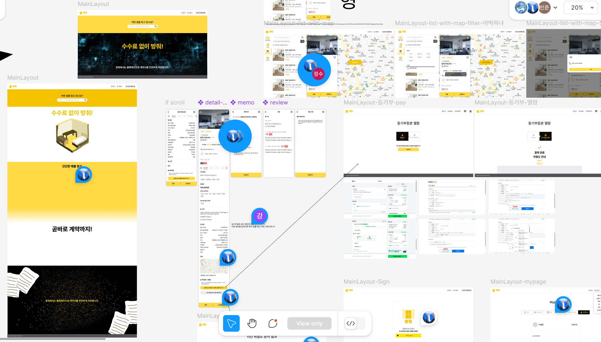

- figma를 사용한 와이어프레임 작성

<br>

### 2-3. Notion 명세 및 문서화

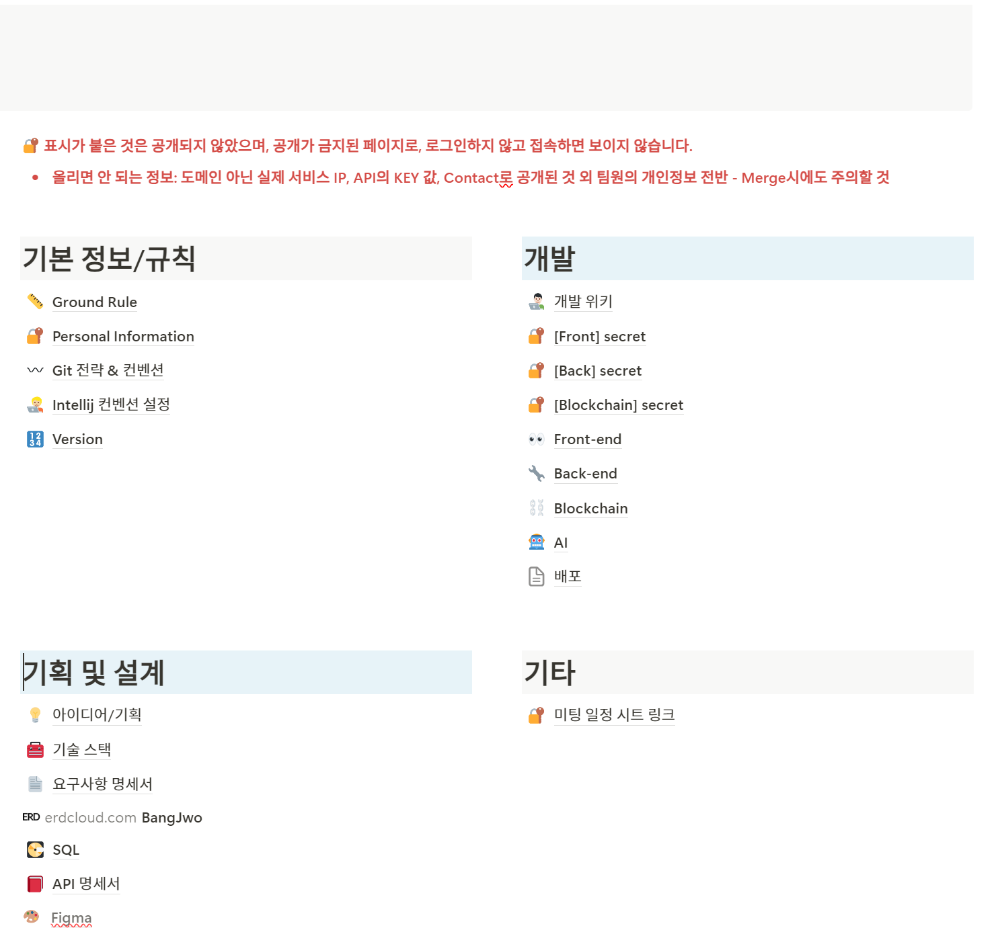

<br>

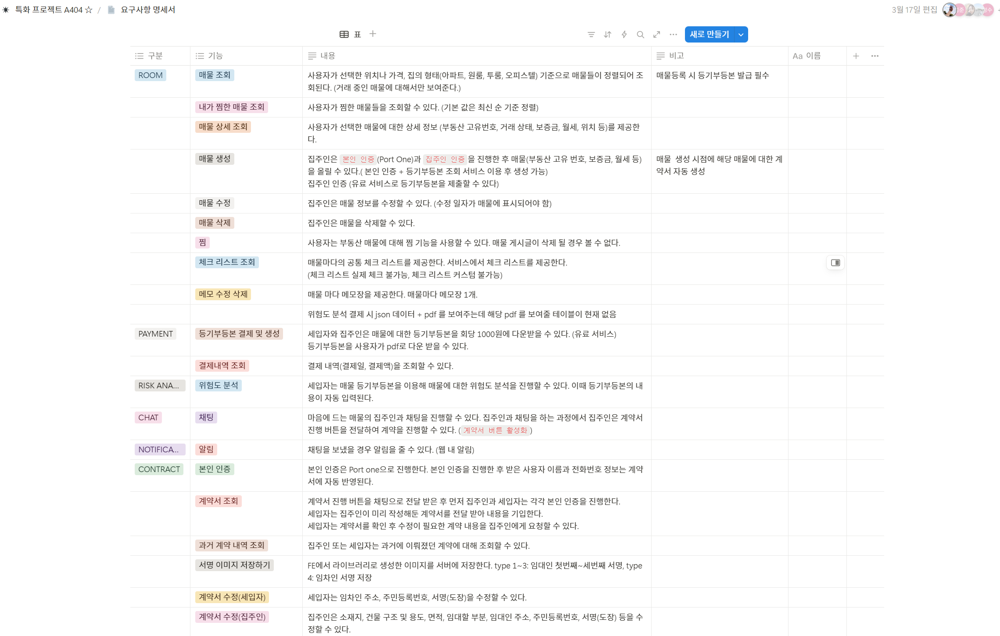

<br>

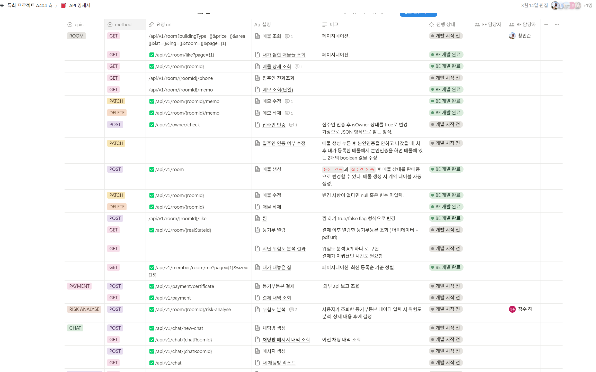

<br>

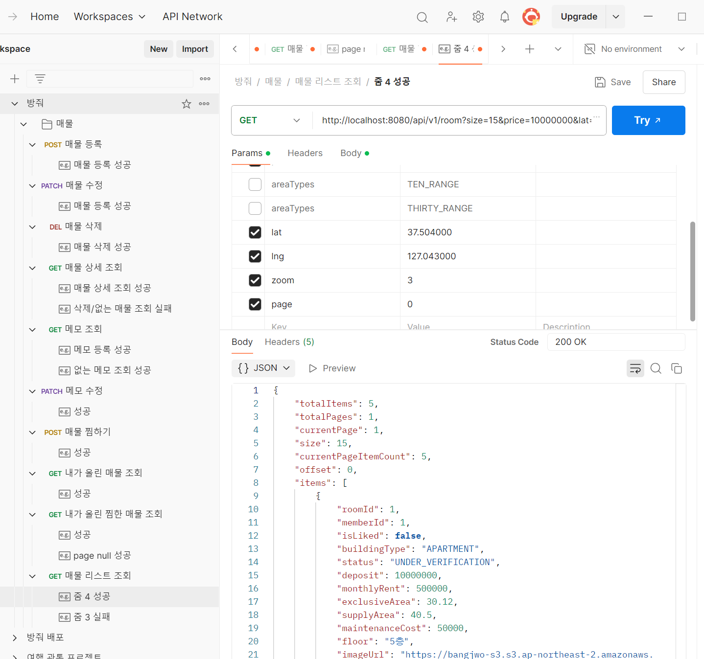

<br>

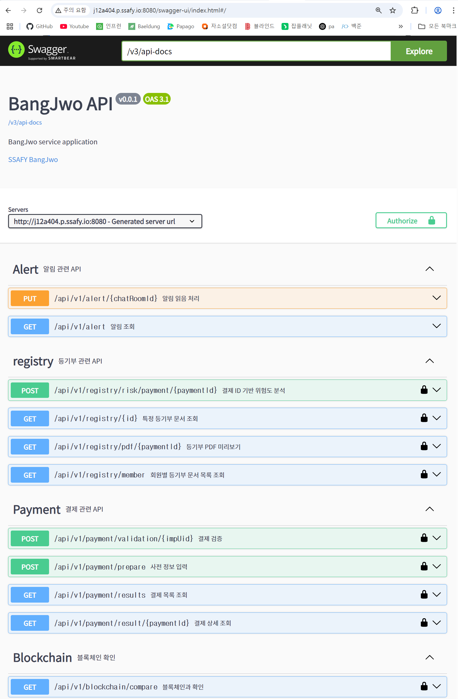

<br>

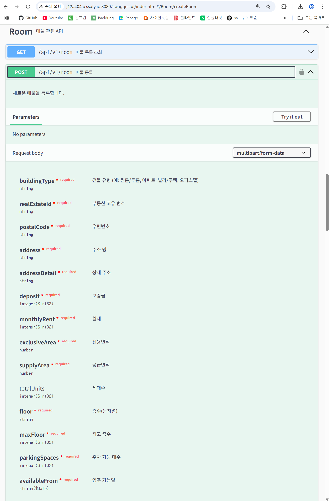

- 요구사항 명세서, API 명세서 노션으로 작성
- API 테스트는 PostMan, Swagger 사용

<br>

### 2-4. ERD 설계

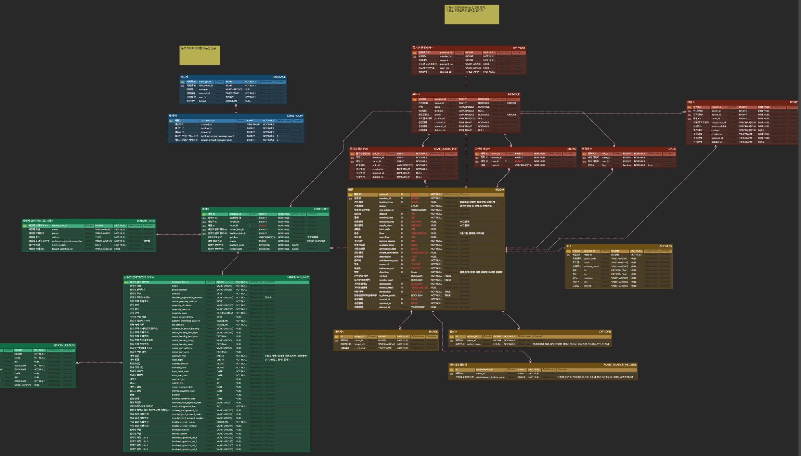

- ERD-Cloud 를 사용한 ERD 설계

<br><br>

## 3. 코드 리팩토링

#### 3-1. 페이지네이션 공통 모듈 분리
- 기존 모든 리스트 정보를 조회 후 해당 리스트를 페이지네이션으로 변환했던 과정을 페이지네이션 객체를 미리 생성 후 JPA 파라미터로 추가하는 로직으로 변경
- 기존 로직은 모든 리스트 조회하고 페이지네이션 객체를 생성하는 것은 N개의 엔티티들을 모두 조회
- 현재 로직은 요청되는 페이지에 해당되는 엔티티만을 조회

```java
// 응답 반환을 위한 페이지네이션 공통 모듈 분리
@Getter
@JsonPropertyOrder({"totalItems", "totalPages", "currentPage", "size", "currentPageItemCount", "offset", "items"})
public class PageResponse<T> {
	private static final int DEFAULT_SIZE = 15;

	private final int totalItems;
	private final int totalPages;
	private final int currentPage;
	private final int size;
	private final int currentPageItemCount;
	private final List<T> items;


	public PageResponse(int totalItems, Integer currentPage, Integer size, List<T> items) {
		int cp = (currentPage == null || currentPage <= 0) ? 1 : currentPage;
		int s = (size == null || size <= 0) ? DEFAULT_SIZE : size;
		this.totalItems = totalItems;
		this.currentPage = cp;
		this.size = s;
		this.currentPageItemCount = (items == null) ? 0 : items.size();
		this.totalPages = (totalItems == 0) ? 0 : (int)Math.ceil((double)totalItems / s);
		this.items = items;
	}

	public PageResponse(int totalItems, Integer currentPage, List<T> items) {
		this(totalItems, currentPage, DEFAULT_SIZE, items);
	}

	public int getOffset() {
		return (currentPage - 1) * size + 1;
	}
}

// Page 객체를 조회하기 위한, Pageable 객체 생성 클래스
public class PaginationRequest {
	private static final int DEFAULT_SIZE = 15;

	public static Pageable toPageable(Integer page, Integer size) {
		int currentPage = (page == null || page < 1) ? 1 : page;
		int pageSize = (size == null || size < 1) ? DEFAULT_SIZE : size;

		return PageRequest.of(currentPage - 1, pageSize);
	}

	public static Pageable toPageable(Integer page) {
		int currentPage = (page == null || page < 1) ? 1 : page;
		
		return PageRequest.of(currentPage - 1, DEFAULT_SIZE);
	}
}

// 조회를 위한 매물 레포지토리로 Pageable 객체를 사용해 Page에 해당하는 엔티티만 페이지 리스트로 반환
@Repository
public interface RoomRepository extends JpaRepository<Room, Long> {
	Optional<Room> findByRoomIdAndDeletedAtIsNull(Long roomId);

	Page<Room> findAllByMemberId(Long memberId, Pageable pageable);

	List<Room> findByRoomIdIn(List<Long> roomIds);

	Page<Room> findAll(Specification<Room> spec, Pageable pageable);
}
```

<br>

#### 3-2. S3 File Upload 모듈 분리

```java
// 매물 저장 기존 코드
@Service
public class RoomImageService {
	private final ImageRepository imageRepository;
	private final RoomRepository roomRepository;

	private final S3Client s3Client;

	@Value("${aws.s3.bucket}")
	private String bucketName;

	@Value("${aws.region}")
	private String awsRegion;

	public void uploadAndSaveImage(Room room, MultipartFile file) {
		try {
			String fileName = UUID.randomUUID() + "_" + file.getOriginalFilename();

			PutObjectRequest putObjectRequest = PutObjectRequest.builder()
				.bucket(bucketName)
				.key(fileName)
				.build();

			s3Client.putObject(putObjectRequest, RequestBody.fromBytes(file.getBytes()));

			String imageUrl = "https://" + bucketName + ".s3." + awsRegion + ".amazonaws.com/" + fileName;

			Room managedRoom = roomRepository.getReferenceById(room.getRoomId());

			Image image = Image.builder()
				.room(managedRoom)
				.imageUrl(imageUrl)
				.build();

			imageRepository.save(image);
		} catch (IOException e) {
			throw new BusinessException(RoomErrorCode.FAIL_IMAGE_UPLOAD);
		}
	}
}
```

#### 문제 사항
- 해당 코드를 잘 사용하고 있다가 이후 다른 도메인에서도 이미지 저장하는 로직이 필요
- S3에 대한 정보를 애초에 매물 ImageService 이 관리하고 있는 구조가 잘못된 설계라고 생각이 들게되었음
    - 이후 확장될 수 있을 만한 기능에 대해서 설계에서 분리하는 습관을 들이면 좋을 것 같음..
- 이후 다른 도메인에서도 사용할 수 있도록 어댑터 패턴을 이용한 아래 방법으로 분리
    - 추상화된 기능을 구현한 구현체를 의존성 주입하여 연결하는 어댑터 패턴 적용

```java
// 이후 기능이 추가될수 있어 추상화
public interface FileUploaderPort {
	String upload(MultipartFile file, String directory, String fileName);
}

// S3 관련 데이터를 해당 어댑터가 관리
@Service
@RequiredArgsConstructor
public class S3FileUploaderAdapter implements FileUploaderPort {
	private final S3Client s3Client;

	@Value("${aws.s3.bucket}")
	private String bucketName;

	@Value("${aws.region}")
	private String awsRegion;

	@Override
    public String upload(MultipartFile file, String directory, String fileName) {
		try {
			String key = directory + fileName;
			PutObjectRequest putObjectRequest = PutObjectRequest.builder()
				.bucket(bucketName)
				.key(key)
				.build();

			s3Client.putObject(putObjectRequest, RequestBody.fromBytes(file.getBytes()));

			return "https://" + bucketName + ".s3." + awsRegion + ".amazonaws.com/" + key;
		} catch (IOException e) {
			throw new BusinessException(GlobalErrorCodes.FAIL_IMAGE_UPLOAD);
		}
	}
}

// 이후 S3 관련 정보는 FileUploaderPort 인터페이스가 관리
@Service
@RequiredArgsConstructor
public class RoomImageService {
    private final static String IMAGE_PATH = "rooms/"
	private final FileUploaderPort fileUploader;
	private final RoomImageRepository imageRepository;
	private final RoomRepository roomRepository;

	public void uploadAndSaveImage(Room room, MultipartFile file) {
		String fileName = UUID.randomUUID() + "_" + file.getOriginalFilename();
		String imageUrl = fileUploader.upload(file, IMAGE_PATH, fileName);
		Room managedRoom = roomRepository.getReferenceById(room.getRoomId());
		Image image = Image.builder().room(managedRoom).imageUrl(imageUrl).build();
		imageRepository.save(image);
	}
}
```

<br>

### 3-3. JWT 로그인 API 공통 모듈 분리

- @SecurityScheme를 통해 Swagger에 JWT 인증 스키마를 등록하고, @MemberHeader라는 커스텀 어노테이션을 만들어, 컨트롤러에서 로그인된 유저의 memberId를 자동으로 주입
- HandlerMethodArgumentResolver를 사용해 JWT 파싱 로직을 공통화하고, 로그인 시 추가정보가 제공되는 API가 있어 로그인 여부에 따라 required 값을 통해 유연하게 대응할 수 있도록 설계
- Swagger 문서에서는 각 API에 @SecurityRequirement(name = "JWT")를 명시하여 로그인 필요 API를 시각적으로 구분이 가능하도록 함

```java
/**
 * @SecurityScheme 애노테이션을 통해 Swagger 문서에서 사용할 보안 스키마를 등록
 * name = "JWT"로 명명하여, 이후 API 메서드에 @SecurityRequirement(name = "JWT")를 달면 "JWT 인증이 필요한 API"로 표시
 * type = SecuritySchemeType.HTTP와 scheme = "bearer"는 Bearer 타입의 HTTP 인증임을 의미
 */
@Configuration
@SecurityScheme(
    name = "JWT",
    type = SecuritySchemeType.HTTP,
    scheme = "bearer",
    bearerFormat = "JWT"
)
public class SwaggerConfig {
    // Swagger 설정과 관련된 추가 설정
}

/**
 * 특정 컨트롤러 메서드에서 @Operation 내 security 속성을 사용해,
 * JWT 인증이 필요한 API임을 Swagger 문서에 명시
 *
 * @Parameter(description, example 등으로 스웨거 파라미터 정보를 설정할 수 있음
 * @MemberHeader를 사용해 JWT에서 파싱된 memberId가 자동 주입
 */
@Operation(
    summary = "등기부 문서 조회 예시",
    description = "JWT 인증이 필요한 API",
    security = @SecurityRequirement(name = "JWT")  // "JWT" 보안 스키마를 적용
)
@GetMapping("/{id}")
public ResponseEntity<RegistryDocument> getRegistryDoc(
    @Parameter(description = "등기부 문서 ID", example = "67e6332b68f0cb1ff92bf31e", required = true)
    @PathVariable String id,
    @MemberHeader Long memberId  // 커스텀 어노테이션을 통한 JWT 파싱 후 유저 ID 조회
) {
    // 실제 비즈니스 로직
    return ResponseEntity.ok(new RegistryDocument());
}

/**
 * 로그인 커스텀 어노테이션.
 *
 * @Parameter(hidden = true)를 통해 Swagger 문서에서 이 파라미터가 노출되지 않도록 설정
 * required()가 true이면 토큰이 없거나 유효하지 않을 경우 예외가 발생하며,
 * false일 경우 토큰이 없어도 null 값으로 주입
 */
@Target(ElementType.PARAMETER)
@Retention(RetentionPolicy.RUNTIME)
@Parameter(hidden = true)
@Documented
public @interface MemberHeader {
    boolean required() default true;
}

/**
 * ArgumentResolver를 활용해 @MemberHeader가 붙은 Long 타입 파라미터에 대한
 * JWT 파싱 로직을 공통화
 *
 * 1) 헤더 검증: Authorization 헤더가 비어있거나 Bearer 로 시작하지 않으면 예외(또는 null)
 * 2) 토큰 파싱: 'Bearer ' 제거 후 JwtTokenProvider로 실제 파싱 및 검증
 * 3) 토큰이 유효하지 않거나 memberId가 숫자로 변환 불가 시 예외 발생
 * 4) 성공 시, 컨트롤러 메서드 파라미터에 memberId(Long) 주입
 */
@RequiredArgsConstructor
public class MemberHeaderArgumentResolver implements HandlerMethodArgumentResolver {
    private final JwtTokenProvider jwtTokenProvider;

    @Override
    public boolean supportsParameter(MethodParameter parameter) {
        // @MemberHeader 애노테이션이 달리고, 타입이 Long인 경우만 처리
        return parameter.hasParameterAnnotation(MemberHeader.class)
            && parameter.getParameterType().equals(Long.class);
    }

    @Override
    public Object resolveArgument(
        MethodParameter parameter,
        ModelAndViewContainer mavContainer,
        NativeWebRequest webRequest,
        WebDataBinderFactory binderFactory
    ) throws Exception {
        HttpServletRequest request = webRequest.getNativeRequest(HttpServletRequest.class);
        String authorizationHeader = request.getHeader("Authorization");

        MemberHeader memberHeader = parameter.getParameterAnnotation(MemberHeader.class);

        // 1) 토큰 유무 및 Bearer 형식 확인
        if (authorizationHeader == null || !authorizationHeader.startsWith("Bearer ")) {
            // required=false인 경우 토큰이 없어도 null을 반환
            if (!memberHeader.required()) {
                return null;
            } else {
                // required=true인데 토큰이 존재하지 않거나 형식이 잘못된 경우 예외
                throw new BusinessException(AuthErrorCode.NOT_EXIST_AUTHORIZATION_TOKEN);
            }
        }

        // 2) 'Bearer ' 부분 제거 후 실제 토큰 문자열 추출
        String token = authorizationHeader.substring(7);

        // 3) 토큰 파싱 및 memberId 추출
        String memberIdStr = jwtTokenProvider.getClaims(token);

        // 4) 숫자 변환 실패 시 예외
        try {
            return Long.valueOf(memberIdStr);
        } catch (NumberFormatException e) {
            throw new BusinessException(AuthErrorCode.INVALID_AUTHORIZATION_TOKEN);
        }
    }
}
```

<br><br>

### 4. 트러블 슈팅

### 4-1. 단방향 연관관계 JPQL 코드 수정 고민
- 단건 조회에서 매물(Room)에 관련된 객체를 받아오고 각각의 Repository에서 조회하고 있는데 이후 GPT를 통해 JPQL을 이용한 아래 방법이 되는지 확인해봤는데 역시 안됨
    - 현재 Room에는 양방향 연관관계가 되어있지 않음
    - 객체와 SQL문이 섞여 사용하다보니 복잡하기도 함
- 1:1 관계인 Address나 Likes 같이 단일 값은 처리하기 쉽지만, Options, MaintenanceInclude, Image와 같은 1:N 컬렉션을 포함하면 데이터 중복 문제가 발생할 수 있다고 함
- 현재 단건조회 이며 추가적인 조회쿼리에 대해서는 각각의 엔티티 별도의 Repository 가 나뉘어 있으니 각각 단건 조회하는 것이 좋다고 생각되었음. 이전 방법을 그대로 이용

```java
// 기존 코드
@Transactional(readOnly = true)
public SearchRoomResponseDto searchRoom(Long roomId, Long memberId) {
    var room = findRoom(roomId);
    var address = addressService.findByRoom(room);
    var options = optionService.findByRoom(room);
    var maintenanceIncludes = maintenanceIncludeService.findByRoom(room);
    var images = imageService.findByRoom(room);
    var isLiked = likeRepository.findByRoomAndMemberId(room, memberId)
        .map(Likes::getFlag)
        .orElse(false);

    return RoomConverter.convert(room, isLiked, address, options, maintenanceIncludes, images);
}

// 이후 고민 코드
@Query("""
    SELECT new com.bangjwo.room.application.dto.response.SearchRoomResponseDto(
            r, a, o, m, i)
    FROM Room r
    LEFT JOIN Address a ON a.room = r
    LEFT JOIN Options o ON o.room = r
    LEFT JOIN MaintenanceInclude m ON m.room = r
    LEFT JOIN Image i ON i.room = r
    WHERE r.roomId = :roomId
    """)
Optional<SearchRoomResponseDto> findRoomDetailsByRoomId(Long roomId);

```

<br><br>

### 4-2. 매물 조회 시 N + 1 문제 발생
- 현재 Page로 생성한 ROOM 엔티티 리스트를 먼저 조회하고 각 ROOM 엔티티 마다 LIKES, IMAGE 엔티티가 N번(Room 리스트 size 만큼) 씩 추가 조회 쿼리가 실행됨
    - 현재 페이지네이션을 통해 총 page size * 2 번 만큼 반복되고 있음 ( 1 + 2N )
- 현재 구성은 ROOM 엔티티를 조회 이후 LIKES, IMAGE 엔티티 내부에 ROOM이 있고, 해당 ROOM으로 LazyLoading 조회를 통해 1 + 2N 조회되는 문제가 발생함

<br>

```sql
Hibernate: 
    /* <criteria> */ select
        r1_0.room_id,
        r1_0.available_from,
        r1_0.bathroom_cnt,
        r1_0.building_type,
        ...
    from
        room r1_0 
    where
        r1_0.member_id=? 
    limit   /* Pageable 객체만큼만 조회 */
        ?
```

- 변경된 sql 페이지네이션 조회 결과

<br><br>

```sql
Hibernate: 
    /* <criteria> */ select
        r1_0.room_id,
        r1_0.available_from,
        r1_0.bathroom_cnt,
        ...
    from
        room r1_0 
    where
        r1_0.monthly_rent<=? 
        and (
            r1_0.exclusive_area between ? and ? 
            or r1_0.exclusive_area between ? and ? 
            or r1_0.exclusive_area between ? and ?
        ) 
        and r1_0.room_id in ((select
            a1_0.room_id 
        from
            address a1_0 
        where
            a1_0.lat between ? and ? 
            and a1_0.lng between ? and ?)) 
    limit
        ?, ?
Hibernate: 
    /* <criteria> */ select
        l1_0.like_id,
        l1_0.flag,
        ...
    from
        likes l1_0 
    where
        l1_0.room_id=? 
        and l1_0.member_id=?
Hibernate: 
    /* <criteria> */ select
        i1_0.image_id,
        i1_0.created_at,
        ...
    from
        image i1_0 
    where
        i1_0.room_id=? 
    order by
        i1_0.room_id desc 
    limit
        ?
Hibernate: 
    /* <criteria> */ select
        l1_0.like_id,
        l1_0.flag,
        ...
    from
        likes l1_0 
    where
        l1_0.room_id=? 
        and l1_0.member_id=?
Hibernate: 
    /* <criteria> */ select
        i1_0.image_id,
        i1_0.created_at,
        ...
    from
        image i1_0 
    where
        i1_0.room_id=? 
    order by
        i1_0.room_id desc 
    limit
        ?
Hibernate: 
    /* <criteria> */ select
        l1_0.like_id,
        l1_0.flag,
    ......  /*  page 만큼 반복 */
```

<br>

### 현재 문제가 되는 코드

```java
@Entity
@Table(name = "LIKES") // ...
public class Likes {
	@Id
	@GeneratedValue(strategy = GenerationType.IDENTITY)
	private Long likeId;

    // 현재 단방향으로 구성
	@ManyToOne(fetch = FetchType.LAZY)  // 연관관계가 Lazy로 되어있어 실제 사용 시점에 각각 별도의 조회 발생
	@JoinColumn(name = "room_id", nullable = false)
	private Room room;
    // ...
}


@Entity
@Table(name = "IMAGE") // ...
public class Image extends BaseEntity {
	@Id
	@GeneratedValue(strategy = GenerationType.IDENTITY)
	private Long imageId;

    // 현재 단방향으로 구성
	@ManyToOne(fetch = FetchType.LAZY)  // 연관관계가 Lazy로 되어있어 실제 사용 시점에 각각 별도의 조회 발생
	@JoinColumn(name = "room_id", nullable = false)
	private Room room;
    // ...
}

// RoomService searchRooms() 메서드
Pageable pageable = PaginationRequest.toPageable(page);
Page<Room> roomPage = roomRepository.findAll(spec, pageable);   // Page에 일치하는 Room 리스트 조회

List<RoomSummaryResponse> roomSummaryList = roomPage.getContent().stream()
    .map(room -> {
        boolean liked = likeRepository.findByRoomIdAndMemberId(room.getRoomId(), memberId)  // Room 하나마다 Like 조회
            .map(Likes::getFlag)
            .orElse(false);
        String imageUrl = imageService.findMainImageByRoom(room).getImageUrl(); // Room 하나마다 Image 조회
        return RoomConverter.convertToRoomSummary(room, liked, imageUrl);
    })
    .collect(Collectors.toList());
```

### 문제 해결 방식
- 문제를 해결할 수 있는 첫번째 방식은 Room 을 1번 조회한 후 해당 엔티티들의 RoomId를 추출하여 다른 리스트로 모으고 해당 RoomId 리스트를 In 절으로 배치 조회
- 두번째 방식은 Fetch Join 으로 변경하여 Room과 연관된 Likes, Images 엔티티를 한 번에 조회
    - 물론, Fetch Join을 하기위해서는 Room에 연관 관계를 추가하여 사용하여야함
    - 하지만 페이징과 Fetch Join을 함께 사용시 결과 행이 중복되어 페이징 계산에 문제가 발생할 수 있어 DISTINCT 사용 필요

<br>

### 잘못된 설계로 발생한 문제
- 현재 Room을 생성할 때 Address, Image, Options, Likes 등의 객체를 가져오는데 해당 객체들은 모두 RoomId가 내부에 있기에 해당 테이블안에 위치해두었음
- 이후 Address, Image, Options, Likes 등의 객체를 가져올때 Room을 한번에 가져오는 것은 좋은 생각이었다고 생각
- 그러나 Room을 조회하고 이후 Room에 관련된 객체들을 조회하려니 N + 1 문제가 발생한 것
- fetch 조인을 한다고 해결하려 했지만 다음과 같은 문제가 발생
    - 현재 단방향으로 되어있어 Room에는 연관 엔티티가 없어 양방향으로 바꾸지 않으면 Fetch 조인이 불가능. 양방향으로 된다고 할 때 순환 참조가 발생할 수 있음
    - 또한 Spring Data JPA 공식 문서에 따르면, 페치 조인 + 페이징은 권장하지 않는다고 함

<br>

### 연관 관계 정리
- Lazy 연관 관계는 불필요한 엔티티에 대해 직접 조회하기 전까지는 쿼리를 날리지 않아 해당 엔티티를 안쓰는 항목이 있으면 좋음. 하지만 이후 쓰게 된다면 그 시점에 조회하기 때문에 추가적인 쿼리가 나가게 됨
- JPQL에서 JOIN FETCH 구문을 통해 명시적으로 필요한 엔티티를 JOIN으로 한꺼번에 조회함. Lazy로 설정된 관계라도, 필요한 시점에만 동적으로 fetch join 가능
- [해당 블로그](https://velog.io/@xogml951/JPA-N1-문제-해결-총정리)가 정리가 잘되어있어 참조

<br>

### 배치 방식으로 해결 이유
- Page 객체로 선처리 했던 값을 사용하다보니 Fetch 조인은 중복 문제 발생 가능 + 양방향으로 변경 필요하므로, 첫번째 해결 방법인 배치 방법으로 문제 해결
- 네이티브 쿼리를 사용하지 않은 이유는 하나의 레포지토리에서 다른 엔티티에 대한 의존성이 생길 수 있어, 도메인 책임 분리를 유지하기 위해 JPQL과 배치 조회 방식으로 해결 결정
    - 네이티브 쿼리를 사용시 반환 타입이 Entity가 아니라면 네이티브 쿼리는 영속성 컨텍스트에서 관리되지 않음
    - ex) Room Repository에서 Likes 엔티티를 반환해도 영속성 컨텍스트에 관리되지만 반환 타입이 맞지 않다면 관리되지 않음
- 변경된 코드와 발생 쿼리는 아래와 같음
    - 추가적으로 JPQL 에서 서브쿼리에서 ORDER BY, LIMIT 같은 문법을 지원하지 않아 MAX로 변경

```java
@Transactional(readOnly = true)
public RoomListResponseDto createRoomListResponseDto(
    List<Room> rooms, int totalItems, int page, int size, Long memberId) {
    List<Long> roomIds = rooms.stream()
        .map(Room::getRoomId)
        .toList();

    List<Likes> likes = likeService.getLikeRooms(rooms, memberId);
    Map<Long, Boolean> likeMap = likes.stream()
        .collect(Collectors.toMap(l -> l.getRoom().getRoomId(), Likes::getFlag, (a, b) -> a));

    List<Image> images = imageService.getMainImages(roomIds);
    Map<Long, String> imageMap = images.stream()
        .collect(Collectors.toMap(i -> i.getRoom().getRoomId(), Image::getImageUrl, (a, b) -> a));

    List<RoomSummaryResponse> roomSummaryList = rooms.stream()
        .map(room -> {
            boolean liked = likeMap.getOrDefault(room.getRoomId(), false);
            String imageUrl = imageMap.getOrDefault(room.getRoomId(), null);
            return RoomConverter.convertToRoomSummary(room, liked, imageUrl);
        })
        .toList();

    return new RoomListResponseDto(totalItems, page, size, roomSummaryList);
}

// Image JPQL
@Query("""
        SELECT i
        FROM Image i
        WHERE i.room.roomId IN :roomIds
        AND i.createdAt = (
            SELECT MAX(i2.createdAt)
            FROM Image i2
            WHERE i2.room.roomId = i.room.roomId
        )
    """)
List<Image> findMainImagesByRoomIds(@Param("roomIds") List<Long> roomIds);

// Likes JPQL
@Query("""
        SELECT l
        FROM Likes l
		WHERE l.room IN :rooms AND l.memberId = :memberId
    """)
List<Likes> findByRoomInAndMemberId(@Param("rooms") List<Room> rooms, @Param("memberId") Long memberId);
```

<br>

```java
Hibernate: 
    /* <criteria> */ select
        r1_0.room_id,
        r1_0.available_from,
        ...
    from
        room r1_0 
    where
        r1_0.monthly_rent<=? 
        and (
            r1_0.exclusive_area between ? and ? 
            or r1_0.exclusive_area between ? and ? 
            or r1_0.exclusive_area between ? and ?
        ) 
        and r1_0.room_id in ((select
            a1_0.room_id 
        from
            address a1_0 
        where
            a1_0.lat between ? and ? 
            and a1_0.lng between ? and ?)) 
    limit
        ?, ?
Hibernate: 
    /* SELECT
        l 
    FROM
        Likes l 
    WHERE
        l.room IN :rooms 
        AND l.memberId = :memberId  */
         select
            l1_0.like_id,
            l1_0.member_id,
            l1_0.room_id
            ...
        from
            likes l1_0 
        where
            l1_0.room_id in (?, ?, ?) 
            and l1_0.member_id=?
Hibernate: 
    /*     SELECT
        i     
    FROM
        Image i     
    WHERE
        i.room.roomId IN :roomIds     
        AND i.createdAt = (
            SELECT
                MAX(i2.createdAt)         
            FROM
                Image i2         
            WHERE
                i2.room.roomId = i.room.roomId     
        )  */ 
        select
            i1_0.image_id,
            i1_0.image_url,
            i1_0.room_id,
            ...
        from
            image i1_0 
        where
            i1_0.room_id in (?, ?, ?) 
            and i1_0.created_at=(
                select
                    max(i2_0.created_at) 
                from
                    image i2_0 
                where
                    i2_0.room_id=i1_0.room_id
            )
```

<br><br>

### 4-3. 계약서 작성 시 동시성 문제 발생
- 현재 계약서 작성 과정은 다음과 같고, 해당 과정이 끝나야만 다음 단계로 접근 가능
    1. 계약 진행에 따른 계약서 생성
    2. 임대인 계약서 저장
    3. 임차인 계약서 저장
    4. 작성된 계약서를 각자 최종 조회 후 수정
    5. 임차인 서명
    6. 임대인 서명
    7. 계약 최종 완료
- 해당 과정에 있어 임차인 서명하는 동안 임대인이 계약서를 수정하고 있는 경우가 존재하고, 임차인이 서명 완료하는 시점에 봤었던 계약서 내용과 달라질 수 있는 문제가 발생할 수 있음
- 이에 있어 임대인이 3번 이후 계약서를 수정하거나 5번에서 임차인이 서명하는 경우를 Redis 락을 통해 접근하도록 변경 예정
- 퍼사드 패턴을 사용하여 기존 로직 이전에 락을 확인하고 접근하도록 수정 예정

<br>

### 문제 해결 방법으로 Redis 단순 락으로 사용한 이유
- 방법으로는 다양한 방법들이 존재했는데 JVM 내부 락(synchronized, ReentrantLock), 스핀락, Redission 분산락, DB 낙관적/비관적 락 등이 존재
- 우선 Redis를 사용한 간단한 락으로 구현하기로 결정했는데 이유는 아래들과 같음
    - 계약서 락 자동 해제는 TTL 기반으로, 인메모리 DB를 사용한 Redis 단순 락 방식으로 결정
    - 현재 채팅 관련으로 Redis를 이미 사용하고 있음
- 스레드의 비정상적인 종료에 대비하여 자동으로 락을 해제하는 방법이 필요. 이에 대해 스핀락같은 하트비트 방식은 불필요한 CPU를 점유 발생
- 현재 프로젝트는 모놀리식 구조로 분산 환경을 고려할 필요는 없지만, 이후 MSA로 확장 가능한 형태로는 구성하면 좋을 것 같다고 판단
- 물리 DB를 직접 조회하여 상태를 확인하는 과정이 불필요한 I/O 연산이나 병목을 추가한다고 판단
- Redission 은 TTL 자동 연장 같은 여러 기능이 존재하지만 현재 락 요구 수준에서는 라이브러리 도입이 과도하다고 판단하여 우선순위에서 제외

<br>

### 해결 코드

```java
// 임대인 계약서 수정 메서드
@Transactional
@RedisLock(key = "'contract:' + #requestDto.contractId", errorCode = RedisLockErrorCode.TENANT_IN_PROGRESS)
public void finalLandlordAfterTenant(UpdateLandlordInfoDto requestDto, Long memberId) {
    // ...
}

// 임차인 계약서 서명 메서드
@Transactional
@RedisLock(key = "'contract:' + #requestDto.contractId", errorCode = RedisLockErrorCode.LANDLORD_IN_PROGRESS)
public void updateTenantSignature(TenantSignatureUpdateRequestDto requestDto, Long memberId) {
    // ...
}

// RedisLock 커스텀 어노테이션
@Target(ElementType.METHOD)
@Retention(RetentionPolicy.RUNTIME)
public @interface RedisLock {
	String key();
	long leaseTime() default 1800;
	RedisLockErrorCode errorCode() default RedisLockErrorCode.LOCKED_RESOURCE;
}

// Redis AOP 
@Slf4j
@Aspect
@Component
@RequiredArgsConstructor
public class RedisLockAspect {
	private final StringRedisTemplate redisTemplate;

    // 락의 소유자만 락을 풀수 있도록 하기 위한 Redis Lua 스크립트
	private static final String UNLOCK_SCRIPT =
		"if redis.call('get', KEYS[1]) == ARGV[1] then " +
			"   return redis.call('del', KEYS[1]) " +
			"else " +
			"   return 0 " +
			"end";

	@Around("@annotation(redisLock)")
	public Object around(ProceedingJoinPoint joinPoint, RedisLock redisLock) throws Throwable {
		String key = parseKey(redisLock.key(), joinPoint);
		long leaseTime = redisLock.leaseTime();

		String uuid = UUID.randomUUID().toString();

        // setIfAbsent를 사용하면 RedisClient 내부적으로 SENTX 구문을 사용하여 하나의 스레드만 접근이 가능
		Boolean success = redisTemplate
			.opsForValue()
			.setIfAbsent(key, uuid, leaseTime, TimeUnit.SECONDS);

		if (Boolean.FALSE.equals(success)) {
			throw new BusinessException(redisLock.errorCode());
		}

		try {
			return joinPoint.proceed();
		} finally {
			releaseLock(key, uuid);
		}
	}

    // 락 해제
	private void releaseLock(String key, String uuid) {
		redisTemplate.execute(
			new DefaultRedisScript<>(UNLOCK_SCRIPT, Long.class),
			List.of(key),
			uuid
		);
	}

    // 
	private String parseKey(String keyExpression, ProceedingJoinPoint joinPoint) {
		MethodSignature signature = (MethodSignature)joinPoint.getSignature();

		EvaluationContext context = new StandardEvaluationContext();
		String[] parameterNames = signature.getParameterNames();
		Object[] args = joinPoint.getArgs();

		for (int i = 0; i < parameterNames.length; i++) {
			context.setVariable(parameterNames[i], args[i]);
		}

		ExpressionParser parser = new SpelExpressionParser();
		return parser.parseExpression(keyExpression).getValue(context, String.class);
	}
}
```
- AOP 및 퍼사드 패턴을 활용한 Redis 단순 락 구현
- Lock 조회에서 setIfAbsent() 명령은, Redis 내부적으로 SENTX를 활용하여 단일 스레드만 접근이 가능
- Lock Key는 SpEL을 통해 동적으로 생성되어, 'contract: {contractId}' 형식으로 Key를 지정
- 불가피하게 서버가 종료되더라도 TTL 이후 락이 해제가 되고, 30분간 2명만이 사용하는 계약서에 접근 못하는 것은 큰 문제가 아니라고 판단
- 또한, 서버가 잠시 중단되고 다시 실행되었을 때 다른 스레드가 락을 다시 가지고 있지만 서버가 중단되는 시점에 중지됬던 스레드가 다시 동작하여 다른 스레드가 가지고 있는 락을 해제하는 경우를 막기 위해 Lua 스크립트를 활용해 락 소유자만 락을 해제할 수 있도록 지정

<br>

### 단위 테스트를 통한 동시성 문제 해결 확인


```java
@Test
void testConcurrentRedisLock() throws InterruptedException {
    int threadCount = 20;
    ExecutorService executorService = Executors.newFixedThreadPool(threadCount);
    CountDownLatch startLatch = new CountDownLatch(1);
    CountDownLatch doneLatch = new CountDownLatch(threadCount);
    AtomicInteger successCount = new AtomicInteger(0);
    AtomicInteger failCount = new AtomicInteger(0);

    for (int i = 0; i < threadCount; i++) {
        executorService.submit(() -> {
            try {
                TenantSignatureUpdateRequestDto dto = new TenantSignatureUpdateRequestDto();
                dto.setContractId(1L);
                MultipartFile file = mock(MultipartFile.class);
                given(file.getBytes()).willReturn("mock-content".getBytes());
                dto.setSignature(file);

                startLatch.await(); // CountDownLatch를 활용하여 스레드 동시 동작
                contractService.updateTenantSignature(dto, 999L);
                successCount.incrementAndGet();
            } catch (BusinessException e) {
                failCount.incrementAndGet();
                System.out.println("[FAIL] " + e.getErrorCode().getCode());
            } catch (Exception e) {
                failCount.incrementAndGet();
                e.printStackTrace();
            } finally {
                doneLatch.countDown();
            }
        });
    }

    startLatch.countDown(); // 일제히 출발
    doneLatch.await(); // 모두 완료될 때까지 대기
    executorService.shutdown();

    System.out.println("성공: " + successCount.get());
    System.out.println("실패: " + failCount.get());

    assertEquals(1, successCount.get(), "성공한 스레드는 정확히 1개여야 합니다");
    assertEquals(threadCount - 1, failCount.get(), "나머지 스레드는 락 에러가 발생해야 합니다");
}
```

<br>

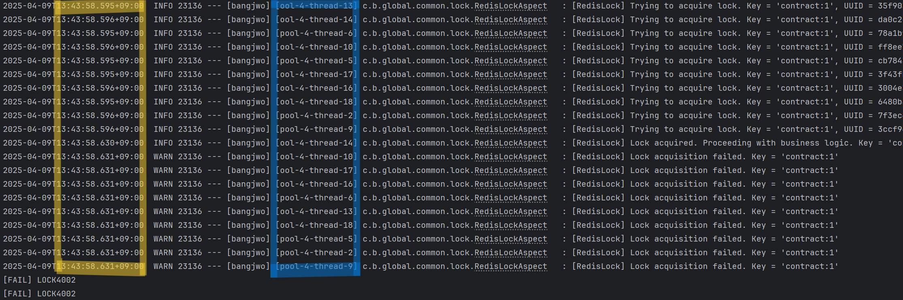

- 해당 노란색 테두리를 보면 스레드 동작 시점은 T13:43:58.595 ~ T13:43:58.596 으로 동시에 시도
- 해당 파란색 테두리를 보면 다양한 스레드가 동작한다는 것을 볼 수 있음

```
// 테스트 성공
성공: 1
실패: 19
```

<br>

### 테스트 코드 Jenkins 빌드 중 문제 발생
- 현재 Jenkins 빌드에서 테스트 코드 동작에 있어 Docker 내부에 있는 MySQL 에 접근하는데 문제 발생
- 이에 있어 기존 clean build를 테스트 코드를 제외하고 실행하는 clean build -x test 로 빌드 명령어 수정

<br>

<br>

## 5. 화면 구성

### 1. 카카오 로그인


<br>

### 2. 매물 등록


<br>

### 3. 매물 조회 및 등기부등본 위험도 분석


<br>

### 4. 문의 채팅


<br>

### 5. 계약서 작성


<br>

### 6. 계약서 챗봇


<br>