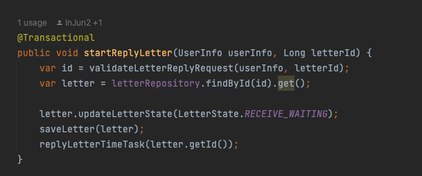
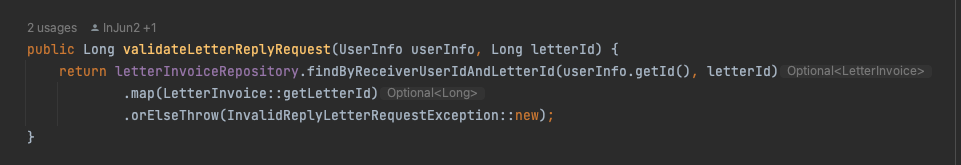
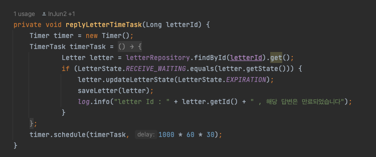
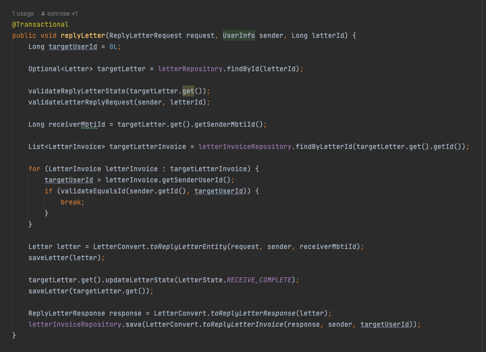
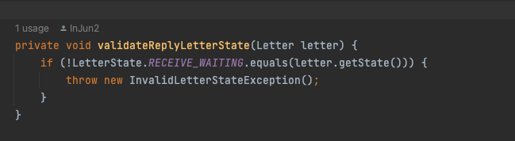
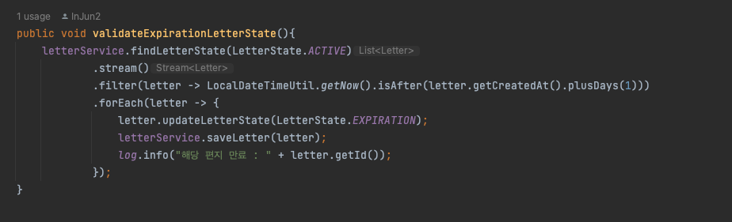

# Glass-Bottle 편지 발송 시 유효시간 직후 답변을 쓸 경우 처리

### 프로젝트 flow 설명
- 현재 진행 중인 프로젝트인 [Glass-Bottle](https://github.com/selab-hs/glass-bottle) 프로젝트는 발송자가 편지를 작성하면 특정 mbti 무작위 대상 혹은 무작위 대상에게 답변을 받을 수 있음
- 현재 발송자가 보낸 편지의 유효기간은 하루이고 해당 유효기간이 지난다면 5분마다 진행되는 스케줄링을 통해 편지 상태가 만료로 변경됨
- 만료로 변경된 편지는 이후 조회를 제외하고 다른 기능에서 사용될 수 없음

<br>

### 현재 문제
- 만약 발송자가 유효시간이 지나기 직전에 자신에게 온 편지를 확인하고 답변을 쓰려고 할때 문제가 발생
- 발송자가 답변 편지를 쓰는 도중 발신 편지의 상태가 만료가 되고 요청을 보낼 경우 만료된 편지이기 때문에 예외처리 발생
- 해당 문제를 해결하기 위해서 편지를 작성하기전 스케줄링에서 변경되지 않도록 편지 상태를 변경하고 이후 어느 정도의 유효시간을 추가로 주어저야한다고 판단
- 신경 써야하는 부분은 유효시간을 추가로 주어져야 하지만 답변자가 답변을 작성 완료할 경우에는 곧바로 답변 편지가 발송되어야 함
- 해당 요청이 들어올 경우 편지 작성 중인 상태를 알려줄 수 있는 상태로 변경하고 스케줄링의 경우 진행 중 상태의 편지만 스케줄링 하도록 작동하도록 진행
- 또한 답변 편지 작성 경우 상태를 변경한 이후 추가된 시간 이후 작성되지 않으면 만료되도록 진행하여야 함

<br>

### 해결 방법
- 현재 편지 상태는 '진행 중', '만료', '답변 완료'로 이루어져 있으며 '작성 중' 상태를 추가하고 해당 상태로 변경되는 중간 과정을 추가하는 것으로 해결
- 스케줄링의 경우 '진행 중'인 편지만 만료되도록 진행하고 답변 편지 작성 요청 전 편지를 '작성 중'으로 변경되도록 get 요청을 하도록 중간 과정을 추가
- 유효시간은 30분으로 측정되어 답변 편지 확인 시 java.util.Timer 클래스를 통해 '작성 중' 상태라면 30분 이후 '만료' 되도록 진행. '진행 중' 상태는 처음 편지를 발송될 때에만 초기 생성되는 상태이기 떄문에 제외하였음
- 답변 편지 작성 시 '작성 중' 상태가 아니라면 예외처리 발생

<br>

### 쓰레드 생성보다 Timer Class의 장점
- Thread.Sleep 은 동작하는 프로세스에 인터럽트하는 강제로 프로세스를 멈추게 하는 성향이 있기 때문에 시스템 전체에 영향을 준다 (쓰레드의 단점) 
- Thread를 만들어서 Sleep을 사용하지 않고 (Sleep을 사용하면 Timer 기능을 하는 Thread는 물론 시스템 전체가 멈춘다)
- Thread와 비교했을 때 반복(Interval) 간격을 옵션으로 간단하게 정할 수 있다 (2번 조건 만족)  
- 시간 계산을 측정해서 구현할 수 있겠지만 Timer에서는 Interval을 설정만 하면 되기 때문에 사용하기 편리하다 (라이브러리 처럼 사용 가능) 
- Timer는 Callback 개념으로 지정된 시간 후에 Callback을 하는 개념이라 상대적으로 부하가 적게 걸림
- 이 말은 정확한 증거는 아니지만 Thread에서는 Sleep()을 통해 다른 Thread로 옮겨가게 되지만 예를 들면 Sleep(10) 과 같이 작은 수치의 밀리세컨드를 지정하더라도 성능에 영향을 미치게 되지만 CallBack 함수로 호출되는 Timer의 경우는 상대적으로 부하가 적게 걸린다는 말로 보인다.  

<br>

### 사용 방법

#### 답변 작성 확인 로직







- 답변 전 확인 요청 시 로그인 정보(토큰)가 해당 편지의 답변자 유저 ID가 맞는지 유효성 검사 진행. 해당 유저가 존재하지 않을 경우 예외 발생
- 유효성 검사 진행 이후 해당 발송 편지 상태를 '답변 대기' 상태로 변경 후 적용 반영.
- 이후 30분 이후 해당 편지의 상태가 아직 '답변 대기'일 경우 편지 상태를 만료하고 적용 반영 및 로그 출력

<br>

#### 답변 작성 로직





- 기존 답변 작성 로직에서 '답변 대기' 상태가 아니면 예외 발생 로직 추가



- 기존 스케줄링 작업시 '활성' (진행 중) 상태인 경우에만 스케줄링 동작하도록 로직 추가


- JPA Entity 업데이트의 경우 기존에 사용하던 대로 모두 해당 Entity 내의 메소드를 통해 JPA 더티체킹을 통해 상태를 변경하였음


<br>

### 현재 고민
- 쓰레드 생성보다 Timer 생성이 낫다고는 하지만 Timer 요청이 많다면 어떻게 할까.. 해당 요청들도 모두 쓰레드를 쓰는게 아닌가..? 아직 부족한 지식으로 찾아봐야 할것같은데 부하가 걸릴 것으로 생각하고 이러한 고민에 대해 우선 chatGPT에게 질문해보았을때 답변은 이렇다
```
Java Timer 클래스는 일반적으로 많은 부하를 발생시키지는 않습니다. 그러나 Timer 클래스는 단일 스레드를 사용하여 작업을 예약하고 실행하는 방식으로 동작합니다. 이는 Timer에 많은 작업이 예약되어있는 경우 작업이 지연되거나 다른 작업과 충돌할 수 있음을 의미합니다.

또한 Timer 클래스는 오랜 시간 동안 실행되는 작업에는 적합하지 않을 수 있습니다. 예를 들어, 작업이 예상보다 긴 시간이 걸리거나 작업이 예외를 발생시키는 경우 Timer는 작업 스케줄링에 문제를 일으킬 수 있습니다.

Java 5부터는 java.util.concurrent 패키지에서 제공하는 ScheduledThreadPoolExecutor 클래스를 사용하여 작업 스케줄링을 수행하는 것이 권장됩니다. ScheduledThreadPoolExecutor는 Timer보다 유연하고 성능이 향상되었습니다. 작업을 여러 스레드로 분산시키고 예약된 작업이 지연되거나 실패할 경우에도 다른 작업에 영향을 주지 않습니다.

따라서 가능하면 Timer 클래스 대신 ScheduledThreadPoolExecutor를 사용하는 것이 좋습니다. 이를 통해 애플리케이션의 성능과 안정성을 향상시킬 수 있습니다.
```
- 라고 하는데 Timer에 대해 좀더 알아보고 이후 부하를 줄이고 성능을 개선할 수 있는 방안이 있다면 확인 후 적용해보겠음