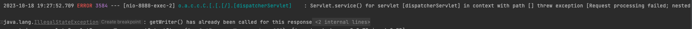

# 코드 피드백

### Authication role은 권한을 나타내라
- 현재 role은 게스트, 유저, 랩장으로 구성되어 있는데 구성원의 역할을 나타내는 것이 아닌 권한을 적어야한다
- 해당 사항을 게스트, 유저, 어드민으로 변경하고 이후 어드민 기능이 확장된다면 매핑 테이블을 통해 어떤 어드민 기능을 가지고 있는지 나누어서 사용해야 한다고 함
- 또한 현재 구성원의 역할은 일단 Member 객체에 State Enum 타입을 통해 재학생, 휴학생, 졸업생, 랩장 등으로 관리하는 것으로 변경

- 이전코드
```java
// Member RoleType Enum
@Getter
@RequiredArgsConstructor
public enum RoleType {
    GUEST("GUEST", "게스트"),
    LAB_USER("ROLE_USER", "랩원"),
    LAB_LEADER("ROLE_LEADER", "랩장");

    private final String role;
    private final String value;

}

// Member 객체 생성
@Builder
public Member(String email, String password, String name,
                Long grade, String studentId){
    this.email = new Email(email);
    this.password = password;
    this.name = new Name(name);
    this.grade = grade;
    this.studentId = new StudentId(studentId);
    this.roleType = RoleType.LAB_USER;
}
```

- 현재 코드

```java
// Member RoleType Enum
@Getter
@RequiredArgsConstructor
public enum RoleType {
    GUEST("GUEST", "게스트"),
    USER("ROLE_USER", "유저"),
    ADMIN("ROLE_ADMIN", "관리자");

    private final String role;
    private final String value;

}

// MemberState Enum
@Getter
@RequiredArgsConstructor
public enum MemberState {
    ENROLLED("재학생"),
    ON_LEAVE("휴학생"),
    GRADUATED( "졸업생"),
    LAB_LEADER("랩장");

    private final String state;
}
```

<br>

---

<div style="text-align: right">23-10-12</div>

<br>

### Filter를 이용한 토큰 처리 방식 변경
- 현재 Jwt 토큰은 Filter 단에서 받아와 파싱하여 유저데이터를 얻어 SpringContext에서 사용하는 구조
- 기존 Jwt 토큰 만료 처리의 경우 만료되었다면 비어있는 토큰을 보내주었으나 해당 경우 토큰이 만료되었다는 정보를 알아낼 수 없음. 토큰 만료시 클라이언트에게 제대로된 응답코드와 메시지를 전달해야함
    - 명확하지 않고 예외처리가 진행되지 않았음. 토큰이 없는 경우와 유사하게 실행되었기에 FE에서 localStorage를 비우기 애매했음
    - 해당 문제를 해결하기 위해 Filter 에서 TokenProvider 클래스의 validateToken에서 예외를 발생하려하였으나 문제가 발생하였음
- 해당 문제는 토큰 만료의 경우 Filter 단에서 로직을 실행하는데 Filter는 WebContext에서 예외를 사용하여 만들어둔 기존 ErrorDto(ResponseEntity)로 반환하려 했으나 되지 않았음

<br>

### Spring Servlet 구조
- Spring 에서는 컨트롤러를 통해 예외 ResponseEntity를 반환하여 전달하려했으나 현재 Filter는 SpringContext 바깥에서 동작하기 때문에 기존 응답을 반환할 수 없었음


<br>

- 기존코드
```java
// Jwt 토큰 파싱 필터
@RequiredArgsConstructor
public class JwtAuthenticationFilter extends GenericFilterBean {
    private final TokenProvider tokenProvider;

    @Override
    public void doFilter(ServletRequest request, ServletResponse response, FilterChain chain)
            throws IOException, ServletException {
        var token = HeaderUtil.getAccessToken((HttpServletRequest) request);

        if (token != null && tokenProvider.validateToken(token)) {  // validate가 false 일때나 토큰이 비어있을 때 
            var authentication = tokenProvider.getAuthentication(token);
            LocalContextHolder.setContext(authentication);
        }
        if(token == null){
            request.setAttribute("noToken", Optional.ofNullable(null));
        }
        chain.doFilter(request, response);
    }

    @Override
    public void destroy() {
        LocalContextHolder.remove();
    }
}

// Token Provider 클래스
@Component
@Slf4j
public class TokenProvider {
    private static final String AUTHORITIES_KEY = "roles";

    @Value("${jwt.token.secret-key}")
    private String secretKey;

    @Value("${jwt.token.expiry}")
    private Long tokenExpiry;
    // ... 그외 코드

    public boolean validateToken(String jwtToken) {
        try {
            Jws<Claims> claims = Jwts.parser().setSigningKey(secretKey).parseClaimsJws(jwtToken);
            return claims.getBody().getExpiration().after(new Date());
        } catch (ExpiredJwtException e)
        {
            log.error("토큰 만료");
            return false;   // 토큰 만료시 false를 리턴하여 비어있는 토큰을 반환
        }
        catch (JwtException e)
        {
            log.error("jwt 에러");
            return false;
        }
    }
```

- 1차 수정 코드
    - 
    - WebContext에서 응답을 시도하려했으나 문제 발생
    - 제대로 응답이 보내지지 않음

```java
// Jwt 토큰 필터 만료 유효검사 변경
// ...
if (token != null) {
    if(!tokenProvider.validateDateToken(token)) {
        jwtExceptionHandler(response);
        request.setAttribute("noToken", Optional.ofNullable(null));
        chain.doFilter(request, response);
    }

    var authentication = tokenProvider.getAuthentication(token);
    LocalContextHolder.setContext(authentication);
    chain.doFilter(request, response);
}

// 메소드 추가. ServletResponse는 HttpServletResponse의 부모 클래스인데 타입 캐스팅 후 예외시 보내주고 있는 ResponseEntity 클래스를 넣어서 응답에 넣어주려고 하였음
public void jwtExceptionHandler(ServletResponse response){
    HttpServletResponse httpResponse = (HttpServletResponse) response;
    var errorResponse = ErrorResponseDto.of(ErrorMessage.EXPIRED_JWT_EXCEPTION);

    httpResponse.setStatus(HttpStatus.UNAUTHORIZED.value());
    httpResponse.setContentType(MediaType.APPLICATION_JSON_VALUE);

    try{
        httpResponse.getWriter().write(MapperUtil.mapper().writeValueAsString(errorResponse));
    } catch (IOException e) {
        log.error(e.getMessage());
    }
}
```

- 에러 발생


<br>

### 피드백 적용
- 해당 Filter를 통해 Jwt 토큰을 사용하고 있는데 Filter에서 사용할 필요가 없음
    - 해당 동작 로직은 기존 Spring Security를 참조하여 만들었는데 Spring Security는 filter 구조를 사용하므로 해당 동작보다 FilterChain을 앞에 두어야 했음. 그러나 로컬로그인을 진행하여 Spring Security 처럼 필터를 쓰거나 앞에 둘 필요가 없음
- Filter를 사용할 필요가 없으므로 해당 로직(Jwt 토큰 처리)을 Argument Resolver에서 사용하면 문제가 없음
    - Argument Resolver는 어떠한 요청이 컨트롤러에 들어왔을 때, 요청에 들어온 값으로부터 원하는 객체를 만들어 내는 일을 간접적으로 해줄 수 있음
- 이전 피드백 내용이었던 ThreadLocal도 제거. 해당 내용도 Spring Security를 참조하여 만들었으나 사용할 필요가 없어 같이 제거를 진행하였음

```java
// argumentResolver를 통한 Jwt 처리
@Component
@RequiredArgsConstructor
public class AuthArgumentResolver implements HandlerMethodArgumentResolver {
    private final TokenProvider tokenProvider;
    
    // ...

    @Override
        public Object resolveArgument(MethodParameter parameter, ModelAndViewContainer mavContainer
                , NativeWebRequest webRequest, WebDataBinderFactory binderFactory) {
            var httpServletRequest = webRequest.getNativeRequest(HttpServletRequest.class); // HttpServletRequest 가져오기
            var token = HeaderUtil.getAccessToken(httpServletRequest);  // 토큰 가져오기
            UserDetail userData = null;

            if (token != null && tokenProvider.validateDateToken(token)) {  // 토큰이 비어있는지 확인 그리고 만료인지 확인
                userData = tokenProvider.getAuthentication(token).getUserDetail();  // 정상적인 토큰이라면 유저 데이터 저장
            }

            if(token == null){
                userData = new Authentication(new UserDetail(), RoleType.GUEST).getUserDetail();    // 토큰이 없으면 게스트 권한 뿐인 Authentication 저장
            }

            return Optional.of(userData).orElseThrow(NullPointerException::new);    // 반환
        }
}

// 헤더에 있는 토큰을 가져오기 위한 클래스 ( 기존과 동일 )
public class HeaderUtil {
    public final static String SELAB_AUTH_HEADER_KEY = "X-SELAB-AUTH-TOKEN";

    public static String getAccessToken(HttpServletRequest request) {
        return request.getHeader(SELAB_AUTH_HEADER_KEY);
    }
}

// TokenProvider Class 다시 예외처리로 변경
// ...
    public Authentication getAuthentication(String token) { // 파싱하여 얻은 유저 ID DB로 조회하여 권한 객체 생성/반환
        UserDetail userDetail = authService.loadUserById(this.getUserToken(token));
        return new Authentication(userDetail, userDetail.getRoleType());
    }

    public boolean validateDateToken(String jwtToken) {
            try {
                Jws<Claims> claims = Jwts.parser().setSigningKey(secretKey).parseClaimsJws(jwtToken);
                return claims.getBody().getExpiration().after(new Date());
            } catch (ExpiredJwtException e) {
                throw new SeExpiredJwtException(ErrorMessage.EXPIRED_JWT_EXCEPTION, "토큰이 만료되었습니다");   // 예외로 변경. ExceptionHandler를 통해 401 상태코드와 메시지 응답
            } catch (JwtException e) {
                throw new SeJwtException(ErrorMessage.WRONG_JWT_EXCEPTION, "잘못된 토큰 정보입니다");   // 예외로 변경. ExceptionHandler를 통해 401 상태코드와 메시지 응답
            }
        }

```

---

<div style="text-align: right">23-10-20</div>

