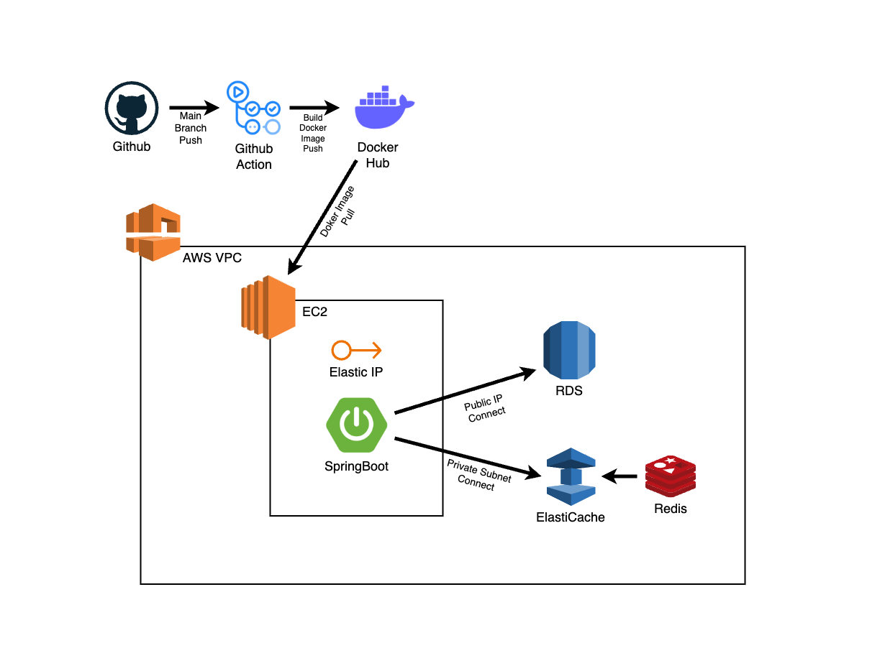
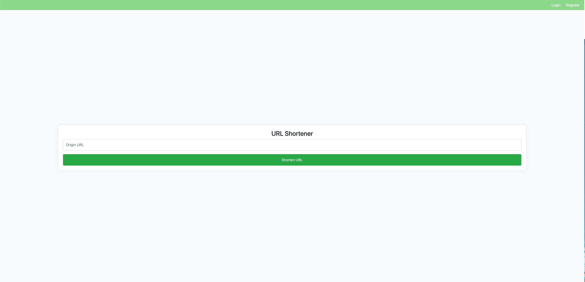
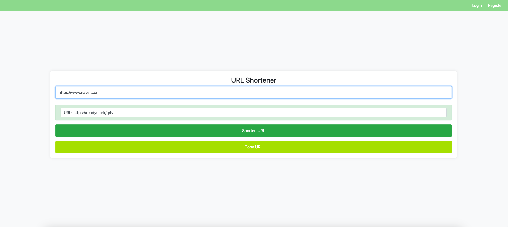
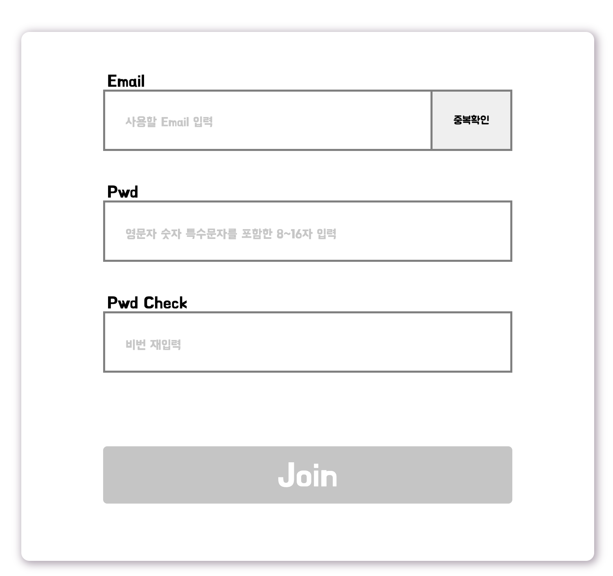
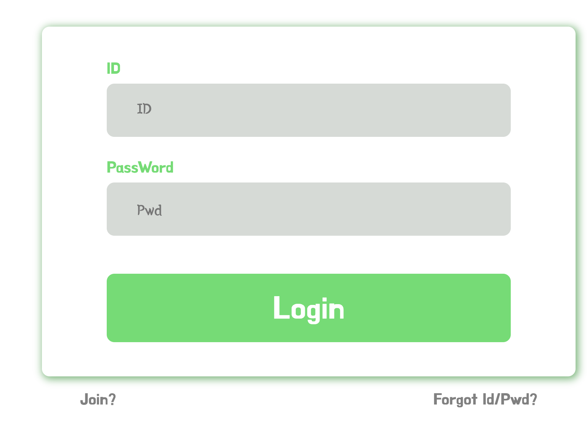
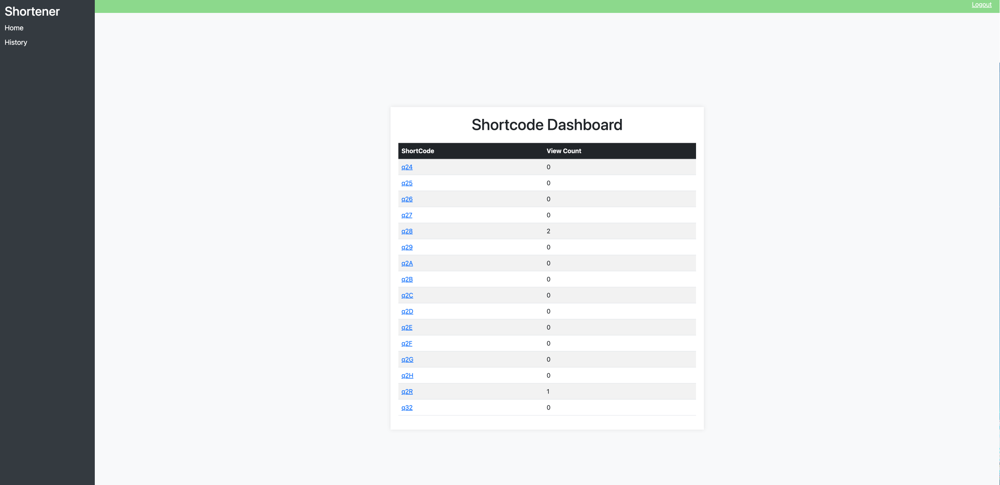
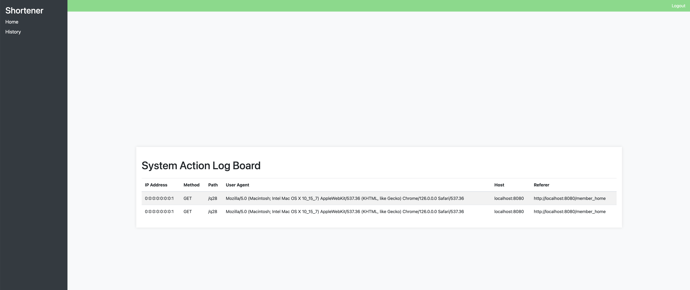

# URL 단축기 프로젝트

## 1. 프로젝트 소개
- 해당 프로젝트는 요청되는 긴 URL을 짧게 변경하게 사용자에게 반환해주는 서비스 입니다.
- 간단한 기능인 만큼 제공되는 성능을 중점으로 프로젝트를 진행하였습니다.
- 프로젝트 참여 인원은 저를 포함한 두명으로 각자 서버 및 화면 구현을 진행하였습니다.
- 저는 주로 인증 및 회원 도메인과 URL 단축 도메인, CI/CD 배포를 담당하였습니다.

### 1-1. 서비스 주요 기능

📑 회원 기능 (담당)
- 회원가입
- 로그인

📑 URL Shortener (담당)
- URL Shortener 구현
- 클라이언트 별 특정 기간 내 요청 횟수 제한

📑 회원 액션 로그
- 유저 Short URL 목록 조회
- Short URL 클라이언트 시스템 액션 로그 조회
- 6개월이 지난 URL 자동 삭제

 

### 1-2. 서비스 아키텍처

- GitHub Action - Docker - AWS VPC (EC2, RDS, ElastiCache) 구조의 CI/CD 배포 자동화를 진행하였습니다.
- AWS Route53, Certification, Elastic Load Balancer 를 사용하여 사용한 도메인의 HTTP(80) 트래픽을 HTTPS(443)로 자동 리다이렉트 리다이렉트를 제공하였습니다.

 

---

 

## 2. 프로젝트 진행 사항

### 2-1. 프로젝트 적용 기술

- Short URL를 `ID` 20000 부터 시작하여 `base62` 인코딩을 통한 Short URL 을 반환하였습니다.
- `Redis` TTL 사용하여 클라이언트별 1분간 10회 요청 제한을 진행하였습니다.
    - `Redis UUID` Key 사용
    - `AOP` Annotation을 사용한 요청 제한
    - 10회라는 적은 횟수 제한으로 `스핀락`으로 구현
- `Swagger 3.0`을 사용하여 문서화를 진행하였습니다.

### 2-2. 프로젝트 도전 사항

1. 빠른 작업 속도를 위해 Shortcode 생성과 캐시 저장 과정을 멀티스레드를 이용해서 기능을 최적화하였습니다.
    - origin url 을 중복 검사 없이 DB에 저장하여 저장된 Index를 Base62(숫자와 영문자)로 인코딩하여 Shortcode를 생성
    - 생성하면서 멀티스레드를 적용하여 새로운 스레드가 Redis에 Key(Shortcode) - Value(origin url) 형식으로 저장, 일정 시간 동안 유지

 

2. 중복되는 검사를 빠르게 처리하기 위해 캐시의 원리를 이용하여 프로젝트에 적용하여 중복 검색은 시간복잡도 O(1)로 성능 최적화하였습니다.
- 1차로 Redis에서 요청 받은 Shortcode를 key 값으로 검색
    캐시히트 : 검색된 value(origin url)을 리턴
    캐시미스 : DB에 조회하여 origin url을 리턴

 

3. System Action Log 기록하는 기능 구현을 위해, HttpServeletRequest에 있는 Header 데이터를 기록하여 접근기록을 보며 데이터를 확인 후 저장하였습니다.
    - HttpSelveletReqeust 에서 원하는 Header 값을 필터링하는 HeaderUtil 구현하여 저장

 

4. 동적 쿼리를 적용하여 복잡한 쿼리 조건을 충족하였습니다.
    - 회원가입을 진행하면서, HttpServeletRequest의 Header의 "client-id"(uuid)로 DB에 조회함. 이후 동일한 uuid가 저장된 Shortcode를 조회하여 생성된 MemberId를 Update함
    - uuid가 사용자마다 다르기 때문에 QueryDsl을 사용한 동적쿼리를 사용하여 기능 구현
    - uuid가 생성한 Shortcode가 대량이 존재하여 전체 조회가 발생하면 서버의 부화가 발생할 수 있으므로 1000개씩 청크를 나누어 조회 후 memberId 업데이트 진행

 

5. 단축 URL 6개월 마다 삭제에서, Batch 작업을 적용하여 일정 기능을 STEP 별로 기능 자동화를 적용하였습니다.
    - 작업을 batch를 사용, 6개월이 지난 DATA를 매일 자정 12시에 Scheduler를 구현
    - 삭제 해야하는 data가 대용량으로 존재할시, 서버의 부하로 리퀘스트에 지장을 줄 수 있기 때문에, 1000건씩 청크를 나누어 삭제 진행

---

## 3. 화면 구성

 

### 3-1. URL 생성

- 비회원/회원 URL 생성 전

 

- URL 생성 후, 해당 링크 클릭 시 기존 URL 리다이렉트

 

### 3-2. 회원가입 / 로그인

- 회원 가입 페이지

 

- 로그인 페이지

 

### 3-3. 회원 URL 조회

- 회원 URL 생성 내역 조회

 

- URL 접근 액션 로그 조회

 

