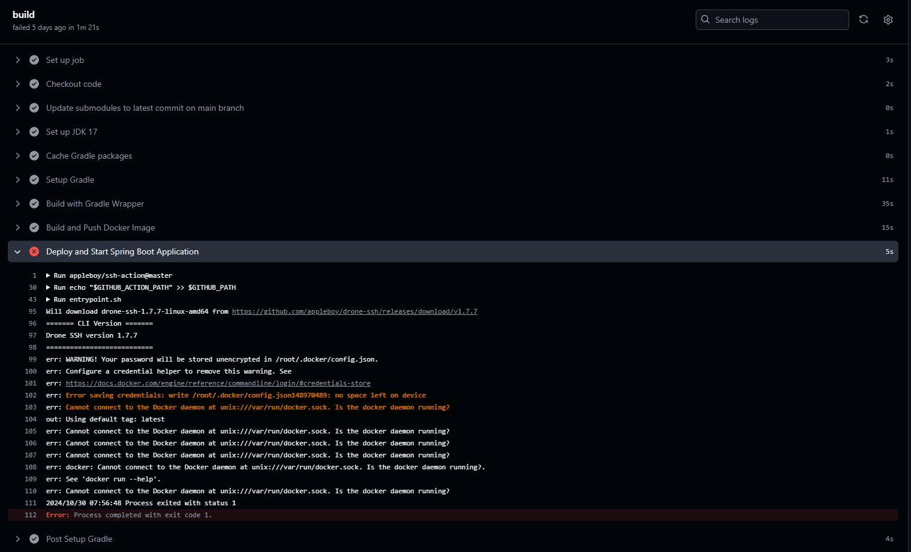
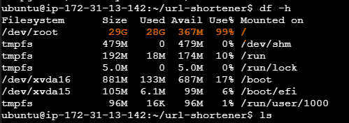
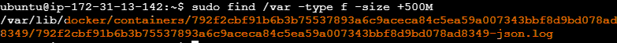
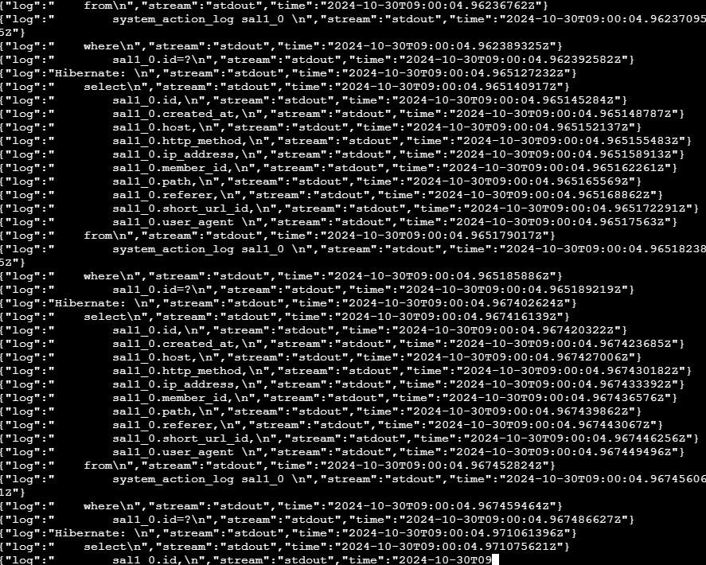
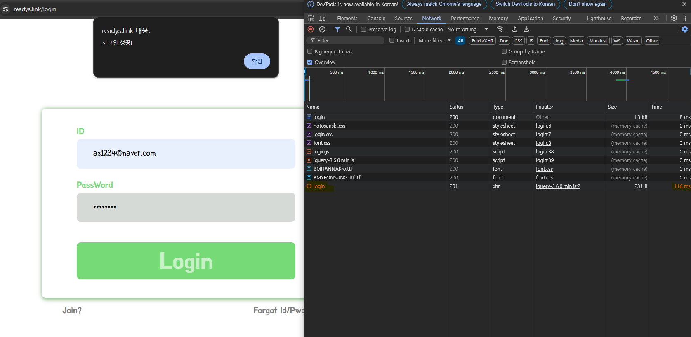
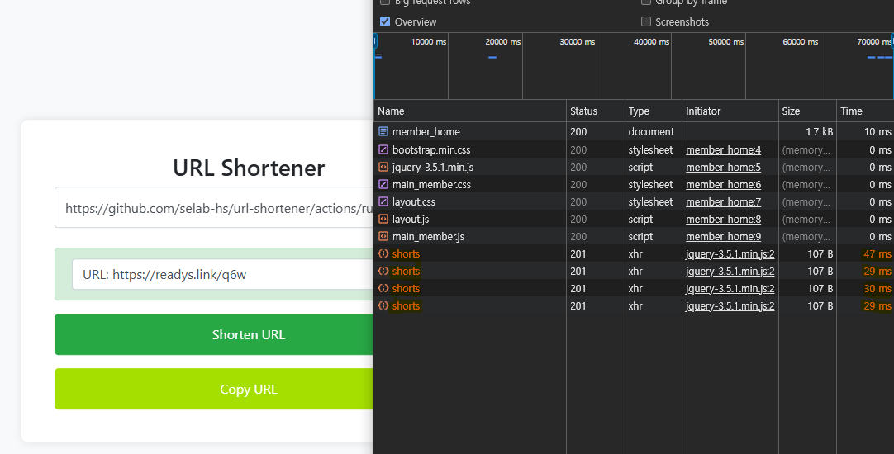
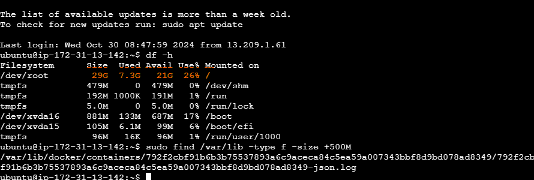
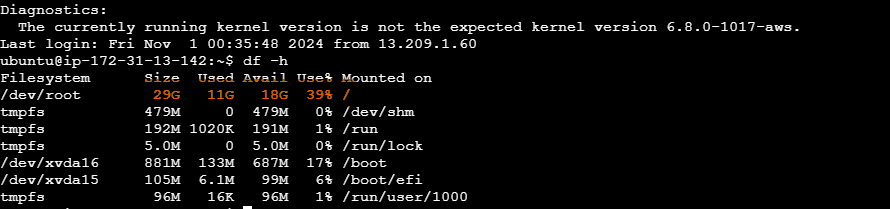

# 트러블 슈팅 기록

## 1. 로그인/회원가입/회원 URL 정보 조회 4초 가량 소모

- 처음 배포 이후와 다르게 특정 기능에 대해 시간이 많이 소모됨
- 로그인/회원가입/URL 정보 조회 외에도 기존 email 조회, short url 생성도 눈에 띄게 성능 감소
  - short url 생성 : 대략 40 ~ 70 ms -> 120 ~ 240 ms 소모
  - 로그인/회원가입 : 대략 80 ~ 160 ms ~ 3.5 ~ 4.5 s 소모
- 기존 코드 수정 없이 약 3개월 가량 AWS EC2 배포 이후 성능 감소 확인
- 해당 문제에 대해 탐색

 

### 1-1. 로컬 환경 성능 차이 확인

- 우선 코드의 차이는 없지만 로컬 환경에서의 성능 차이 확인을 위해 해당 환경에서 실행
- readys.link 배포 웹과 비교하면 성능이 우세하지만 여전히 속도가 느림
  - short url 생성 : 100~ 200 ms 소모
  - 로그인/회원가입 : 1 ~ 2 s 소모
- 이후 해당 문제 성능 저하가 발생된 부분을 확인하기 위해 로그 작성 후 해당 성능 감소 지점 확인 결정

 

### 1-2. 배포 환경 문제 발생

- 이전 git-action -> dockerhub -> ec2 를 통한 배포 자동화를 통해 재 배포 진행 중 문제 발생
- git action 에서 위의 해당 사진처럼 에러가 발생. 주요 에러 포인트는 다음과 같음
  - no space left on device : 현재 디바이스에 저장공간이 없음
  - Cannot connect to the Docker daemon at unix:///var/run/docker.sock. Is the docker daemon running? : 현재 도커 클라이언트와 도커 데몬이 통신할 수 없는 상태에 있음
- 이를 통해 Dockerhub나 ec2 내부 문제 중 하나라고 생각

 

 

### 1-3. Dockerhub, EC2 용량 탐색

- 기존 EC2 연결에서 계속 연결 실패 발생, 우선 dockerhub 부터 확인
- dockerhub 의 경우 기존 repository를 제거 후 동일한 이름의 private repository 새로 생성
- 이후 EC2 연결을 통해 전체 용량 확인에서 전체 저장소를 사용하고 있는 것을 확인
- 해당 문제에서 큰 용량을 차지하는 위치를 파악하기 위해 해당 명령어를 통해 500MB 이상 차지하는 파일 탐색
  - sudo find /var -type f -size +500M : 주요 로그 파일이나 도커 관련 파일를 포함한 위치에서 500MB 이상 파일 탐색
- 해당 탐색을 통해 위의 docker/containers 위치에 난잡한 이름의 json 로그 파일을 찾을 수 있었음

 

### 1-4. 해당 로그 확인

- 해당 로그를 확인하기 위해 해당 폴더에 접근 권한을 수정하고 해당 로그에 접근
- 해당 로그 정보는 위와 같고 JSON 형식으로 표준 출력에서 발생한 여러 SQL 정보와 시간 정보, 로그 메시지, 쿼리 내용 등의 내용이 작성되어 있음
- 빠른 주기로 유저 액션 로그 정보에 대해 스케줄링하고 있어 로그를 작성하였으나 현재 로그 파일을 저장하는 과정을 구현하지 않았음
- 해당 문제는 Docker 가 컨테이너의 상태와 로그를 관리하기 위해 자동으로 기록하고 있는 파일이었음. 별도의 로그 파일 설정을 하지 않으면 기본설정으로 컨테이너 로그를 자동으로 저장함
- 이를 통해 빠른 주기의 스케줄링 로그 출력으로 인한 도커 로그 파일 저장 용량 부족을 확인

 

 

### 1-5. 로그 삭제 및 이후 상태 확인

- 해당 로그를 삭제하고 나서의 용량 확인을 통해 기존 /dev/root 디렉토리의 파일 시스템의 사용 용량의 사용량이 99 ~ 100 % -> 26% 로 변경을 확인
- 또한 성능 또한 다시 처음 배포 시점의 성능으로 복구를 확인
  - short url 생성 : 대략 30 ~ 70 ms 소모
  - 로그인/회원가입 : 80 ~ 160 ms 소모
- 이후 4일 가량 로그 파일이 차지하는 용량을 확인

#### 4일간 로그 파일 용량 확인

- 서울 시간 2024-10-31 08:11 기준 /dev/root Used 7.3G, Used 26 %
- 서울 시간 2024-11-04 08:17 기준 /dev/root Used 11G, Used 39 %
- 약 4일간 3.7 GB 저장, 약 24일 가량 로그 파일이 전체 디스크 용량을 차지하게 됨
- 이에 대해 새롭게 로그 설정 혹은 로그 처리 방법 추가가 시급
