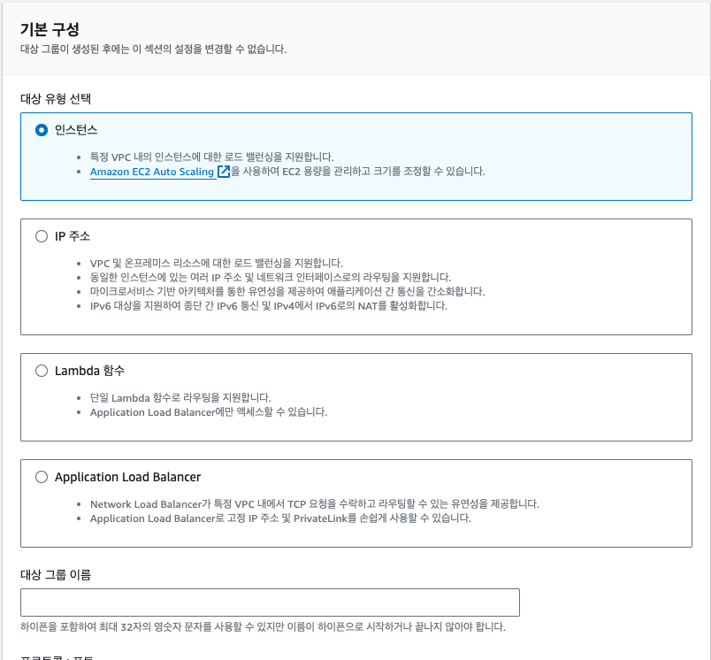
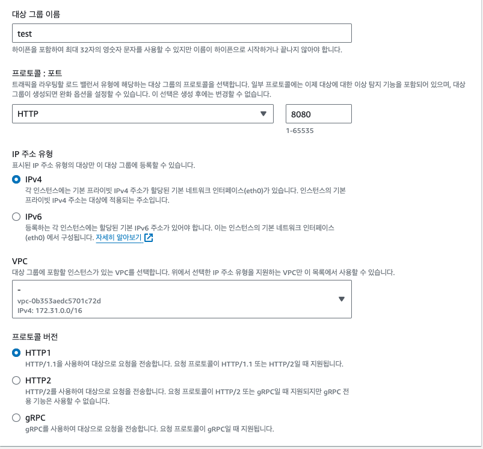
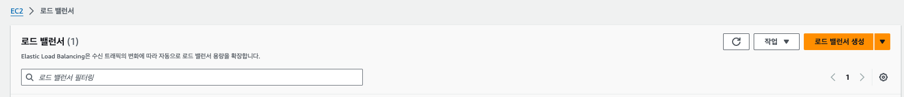
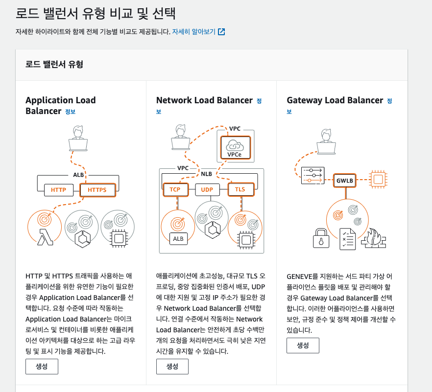
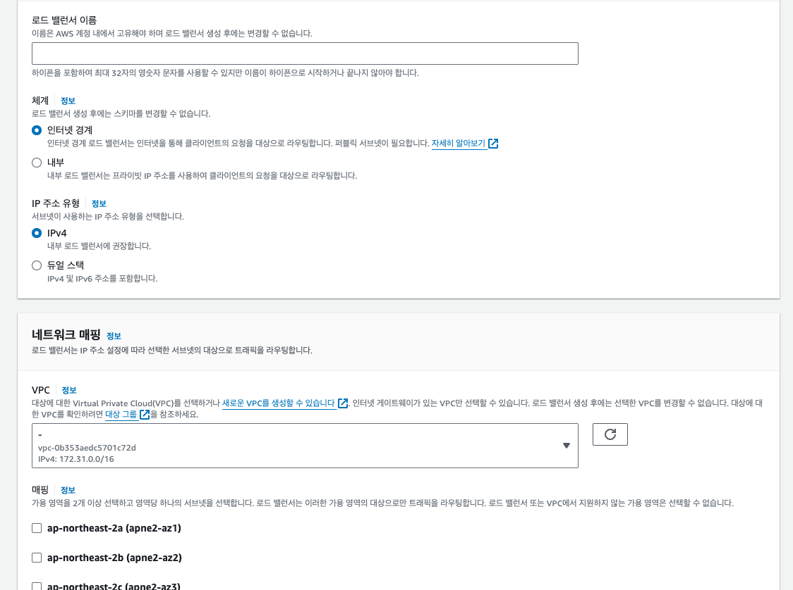
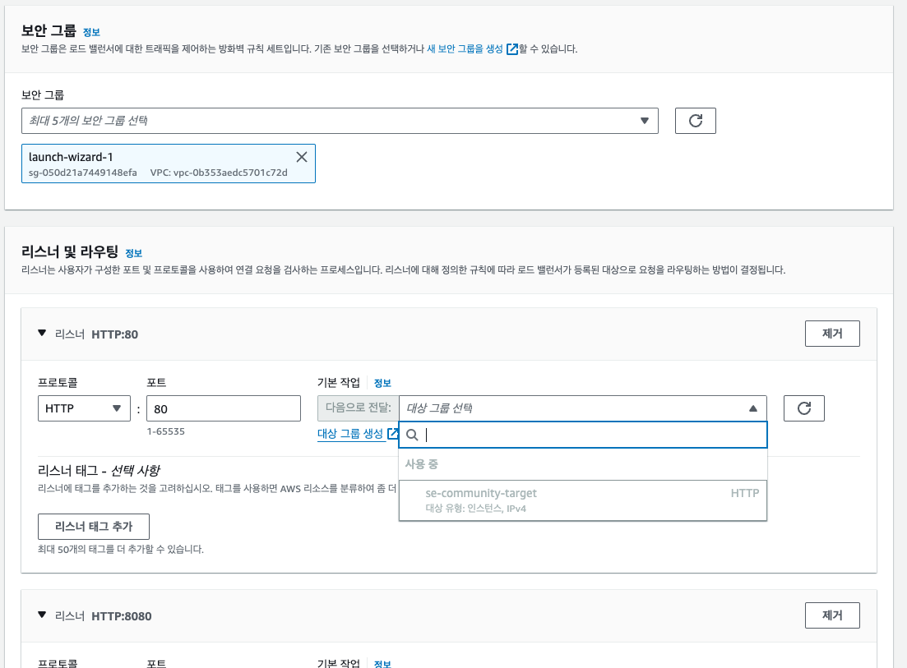
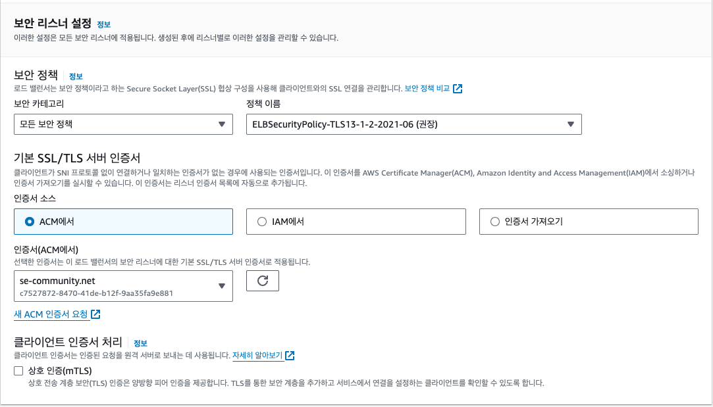

# HTTPS AWS Application Load Balancing (AWS ALB)

### Load Balancing?
- 클라이언트와 서버 그룹 사이에 위치해 서버에 가해지는 트래픽을 여러 대의 서버에 고르게 분배하여 특정 서버의 부하를 덜어줌
- 로드밸런싱에는 라운드 로빈, 가중치 분배, 최소 연결 등 다양한 알고리즘이 사용됨
- 주로 ALB, NLB, ELB로 구성됨
    - ALB (Application Load Balancer) : HTTP 헤더 또는 SSL 세션 ID와 같은 요청 콘텐츠를 확인하여 트래픽을 리다이렉션험. L7 기반 로드 밸런서를 지원하며 HTTP/HTTPS 트래픽에 적합하며 SSL 적용이 가능
    - NLB (Network Load Balancer) :  IP 주소 및 기타 네트워크 정보를 검사하여 트래픽을 최적으로 리다이렉션함. L4 기반 로드 밸런서를 지원하며 TCP/UDP 트래픽에 적합
    - ELB (Elastic Load Balancer) : 둘 이상의 가용 영역에서 EC2 인스턴스 컨테이너, IP 주소 등 여러 대상에 걸쳐 수신되는 트래픽을 자동으로 분산함. 4가지 유형의 로드 밸런서를 지원하며 뛰어난 확장성과 유연성으로 요구사항과 환경에 맞출 수 있음

<br>

### 게층별 제공하는 로드밸런서가 있는 이유
- 각 계층별로 확인할 수 있는 정보가 다르기 때문
```
- 3~4계층에서 동작하는 Gateway Load Balancer는 MAC주소, IP주소를 기반으로 로드밸런싱을 할 수 있음
- 4계층에서 동작하는 Network Load Balancer는 MAC주소, IP주소, port번호를 기반으로 로드밸런싱 할 수 있음
- 7계층에서 동작하는 Application Load Balancer는 MAC주소, IP주소, port번호, URL을 기반으로 로드밸런싱 할 수 있다. 또한 HTTP 헤더 정보를 통해서도 분산이 가능
```

<br>

### 이번에 Load Balancing 사용 이유
- 이번에 사용한 이유는 들어오는 요청에 SSL 적용을 위해 사용
    - 가용역역에 있는 대상으로 들어오는 트래픽 분산을 위한 서비스는 ELB(Elastic Load Balancing) 라고 부름. ELB의 서비스 중 하나가 ALB (Application Load Balancer) 임
- 현재 도커에서 배포가 8080포트로 지정이 되있어 Http 기본 포트인 80번과 8080 포트일 경우, Https 443 포트인 경우 모두 SSL 인증서가 적용된 8080포트로 보내주기 위함

<br>

### ALB 구조
1. Load balancer
    - 클라이언트에 대한 단일 진입점 역할을 수행
    - 클라이언트는 로드밸런서에 요청을 전송하고, 로드밸런서는 EC2 인스턴스 같은 대상으로 요청을 라우팅
    - 로드 밸런서를 구성하기 위해서는 Target group과 Listener가 필요

2. Listener
    - Listener는 구성한 프로토콜 및 포트를 사용하여 연결 요청을 확인하는 프로세스
    - 리스너에 정의한 규칙에 따라 로드밸런서가 EC2 같은 대상으로 요청을 라우팅
    - 7계층에서 동작하는 ALB는 HTTP, HTTPS 프로토콜을 지원
        - HTTPS 프로토콜을 사용하는 경우 Listener에 SSL 서버 인증서를 배포해야 함
    - 정의할 수 있는 규칙은 예로 아래와 같은 것들이 있음
        - 특정 URL로 인입된 요청을 다른 URL로 리다이렉트
        - http로 들어온 요청을 https로 리다이렉트
        - 각 Target group별로 요청을 분산시킬 퍼센트 지정

3. Target Group
    - Listener 규칙을 생성할 때, Target group을 지정. 해당 규칙이 충족되면 지정한 Target group으로 트래픽이 전달됨
    - Load balancer는 Target group 단위로 상태를 확인함 (health check)
        - 정상 상태인 Target group으로만 요청을 라우팅함

<br>

### 적용방법
- [인증서 발급 방법](https://github.com/InJun2/TIL/blob/main/Stack/AWS/Certificate.md)은 다음과 같이 진행하였음

<br>

#### 우선 대상 그룹(Target Group) 생성을 먼저 진행


- 인스턴스로 지정
- 대상 그룹 이름을 명명

<br>


- 도커에서 8080포트를 사용하기 때문에 8080포트로 사용하였음
- IPv4, HTTP1 로 사용하였음
- 사용할 VPC 지정

<br>

#### 이후 로드밸런싱 생성


- EC2에서 로드밸랜서 서비스 클릭 후 로드 밸런서 생성

<br>


- ALB 선택하여 생성

<br>


- 로드밸런스 명 지정 및 대상 VPC 지정
- 아시아-태평양 서울 리전 가용 영역 모두 체크

<br>


- 인바운드가 80, 8080, 443이 모두 열려있는 보안그룹 지정
- 리스너의 경우도 80, 8080, 443 생성 및 대상 그룹 인스턴스 지정
    - 해당 대상 그룹은 로드밸런싱 및 대상 그룹에서 생성하였었음

<br>


- 보안 정책 지정
- ACM (이전에 인증서를 발급하는데 사용한 서비스)를 선택하고 ACM의 인증서 선택 후 ALB 생성

<br>

#### 로드밸런서 리스터 규칙 변경


<br>

### 참조링크
- https://velog.io/@znftm97/AWS-EC2에-HTTPS-적용하기