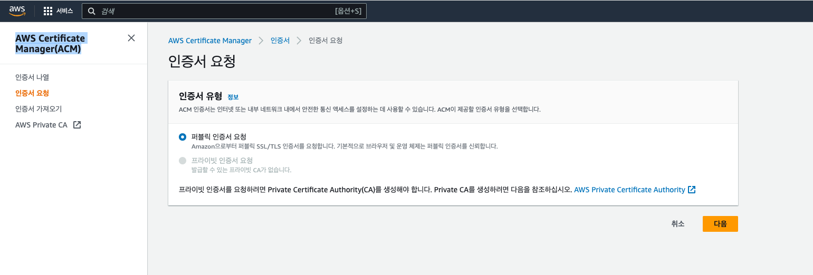
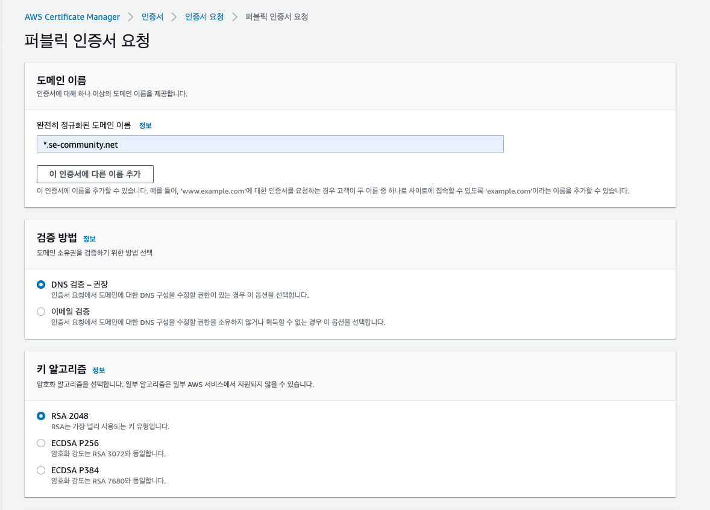
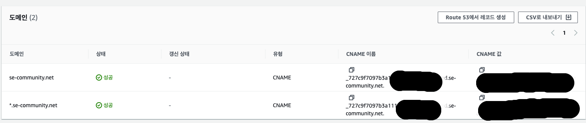
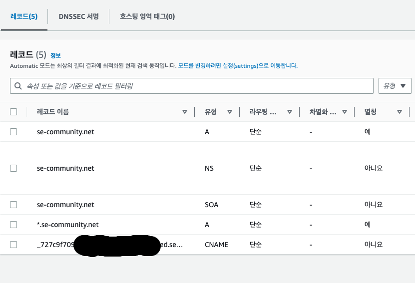

# AWS Certificate

### SSL 인증서 사용 이유
- 웹 사이트에는 SSL 인증서가 있어야만 사용자 데이터를 안전하게 유지하고, 웹 사이트의 소유권을 확인하며, 공격자가 사이트의 가짜 버전을 만드는 것을 방지하고, 사용자의 신뢰를 얻기 위함
- SSL(Secure Socket Layer) 프로토콜은 처음에 Netscape사에서 웹서버와 브라우저 사이의 보안을 위해 만들었다. SSL은 Certificate Authority(CA)라 불리는 서드 파티로부터 서버와 클라이언트의 인증을 하는데 사용
- Https는 HyperText Transfer Protocol over Secure Socket Layer 의 약자로 HTTP의 보안을 강화한 것으로 개인정보보호법 등을 이용하여 SSL을 의무화 사용하도록 하였음
- 인증서의 역할은 클라이언트가 접속한 서버가 클라이언트가 의도한 서버가 맞는지를 보장하는 역할. 이 역할을 하는 민간기업들이 있는데 이런 기업들을 CA(Certificate authority) 혹은 Root Certificate 라고 함

 

### SSL 인증서 발급 (AWS Certificate Manager)
- 해당 SSL 인증서를 발급하기 위해 AWS Certificate Manager를 통해 공인 SSL 인증서를 발급하였음 ( 사설 기관은 요금이 청구됨 )
    - 해당 발급 전 AWS Route53을 통하여 도메인을 구매하였음
    - 도메인을 무료지만 3개월마다 갱신을 해도 상관없다면 [let's encrypt](https://letsencrypt.org/ko/)를 사용하고 aws 인스턴스에 붙여도 됨
    - 밑의 과정은 AWS Route53 + AWS Certificate Manager 를 사용하여 인증서 적용

 

### AWS Certificate Manager(ACM) 인증서 요청 과정

- 공인 인증서 선택

 

- 사용할 도메인 이름 지정, 여러 이름 추가 가능 및 와일드 카드를 통해 하위 도메인 전체 적용 가능
- DNS 검증 및 알고리즘 지정

 

- 요청 진행중인 인증서 클릭하면 상태가 검증 보류 상태가 되어있음
- Route53 레코드를 생성을 클릭하면 DNS 레코드를 자동으로 생성해주기 때문에 바로 레코드 생성 클릭

 

- 이후 Route53 레코드 호스트 영역 확인 시 CNAME 레코드가 생성되어 있음

 

### 결과
- 인증서 발급은 정상적으로 이루어졌고 이후 EC2 인스턴스와 도메인을 연결하고 https로 접근하게 하기위해 AWS EC2 로드밸런싱을 사용하였음

 

### 참조링크
- https://12bme.tistory.com/80
- https://jjong-factory.tistory.com/92