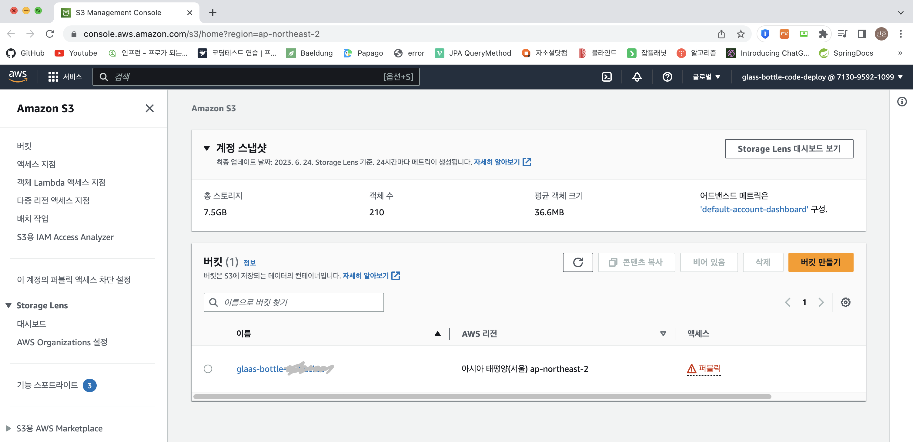

# S3

### AWS S3란?
- Simple Storage Service의 약자로 파일 서버의 역할을 하는 서비스로 인터넷용 스토리지
- 일반적인 파일서버는 트래픽이 증가함에 따라서 장비를 증설하는 작업을 해야 하는데 S3는 이와 같은 것을 대행하고 일에 대한 접근 권한을 지정 할 수 있어서 서비스를 호스팅 용도로 사용하는 것을 방지
- REST 인터페이스를 통해 CRUD가 가능하고 주로 이미지 파일, 정적 리소스 등을 S3에 올려놓고 사용

 

### S3 특징
- 많은 사용자가 접속을 해도 이를 감당하기 위해서 시스템적인 작업을 하지 않아도 된다.
- 저장할 수 있는 파일 수의 제한이 없다.
- 최소 1바이트에서 최대 5TB의 데이터를 저장하고 서비스 할 수 있다.
- 파일에 인증을 붙여서 무단으로 엑세스 하지 못하도록 할 수 있다.
- HTTP와 BitTorrent 프로토콜을 지원한다.
- REST, SOAP 인터페이스를 제공한다.
- 데이터를 여러 시설에서 중복으로 저장해 데이터의 손실이 발생할 경우 자동으로 복원한다.
- 버전관리 기능을 통해서 사용자에 의한 실수도 복원이 가능하다.
- 정보의 중요도에 따라서 보호 수준을 차등 할 수 있고, 이에 따라서 비용을 절감

 

### S3 용어
- object : 객체로 AWS는 S3에 저장된 데이터 하나 하나를 객체라고 명명하는데, 하나 하나의 파일로 S3에 데이터가 저장되는 최소 단위
- bucket : 버킷으로 객체가 파일이라면 버킷은 연관된 객체들을 그룹핑한 최상위 디렉토리로 S3상의 모든 객체는 버킷에 포함됨. 버킷 단위로 지역(region)을 지정 할 수 있고, 또 버킷에 포함된 모든 객체에 대해서 일괄적으로 인증과 접속 제한을 걸 수 있음
- keys : 버킷 내 객체의 고유 식별자. 버킷의 모든 객체에는 정확히 하나의 키가 존재하고 보통 "디렉토리 + 파일명"으로 명명
- regions : S3가 생성한 버킷을 저장할 위치를 지정. 리전 간 객체 공유는 불가능하고 버킷 위치(리전)을 어디에 지정하냐에 따라 지연 시간, 비용 등이 결정됨
- 버전관리 : S3에 저장된 객체들의 변화를 저장. 예를들어 A라는 객체를 사용자가 삭제하거나 변경해도 각각의 변화를 모두 기록하기 때문에 복구가 쉬움
- RSS :  Reduced Redundancy Storage의 약자로 일반 S3 객체에 비해서 데이터가 손실될 확률이 높은 형태의 저장 방식. 대신 가력이 저렴하기 때문에 복원이 가능한 데이터, 이를테면 섬네일 이미지와 같은 것을 저장하는데 적합

 

### 버킷 생성
- [해당 블로그](https://velog.io/@jinseoit/AWS-S3-bucket) 를 참조하여 버킷을 생성하였음
- https://console.aws.amazon.com/s3/home?region=ap-northeast-2 접속
- 버킷 만들기

- 버킷 이름, regions 지정. 이름은 고유해야 하며 AWS 리전은 서울인 ap-northeast-2 지정

- 퍼블릭 엑세스 차단 설정

- 버킷 버전관리 및 암호화 설정

- 이후 버킷 생성 후 업로드 이후 URL을 통해 확인시 AccessDenied 오류 발생
- 퍼블릭 엑세스 차단 수정
    - 권한 -> 퍼블릭 엑세스 차단 -> 편집 -> 체크 모두 해제 체크 -> 변경사항 저장
- 버킷 정책 편집
    - 권한 -> 버킷정책 -> 편집 -> 버킷정책 -> 버킷 ARN 복사 후 정책 생성기 클릭
- 버킷 정책 생성
    - Select Type of Policy - S3 Bucket Policy 선택
    - Principal - * 입력
    - Actions - GetObject 선택
    - 복사한 버킷 ARN을 붙여넣기 한 후에 /* 을 추가 -> Add Statement 클릭
    - Generate Policy 클릭
    - Policy JSON Document를 복사후 닫기
    - 버킷 정책 편집. 복사한 Json을 붙여넣은 후 -> 변경사항 저장

 

### 후기
- 해당 블로그를 통해 간단하고 기초적으로 생성하였는데 버킷 생성은 해당 블로그를 참조하면 수월하게 진행할 수 있을 것이라고 생각!
- glass bottle 프로젝트를 진행하기 위해 간단하게 버킷을 생성하였고 무난하게 진행하였다고 생각하는데 이후에는 엑세스설정이나 암호화도 따로 진행 해봐야 할 것 같음

 

### 참조링크
- https://dev.classmethod.jp/articles/for-beginner-s3-explanation/
- https://velog.io/@jinseoit/AWS-S3-bucket