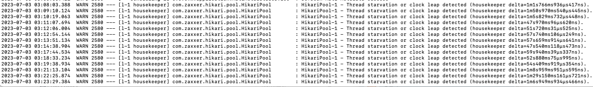
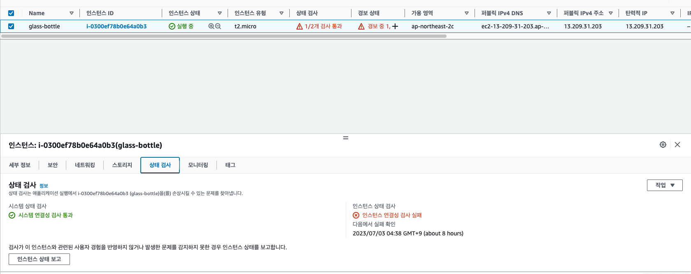
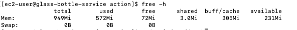
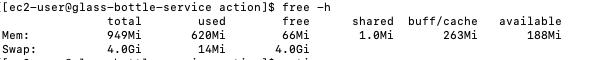

# Hikari Pool Thread Starvation

### 문제 발생
- 자동 CI/CD 를 통한 프로그램이 실행되다가 어느 정도 시간이 지난 이후 ec2 서버에서 지속적으로 종료되는 현상 발생
- Spring actuator health 정보도 down 되어 있음
- 해당 EC2 인스턴스를 확인해보니 상태검사 1/2로 변경되어 있고 인스턴스 상태검사 실패로 적혀있음

 

### 로그 확인
- 프로젝트 실행 중 로그는 다음과 같음
    - 2023-07-01 07:25:02.108  WARN 2475 --- [l-1 housekeeper] com.zaxxer.hikari.pool.HikariPool        : HikariPool-1 - Thread starvation or clock leap detected (housekeeper delta=45s730ms189µs33ns).
    - 2023-07-01 07:50:13.545  WARN 2475 --- [l-1 housekeeper] com.zaxxer.hikari.pool.HikariPool        : HikariPool-1 - Thread starvation or clock leap detected (housekeeper delta=5h13m48s845ms931µs569ns).
- Spring actuactor health 정보는 다음과 같음
    - org.springframework.web.client.HttpServerErrorException$ServiceUnavailable: 503 : "{"status":"DOWN","components":{"db":{"status":"DOWN","details":{"error":"org.springframework.jdbc.CannotGetJdbcConnectionException: Failed to obtain JDBC Connection; nested exception is java.sql.SQLTransientConnectionException: HikariPool-1 - Connection is not available, request timed out after 18289ms."}},"diskSpace":{"status":"UP","details":{"total":32132542464,"free":21718679552,"threshold":10485760,"exists":true}},"ping":{"status":"UP"},"redis":{"status":"DOWN","details":{"error":"org.springframework.dao.QueryTimeoutException: Redis command timed out; nested exception is io.lettuce.core.RedisCommandTimeoutException: Command timed out after 1 minute(s)"}}}}"

 

### 해결방안 1
- 서칭을 통해 찾아보다가 [해당 블로그](https://velog.io/@mbsik6082/Thread-starvation-or-clock-leap-detected-Dead-Lock-hikari-오류)의 글을 접하고 아 이문제구나 싶었음..
- 해당 해결방안을 따라 max connection-pool 을 20, 25로 각각 지정해서 실행해 보았음
- 다른 블로그도 참조하여 timeout 시간도 연장하여 지정
- 그러나 해당 방안으로 해결되지 않았고 커넥션 풀문제로 스레드가 실행되지 못했을 거란 생각으로 시간을 많이 소비하였음..

 

### 헤걀빙인 2
- 해당 문제를 [지인](https://github.com/DongGeon0908) 에게 질문 해보았음
- 프로젝트 실행 중 발생한 로그에서 housekeeper 에러의 경우 스레드나 메모리가 적은것이 문제라고 함
- 우선 actuator로 보았던 애플리케이션의 상태는 처음 실행할 때에는 이상이 없었음
- 이후 ec2 서버에서 RAM 메모리 상태를 확인

    

- 이전에 적용했던 메모리 스왑이 진행 되지 않고 있고 사용 가능한 메모리가 72mb 였고 이후 50mb 까지 떨어지는 것을 확인
- 해당 문제를 해결하기 위해 [메모리 스왑](https://github.com/InJun2/TIL/blob/main/Stack/Error/EC2_Memory_Shortage.md)을 다시 진행하였음

    

- 이후 하루가량 지난 현재까지 서버 무사히 작동 중으로 이후 다시 문제가 발생하면 해당 글에 내용을 추가하려고 함.

 

### 참조링크
- https://velog.io/@mbsik6082/Thread-starvation-or-clock-leap-detected-Dead-Lock-hikari-오류
- https://repost.aws/ko/knowledge-center/ec2-memory-swap-file