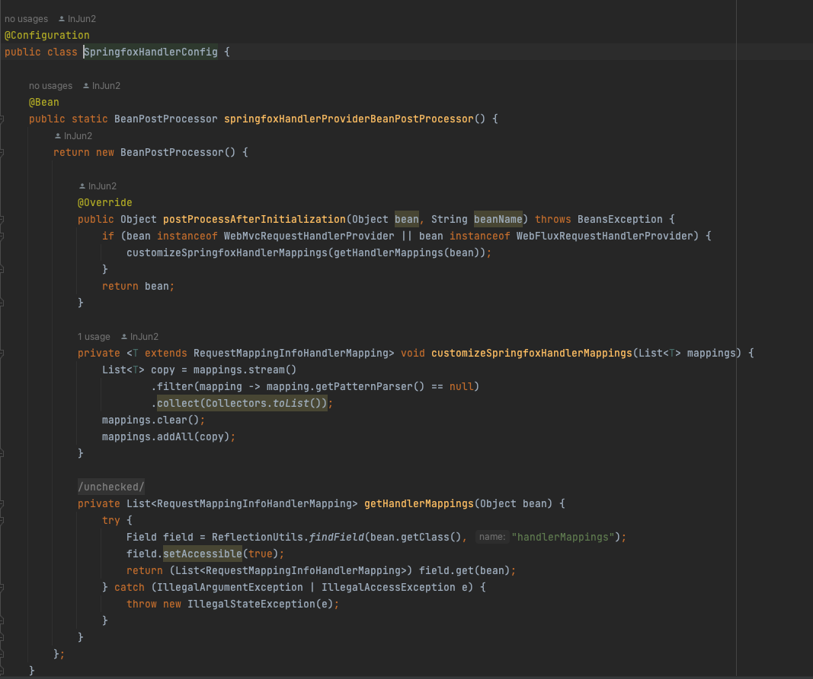

## Swagger 3.0 Spring actuator 호환성 문제

### 에러 메세지
- org.springframework.context.ApplicationContextException: Failed to start bean 'documentationPluginsBootstrapper'; nested exception is java.lang.NullPointerException: Cannot invoke "org.springframework.web.servlet.mvc.condition.PatternsRequestCondition.getPatterns()" because "this.condition" is null ...

 

### 해당 문제 사항
- mvc 설정을 하던 중에 this.condition 부분에 NullPointerException을 발생했고, 해당 문제는 이전 Spring 버전과 Swagger 3.0 에서도 발생했던 문제였는데 이번 문제의 경우 Swagger는 모든 endpoint에 대해서 documentation을 해주는 역할인데 Actuator 또한 마찬가지로 몇몇 endpoint(refresh, beans, health)등을 직접 생성하는 역할이다 보니 의존성이 충돌나는 것이라고 함

 

### 해당 해결 방법
- springfox 패키지가 아닌 springdoc을 이용하면 더 많은 업데이트로 이후 지원되는 경우가 많고 swagger를 사용할 수 있다고 하지만 해당 문제를 밑의 참조링크에서 확인하여 해당 문제를 해결하기 위해 해당 링크의 Bean을 추가해주었음
- springfox 업데이트도 안되고 버전 문제도 많은데 다음번에는 springdoc을 이용해봐야 겠음..

 

### 참조링크
- https://stackoverflow.com/questions/70695150/how-to-befriend-spring-boot-2-6-x-with-actuator-dependency-and-swagger-starter-3
