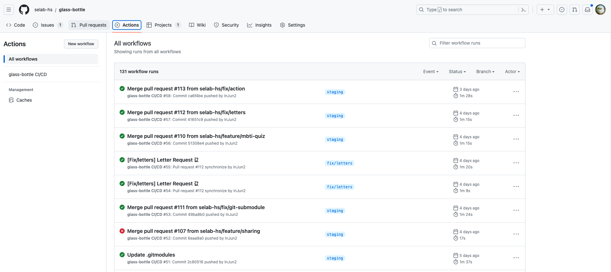
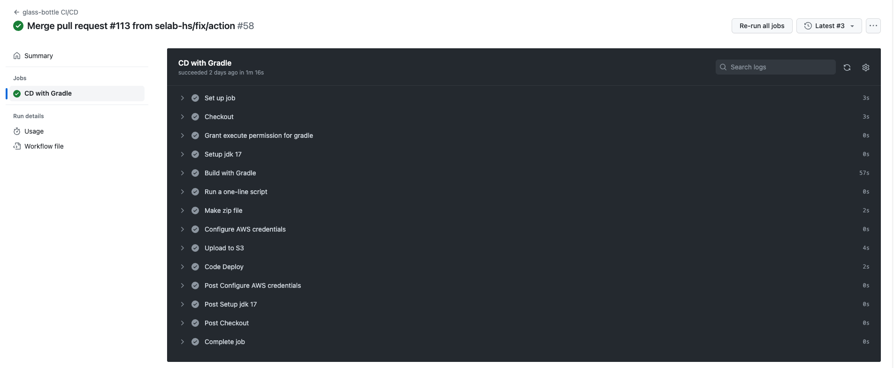

# Git Action

### Git Action이란
- 빌드, 테스트 및 배포 파이프라인을 자동화할 수 있는 CI/CD 플랫폼
- GitHub Actions를 사용하면 GitHub 리포지토리에서 손쉽게 CI/CD 결과를 확인하고 관리가 가능하며 YAML 포맷을 사용하여 가독성이 높고, 이미 구현되어 있는 수많은 액션을 활용하여 간단하게 CI/CD 플로우를 작성가능
- github repository를 workflow로 생성하여 GitHub Actions는 단순한 DevOps를 넘어 repository에서 다른 이벤트가 발생할 때 workflow를 실행
- 누군가가 저장소에 새로운 이슈를 생성할 때마다 적절한 레이블을 자동으로 추가하는 workflow를 실행가능

<br>

### workflow
- workflow는 작업의 단계별 로직에 대한 제어 흐름과 비즈니스 로직이 포함된 실제 작업 단위 간의 분리. 작업 흐름이라고도 부름
- 하나 이상의 job으로 구성되고 event에 의해 트리거될 수 있는 자동화된 프로세스
- 가장 최상위 개념으로 YAML으로 작성되고 Github Repository의 .github/workflows 폴더 아래에 저장되어 repository에는 여러 workflow를 가질 수 있으며 각 workflow는 서로 다른 작업을 수행이 가능함
- workflow의 예시로는 test code 실행, 배포, 자동화 하고자하는 스크립트 등
- workflow의 구성들은 다음과 같음
    - event : 실행을 트리거하는 특정 활동이나 규칙입니다. 예를 들어, 누군가가 pull request를 생성하거나 issue를 열거나 특정 브랜치로 push하거나 특정 시간대에 반복(cron)하거나 webhook을 사용해 외부 이벤트를 통해 실행
    - jobs : jobs은 여러 step으로 구성되고 가상 환경의 인스턴스에서 실행하며 다른 job에 의존 관계를 가질 수 있고 독립적으로 병렬실행도 가능
    - steps : task들의 집합으로 커맨드를 날리거나 쉘 스크립트 실행하는 것처럼 action을 실행가능
    - actions : 가장 작은 블럭으로 job을 만들기 위해 step들을 연결할 수 있음. 재사용이 가능한 컴포넌트로서 반복적인 코드의 양을 줄일 수 있고 git repository를 가져오거나 클라우드 공급자에게 인증을 설정 가능
    - runners : 트리거될 때 실행하는 서버로 각 runner는 1번에 1개의 job을 실행가능

<br>

### 사용이유
- [glass-bottle project](https://github.com/selab-hs/glass-bottle) CI/CD 자동화를 위해 GitHub Action을 사용하기로 하였음
- 프로젝트를 github를 이용하여 브랜치별로 나누어서 작업하고 staging 브랜치에 통합한 이후 서버에 반영하기에 GitHub Action이 좋을 것이라는 팀원의 설명으로 정하게 되었음
- 위에서 설명한대로 workflow를 통해 이벤트 발생에 따른 CI/CD 자동화를 진행하기 위해 사용하였음
- Github repository 설정에서 repository secret을 통한 AWS access key, git token 같은 민감하고 개인적인 데이터를 안전하게 사용가능

<br>

### 사용 방법
- 우선 github action을 사용하여 S3에 저장하고 해당 파일을 Code Deploy가 명령어를 통해 실행하여 배포를 진행하는 방식으로 S3와 CodeDeploy 를 사용하기 위한 과정들이 필요
    - [AWS S3](https://github.com/InJun2/TIL/blob/main/Stack/AWS/S3.md)
    - [AWS Code Deploy](https://github.com/InJun2/TIL/blob/main/Stack/AWS/CodeDeploy.md)
- 아래는 glass-bottle 프로젝트를 진행하면서 사용했던 git action 예시

<br>

```yml
# Repository의 Actions 탭에 나타날 Workflow 이름으로 필수 옵션은 아님
name: glass-bottle CI/CD

# S3 Upload를 위한 환경설정. 해당 job에서 사용할 환경 변수를 key/value의 형태로 설정
env:
  S3_BUCKET_NAME: glaas-bottle-s3-bucket
  AWS_REGION: ap-northeast-2

# 하단 코드에 따라 develop 브랜치에 Push 또는 Pull Request 이벤트가 발생한 경우에 Workflow가 실행. 위에서 설명한 event에 해당
# 만약 브랜치 구분 없이 이벤트를 지정하고 싶을 경우에는 단순히 on: [push, pull_request] 같이 작성도 가능
# 현재는 staging으로 취합하고 기능 구현이 완료된 이후 main브런치로 push, PR 시 git action 실행
on:
  push:
    branches:
      - main
  pull_request:
    branches:
      - main

# 해당 옵션을 통해 사용자가 직접 Actions 탭에서 Workflow를 실행
# push나 pr 같은 Event가 아닌 수동으로 Event 발생시켜 테스트 용도
  workflow_dispatch:
    inputs:
      logLevel:
        description: 'Log level'
        required: true
        default: 'warning'
      tags:
        description: 'Test scenario tags'

# 해당 Workflow의 하나 이상의 Job 목록
jobs:
    # 해당 workflow가 포함한 하나의 잡은 cd라는 이름으로 임의지정
   cd:
    name: CD with Gradle
    # Runner가 실행되는 환경을 정의
    runs-on: ubuntu-latest

    # build Job 내의 step 목록
    steps:
        # uses 키워드를 통해 Action을 불러옴
        # 여기에서는 해당 레포지토리로 check-out하여 레포지토리에 접근할 수 있는 Action을 불러오기
      - name: Checkout
        uses: actions/checkout@v3
        # 서브모듈을 연결하기 위해 깃허브 유저 토큰정보를 git repository secret에서 받아오고 서브모듈 설정 지정
        with:
          token: ${{ secrets.GIT_TOKEN }}
          submodules: true

        # gradle을 위한 권한부여
      - name: Grant execute permission for gradle
        # run을 통해 명령어 실행
        run: git update-index --add --chmod=+x gradlew
        # 리눅스에서 명령어와 프로그램을 실행하기 위한 인터페이스인 셸을 bash로 지정
        shell: bash

        # 프로젝트 환경구성을 위한 jdk 설치
      - name: Setup jdk 17
        # 해당 step에서 사용할 액션. github 마켓플레이스에 올라온 action들을 사용할 수도 있음
        uses: actions/setup-java@v3
        with:
          java-version: '17'
          # 사용가능한 옵션에 대한 지원 배포
          distribution: 'temurin'

        # gradle 빌드
      - name: Build with Gradle
        run: ./gradlew clean build
        shell: bash

        # 실행하고 해당 job 출력
      - name: Run a one-line script
        run: echo ${{ github.job }}

        # S3에 저장하기위해 zip으로 저장
      - name: Make zip file
        run: zip -r ./$GITHUB_SHA.zip .
        shell: bash

        # AWS 연결을 위해 액션 사용 및 필요한 정보 입력
      - name: Configure AWS credentials
        uses: aws-actions/configure-aws-credentials@v1
        with:
          aws-access-key-id: ${{ secrets.AWS_ACCESS_KEY_ID }}
          aws-secret-access-key: ${{ secrets.AWS_SECRET_ACCESS_KEY }}
          aws-region: ${{ env.AWS_REGION }}

        # AWS에 연결한 이후 저장한 zip파일 S3에 저장 명령
      - name: Upload to S3
        run: aws s3 cp --region ap-northeast-2 ./$GITHUB_SHA.zip s3://$S3_BUCKET_NAME/$GITHUB_SHA.zip

        # S3에 저장한 zip파일을 aws에서 지정해둔 배포그룹, 배포설정, 애플리케이션이름을 통해 codedeploy 실행
      - name: Code Deploy
        run: aws deploy create-deployment --application-name glass-bottle-app --deployment-config-name CodeDeployDefault.AllAtOnce --deployment-group-name glass-bottle-group --s3-location bucket=glaas-bottle-s3-bucket,bundleType=zip,key=$GITHUB_SHA.zip

```

<br>

### 적용 모습
- 이전에 staging에 취합한 코드도 서버에 올려서 정상작동 확인 진행
- 설정해둔대로 PR 요청시 그리고 PR merge를 통한 push시 git action 실행

<br>




<br>

### 참조링크
- https://brownbears.tistory.com/597
- https://tech.kakaoenterprise.com/180
- https://velog.io/@ggong/Github-Action에-대한-소개와-사용법