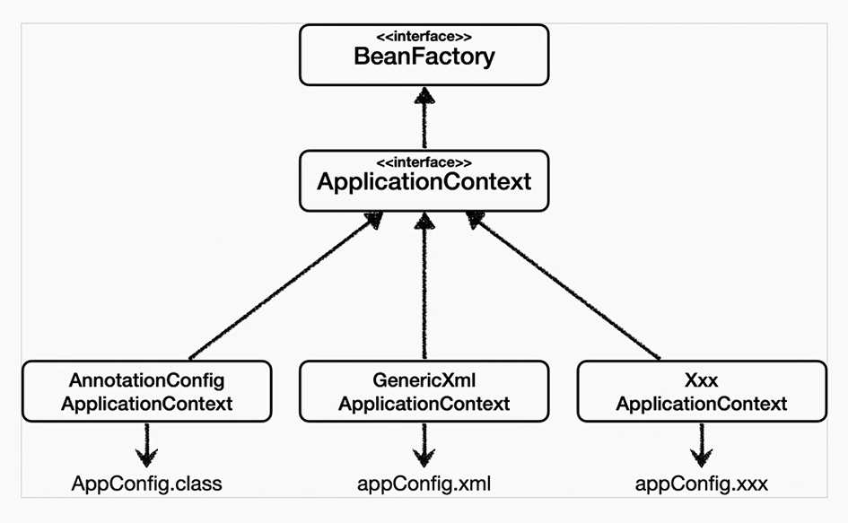
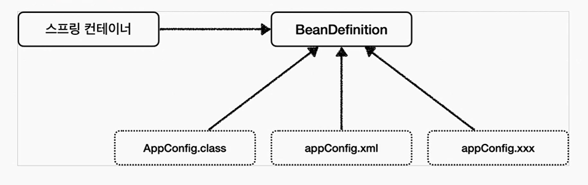

# 스프링컨테이너와 스프링 빈

### 스프링 컨테이너 생성
- ApplicationContext를 스프링 컨테이너라고 한다. 해당 ApplicationContext는 인터페이스 임
- 스프링 컨테이너는 XML기반으로 만들수도 있으나 최신에는 간단한 어노테이션 기반의 자바 설정 클래스로 만듬
- 스프링 핵심 원리 - 기본편에서 작성한 코드의 AppConifg가 어노테이션 기반의 자바 설정 클래스로 스프링 컨테이너를 만든 것

<br>

#### 빈 출력하기
- 스프링에 등록된 모든 빈 정보 출력 가능
- ac.getBeanDefinitionNames() : 스프링에 등록된 모든 빈 이름을 조회
- ac.getBean() : 빈의 이름으로 빈 객체(인스턴스)를 조회한다

<br>

#### 애플리케이션 빈 출력하기
- 스프링이 내부에서 사용하는 빈은 제외하고 내가 등록한 빈만 출력.
- 스프링이 내부에서 사용하는 빈은 getRole으로 구분할 수 있음
- ROLE_APPLICATION : 일반적으로 사용자가 정의한 빈
- ROLE_INFRASTRUCTURE : 스프링이 내부에서 사용하는 빈

<br>

#### 상속 관계에서 빈 호출
- 해당 하위 클래스들을 모두 호출함

<br>



#### BeanFactory, ApplicationContext
- ApplicationContext는 BeanFactory의 기능을 상속 받음
- ApplicationContext는 빈 관리기능 + 편리한 부가기능을 제공
- BeanFactory를 직접 사용할 일은 거의 없음. 부가기능이 포함된 ApplicationContext를 사용
- BeanFactory나 ApplicationContext를 스프링 컨테이너라고 함

1. BeanFactory
- 스프링 컨테이너의 최상위 인터페이스
- 스프링 빈을 관리하고 조회하는 역할을 함
- getBean()을 제공

2. ApplicationContext
- BeanFactory 기능을 모두 상속받아서 제공하는 인터페이스
- 빈을 관리하고 검색하는 기능을 BeanFactory가 제공
- 애플리케이션을 개발할 때는 빈은 관리하고 조회하는 기능은 물론이고, 수 많은 부가기능 제공
> 부가기능 종류
>- 메시지 소스를 활용한 국제화 기능
>       - 예를 들어 한국에서 들어오면 한국어로, 영어권에서 들어오면 영어로 출력
>- 환경변수
>       - 로컬, 개발, 운영등을 구분해서 처리
>- 애플리케이션 이벤트
>       - 이벤트를 발행하고 구독하는 모델을 편리하게 지원
>- 편리한 리소스 조회
>       - 파일, 클래스패스, 외부 등에서 리소스를 편리하게 조회

```java
// 스프링 컨테이너 생성 -> 아래 생성자를 호출한 AnnotationConifgApplicationContext는 ApplicationContext 인터페이스의 구현체
    ApplicationContext = applicationContext = new AnnotationConfigApplicationContext(의존주입설정.class);
```

<br>



#### BeanDefinition
- 스프링 빈 설정 메타 정보라고 부름
- 스프링이 다양한 설정 형식을 지원하는 방식의 중심에는 <code>BeanDefinition</code>이라는 추상화가 존재
- 쉽게 말해서 <b>역할과 구현</b>을 개념적으로 나눈 것이라고 함
- 스프링 컨테이너는 설정을 자바코드로 하던지 XML으로 하던지 몰라도 되고 오직 BeanDefinition만 알면 됨
- BeanDefinition을 빈 설정 메타 정보라고 함 : @Bean, \<bean\>당 각각 하나씩 메타 정보가 생성됨
- 스프링 컨테이너는 이 메타정보를 기반으로 스프링 빈을 생성함
> BeanDefinitnion 정보
>- BeanClassName : 생성할 빈의 클래스 명 ( 자바 설정 처럼 팩토리 역할의 빈을 사용하면 없음 )
>- factoryBeanName : 팩토리 역할의 빈을 사용할 경우 이름 ( ex) appConfig )
>- factoryMethodName : 빈을 생성할 팩토리 메소드 지정 ( ex ) memberService ) 
>- Scope : 싱글톤 ( 기본값 )
>- IazyInit : 스프링 컨테이너를 생성할 때 빈을 생성하는 것이 아니라, 실제 빈을 사용할 때 까지 최대한 생성을 지연처리하는지 여부
>- InitMethodName : 빈을 생성하고, 의존관계를 적용한 뒤에 호출되는 초기화 메소드 명
>- DestoryMethodName : 빈의 생명주기가 끝나서 제거하기 직전에 호출되는 메서드 명
>- Constructor arguments, Properties : 의존관계 주입에서 사용함 ( 자바 설정 처럼 팩토리 역할의 빈을 사용하면 없음 )


<br>

---
- 2022-07-08

--- 
## intellij 단축키 (window)
- Ctrl + Art + V : 변수 생성
- "iter" 작성 후 + tab : 자동으로 위의 배열의 for 문 생성 
- Ctrl + e : 다른 클래스로 이동
- Art + inesrt : 클래스 / 메소드 생성
- 파일 이름 변경 : Shift + F6