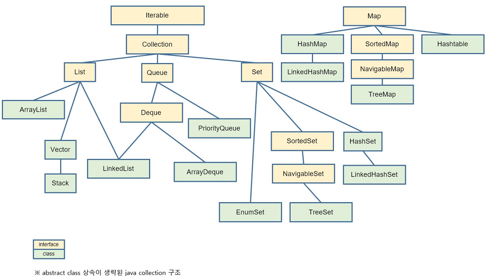
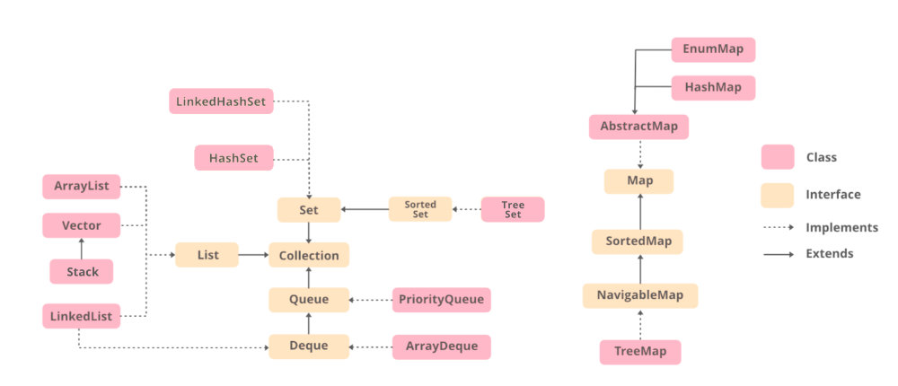

# Collection

### 컬렉션(Collection)이란?
>- 컬렉션이란 데이터 집합, 그룹을 의미하며 Java에서 JCF( Java Collections Framework )는 이러한 데이터, 자료구조인 컬렉션과 이를 구현하는 클래스를 정의하는 인터페이스를 제공. 
>- 개발에 소요되는 시간을 절약하면서 최적화된 알고리즘을 사용 가능.

 

### Collection을 사용하는 이유
>- 일관된 API : Collection의 일관된 API를 사용하여 Collection 밑에 있는 모든 클래스
>- 프로그래밍 노력 감소 : 객체 지향 프로그램의 추상화의 기본 개념이 성공적으로 구현되어있음
>- 프로그램 속도 및 품질 향상 : 유용한 데이터 구조 및 알고리즘은 성능을 향상시킬 수 있음.  

 

### Java Collection 구조

 

### Java 자료구조 유형 ( Collectcion + Map )
>- 순서가 있는 목록인 List
>- 순서가 중요하지 않은 목록인 Set
>- 먼저 들어온 것이 먼저 나가는 Queue
>- Key-Value 형태로 저장되는 Map

 

|인터페이스|설명|구현 클래스|
|:---:|:---:|:---:|
|List\<E>|순서가 있는 데이터의 집합으로, 데이터의 중복을 허용|Vector, ArratList, LinkedList, Stack|
|Queue\<E>| 선입선출(FIFO)방식. List와 유사하나 구현목적의 차이|LinkedList, PriorityQueue, ArrayDeque|
|Set\<E>|순서가 없는 데이터의 집합으로, 데이터의 중복을 허용하지 않음|HashSet, TreeSet|
|Map\<K,Y>|키와 값의 한 쌍으로 이루어지는 데이터의 집합으로 순서가 없음. 이때 키는 중복을 허용하지 않지만 값은 중복될 수 있음|HashMap, TreeMap, Hashtable, Properties|

 

### List Interface
>- 정렬된 모든 객체 컬렉션을 저장할 수 있는 목록 데이터 전용
>- 인덱스로 원소에 접근이 가능하고 크기가 가변적
>- ArrayList, Vector, Stack 클래스 존재
>
>1. ArrayList
>>- 동적 배열 제공. 표준 배열보다 느릴수 있지만 배열에서 많은 움직임이 필요한 프로그램에서 유용
>>- 단방향 포인터구조로 데이터 삽입, 삭제가 느리고 데이터 검색이 빠르다
>>- 컬렉션에서 객체를 추가, 삭제하면 ArrayList 크기가 자동으로 조정
>
>2. LinkedList
>>- 요소가 연속 된 위치에 저장되지 않고 모든 요소가 데이터 부분과 주소부분이 있는 별도의 객체에 저장됨
>>- 포인터의 주소에서 사용하는 데이터를 가져옴
>>- 각 요소를 노드라 부른다.
>
>3. Vector
>>- 동적 배열을 제공하고 표준 배열보다 느리지만 많은 움직임이 필요한 프로그램에서 유용.
>>- LinkedList와 유사하지만 Vector는 동기화가 되고 ArrayList는 동기화가 되지 않는다.
>
>4. Stack
>>- 스택 클래스 모델 및 스택 데이터 구조를 구현할 때 주로 사용
>>- 후입 선출을 기본 원칙으로 함

 

### Queue Interface
>- 대기열 인터페이스라는 이름에서 알 수 있듯이 선입선출(FIFO)을 기본적으로 사용
>- 순서가 중요한 업무에서 주로 사용
>- LinkedList, PriorityQueue, ArrayDeque 등의 클래스 존재.
>
>1. LinkedList
>>- Queue는 조회보다 삽입 삭제가 많이 이루어지기 때문에 기존 LinkedList를 이용해 구현.
>>- List Interface의 LinkedList와 동일
>
>2. PriorityQueue 
>>- 우선 순위에 따라 객체를 처리해야 할 때 사용
>>- 선입선출을 기본으로 하지만, 우선 순위에 따라 먼저 처리해야할 것이 있다면 우선 순위 힙을 기반으로 처리
>
>3. ArrayDeque
>>- 크기가 조정되는 배열이고 양쪽 끝에서 요소를 추가하고 제거하는 구조
>>- 사이즈에 제한이 없으며 외부 동기화안됨 ( 멀티쓰레드에서동시 접속 불가. 멀티쓰레드 사용시 직접 synchronized 작성 )
>>- NULL은 저장되지 않음
>>- 수행속도와 메모리 부분에서 스택으로 사용할 때 Stack보다 좋고 대기열로 사용할 때는 LinkedList로 구현하는 것보다 좋다고 함

 

### Set Interface
>- 중복 값을 저장할 수 없는 정렬되지 않은 데이터 모음
>- 중복을 방지하고 고유한 데이터만 저장해야하는 경우 사용
>- 하나의 NULL 저장 가능. 마찬가지로 중복은 불가능
>- HashSet, TreeSet, LinkedHashSet 등에서 사용
>
>>1. HashSet
>>- HashSet에서 입력되는 데이터는 동일한 순서로 삽입되는 것을 보장하지 않음
>>- 이 클래스는 NULL 요소 삽입을 허용
>
>2. LinkedHashSet
>>- HashSet과 유사하지만 차이점은 입력하는 순서대로 데이터를 저장하는 순서을 유지
>
>3. TreeSet
>>- 데이터의 순서는 자연적인 순서(오름차순)대로 데이터를 저장
>>- 이진 탐색 트리로 데이터를 저장

 

### Map Interface
>- Map은 데이터를 키-값으로 매핑을 지원하는 데이터 구조
>- 동일한 키가 여러 개가 있을 수 없어 중복 키는 지원하지 않고 순서를 보장하지 않음
>- 키를 기반으로 프로그래밍을 하는 경우 유용
>- 뛰어난 검색속도를 가지며 인덱스가 따로 존재하지 않아 iterator를 사용
>- Map Interface는 HashMap, TreeMap 등의 클래스가 있음
>
>1. HashMap
>>- HashMap에 데이터에 접근하려면 키를 알고있어야 접근 가능하며 검색에 가장 뛰어남
>>- HashMap은 Hashing이라는 기술을 사용하는데 해싱은 인덱싱 및 검색 작업이 더 빨라지도록 키에 산술적인 연산을 적용하여 항목이 저장되어 있는 주소를 계산하여 항목에 접근하는 방식
>
>2. Hashtable
>>- HashMap보다는 느리지만 동기화 지원
>>- NULL 값이 들어오지 못함
>
>3. TreeMap
>>- 키와 값을 저장하는 동시에 키를 정렬
>>- 정렬 순서는 숫자 > 알파벳 대문자 > 알파벳 소문자 > 한글
>
>4. LinkedHashMap
>>- HashMap과 거의 동일하나 이중 연결 리스트라는 방식을 이용하여 데이터를 담음. 
>>- 키의 순서가 지켜지므로 키의 순서가 보장되어야 할 경우 사용

 

#### \* Sorted 인터페이스
>- Set과 Map 인터페이스를 상속받아 정렬 기능이 추가된 SortedSet과 SortedMap 인터페이스가 되는데 구현체인 TreeSet, TreeMap은 Set과 Map의 기능을 가지고 있으면서 정렬기능이 존재한다.

 

22-06-21

-------

## Reference
- https://gangnam-americano.tistory.com/41
- https://www.geeksforgeeks.org/collections-in-java-2/ 
- http://www.tcpschool.com/java/java_collectionFramework_concept
- https://cocoon1787.tistory.com/527
