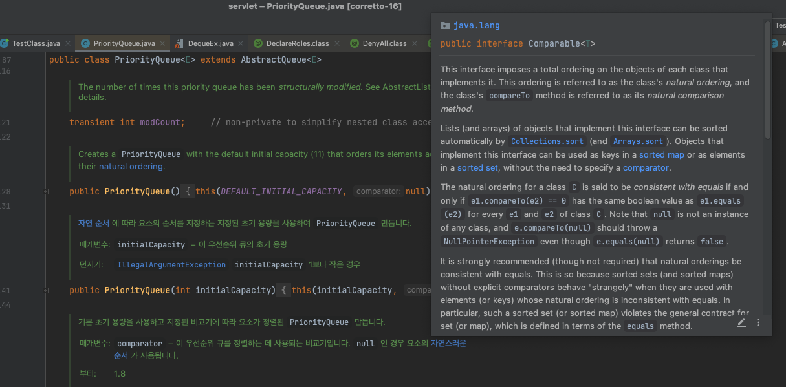

# Comparator

### 정렬 방법
- Comparable 은 내부적으로 compareTo()를 사용하고 Comparator의 경우 compare()을 사용하지만 해당 메서드 구현체에 compareTo()을 사용하기도 함
- str1.compareTo(str2) 반환시
    - str1이 클 경우 양수 반환 : str1이 str2보다 크므로 str1이 str2 뒤에 위치
    - 같을 경우 0 반환 : 기존대로 정렬
    - str1이 작을 경우 음수 반환 : str1이 str2보다 작으므로 str1이 str2 앞에 위치

```java
public interface Comparable<T> {
    public int compareTo(T o);
}

@FunctionalInterface
public interface Comparator<T> {
    int compare(T o1, T o2);
}
```

<br>

### Comparable ?
- 클래스 자체의 compareTo() 메서드를 구현하여 추가적인 클래스나 익명 함수 없이도 객체를 정렬함
    - Arrays.sort(), Collections.sort() 등
- 정렬이 필요한 객체를 작성할 때 Comparable 인터페이스를 구현한 뒤 정렬 기준을 정하는 compareTo() 메소드를 오버라이딩함
    - int compareTo() 메소드 리턴값이 양수일 경우 두 요소의 위치를 그대로 두고, 음수일 경우 두 요소의 위치를 바꿈
- 하지만 한 클래스에는 하나의 '자연스러운 순서'만 정의할 수 있어 다양한 기준으로 정렬하려면 별도의 Comparator 객체를 사용해야 함
    - Comparable을 구현하려면 원래의 클래스를 수정해야 하므로, 이미 작성된 클래스나 외부 라이브러리의 클래스를 정렬하려면 Comparator를 사용해야 함
    - 내부적인 Comparable 정렬 기준은 숫자는 오름차순, 문자는 사전순으로 정렬됨
- java.lang.Comparable 패키지

```java
class Person implements Comparable<Person> {
    @Override
	public int compareTo(Person person) {
		int result = this.height - person.height;
		
		if(result > 0) {
			return 1;
		}
		
		else if(result < 0) {
			return -1;
		}
		
		return 0;
	}
}
```

<br>

### Comparator 라이브러리
- 특정 클래스의 객체들이 자연스럽게 비교될 수 있고 정렬할 수 있는 경우 사용
    - 객체의 정렬 기준을 정읳라 수 있음
- 원래의 클래스를 수정하지 않고도 객체를 정렬할 수 있으므로, 외부 라이브러리의 클래스나 수정이 불가능한 클래스를 정렬하는 데 적합
    - Collections.reverseOrder() 등을 사용하여 역순으로 정렬 가능
- java 8 버전 이후부터 람다식 사용 가능
- java.util.Comparator 패키지

<br>

### Comparator 인터페이스 구현
- 정렬이 필요한 객체를 작성할 때 Comparator를 생성이 필요

```java
// 구현부를 작성하여 사용 방법
String[] strings = {"apple", "banana", "orange", "grape", "kiwi"};
        
// 역순으로 정렬하는 Comparator 구현
Comparator<String> reverseComparator = new Comparator<String>() {
    @Override
    public int compare(String str1, String str2) {
        return str2.compareTo(str1);
    }
};

// 위와 동일
// Comparator<String> reverseComparator = Collections.reverseOrder();

// 정렬
Arrays.sort(strings, reverseComparator);

// 클래스 생성 사용 방법 (내부 클래스, 로컬 내부 클래스로 생성 가능)
public class StringLengthComparator implements Comparator<String>{

	@Override
	public int compare(String o1, String o2) {	// 반환 값에 대한 크기보다는 방향이 중요
		int len1 = o1.length();
		int len2 = o2.length();
		
		return Integer.compare(len1, len2) * -1;	// 역순 정렬
	}
}

// 사용
public void stringLengthSort(List<String> names) {
    Collections.sort(names, new StringLengthComparator());
    System.out.println(names); // [Hi, Java, World, Welcome]
}
```

<br>

### Comparator 람다식 구현
- java 8 버전 이후부터 람다식으로 사용이 가능함

```java
String[] strings = {"apple", "banana", "orange", "grape", "kiwi"};
    
    // 역순으로 정렬하는 Comparator 람다식 구현
    Comparator<String> reverseComparator = (str1, str2) -> str2.compareTo(str1);
    
    // 정렬
    Arrays.sort(strings, reverseComparator);
```

<br>

### PriorityQueue 우선순위?
- PriorityQueue는 내부적으로 Comparator를 사용하여 정렬하고 기본값은 Comparable에 따라 정렬됨
    - Comparable은 자연적인 순서



<br>

```java
public class PriorityQueue<E> extends AbstractQueue<E>
    implements java.io.Serializable {

    @java.io.Serial
    private static final long serialVersionUID = -7720805057305804111L;

    private static final int DEFAULT_INITIAL_CAPACITY = 11;

    transient Object[] queue; // non-private to simplify nested class access

    int size;

    @SuppressWarnings("serial") // Conditionally serializable
    private final Comparator<? super E> comparator;

    transient int modCount;     // non-private to simplify nested class access
```

<br>