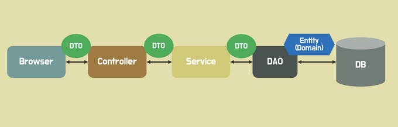
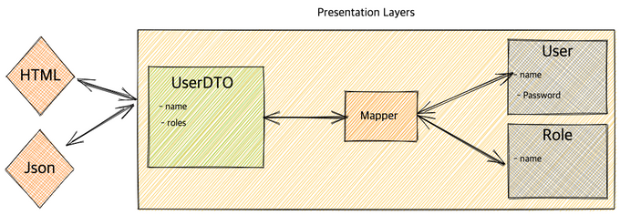

# DTO



### DTO (Data Transfer Object)?
- DTO는 데이터 전송 객체로 프로세스 간에 데이터를 전달하는 객체 / 계층 간 데이터 전송을 위해 <code>도메인 모델</code> 대신 사용되는 객체
- DTO는 순수하게 데이터를 저장하고, 데이터에 대한 getter, setter 만을 가져야함. 즉 어떠한 비즈니스 로직을 가져서는 안되고 저장, 검색, <code> 직렬화, 역직렬화 </code> 로직만을 가짐
- 원격 인터페이스로 작업을 할 떄 호출에 따른 비용은 비싸기 때문에 요청의 횟수를 줄여야 하고, 이를 위해 한번에 더 많은 데이터를 전송하기 위해 생겨남
- 많은 매개변수를 사용하는 것은 어렵고, 좋지 않으며 Java에서는 반환값으로 여러 값을 받을 수 없으므로 요청에 대한 모든 데이터를 보관할 수 있는 데이터 전송 객체를 만들어 사용
- 클린코드에서 로버트.C.마틴은 DTO는 자료 구조체의 전형적인 형태는 공개 변수만 있고 함수가 없는 클래스이고 이러한 자료 구조체를 때로는 자료 전달 객체라고 함. DTO는 매우 유용한 구조체로 데이터베이스와 통신하거나 소켓에서 받은 메시지의 구문을 분석할 때 유용하다고 말하였음.
```
도메인 모델 
- 객체 지향 분석 설계 기반으로 구현하고자 하는 도메인(비즈니스 영역)의 모델을 생성하는 패턴
- 도메인에서의 객체 판별, 목록작성, 객체간의 관계
- 속성과 기능 분리
```

```
직렬화 : DTO를 Byte, Json, Xml등의 형태로 변환하는 것
역직렬화 : Byte, Json, Xml들을 DTO의 형태로 변환하는 것
```

<br>

### 도메인 대신 DTO를 사용 이유
- DTO 대신 도메인 모델을 계층간 전달에 사용하면 UI 계층에서 도메인 모델의 메소드를 호출하거나 상태를 변경 시킬 수 있다고 함
- 또한 UI 화면마다 사용하는 도메인 모델의 정보가 상이하여 도메인 모델을 사용하면 UI에 필요하지 않은 정보까지 가지고 있어 보안 문제가 발생할 수 있음. 즉 DTO를 사용하면 도메인 모델을 캡슐화하여 보호할 수 있음
- 도메인 모델을 계층간 전송에 사용하면, 모델과 뷰가 강하게 결합될 수 있음. 뷰의 요구사항 변화로 도메인의 코드를 변경해야할 일이 생기는 것은 좋지 않은데 DTO를 사용하면 이 결합을 느슨하게 만들 수 있다고 함


<br>



<br>

### DTO 사용 계층?
- 마틴파울러는 Service layer란 어플리케이션의 비즈니스 로직 즉, 도메인을 보호하는 레이어라고 함. 이 정의를 명확히 지키기 위해서는 Presentation layer에 도메인을 노출해서는 안된다고 함. 
- 위의 관점으로는 도메인은 서비스 레이어에서 DTO로 변환되어 컨트롤러로 전달되어야 한다

<br>

### DTO vs VO ?
- VO(Value Object)로 값 객체라는 의미를 가지고 있음. 
- VO가 DTO와 가지는 차이점은 DTO는 사용자 혹은 데이터 베이스가 보내주는 데이터를 객체로 가공하는 방향이 쌍뱡향이며 VO는 데이터베이스가 보내는 데이터를 객체로 가공하는 단방향이라고 함.
- DTO는 데이터의 캡슐화를 통해서 유연한 대처가 가능한 로직을 갖고 있지 않는 순수한 데이터 객체로 값이 변할 수 있음 ( 생성자를 이용해 초기화하는 경우는 불변객체로 활용 가능 )
- VO는 값을 가지는 객체로써 해당 값이 변하지 않음을 보장하기 때문에 코드의 안정성과 생산성을 높인다고 함. VO는 별도의 비즈니스 로직을 가질 수 있음
- VO 역시 레이어간 데이터를 전송하는 역할을 하지만 굳이 VO라고 하는 이유는 데이터의 불변성인 VO의 특성 상 전송하는 데이터가 과정 중에서 변질되지 않음을 보장할 수 있기 떄문에 현업에서는 이 두 개념을 혼용해서 사용한다고 함

<br>

#### Entity
- 실제 DB 테이블과 매핑되는 핵심 클래스.
- 이를 기준으로 테이블이 생성되고 스키마가 변경되기 때문에 절대로 Entity를 요청이나 응답값을 전달하는 클래스로 사용해서는 안됨
- Entity는 id로 구분되며 비즈니스 로직을 포함할 수 있다고 함.

<br>

|분류|DTO|VO|Entity|
|:---:|:---:|:---:|:---:|
|정의|레이어간 데이터 전송용 객체|값 표현용 객체|DB 테이블 매핑용 객체|
|상태 변경 여부|가변 또는 불변 객체|불변 객체|가변 또는 불변 객체|
|로직 포함 여부|로직 포함 불가|로직 포함 가능|로직 포함 가능|


<br>

<div style="text-align: right">22-07-06</div>

-------

## Reference

- https://kafcamus.tistory.com/13
- https://hudi.blog/data-transfer-object/
- https://shm-m.github.io/blog/DTO_VO
- https://tecoble.techcourse.co.kr/post/2021-05-16-dto-vs-vo-vs-entity/