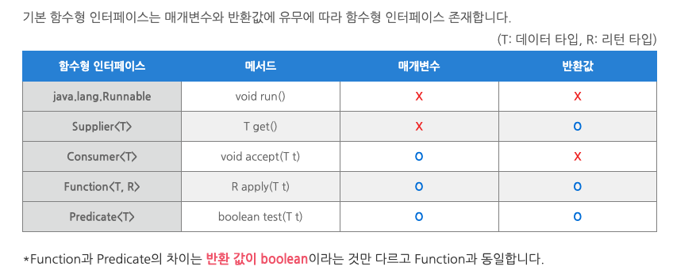
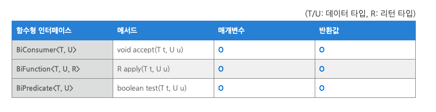
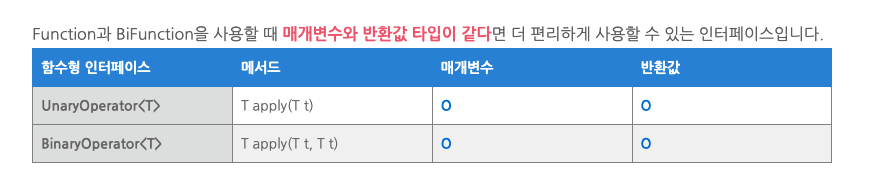

# 함수형 인터페이스 ( Functional Interface )

### 함수형 인터페이스
- Object 클래스의 메서드를 제외하고 추상 메서드가 오직 하나인 인터페이스. 다른 말로 SAM(Single Abstract Method)라고도 함
- 추상 메서드가 하나라는 뜻은 default method 또는 static method는 여러개 존재해도 상관 없음
- 함수형 인터페이스를 사용하는 이유는 자바의 람다식은 함수형 인터페이스로만 접근이 되기 때문
- @FunctionalInterface 어노테이션을 사용. 이 어노테이션은 해당 인터페이스가 함수형 인터페이스 조건에 맞는지 검사 -> 추상 메서드가 2개 이상이면 컴파일 시점에서 오류 발생
- 함수형 인터페이스는 개발자가 직접 만들어서 사용할 수 있지만 항상 새로운 함수형 인터페이스를 정의하기 보다는 자주 쓰이는 형식의 인터페이스는 java.util.function 패키지에 이미 정의된 인터페이스를 사용하는 것을 권장 -> 해당 정의된 인터페이스는 아래 설명하는 인터페이스과 대표적으로 Runnable이 있음(기본적인 인터페이스로 매개변수와 반환값 없음)
- 해당 인터페이스를 이용하여 사용하면 불필요한 박싱으로 인한 객체생성을 하지 않아 훨씬 효율적
- 여기서 \<T,R\>은 제네릭 메소드. 제네릭 메소드는 매개타입과 리턴타입으로 타입파라미터를 갖는 메소드. 데이터형식에 의존하지 않고 하나의 값이 여러 다른 데이터 타입을 가질 수 있게한 방법 (외부에서 사용자가 타입 지정)

```java
// 커스텀 함수형 인터페이스
@FunctionalInterface
interface CustomInterface<T> {
    // abstract method 오직 하나
    T myCall();

    // default method 는 존재해도 상관없음
    default void printDefault() {
        System.out.println("Hello Default");
    }

    // static method 는 존재해도 상관없음
    static void printStatic() {
        System.out.println("Hello Static");
    }
}

// 실제 사용
CustomInterface<String> customInterface = () -> "Hello Custom";

// abstract method
String s = customInterface.myCall();
System.out.println(s);
```

<br>



<br>

#### 기본 함수형 인터페이스 
1. Predicate<T>
>   - Predicate 는 인자 하나를 받아서 boolean 타입을 리턴
>   - 파라미터를 조사해서 return 결정
>   - 람다식으로는 T -> boolean 로 표현
>   ```java
>   @FunctionalInterface
>   public interface Predicate<T> {
>       boolean test(T t);
>   }
>   ```
2. Consumer<T>
>   - Consumer 는 인자를 받아 소비하고 아무것도 리턴하지 않음
>   - 소비자라는 이름에 걸맞게 무언가 (인자) 를 받아서 소비만 하고 끝낸다고 생각하면 됨
>   - 람다식으로는 T -> void 로 표현
>   ```java
>   @FunctionalInterface
>   public interface Consumer<T> {
>       void accept(T t);
>   }
>   ```
3. Function<T, R>
>   - Function 은 T 타입 인자를 받아서 R 타입을 리턴
>   - 주로 파라미터를 리턴으로 매핑. 새로운 타입으로 변환해서 리턴
>   - 수학식에서의 함수처럼 특정 값을 받아서 다른 값으로 반환
>   - 람다식으로는 T -> R 로 표현
>   - T 와 R 은 같은 타입을 사용가능
>   ```java
>   @FunctionalInterface
>   public interface Function<T, R> {
>       R apply(T t);
>   }
>   ```
4. Supplier<T>
>   - Consumer 와 상반된 공급자의 역할로 파라미터는 없고 반환 타입은 존재
>  - Supplier\<T\>는 특이하게 매개변수를 받지 않고 단순히 무엇인가를 반환하는 추상메서드 T get(); 존재
>  - Supplier\<T\>는 get()을 통해 게으른 연산(Lazy Evaluation)이 가능. 불필요한 연산을 피하기위해 연산을 지연시키는 것을 말함
>   - 람다식으로는 () -> T 로 표현. 아무것도 받지 않고 특정 객체를 리턴
>   ```java
>   @FunctionalInterface
>   public interface Supplier<T> {
>       T get();
>   }
>   ```
5. Comparator<T>
>   - Comparator 은 T 타입 인자 두개를 받아서 int 타입을 리턴
>   - 람다식으로는 (T, T) -> int 로 표현
>   ```java
>   @FunctionalInterface
>   public interface Comparator<T> {
>       int compare(T o1, T o2);
>   }
>   ```
6. Runnable
>   - Runnable 은 아무런 객체를 받지 않고 리턴하지 않음
>   - Runnable 이라는 이름에 맞게 "실행 가능한" 이라는 뜻을 나타내며 이름 그대로 실행만 할 수 있다고 생각하면 됨
>   - 자바에서 스레드를 구현할 때 자주 사용하는 인터페이스로 단순 실행 처리
>   - Exception을 발생시키지 않음
>   - 람다식으로는 () -> void 로 표현
>   ```java
>   @FunctionalInterface
>   public interface Runnable {
>       public abstract void run();
>   }
>   ```
7. Callable<V>
>   - 아무런 인자를 받지 않고 T 타입 객체를 리턴
>   - Runnable 과 비슷하게 Callable 은 "호출 가능한" 이라고 생각하면 됨
>   - Exception을 발생시킬 수 있음
>   - Callable과 Supplier은 거의 차이가 없으나 Callable은 Runnable과 함께 병렬 처리를 위해 등장 했던 개념으로 ExecutorService.submit 같은 함수는 인자로 Callable 을 받음 
>   - 람다식으로는 () -> T 로 표현
>   ```java
>   @FunctionalInterface
>   public interface Callable<V> {
>       V call() throws Exception;
>   }
>   ```
7. Operation<T>
>   - 다양한 연산을 추상화하기 위해 사용됨. 특정 타입의 파라미터를 받아 그 타입의 결과를 반환하는 연산을 정의함
>   - 제네릭 타입 파라미터 T를 사용하여 입력과 출력의 타입이 동일. 이는 다양한 타입에 대해 유연하게 사용할 수 있도록함
>   ```java
>   @FunctionalInterface
>   public interface Operation<T> {
>       T execute(T input);
>   }
>   ```

<br>



<br>

[runnable, callable, future 정리](./runnable-callable-future.md)

<br>

#### 매개변수가 두 개인 함수형 인터페이스
- 사용법은 위와 동일하고 Bi 라는 접두사가 붙었음
- 매개변수로 데이터 타입을 두 개 사용
1. BiPredicate<T, U>
>   - (T, U) -> boolean
>   ```java
>   @FunctionalInterface
>   public interface BiPredicate<T, U> {
>       boolean test(T t, U u)
>   }
>   ```
2. BiConsumer<T, U>
>   - 	(T, U) -> void
>   ```java
>   @FunctionalInterface
>   public interface BiConsumer<T, U> {
>       void accept(T t, U u)
>   }
>   ```
3. BiFunction<T, U, R>
>   - 	(T, U) -> R
>   ```java
>   @FunctionalInterface
>   public interface BiFunction<T, U, R> {
>       R apply(T t, U u)
>   }
>   ```


<br>



<br>

#### 매개변수 타입과 반환 타입이 일치하는 함수형 인터페이스 (Operator)
- 매개변수와 반환값 타입이 동일
1. UnaryOperator<T>
>   - Function를 상속받음
>   - Function 인터페이스와 동일하게 apply 메소드를 통해 람다식을 실행
>   - 입력값 하나를 받아서 동일한 타입을 리턴하는 함수 인터페이스
>   ```java
>   public interface UnaryOperator<T> extends Function<T, T> {
>   
>   }
>   ```
2. BinaryOperator<T>
>   - BiFunction를 상속받음
>   - BiFunction 인터페이스와 동일하게 apply 메소드를 통해 람다식을 실행
>   - 동일한 타입의 입렵값 두개를 받아 리턴하는 함수 인터페이스
>   ```java
>   @FunctionalInterface
>   public interface BinaryOperator<T> extends BiFunction<T,T,T> {
>       
>   }
>   ```

<br>

### 기본형 특화 인터페이스
- 지금까지 확인한 함수형 인터페이스를 제네릭 함수형 인터페이스라고 함
- 자바의 모든 형식은 참조형 혹은 기본형
    - 참조형 (Reference Type) : Byte, Integer, Object, List
    - 기본형 (Primitive Type) : int, double, byte, char
- 자바에서는 기본형과 참조형을 서로 변환해주는 박싱, 언박싱 기능을 제공
    - 박싱 (Boxing) : 기본형 -> 참조형 (int -> Integer)
    - 언박싱 (Unboxing) : 참조형 -> 기본형 (Integer -> int)
- 개발자가 박싱, 언박싱을 신경쓰지 않고 개발할 수 있게 자동으로 변환해주는 오토박싱(Autoboxing)이라는 기능도 제공함
- 이런 변환 과정은 비용이 소모되기 때문에, 함수형 인터페이스에서는 이런 오토박싱 동작을 피할 수 있도록 기본형 특화 함수형 인터페이스를 제공함
- 특정 타입을 받는 것이 확실하다면 기본형 특화 인터페이스를 사용하는 것이 더 좋다고 함
- 아래에는 각 함수형 인터페이스에 따른 기본형 특화 제공

<br>

#### 1. Predicate (T -> boolean)
- 기본형을 받은 후 boolean 리턴
    - IntPredicate
    - LongPredicate
    - DoublePredicate
#### 2. Consumer (T -> void)
- 기본형을 받은 후 소비
    - IntConsumer
    - LongConsumer
    - DoubleConsumer
#### 3. Function (T -> R)
- 기본형을 받아서 기본형 리턴
    - IntToDoubleFunction
    - IntToLongFunction
    - LongToDoubleFunction
    - LongToIntFunction
    - DoubleToIntFunction
    - DoubleToLongFunction
- 기본형을 받아서 R 타입 리턴
    - IntFunction<R>
    - LongFunction<R>
    - DoubleFunction<R>
- T 타입 받아서 기본형 리턴
    - ToIntFunction<T>
    - ToDoubleFunction<T>
    - ToLongFunction<T>
#### 4. Supplier (() -> T)
- 아무것도 받지 않고 기본형 리턴
    - BooleanSupplier
    - IntSupplier
    - LongSupplier
    - DoubleSupplier

<br>

<div style="text-align: right">22-08-11</div>

-------

## Reference
- https://m.blog.naver.com/zzang9ha/222087025042
- https://bcp0109.tistory.com/313
- https://inma.tistory.com/151
- https://bcp0109.tistory.com/313